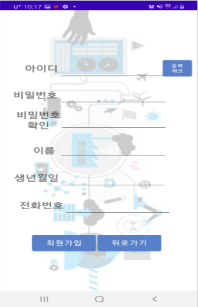
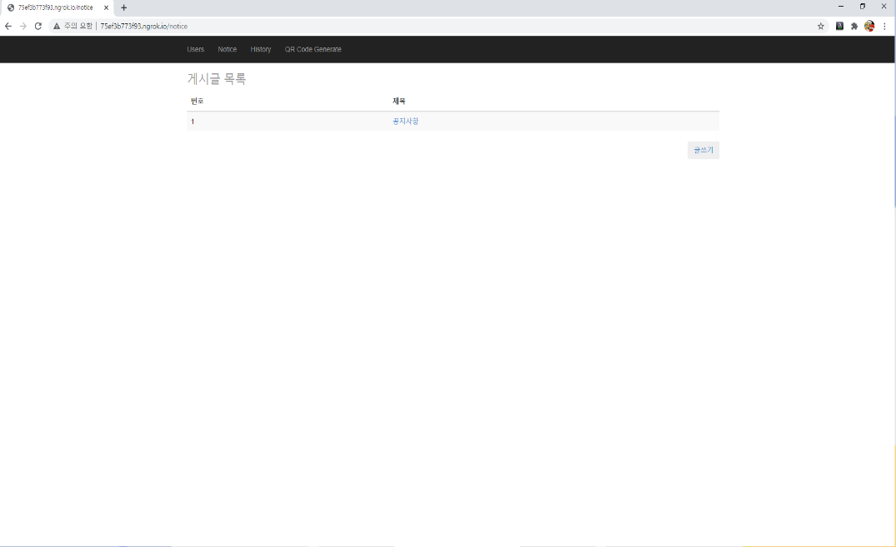
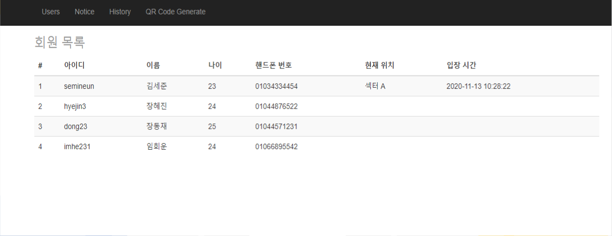

# 2020-11-09 변경점

 - Main 디자인 변경
 - 회원 목록 출력

# 2020-11-10 변경점

 - 게시글 목록 UI 추가
 - 게시글 작성 UI 추가
 - 게시판 글쓰기 기능 추가
 - 게시판 목록 및 조회 기능 추가
 
 
 # 2020-11-11 변경점
 
 - 안드로이드 전체 UI 추가 (팀원 수행)
 - QR코드 스캔 기능 추가(팀원 수행)
 - JSON 포맷 이용, 안드로이드 앱과 스프링 웹 서버 연결 후 로그인 기능 추가

 # 2020-11-12 변경점
 - 안드로이드 회원가입 기능 
 - 안드로이드 폰 QR코드 스캔으로 현재 사용자 [출입시간, 출입장소] 웹 애플리케이션에서의 조회 기능 추가
 - 이전 출입시간, 출입장소 내역 조회 기능
 
 ------
 
 - 안드로이드 UI 최종 수정 (팀원 수행)
 - 출입시간, 출입장소 내역 검색기능 추가
 
---

# UI

## 1. 홈화면

|      웹 애플리케이션       | 안드로이드                   |
|:-------------------:|:------------------------|
|  |  |

## 2. 회원가입

|        웹 애플리케이션         | 안드로이드                   |
|:-----------------------:|:------------------------|
|  |  |

## 3. 공지사항 CRUD API

|         웹 애플리케이션        | 안드로이드 |
|:-----------------------:|:------|
|  |       |

## 4. QR 체크 API

|        웹 애플리케이션         | 안드로이드                   |
|:-----------------------:|:------------------------|
|  |  |

---

# 사용 기술

- IntelliJ
- Spring Boot
- JPA
- Thymeleaf
- Android Studio
- ngrok