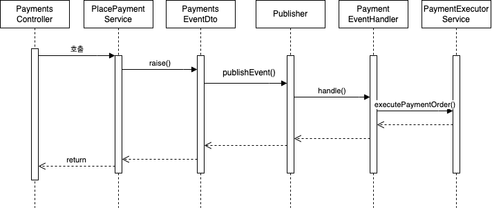
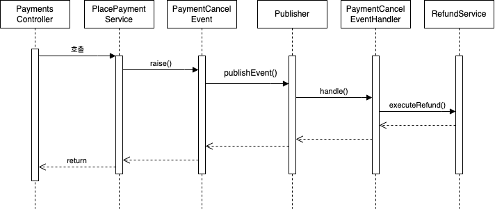

# BANK APP

## 1. ERD

- T_USER : 유저 정보 테이블
- T_PAYMENT_ORDER : 결제 주문 테이블
- T_PAYMENT_EVENT : 결제 이벤트 테이블

1. 한 번의 결제 API 를 호출하면 하나의 결제 이벤트를 만들 수 있다.
2. 하나의 결제 이벤트에서 여러 개의 결제 주문이 들어갈 수 있다. (상태 전환)
3. 결제 주문(payment_order_status) 의 결제 상태는 아래의 상태가 존재한다.
    - EXECUTING
    - SUCCESS
    - CANCELLED
    - FAILED

---

## 2. API 설계

_공통 응답 코드_

- 성공 시 (200 OK)
- 중복 결제 시 (429 Too Many Requests)
- 제한 시간 초과 (500)

| 필드      | 설명     | 자료형    |
|---------|--------|--------|
| status  | 응답 상태  | string |
| message | 응답 메시지 | string |
| data    | 응답 본문  | json   |

### POST /payments

머니 결제 API

_요청 본문_

| 필드             | 설명            | 자료형    |
|----------------|---------------|--------|
| payingMemberId | 결제하려는 사용자 아이디 | object |
| amount         | 결제 금액         | int    |

```json
{
  "payingMemberId": {
    "id": 1
  },
  "amount": 100
}
```

### POST /payback

결제 후 페이백 지급 API

_요청 본문_

| 필드       | 설명             | 자료형  |
|----------|----------------|------|
| memberId | 페이백 해줄 사용자 아이디 | long |
| percent  | 페이백 해줄 퍼센트     | int  |

```json
{
  "memberId": 0,
  "percent": 0
}
```

### POST /payback/cancel

결제 취소 API

_요청 본문_

| 필드                 | 설명              | 자료형    |
|--------------------|-----------------|--------|
| cancellingMemberId | 결제를 취소하려는 멤버 ID | object |
| paymentEventId     | 결제 성공한 이벤트 ID   | string |

```json
{
  "cancellingMemberId": {
    "id": 1
  },
  "paymentEventId": "1723450314-1"
}
```

페이백 취소 API

_요청 본문_

| 필드               | 설명                 | 자료형    |
|------------------|--------------------|--------|
| user_id          | 사용자 아이디            | int    |
| payment_order_id | 전역적으로 고유한 주문 식별 ID | string |

---

## 요구 사항 정리

### 머니 결제 API 요구 사항

- 현재 가입되어 있는 사용자만 결제 이벤트가 발행되어야 한다.
- 유저는 각각 1회 결제 한도, 1일 결제 한도, 1달 결제 한도를 넘어선 결제 금액은 결제 할 수 없다.
- 동일한 결제 이벤트가 발생에 대한 결제를 막아야 한다.
- 동일한 결제 이벤트가 동시에 중복해서 일어날 때 두 번째 결제는 이뤄지면 안된다.
- 결제 이벤트가 완료됨이 확인되면 사용자 지갑의 잔고를 그만큼 줄여야 한다.
- 결제 완료까지 5초 이내가 되어야 한다.
- 결제 완료가 5초가 지나면 그대로 취소시킨다.
- 결제가 어디서 틀어지는 지 알 수 있어야 한다.

#### 구현 내용

- 결제 검증 조건이 많다.
    - 어디에서 검증 조건이 틀어지는지 알 수 있어야 하므로 RuntimeException 을 상속받은 임의의 Exception 을 생성한다.
    - 가입 여부 / 결제 한도 / 결제 금액 부족에 대한 모든 Exception 을 정의해 해당 조건을 만족하지 못할 때 Exception 을 발생시킨다.

- 결제는 1건당 1회가 일어나야 한다.
    - 1건당 1회는 정확히 한 번 전달을 의미한다. 즉 최소 한 번은 실행 / 최대 한 번 실행을 만족해야 한다.
    - 결제 5초 이내
        - 이벤트를 발행하고나서 해당 이벤트를 코루틴의 withTimeout 을 사용해서 시간 제한을 구현한다.
    - 멱등성
        - 결제 API 가 호출될 때 결제 EVENT ID 를 `UNIXTIMESTAMP-MEMBERID` 형식으로 생성한다.
        - 결제 EVENT ID 를 기본 키로 생성한 `T_PAYMENT_EVENT` 에 첫번째 이벤트가 들어온다면 그 이벤트는 새로 생성된 이벤트이므로 정상적인 이벤트로 판단하고 그대로 실행한다.
        - 데이터베이스에서 같은 Primary Key 는 존재할 수 없다. EVENT ID 가 이미 존재한다면 이벤트 자체를 생성하지 않는다.

결제 API 의 순서도



- 결제를 진행하는 부분이 오래 걸릴 수 있음을 염두해두고 비동기 이벤트 방식으로 구현한다.
- 만약 결제 시스템이 외부 시스템으로 교체된다면 트랜잭션 관리에 경우의 수가 생김을 고려한다.
- 이벤트 발행 메서드의 트랜잭션은 실패했는데 외부 트랜잭션은 성공해서 서로 정합성이 지켜지지 않을 수 있기 때문에 이 부분을 고려해서 개발한다.

### 결제 취소 API 요구 사항

- 이미 결제를 한 이력이 있어야 한다.
- 결제 취소를 한 만큼 1일 결제 한도, 1달 결제 한도를 더해줘야 한다.
- 동일한 취소 이벤트 발생을 막는다. 두 번 환불되는 일이 있어선 안된다.
- 취소 이벤트가 완료되면 사용자 지갑의 잔고를 그만큼 더한다.
- 취소 완료까지 5초 이내가 되어야 한다.
- 5초가 지나면 결제 이벤트를 자동으로 취소시킨다.

#### 구현 내용

- 머니 결제 API 와 똑같이 이벤트 발행 아이디를 `UNIXTIMESTAMP-MEMBERID` 를 사용한다.
- 이벤트 발행 후 환불 로직을 실행해 사용자의 잔고와 이용 한도를 같이 증가시킨다.



### 결제 후 페이백 지급 API 요구 사항

- 이미 결제 성공한 이력이 있어야 한다.
- 동일한 페이백 API 호출을 막아야 한다.
- 페이백은 결제한 금액의 퍼센트 단위가 된다. 소숫점인 경우 뒤를 절삭한다
- 페이백 API 는 5초 이내 완료되어야 한다. 5초가 지나면 이벤트를 취소한다.
- 취소한 결제에 대해선 페이백을 적용하지 않는다.


