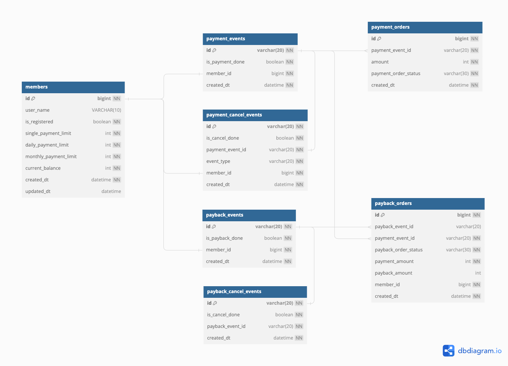
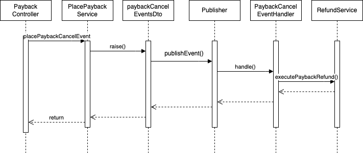

# BANK APP

## 1. 테이블

- members : 유저 정보 테이블
- payment_events : 결제 이벤트 테이블
- payment_orders : 결제 주문 테이블
- payment_cancel_events : 결제 취소 테이블
- payback_events : 페이벡 이벤트 테이블
- payback_cancel_events : 페이백 취소 테이블
- payback_orders : 페이백 주문 테이블

1. 한 번의 결제 API 를 호출하면 하나의 결제 이벤트를 만들 수 있다.
2. 하나의 결제 이벤트에서 여러 개의 결제 주문이 들어갈 수 있다. (상태 전환)
3. 결제 주문(payment_order_status) 의 결제 상태는 아래의 상태가 존재한다.
    - EXECUTING 주문 실행 중
    - SUCCESS 결제 성공
    - CANCELLED 결제 취소
    - FAILED 결제 실패
4. 페이백 주문의 상태
    - NOT_STARTED 페이백 지급 이전. 결제가 완료되고 난 후 최초 상태
    - SUCCESS 페이백 지급 성공
    - CANCELLED 페이백 지급 취소
    - FAILED 페이백 지급 실패
    - NOT_NEED_TO_PAYBACK 페이백을 지급하기 전 결제 취소를 해서 지급할 필요가 없는 상태



---

## 2. API 설계

_공통 응답 코드_

- 성공 시 (200 OK)
- 중복 결제 시 (429 Too Many Requests)
- 제한 시간 초과 (500)

| 필드      | 설명     | 자료형    |
|---------|--------|--------|
| status  | 응답 상태  | string |
| message | 응답 메시지 | string |
| data    | 응답 본문  | json   |

### POST /payments

머니 결제 API

_요청 본문_

| 필드             | 설명            | 자료형    |
|----------------|---------------|--------|
| payingMemberId | 결제하려는 사용자 아이디 | object |
| amount         | 결제 금액         | int    |

```json
{
  "payingMemberId": {
    "id": 1
  },
  "amount": 100
}
```

_응답 본문_

| 필드             | 설명         | 자료형    |
|----------------|------------|--------|
| eventId        | 결제 이벤트 아이디 | string |
| payingMemberId | 결제한 멤버 아이디 | long   |

```json
{
  "status": "OK",
  "message": "성공",
  "data": {
    "eventId": "1723483238-1",
    "payingMemberId": 1
  }
}
```

---

### POST /payments/cancel

결제 취소 API

| 필드                 | 설명           | 자료형    |
|--------------------|--------------|--------|
| cancellingMemberId | 취소하려는 멤버 아이디 | object |
| paybackEventId     | 결제 이벤트 아이디   | int    |

_요청 본문_

```json
{
  "cancellingMemberId": {
    "id": 1
  },
  "paymentEventId": "1723560970-1"
}
```

_응답 본문_

| 필드            | 설명         | 자료형    |
|---------------|------------|--------|
| cancelEventId | 취소 이벤트 아이디 | object |

```json
{
  "status": "OK",
  "message": "성공",
  "data": {
    "cancelEventId": "1723560980-1"
  }
}
```

---

### POST /payback

결제 후 페이백 지급 API

_요청 본문_

| 필드             | 설명             | 자료형    |
|----------------|----------------|--------|
| memberId       | 페이백 해줄 사용자 아이디 | long   |
| paymentEventId | 결제 이벤트 아이디     | string |
| percent        | 페이백 해줄 퍼센트     | int    |

```json
{
  "memberId": 1,
  "paymentEventId": {
    "id": "1723537304-1"
  },
  "percent": 10
}
```

_응답 본문_

| 필드             | 설명             | 자료형    |
|----------------|----------------|--------|
| paybackEventId | 페이백 발행 이벤트 아이디 | string |

```json
{
  "status": "OK",
  "message": "성공",
  "data": {
    "paybackEventId": "1723537493-1"
  }
}
```

---

### POST /payback/cancel

결제 취소 API

_요청 본문_

| 필드                 | 설명              | 자료형    |
|--------------------|-----------------|--------|
| cancellingMemberId | 결제를 취소하려는 멤버 ID | object |
| paybackEventId     | 페이백 발행 이벤트 ID   | string |

```json
{
  "cancellingMemberId": {
    "id": 1
  },
  "paybackEventId": "1723450314-1"
}
```

페이백 취소 API

_요청 본문_

| 필드               | 설명                 | 자료형    |
|------------------|--------------------|--------|
| user_id          | 사용자 아이디            | int    |
| payment_order_id | 전역적으로 고유한 주문 식별 ID | string |

---

# 발생할 수 있는 문제에 대한 해결

1. 서버가 두 대 이상인 경우, 동시 요청에 대한 결제 및 취소를 처리하기 위해 [현재 시간 - 멤버 아이디] 와 같은 고유 이벤트 아이디를 발급한다.
2. 고유 이벤트 아이디가 데이터베이스 PK 에 중복 INSERT 되는 경우 DuplicatedKeyException 이 발생하는 것을 이용해 단 하나의 이벤트만 처리하도록 보장한다.
3. 동기식으로 구현하면 다량의 요청이 들어왔을 때 이벤트를 정상적으로 발행할 수 없는 문제가 생긴다.
   그러므로 **[이벤트 발행 메서드] - [이벤트 퍼블리셔] - [(비동기) 성공 / 실패 이벤트 메서드 실행]** 방식으로 구현한다.
4. 내부 트랜잭션 커밋은 실패했는데, 비동기로 작동하는 이벤트 메서드가 성공하면 서로 간의 정합성이 틀어진다.
   이벤트 발행 메서드의 커밋이 성공했을 때만 이벤트를 실행하도록 한다. 이렇게 하면 추후 비동기로 동작하는 이벤트 메서드의 실패에 대한 재시도에만 집중하면 된다.

---

# 요구 사항

### 머니 결제 API 요구 사항

- 현재 가입되어 있는 사용자만 결제 이벤트가 발행되어야 한다.
- 유저는 각각 1회 결제 한도, 1일 결제 한도, 1달 결제 한도를 넘어선 결제 금액은 결제 할 수 없다.
- 동일한 결제 이벤트가 발생에 대한 결제를 막아야 한다.
- 동일한 결제 이벤트가 동시에 중복해서 일어날 때 두 번째 결제는 이뤄지면 안된다.
- 결제 이벤트가 완료됨이 확인되면 사용자 지갑의 잔고를 그만큼 줄여야 한다.
- 결제 완료까지 5초 이내가 되어야 한다.
- 결제 완료가 5초가 지나면 그대로 취소시킨다.
- 결제가 어디서 틀어지는 지 알 수 있어야 한다.

#### 구현 내용

- 결제 검증 조건이 많다.
    - 어디에서 검증 조건이 틀어지는지 알 수 있어야 하므로 RuntimeException 을 상속받은 임의의 Exception 을 생성한다.
    - 가입 여부 / 결제 한도 / 결제 금액 부족에 대한 모든 Exception 을 정의해 해당 조건을 만족하지 못할 때 Exception 을 발생시킨다.

- 결제는 1건당 1회가 일어나야 한다.
    - 1건당 1회는 정확히 한 번 전달을 의미한다. 즉 최소 한 번은 실행 / 최대 한 번 실행을 만족해야 한다.
    - 결제 5초 이내
        - 이벤트를 발행하고나서 해당 이벤트를 코루틴의 withTimeout 을 사용해서 시간 제한을 구현한다.
    - 멱등성
        - 결제 API 가 호출될 때 결제 EVENT ID 를 `UNIXTIMESTAMP-MEMBERID` 형식으로 생성한다.
        - 결제 EVENT ID 를 기본 키로 생성한 `T_PAYMENT_EVENT` 에 첫번째 이벤트가 들어온다면 그 이벤트는 새로 생성된 이벤트이므로 정상적인 이벤트로 판단하고 그대로 실행한다.
        - 데이터베이스에서 같은 Primary Key 는 존재할 수 없다. EVENT ID 가 이미 존재한다면 이벤트 자체를 생성하지 않는다.

결제 API 의 순서도


- 결제를 진행하는 부분이 오래 걸릴 수 있음을 염두해두고 비동기 이벤트 방식으로 구현한다.
- 만약 결제 시스템이 외부 시스템으로 교체된다면 트랜잭션 관리에 경우의 수가 생김을 고려한다.
- 이벤트 발행 메서드의 트랜잭션은 실패했는데 외부 트랜잭션은 성공해서 서로 정합성이 지켜지지 않을 수 있기 때문에 이 부분을 고려해서 개발한다.

### 결제 취소 API 요구 사항

- 이미 결제를 한 이력이 있어야 한다.
- 결제 취소를 한 만큼 1일 결제 한도, 1달 결제 한도를 더해줘야 한다.
- 동일한 취소 이벤트 발생을 막는다. 두 번 환불되는 일이 있어선 안된다.
- 취소 이벤트가 완료되면 사용자 지갑의 잔고를 그만큼 더한다.
- 취소 완료까지 5초 이내가 되어야 한다.
- 5초가 지나면 결제 이벤트를 자동으로 취소시킨다.

#### 구현 내용

- 머니 결제 API 와 똑같이 이벤트 발행 아이디를 `UNIXTIMESTAMP-MEMBERID` 를 사용한다.
- 이벤트 발행 후 환불 로직을 실행해 사용자의 잔고와 이용 한도를 같이 증가시킨다.


### 결제 후 페이백 지급 API 요구 사항

- 이미 결제 성공한 이력이 있어야 한다.
- 결제 성공한 단 건의 결제 이벤트 ID 를 받아서 처리한다.
- 각 건에 대해 페이백 퍼센트를 조정하기 위해 퍼센트를 입력받는다.
- 동일한 페이백 API 호출을 막아야 한다.
- 페이백은 결제한 금액의 퍼센트 단위가 된다. 소숫점인 경우 뒤를 절삭한다
- 페이백 API 는 5초 이내 완료되어야 한다. 5초가 지나면 이벤트를 취소한다.
- 취소한 결제에 대해선 페이백을 지급하지 않는다.

#### 구현 내용

1. 결제 완료 이벤트가 호출되면 `T_PAYBACK_ORDER` 테이블에 아래와 같은 형태로 데이터를 넣는다.

| id | payback\_event\_id | payment\_event\_id | payback\_order\_status | payment\_amount | payback\_amount | member\_id | created\_dt         |
|:---|:-------------------|:-------------------|:-----------------------|:----------------|:----------------|:-----------|:--------------------|
| 1  | null               | 1723560756-1       | NOT\_STARTED           | 100000          | null            | 1          | 2024-08-13 23:52:37 |

2. 페이백 지급 API 가 호출되면 이벤트를 발행하고 입력받은 결제 payment_event_id 를 토대로 `T_PAYBACK_ORDER` 상태를 INSERT 한다.

| id | payback\_event\_id | payment\_event\_id | payback\_order\_status | payment\_amount | payback\_amount | member\_id | created\_dt         |
|:---|:-------------------|:-------------------|:-----------------------|:----------------|:----------------|:-----------|:--------------------|
| 2  | 1723560797-1       | 1723560756-1       | SUCCESS                | 100000          | 100000          | 1          | 2024-08-13 23:53:18 |



### 페이백 지급 API 취소 요구 사항

- 이미 페이백 지급 완료한 이력이 있어야 한다.
- 중복 취소 호출을 막는다
- 취소 API 는 5초 이내 완료되어야 한다. 5초가 지나면 이벤트를 취소한다.
- 페이백이 완료되면 사용자 현금을 페이백을 받은만큼 차감시킨다.

#### 구현 내용

취소되면 아래 상태를 INSERT 한다.

| id | payback\_event\_id | payment\_event\_id | payback\_order\_status | payment\_amount | payback\_amount | member\_id | created\_dt         |
|:---|:-------------------|:-------------------|:-----------------------|:----------------|:----------------|:-----------|:--------------------|
| 3  | 1723560797-1       | 1723560756-1       | CANCELLED              | 100000          | 100000          | 1          | 2024-08-13 23:53:18 |


# 4. 테스트

### 컨트롤러 통합 테스트

동시 요청을 가정하고 여러개의 스레드로 동시 접근했을 때, 사용자 잔액이 예상한 만큼 올라가는 지 테스트

- [PaybackControllerITest.kt]
- [PaymentsControllerITest.kt]

### 그 외 서비스 단위 테스트

주어진 조건에서 예외가 발생하는지에 대한 단위 테스트

### POSTMAN JSON 파일

실제 API 호출을 하며 사용했던 포스트맨 API JSON 파일

[backapp.json](backapp.json)