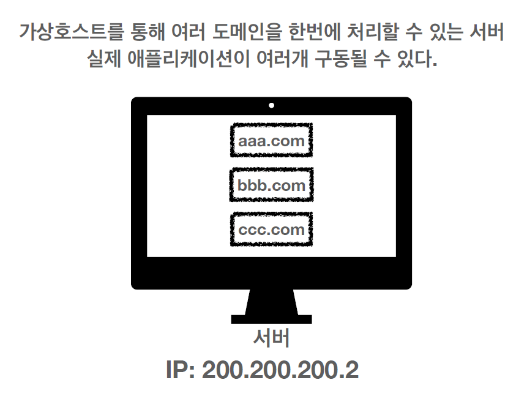

## HTTP 헤더

### 1. 개요

HTTP 헤더에는 전송에 필요한 **모든 부가정보**가 들어있다.
필요 시 임의의 헤더도 추가 가능하다.

#### 1.1 HTTP 헤더 양식

> header-field = field-name ":" OWS field-value OWS (OWS:띄어쓰기 허용)

헤더 필드에서 유의해야할 점은 field-name 옆에는 OWS 가 없기 때문에, 띄어쓰기를 허용하지 않는다는 점이다.

#### 1.2 HTTP 헤더 구성 요소


HTTP 헤더는 4가지로 분류된다.

- General Header : 메시지 전체에 적용되는 정보
- Request Header : 요청 정보
- Response Header : 응답 정보
- Entity Header : 엔티티 바디 정보

여기서 엔티티 헤더는 엔티티 본문의 데이터를 해석할 수 있는 정보를 제공한다.
다만 엔티티라는 표현은 1999년의 RFC2616 에서 사용되었던 용어였고,
2014년에 등장한 **RFC7230~RFC7235**가 등장하면서 부터 엔티티라는 용어는 폐기되었다.

엔티티라는 용어는 **표현(Representation)** 이라는 용어로 변경되었다.
RESTful API를 설명할 때 REST의 약자는 Representational State Transfer인데,
여기서 뜻하는 표현이라는 용어랑 같은 의미가 맞다.

- 표현(Representation)의 구성 요소
  - Content-Type : 표현 데이터의 형식
  - Content-Encoding : 표현 데이터의 압축 방식
  - Content-Language : 표현 데이터의 자연 언어
  - Content-Length : 표현 데이터의 길이


#### 1.3 협상(Contents Negotiation)

> 클라이언트가 선호하는 표현 요청

- Accept : 클라이언트가 선호하는 미디어 타입 전달
- Accept-Charset : 클라이언트가 선호하는 문자 인코딩
- Accept-Encoding : 클라이언트가 선호하는 압축 인코딩
- Accept-Language : 클라이언트가 선호하는 자연 언어

협상 헤더는 **요청** 시에만 사용한다.

```http request
accept: */*
accept-encoding: gzip, deflate, br
accept-language: ko-KR,ko;q=0.9,en-US;q=0.8,en;q=0.7
```

먼저 accept 를 보면 */* 가 있다. 이것은 미디어 타입을 지정하는 속성인데 구체적인 것이 우선이다.
```http request
accept: text/*, text/plain, text/plain;format=flowed, */*
```
만약 accept가 이렇게 되어 있었으면 우선 순위는

1. text/plain;format=flowed
2. text/plain
3. text/*
4. */*

가 될 것이다.


Request Header 에 있는 협상의 예다. accept-language 옆에 있는 숫자는 우선 순위를 나타낸다.
0~1 로 이루어져 있으며, **클수록 높은 우선순위**이다. q 는 Quality Values 를 뜻한다.
예시에 나와있는 accept-language를 분석하면 아래와 같다.

1. ko-KR;q=1(q=1일 때 생략 가능)
2. ko;q=0.9
3. en-US;q=0.8
4. en:q=0.7


#### 1.4 전송 방식

전송 방식은 4가지가 있다.

- 단순 전송
- 압축 전송
- 분할 전송
- 범위 전송

**1. 단순 전송**

단순 전송은 메시지 바디에 있는 데이터의 길이를 계산해 전송하는 방식이다.
Content-Length 값이 응답 헤더에 포함된다.

**2. 압축 전송**

압축 전송은 콘텐츠를 보낼 때 압축해서 보낸다. Content-Encoding 에 적혀 있는 값이 압축 방식을 뜻한다.

**3. 분할 전송**

클라이언트가 요청하면 표현을 분할해서 전송하는 방식이다. 
분할 전송을 사용할 때는 content-length 가 응답 헤더에 있어선 안된다.
분할해서 보내기 때문에 전체 content-length 값을 예측하기 어렵기 때문이다.

**4. 범위 전송**

일정 범위 데이터를 받은 상태에서 처음부터 다시 받아오는 것은 비효율적이다.
이 때 범위를 설정해서 받은 데이터를 제외하고 나머지 데이터 범위만 받아올 수 있다.

### 2. HTTP 요청 일반 정보

1. From

> 유저 에이전트의 이메일 정보

일반적으로 사용되지 않는다. 
검색 엔진은 다른 사이트를 크롤링하는데, 어떤 사이트는 크롤링 하는 것을 거부하고 싶을 수도 있다.
이런 상황에서 연락할 수단이 필요할 때 사용된다.

2. Referer

> 현재 요청된 페이지의 이전 웹 페이지 주소

A -> B로 이동하는 경우 B를 요청할 때 Referer: A를 포함해서 요청한다.
사용자가 어떤 사이트를 통해서 유입 되었는지 referer 을 통해서 통계를 낼 수 있다.


3. User-Agent

> 유저 에이전트 애플리케이션 정보

가끔 특정 브라우저에서만 에러가 날 때, user-agent 속성을 통해 어떤 브라우저에서 장애가 발생하는지 파악 가능하다.


### 3. HTTP 응답 일반 정보

1. Server

> 요청을 처리하는 ORIGIN 서버의 소프트웨어 정보

클라이언트와 서버는 통신할 때 다이렉트로 가지 않고 많은 중간 노드를 거친다.
이 때 내 요청을 처리하는 최종 서버의 정보가 담기는 곳이 server 이다.


크롬 개발자 도구에서 Response Headers 를 클릭하면 볼 수 있다.

2. Date

> 메시지가 발생한 날짜와 시간

### 4. HTTP 요청 특별 정보

- Host : 요청한 호스트 정보(도메인)
- Location : 페이지 리다이렉션
- Allow : 허용 가능한 HTTP 메서드
- Retry-After : 유저 에이전트가 다음 요청을 하기까지 기다려야 하는 시간

**1. Host**

> 요청한 호스트 정보(도메인)

필수 정보이다. 
왜냐하면 하나의 서버가 여러 도메인을 처리해야될 때, 
호스트 정보가 없으면 어느 도메인을 처리해야할 지 할 수 없기 때문이다.



```http request
GET /hello HTTP 1.1
```

이 요청만 보냈을 때, 어떤 도메인으로 처리해야 하는지 서버는 알 수 없다.
따라서 요청 헤더에 반드시 host 정보가 들어가야 한다.

```http request
GET /hello HTTP 1.1
Host: aaa.com
```

**2. Location**

웹 브라우저는 3XX 결과가 있으면 Location 헤더 정보를 가져와 이 위치로 자동으로 이동한다.
201 (Create) 응답 코드에서도 있을 수 있는데, 이 때는 **요청에 의해 생성된 URI**를 뜻한다.

**3. Allow**

허용 가능한 HTTP 메서드이다.
405 응답에 Allow 값으로 GET, HEAD 가 있으면 이 두 개의 메서드만 사용 가능하다고 클라이언트에게 알릴 수 있다.
다만 잘 사용되지 않는다.

**4. Retry-After**

서버 장애로 503 응답 코드를 받을 때 Retry-After 으로 클라이언트가 언제까지 기다려야 하는지 알 수 있다.

### 5. HTTP 인증

- Authorization : 클라이언트 인증 정보를 서버에 전달
- WWW-Authenticate : 리소스 접근 시 필요한 인증 방법 정의

### 6. 쿠키

- Set-Cookie : 서버에서 클라이언트로 쿠키 전달(응답)
- Cookie : 클라이언트가 서버에서 받은 쿠키를 저장하고, HTTP 요청 시 서버에 전달

쿠키는 서버로부터 내려올 때 sessionId 를 발급받는다.
만약 쿠키를 서버에 전송하지 않고, 웹 브라우저 내부에 데이터를 저장하고 싶으면
웹 스토리지(localStorage, sessionStorage)를 사용한다.

쿠키는 클라이언트에 저장되는 특성때문에 보안에 민감한 데이터는 저장하면 안 된다.


> 더 자세한 정보 : https://github.com/dailyzett/TIL/blob/main/common/HttpBasic/cookie.md

### 7. 참고 자료

> [모든 개발자를 위한 HTTP 웹 기본 지식](https://www.inflearn.com/course/http-웹-네트워크/dashboard)
