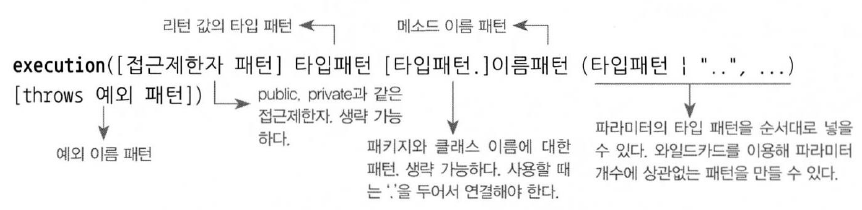
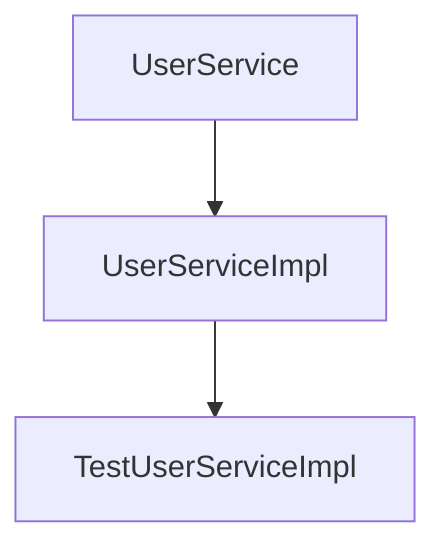

# 목차

- [목차](#목차)
- [6.5 스프링 AOP](#65-스프링-aop)
  - [6.5.1 자동 프록시 생성](#651-자동-프록시-생성)
    - [빈 후처리기를 이용한 자동 프록시 생성기](#빈-후처리기를-이용한-자동-프록시-생성기)
    - [확장된 포인트컷](#확장된-포인트컷)
  - [6.5.2 DefaultAdvisorAutoProxyCreator의 적용](#652-defaultadvisorautoproxycreator의-적용)
    - [자동 프록시 생성기를 사용하는 테스트](#자동-프록시-생성기를-사용하는-테스트)
    - [자동생성 프록시 확인](#자동생성-프록시-확인)
  - [6.5.3 포인트컷 표현식을 이용한 포인트컷](#653-포인트컷-표현식을-이용한-포인트컷)
    - [포인트컷 표현식](#포인트컷-표현식)
    - [포인트컷 표현식 문법](#포인트컷-표현식-문법)
    - [포인트컷 표현식을 이용하는 포인트컷 적용](#포인트컷-표현식을-이용하는-포인트컷-적용)
    - [타입 패턴과 클래스 이름 패턴](#타입-패턴과-클래스-이름-패턴)
  - [6.5.4 AOP란 무엇인가?](#654-aop란-무엇인가)
    - [1. 트랜잭션 서비스 추상화](#1-트랜잭션-서비스-추상화)
    - [2. 프록시와 데코레이터 패턴](#2-프록시와-데코레이터-패턴)
    - [3. 다이내믹 프록시와 프록시 팩토리 빈](#3-다이내믹-프록시와-프록시-팩토리-빈)
    - [4. 자동 프록시 생성 방법과 포인트컷](#4-자동-프록시-생성-방법과-포인트컷)
    - [부가기능의 모듈화](#부가기능의-모듈화)
    - [AOP: 애스펙트 지향 프로그래밍](#aop-애스펙트-지향-프로그래밍)
  - [6.5.5 AOP 적용 기술](#655-aop-적용-기술)
    - [프록시를 이용한 AOP](#프록시를-이용한-aop)
    - [바이트코드 생성과 조작을 통한 AOP](#바이트코드-생성과-조작을-통한-aop)
  - [6.5.6 AOP의 용어](#656-aop의-용어)
  - [6.5.7 AOP 네임스페이스](#657-aop-네임스페이스)
    - [AOP 네임스페이스](#aop-네임스페이스)
    - [어드바이저 내장 포인트컷](#어드바이저-내장-포인트컷)

# 6.5 스프링 AOP

## 6.5.1 자동 프록시 생성

프록시 팩토리 빈 방식의 접근 방법에는 두 가지 한계가 있다.

- 부가기능이 타깃 오브젝트마다 새로 만들어지는 문제
- 부가기능의 적용이 필요한 타깃 오브젝트마다 거의 비슷한 내용의 ProxyFactoryBean 빈 설정정보를 추가해주는 문제

첫 번째 문제는 스프링 ProxyFactoryBean의 어드바이스를 통해 해결할 수 있다.
새로운 타깃이 생겼다고 코드에 직접 수정할 필요는 없어졌지만 설정은 매번 복사해서 붙이고 target 프로퍼티의 내용을 수정해줘야 한다.

### 빈 후처리기를 이용한 자동 프록시 생성기

빈 후처리기는 BeanPostProcessor 인터페이스를 구현해서 만든다.
빈 후처리기는 이름 그대로 스프링 빈 오브젝트로 만들어지고 난 후에, 빈 오브젝트를 다시 가공할 수 있게 해준다.
빈 후처리기 중 하나인 DefaultAdvisorAutoProxyCreator는 어드바이저를 이용한 자동 프록시 생성기이다.


DefaultAdvisorAutoProxyCreator 빈 후처리기가 등록되어 있으면 스프링은 빈 오브젝트를 만들 때마다 후처리기에게 빈을 보낸다.
DefaultAdvisorAutoProxyCreator는 빈으로 등록된 모든 어드바이저 내의 포인트컷을 이용해 전달받은 빈이 프록시 적용 대상인지 확인한다.
프록시 적용 대상이면 내장된 프록시 생성기에게 현재 빈에 대한 프록시를 만들게 하고, 만들어진 프록시에 어드바이저를 연결해준다.

이를 통해 마지막 남은 ProxyFactoryBean 설정 문제를 깔끔하게 해결할 수 있다.

### 확장된 포인트컷

- Pointcut 인터페이스

```java
public interface Pointcut{
    ClassFilter getClassFilter();
    MethodMatcher getMethodMatcher();
}
```

포인트컷은 클래스 필터와 메서드 매처 두 가지를 모두 돌려주는 메서드를 가지고 있다.
Pointcut의 선정 기능을 모두 적용한다면 먼저 프록시를 적용할 클래스인지 판단하고 나서,
적용 대상이 클래스인 경우에는 어드바이스를 적용할 메서드인지 확인하는 식으로 동작한다.

모든 빈에 대해 프록시 자동 적용 대상을 선별해야 하는 빈 후처리기인 DefaultAdvisorAutoProxyCreator는
클래스와 메서드 선정 알고리즘을 모두 갖고 있는 포인트컷이 필요하다.

## 6.5.2 DefaultAdvisorAutoProxyCreator의 적용

먼저 DefaultAdvisorAutoProxyCreator를 사용하기 위해 xml 파일에 다음 코드를 추가한다.
자동 프록시 생성기는 어디선가 참조할 일이 없으므로 id를 적어주지 않아도 된다.

```xml
<bean class="org.springframework.aop.framework.autoproxy.DefaultAdvisorAutoProxyCreator"/>
```

<details>
<summary><b>1. 클래스 필터가 보함된 포인트컷</b></summary>
<div markdown="1">

```java
public class NameMatchClassMethodPointcut extends NameMatchMethodPointcut {
    public void setMappedClassName(String mappedClassName) {
        this.setClassFilter(new SimpleClassFilter(mappedClassName));

    }

    static class SimpleClassFilter implements ClassFilter {
        String mappedName;

        public SimpleClassFilter(String mappedClassName) {
            this.mappedName = mappedClassName;
        }

        @Override
        public boolean matches(Class<?> clazz) {
            return PatternMatchUtils.simpleMatch(mappedName, clazz.getSimpleName());
        }
    }
}
```

</div>
</details>

<details>
<summary><b>2. 포인트컷 빈 설정</b></summary>
<div markdown="1">

```xml
<bean id="transactionPointcut" class="service.NameMatchClassMethodPointcut">
    <property name="mappedClassName" value="*ServiceImpl"/>
    <property name="mappedName" value="upgrade*"/>
</bean>
```

</div>
</details>

더 이상 명시적인 프록시 팩토리 빈을 등록하지 않기 때문에 userService에 ProxyFactoryBean 을 주입하지 않아도 된다.

<details>
<summary><b>3. ProxyFactoryBean 제거와 서비스 빈의 원상복구</b></summary>
<div markdown="1">

```xml
<bean id="userService" class="service.UserServiceImpl">
    <property name="userDao" ref="userDao"/>
    <property name="mailSender" ref="mailSender"/>
</bean>
```

</div>
</details>

### 자동 프록시 생성기를 사용하는 테스트

이전 테스트는 ProxyFactoryBean이 빈으로 등록되어 있으므로 이를 가져와 타깃을 테스트용 클래스로 바꿔치기하는 방법을 사용했다.
하지만 자동 프록시 생성기를 사용하면 이 방법은 사용할 수 없다.
자동으로 프록시를 만들어주기 때문에 프록시 오브젝트만 남아있기 때문이다.

지금까지는 설정파일에는 정상적인 경우의 빈 설정만을 두고 롤백을 일으키는 예외상황에 대한 테스트는 테스트 코드에서 빈을 가져와 수동 DI로 구성을 바꿔서 사용했다.
하지만 자동 프록시 생성기라는 스프링 컨테이너에 종속적인 기법을 사용했기 때문에 예외상황을 위한 테스트 대상도 빈으로 등록해 줄 필요가 있다.

기존에 만들어서 사용하던 강제 예외 발생용 TestUserService 클래스를 이제는 직접 빈으로 등록해야 한다.
하지만 두 가지 문제점이 있다.

1. TestUserService 는 테스트 코드 내부에 정의된 스태틱 클래스다.
2. 포인트컷이 트랜잭션 어드바이스를 적용해주는 대상 클래스의 이름 패턴이 *ServiceImpl이라고 했기 때문에 TestUserService는 어드바이스가 적용되지 않는다.

- 1번 문제 해결: "$" 사용
```xml
<bean id="testUserService" class="service.UserServiceTest$TestUserServiceImpl" parent="userService"/>
```

- 2번 문제 해결: static class 이름 변경

```java
static class TestUserServiceImpl extends UserServiceImpl {
    private String id = "madnite1";

    protected void upgradeLevel(User user) {
        // 지정된 id의 User 오브젝트가 발견되면 예외를 던져서 작업을 강제로 중단시킨다.
        if (user.getId().equals(this.id)) throw new TestUserServiceException();
        super.upgradeLevel(user);
    }
}
```

빈을 테스트 코드에서 생성하는 것이 아니기 때문에 테스트 픽스처로 만든 users 리스트에서 예외를 발생시킬 기준 id를 가져오는 것이 불가능하다.
그러므로 아예 예외를 발생시킬 대상인 네 번째 사용자 아이디인 madenite1 를 대입해 이를 해결한다.

### 자동생성 프록시 확인

트랜잭션 어드바이스를 적용한 프록시 자동생성기를 빈 후처리기 메커니즘으로 적용하기 위해 최소한 두 가지는 확인해야 한다.

1. 트랜잭션이 필요한 빈에 트랜잭션 부가기능이 적용됐는가?
2. 아무 빈에나 트랜잭션 부가기능이 적용된 것은 아닌가?

## 6.5.3 포인트컷 표현식을 이용한 포인트컷

리플렉션 API는 코드를 작성하기가 번거롭다는 단점이 있다.
그리고 리플렉션 API를 이용해 메타정보를 비교하는 방법은 조건이 달라질 때마다 포인트컷 구현 코드를 수정해야하는 번거로움도 있다.

스프링은 아주 효과적인 방법으로 포인트컷의 클래스와 메서드를 선정하는 알고리즘을 작성할 수 있는 방법을 제공한다.
이것을 **포인트컷 표현식**이라고 부른다.

### 포인트컷 표현식

스프링이 사용하는 포인트컷 표현식은 **AspectJ**라는 유명한 프레임워크에서 제공하는 것을 가져와 일부 문법을 확장해서 사용하는 것이다.

### 포인트컷 표현식 문법

AspectJ 포인트컷 표현식은 주로 포인트컷 지시자를 이용해 작성한다.
포인트컷 지시자 중에서 가장 대표적으로 사용되는 것은 **execution()**이다.



[] 괄호는 옵션항목이기 때문에 생략 가능하며 | 는 OR 조건을 의미한다.
포인트컷 지시자는 메서드의 풀 시그니처를 문자열로 비교하는 개념이다.

- 접근제한자 패턴

public / protected / private 등이 올 수 있다. 생략 가능하다.

- 타입 패턴

리턴 값의 타입을 나타내는 패턴이다. 생략 불가능하다.
모든 리턴 타입을 지정하려면 "*"를 사용한다.

- 타입패턴.

패키지와 타입 이름을 포함한 클래스의 타입 패턴이다.
생략 가능하고 생략하면 모든 타입을 허용하겠다는 의미다.

- 이름 패턴

메서드의 이름 패턴이다. 생략 불가능하다.

- (타입 패턴)

메서드 파라미터의 타입 패턴이다. 파라미터가 없는 메서드를 지정할 때는 ()로 적는다
파라미터의 타입과 개수에 상관없이 모두 다 허용하는 패턴으로 만들려면 ".."를 넣는다.
".."를 이용해서 뒷부분의 파라미터 조건만 생략할 수도 있다.

### 포인트컷 표현식을 이용하는 포인트컷 적용

포인트컷 표현식은 메서드의 시그니처를 비교하는 방식인 execute() 외에도 몇 가지 표현식 스타일을 갖고 있다.
대표적으로 스프링에서 사용될 때 빈의 이름으로 비교하는 bean()이 있다.
bean(*Service)라고 쓰면 아이디가 Service로 끝나는 모든 빈을 선택한다는 뜻이다.

또 특정 애노테이션이 타입, 메서드, 파라미터에 적용되어 있는 것을 보고 메서드를 선정하게 하는 포인트컷도 만들 수 있다.

```java
@annotaion(org.springframework.transaction.annotaion.Transactional)
```

위 코드를 쓰면 @Transactional이라는 애노테이션이 적용된 메서드를 선정하게 해준다.
포인트컷 표현식을 이용해 기존 applicationContext xml 파일을 더 간단하게 설정할 수 있다.

```xml
<bean id="transactionPointcut" class="org.springframework.aop.aspectj.AspectJExpressionPointcut">
    <property name="expression" value="execution(* *..*ServiceImpl.upgrade*(..))"/>
</bean>
```

포인트컷 표현식을 이용하는 포인트컷이 정확히 원하는 빈만 선정했는지를 확인하는 일은 쉽지 않다.
하지만 스프링 개발팀이 제공하는 스프링 지원 툴을 사용하면 아주 간단히 포인트컷이 선정한 빈이 어떤 것인지 한눈에 확인하는 방법이 있다.

### 타입 패턴과 클래스 이름 패턴



현재 UserService 를 그림으로 그려보면 위와 같다.
execution(* *..*ServiceImpl.upgrade*(..)) 에서 주의해야할 점은 클래스 이름에 적용되는 패턴은 클래스 이름 패턴이아니라
**타입 패턴**이다. 그래서 TestUserServiceImpl 클래스는 타입을 따져보면 슈퍼 클래스인 UserServiceImpl, 구현 인터페이스인
UserService 세 가지가 모두 적용된다.

> **중요**<br/>
> 포인트컷 표현식에서 "타입 패턴"이라고 명시된 부분은 모두 동일한 원리가 적용됨을 알아야 한다

## 6.5.4 AOP란 무엇인가?

비즈니스 로직을 담은 UserService에 트랜잭션을 적용해온 과정을 정리해보자

### 1. 트랜잭션 서비스 추상화

트랜잭션 경계설정 코드를 UserService에 합친 결과 특정 트랜잭션 기술에 종속되는 코드가 돼버렸다.
그래서 이를 해결하기 위해 **서비스 추상화**기법을 적용했다.
이 덕분에 비즈니스 로직코드는 트랜잭션을 어떻게 처리해야 한다는 구체적인 방법과 서버환경에 종속되지 않는다.

### 2. 프록시와 데코레이터 패턴

트랜잭션을 어떻게 다룰 것인가는 추상화를 통해 코드에서 제거했지만, 
트랜잭션이라는 부가적인 기능을 어디에 적용할 것인가는 여전히 코드에 노출시켜야 했다.
그리고 트랜잭션의 경계설정을 담당하는 코드의 특성 때문에 단순한 추상화와 메서드 추출 방법으로는 제거할 방법이 없었다.

이것을 해결하기 위해 **데코레이터 패턴**을 적용했다.
클라이언트가 인터페이스와 DI를 통해 접근하도록 설계하고, 데코레이터 패턴을 적용해서, 비즈니스 로직을 담은
클래스의 코드에는 전혀 영향을 주지 않으면서 트랜잭션이라는 부가기능을 자유롭게 부여할 수 있는 구조가 되었다.


### 3. 다이내믹 프록시와 프록시 팩토리 빈

비즈니스 로직 인터페이스의 모든 메서드마다 트랜잭션 기능을 부여하는 코드를 넣어 프록시 클래스를 만드는 작업은 오히려 큰 짐이 됐다.
트랜잭션 기능을 부여하지 않아도 되는 메서드조차 프록시로서 위임 기능이 필요하기 때문에 일일이 다 구현을 해줘야 했다.

이것을 해결하기 위해 프록시 오브젝트를 런타임 시에 만들어주는 **JDK 다이내믹 프록시 기술**을 적용했다.
하지만 동일한 기능의 프록시를 여러 오브젝트에 적용할 경우 오브젝트 단위로 일어나는 중복을 막을 순 없었다.

그래서 JDK 다이내믹 프록시와 같은 프록시 기술을 추상화한 스프링의 프록시 팩토리 빈을 이용해서 다이내믹 프록시 생성 방법에 DI를 도입했다.
내부적으로 템플릿/콜백 패턴을 활용하는 **스프링의 프록시 팩토리 빈**덕분에 어드바이스와 포인트컷은 프록시에서 분리될 수 있었고 여러 프록시에서
공유해서 사용할 수 있게 됐다.

### 4. 자동 프록시 생성 방법과 포인트컷

트랜잭션 적용 대상이 되는 빈마다 일일이 프록시 팩토리 빈을 설정해줘야 한다는 부담이 있었다.
이를 해결하기 위해 스프링의 빈 생성 후처리 기법을 활용해 컨테이너 초기화 시점에서 자동으로 프록시를 만들어주는 방법을 도입했다.

그리고 트랜잭션 부가기능을 어디에 적용하는지에 대한 정보를 포인트컷이라는 독립적인 정보로 완전히 분리할 수 있었다.

### 부가기능의 모듈화

관심사가 같은 코드를 분리해 한데 모으는 것은 소프트웨어 개발의 가장 기본이 되는 원칙이다.
하지만 트랜잭션과 같은 부가기능은 독립된 모듈로 만들기는 어렵다.
이름 그대로 부가기능이기 때문에 부가기능을 적용해 줄 다른 대상, 즉 **타깃이 존재해야만 의미가 있다.**
따라서 각 기능을 부가할 대상인 각 타깃의 코드 안에 침투하거나 긴밀하게 연결되어 있지 않으면 안 된다.

그래서 많은 개발자는 핵심기능을 담당하는 코드 여기저기에 흩어져 나타나야 했던 이런 부가기능을
어떻게 독립적인 모듈로 만들 수 있을까를 고민해왔다.
DI, 데코레이터 패턴, 다이내믹 프록시, 오브젝트 생성 후처리, 자동 프록시 생성, 포인트컷과 같은 기법은
이런 문제를 해결하기 위해 적용한 대표적인 방법이다.

결국 지금까지 해온 모든 작업은 핵심기능에 부여되는 부가기능을 효과적으로 모듈화하는 방법을 찾는 것이었고,
어드바이스와 포인트컷을 결합한 어드바이저가 단순하지만 이런 특성을 가진 모듈의 원시적인 형태로 만들어지게 됐다.

### AOP: 애스펙트 지향 프로그래밍

전통적인 객체지향 기술의 설계 방법으로는 독립적인 모듈화가 불가능한 부가기능을 어떻게 모듈화할 것인가를 연구해온 사람들은,
이 부가기능 모듈화 작업은 기존의 객체지향 설계 패러다임과는 구분되는 새로운 특성이 있다고 생각했다.
그래서 이런 부가기능 모듈을 객체지향 기술에서 주로 사용하는 오브젝트와는 다르게 특별한 이름으로 부르기 시작했는데 그것이 바로 **애스펙트(aspect)** 이다.

애스펙트는 부가될 기능을 정의한 코드인 어드바이스와 어드바이스를 어디에 적용할지를 결정하는 포인트컷을 함께 갖고 있다.

애플리케이션의 핵심적인 긴으에서 부가적인 기능을 분리해서 애스펙트라는 독특한 모듈로 만들어서 설계하고 개발하는 방법을
**애스펙트 지향 프로그래밍, 약자로 AOP**라고 부른다. 하지만 AOP도 결국 OOP를 돕는 보조적인 기술일 뿐이다.

## 6.5.5 AOP 적용 기술

### 프록시를 이용한 AOP

스프링은 다양한 기술을 조합해 AOP를 지원하고 있다. 그중 가장 핵심은 프록시를 이용했다는 것이다.
따라서 스프링 AOP는 자바의 기본 JDK와 스프링 컨테이너 외에는 특별한 기술이나 환경을 요구하지 않는다.

독립적으로 개발한 부가기능 모듈을 다양한 타깃 오브젝트의 메서드에 다이내믹하게 적용해주기 위해
가장 중요한 역할을 맡고 있는 게 바로 프록시다. 그래서 스프링 AOP는 프록시 방식의 AOP라고 할 수 있다.

### 바이트코드 생성과 조작을 통한 AOP

가장 강력한 AOP 프레임워크로 꼽히는 AspectJ는 프록시를 사용하지 않는 대표적인 AOP 기술이다.
AspectJ는 타깃 오브젝트를 뜯어고쳐서 부가기능을 직접 넣어주는 직접적인 방법을 사용한다.
컴파일된 타깃의 클래스 파일 자체를 수정하거나 클래스가 JVM에 로딩되는 시점을 가로채서 바이트코드를 조작하는 복잡한 방법을 사용한다.

AspectJ가 바이트코드 조작과 같은 복잡한 방법을 사용하는 이유는 두 가지다.

1. 바이트코드를 조작해서 타깃 오브젝트를 직접 수정해버리면 스프링과 같은 DI 컨테이너의 도움을 받아서 자동 프록시 생성 방식을
사용하지 않아도 AOP를 적용할 수 있다. 즉 스프링과 같은 컨테이너가 사용되지 않는 환경에서도 손쉽게 AOP의 적용이 가능해진다.
2. 프록시 방식보다 훨씬 강력하고 유연한 AOP가 가능하다. **프록시를 이용한 AOP는 부가기능을 부여할 대상은 클라이언트가 호출할 때
사용하는 메서드로 제한된다.** 하지만 바이트 코드를 직접 조작해서 AOP를 적용하면 오브젝트의 생성, 필드 값의 조회와 조작, 스태틱 초기화
등의 다양한 작업에 부가기능을 부여해줄 수 있다.

물론 대부분의 기능은 프록시 방식을 이용하는 것만으로도 충분하다.
고급 AOP 기술을 이용하려면 바이트코드 조작을 위해 JVM의 실행 옵션을 변경하거나, 별도의 바이트코드 컴파일러를 사용하거나,
특별한 클래스 로더를 사용하게 하는 등의 작업이 필요하다.

간혹 특별한 AOP 요구사항이 생겨서 스프링의 프록시 AOP 수준을 넘어서는 기능이 필요할 때 AspectJ를 사용하면 된다.

## 6.5.6 AOP의 용어

- **타깃**

부가기능을 부여할 대상.

- **어드바이스**

타깃에게 제공할 부가기능을 담은 모듈.

- **조인 포인트**

어드바이스가 적용될 수 있는 위치. 스프링의 프록시 AOP에서 조인 포인트는 메서드의 실행 단계일 뿐이다.

- **포인트컷**

어드바이스를 적용할 조인 포인트를 선별하는 작업 또는 그 기능을 정의한 모듈.
포인트컷 표현식은 메서드의 실행이라는 의미인 execution으로 시작한다.

- **프록시**

클라이언트와 타깃 사이에 투명하게 존재하면서 부가기능을 제공하는 오브젝트.

- **어드바이저**

하나의 포인트컷과 하나의 어드바이스. AOP의 가장 기본이 되는 모듈이다.

- **애스펙트**

한 개 또는 그 이상의 포인트컷과 어드바이스의 조합으로 만들어지며 보통 싱글톤 형태의 오브젝트로 존재.

## 6.5.7 AOP 네임스페이스

스프링의 프록시 방식 AOP를 적용하려면 최소한 네 가지 빈을 등록해야 한다.

1. 자동 프록시 생성기

스프링의 DefaultAdvisorAutoProxyCreator 클래스를 빈으로 등록한다.
애플리케이션 컨텍스트가 빈 오브젝트를 생성하는 과정에 빈 후처리기로 참여한다.
빈으로 등록된 어드바이저를 이용해서 프록시를 자동으로 생성하는 기능을 담당한다.

2. 어드바이스

부가기능을 구현한 클래스를 빈으로 등록한다.

3. 포인트컷

스프링의 AspectJExpressionPointcut을 빈으로 등록하고 expression 프로퍼티에 포인트컷 표현식을 넣어준다.

4. 어드바이저

스프링의 DefaultPointcutAdvisor 클래스를 빈으로 등록해서 사용한다.
자동 프록시 생성기에 의해 자동 검색되어 사용된다.

### AOP 네임스페이스

스프링에서는 이렇게 AOP를 위해 기계적으로 적용하는 빈들을 간편한 방법으로 등록할 수 있다.
스프링은 AOP와 관련된 태그를 정의해둔 aop 스키마를 제공한다.
이것을 사용하려면 설정 파일에 네임스페이스를 선언해야 한다.

```xml
<beans xmlns:aop="http://www.springframework.org/schema/aop"
       xsi:schemaLocation="http://www.springframework.org/schema/aop
                           http://www.springframework.org/schema/aop/spring-aop-3.0.xsd"/>
```

그리고 aop 태그를 이용해서 아래와 같이 설정 파일을 작성할 수 있다.
```xml
<aop:config>
    <aop:pointcut id="transactionPointcut" expression="execution(* *..*ServiceImpl.upgrade*(..))"/>
    <aop:advisor advice-ref="transactionAdvice" pointcut-ref="transactionPointcut"/>
</aop:config>
```


<details>
<summary><b>기존 application-context.xml</b></summary>
<div markdown="1">

```xml
<bean id="transactionPointcut" class="org.springframework.aop.aspectj.AspectJExpressionPointcut">
    <property name="expression" value="execution(* *..*ServiceImpl.upgrade*(..))"/>
</bean>

<bean id="transactionAdvisor" class="org.springframework.aop.support.DefaultPointcutAdvisor">
    <property name="advice" ref="transactionAdvice"/>
    <property name="pointcut" ref="transactionPointcut"/>
</bean>
```

</div>
</details>

기존 bean 태그로 설정했던 application-context.xml 과 비교해보면 코드가 훨씬 간단해지고 가독성이 좋아졌다.

### 어드바이저 내장 포인트컷

AspectJ 포인트컷 표현식을 활용하는 포인트컷은 스트링으로 된 표현식을 담은 expression 프로퍼티 하나만 설정해주면 된다.
그래서 aop 스키마의 전용 태그를 사용하면 어드바이저 태그와 포인트컷을 결합하는 것도 가능하다.

```xml
<aop:config>
    <aop:advisor advice-ref="transactionAdvice" pointcut="execution(* *..*ServiceImpl.upgrade*(..))"/>
</aop:config>
```

> **참고.**<br>
> 하나의 포인트컷을 여러 개의 어드바이저에 공유하려고 하는 경우에는 포인트컷을 독립적인 태그로 등록해야 한다.
