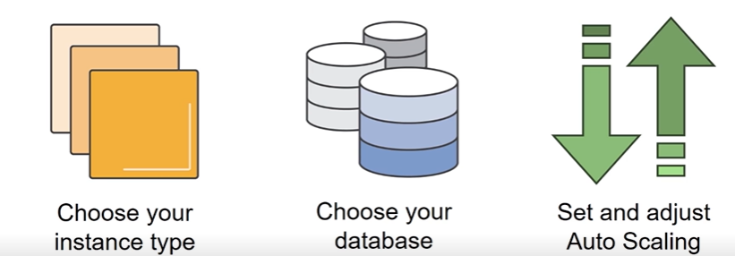
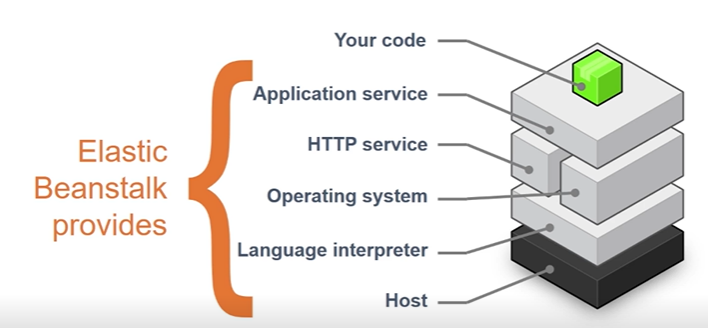
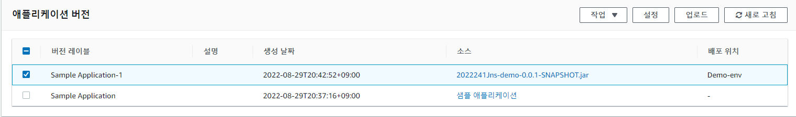
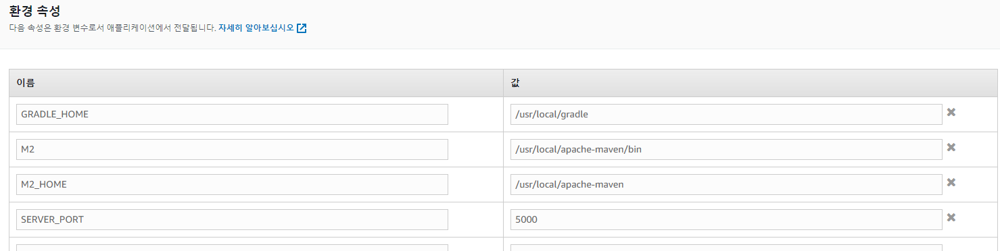

# 목차

- [목차](#목차)
- [1. Elastic Beanstalk 은 무엇인가?](#1-elastic-beanstalk-은-무엇인가)
- [2. Elastic Beanstalk 구성 요소](#2-elastic-beanstalk-구성-요소)
- [3. 예시](#3-예시)

# 1. Elastic Beanstalk 은 무엇인가?

_PaaS(Platform-as-a-Service)_ 는 인프라와 전체 플랫폼이 생성된 상태이므로 필요에 따라 코드를 시스템에
간단하게 배포할 수 있다는 의미다. 그래서 애플리케이션을 빠르게 배포할 수 있고, 관리 복잡성이 줄어든다.



개발자는 인스턴스 유형, 데이터베이스, Auto Scaling 을 필요에 따라 조정할 수 있다.
또한 서버 로그 파일에 액세스할 수 있으며 애플리케이션의 필요에 따라 로드 밸런서에서 HTTPS 를 활성화할 수 있다.

플랫폼의 지원 범위는 매우 다양하다.

- Packer Builder
- Single Container, Multi Container, Preconfigured Docker
- Go, Java SE, Java with Tomcat, .NET on Windows Server With IIS, Node.js, PHP....

_Packer Builder_ 에서 단일 컨테이너 혹은 다중 컨테이너 아니면 사전 구성된 도커로 이동한다.
개발자가 원하는 언어를 선택하고 기능을 개발 후에 Beanstalk 을 사용하여 필요에 따라 환경에 배포할 수 있다.

# 2. Elastic Beanstalk 구성 요소

그림과 같이 모든 애플리케이션 서비스 수준을 제공하기 때문에 개발자가 신경 쓸 부분이 상당히 줄어든다.



# 3. 예시

_Elastic Beanstalk_ 을 사용하면 우리가 서버를 배포하기 위해 EC2 서버에서 설정했던 많은 기본 부분을 생략할 수 있다.
스프링 부트에서 빌드한 jar 파일을 그대로 Beanstalk 에 넣어주고 갱신하면 배포가 알아서 진행된다.
자신의 컴퓨터에 있는 파일을 선택해도 되고, 없는 경우는 AWS 에서 제공해주는 샘플 코드를 이용할 수 있다.


```java
import org.springframework.web.bind.annotation.GetMapping;
import org.springframework.web.bind.annotation.RestController;

@RestController
public class DemoController {

	@GetMapping("/hello")
	public String hello() {
		return "hello aws";
	}
}
```

테스트를 위한 간단한 컨트롤러를 만들고 해당 파일을 빌드한 jar 파일을 그대로 배포를 진행했다.
외부 API 와 연동하는 코드를 개발하는 경우 CI/CD 가 적용되어 있어도 협업하는 과정에선 실환경 테스트하는 것이
까다로운 경우가 있는데, _Elastic BeanStalk_ 을 이용해 편리하게 실환경과 같은 테스트 진행이 가능하다.

또한 사이드 프로젝트 진행 시, 내 코드에 대한 빠른 결과를 확인하고 싶을 때도 매우 유용하다고 볼 수 있다.




참고로 Elastic Beanstalk 은 기본적으로 5000 포트를 사용한다.
따라서 스프링 부트의 기본 포트를 이용하면 502 에러가 나오기 때문에 구성에 들어가서 포트 변경을 해줘야한다.



올렸던 코드의 삭제 또한 마우스 클릭 한 번으로 이뤄지기 때문에 간편하다.


