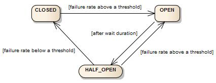
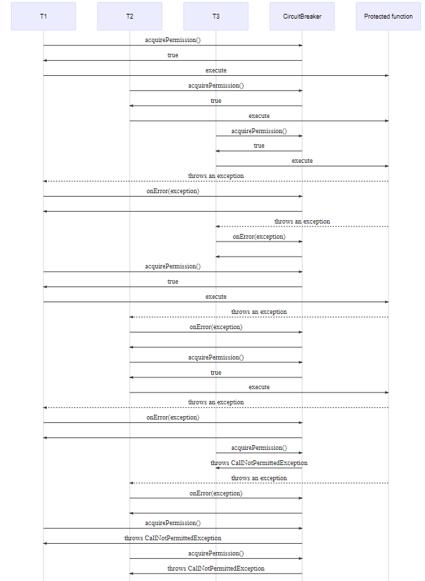

# 목차

- [목차](#목차)
- [1. Circuit Breaker 패턴](#1-circuit-breaker-패턴)
- [2. 사용하는 이유](#2-사용하는-이유)
- [3. Circuit Breaker 상태](#3-circuit-breaker-상태)
- [4. Resilience4j 라이브러리](#4-resilience4j-라이브러리)
  - [4.1 Count-Based Sliding Window](#41-count-based-sliding-window)
  - [4.2 Time-Based Sliding Window](#42-time-based-sliding-window)
  - [4.3 실패 비율 및 SLOW CALL 비율의 임계값(Threshold)](#43-실패-비율-및-slow-call-비율의-임계값threshold)
    - [실패 비율](#실패-비율)
    - [SLOW CALL 비율](#slow-call-비율)
    - [최소 호출 수](#최소-호출-수)
    - [CallNotPermittedException](#callnotpermittedexception)
    - [특수 상태](#특수-상태)
    - [Thread-Safe](#thread-safe)
  - [4.4 CircuitBreaker의 구성 요소](#44-circuitbreaker의-구성-요소)

# 1. Circuit Breaker 패턴

Circuit Breaker 패턴은 전기의 회로 차단기에서 차용한 개념이다.

- 회로가 닫혀있을 때는 정상적으로 전기가 흐른다.
- 문제가 생기면 그 즉시 회로를 열어 더이상 전기가 흐르지 않도록 한다.

전기와 같이 애플리케이션에서 문제가 되는 기능 자체를 동작하지 않게 해서 리소스를 점유하지 않게 하는 것이 **Circuit Breaker**
패턴이다.

# 2. 사용하는 이유

외부 API 호출할 때 호출 실패도 항상 고려해야한다.
만약 외부 API를 호출했는데 해당 API가 장기간 오류가 발생한다면 응답을 받지 못한 요청이 _time_out_ 이 될 때까지
무기한으로 리소스를 점유한다.

이 상태를 가만히 놔두면 같은 리소스를 사용하고 있는 다른 서비스에도 영향을 미쳐 순식간에 장애가 전파된다.
이러한 문제점을 해결하기 위해선 두 가지 방법이 있다.

1. 오류가 전파되지 못하도록 공유하고 있는 리소스를 분리한다.
2. 오류 발생시 오랫동안 리소스를 잡아두지 못하게 한다.

Circuit Breaker 패턴은 2번 방법에 해당한다.

# 3. Circuit Breaker 상태

총 세 가지 상태로 이루어진다.

- 정상 : Close
- 오류 : Open
- 반열림 : Half Open

전기의 경우 회로가 복구되면 그대로 다시 닫으면 되지만 애플리케이션의 경우는 그렇지 않다.

오류로 인해 처리 못한 요청들이 한꺼번에 밀려들면 트래픽 부하가 걸릴 가능성이 높기 때문에 일부 요청만 실행하면서
다시 정상적으로 동작하는지 확인하는 과정이 필요하다. 이 과정을 **Half Open**이라고 한다.

# 4. Resilience4j 라이브러리

_Resilience4j_ 라이브러리는 넷플릭스 히스트릭스에 영향을 받아 개발된 경량화 라이브러리이다.
_Resilience4j_ 는 세 가지 기본 상태와 두 가지 특수 상태가 존재한다.

- CLOSED
- OPEN
- HALF_OPEN

**특수 상태:**

- DISABLED:
- FORCED_OPEN:

CircuitBreaker 는 슬라이딩 윈도우를 사용하여 호출 결과를 저장하고 집계한다. 슬라이딩 윈도우 방식에는 두 가지가 있는데
하나를 선택할 수 있다.

- count-based sliding window : 마지막 N번 호출의 결과를 집계한다.
- time-based sliding window : 마지막 N초의 호출 결과를 집계한다.

> **슬라이딩 윈도우?**  
> 두 개의 네트워크 호스트간의 패킷의 흐름을 제어하기 위한 방법이다.
> 슬라이딩 윈도우는 윈도우(메모리 버퍼의 일정 영역)에 포함되는 모든 패킷을 전송하고 그 패킷들의 전송이 확인되는 대로
> 이 윈도우를 옆으로 옮김으로서 그 다음 패킷들을 전송하는 방식이다.  

> 슬라이딩 윈도우는 아직 확인을 받지 않고도 여러 패킷을 보내는 것을 가능하게 하기 때문에, stop-and-wait 를 사용하는
> 방식보다 훨씬 네트워크를 효율적으로 사용할 수 있다.

## 4.1 Count-Based Sliding Window

N번 측정한 원형 배열로 구현된다.

- 카운트 윈도우 크기가 10이면, 원형 배열은 항상 10개의 측정값을 가진다.
- 총 집계를 점차 업데이트한다. 새 통신 결과가 기록되면 총 집계가 업데이트되는데,
가장 오래된 측정값이 제거되면 총 집계에서 오래된 측정값이 차감되고 버킷이 재설정된다.
- 스냅샷을 검색하는 시간 복잡도는 O(1) 이다.

## 4.2 Time-Based Sliding Window

N개의 부분 집계(버킷)의 원형 배열로 구현된다.

- time-window 크기가 10초인 경우 원형 배열에는 항상 10개의 버킷이 있다.
- 모든 버킷은 특정 epoch 초에 발생하는 모든 호출의 결과를 집계한다.
- 슬라이딩 윈도우는 호출 결과(튜플)을 개별적으로 저장하지 않지만
버킷 및 전체 집계를 점진적으로 업데이트 한다.
- 스냅샷이 사전 집계되고 윈도우 사이즈와는 무관하므로 검색하는 시간 복잡도는 O(1)이다.

## 4.3 실패 비율 및 SLOW CALL 비율의 임계값(Threshold)

### 실패 비율

CircuitBreaker의 상태는 실패 비율이 사용자가 설정한 임계값과 같거나 크면 CLOSED에서 OPEN으로 변경된다.
예를 들면 통신을 하는데 50% 이상이 실패한 경우이다. 

- 기본적으로 모든 예외는 실패로 간주한다. 
- 물론 실패로 간주되어야 하는 예외 목록을 정의할 수 있다. 이 때의 다른 모든 예외는 성공으로 카운트된다.

### SLOW CALL 비율

SLOW CALL의 비율이 구성 가능한 임계값보다 크거나 같으면 CLOSED에서 OPEN으로 변경된다.
예를 들어 통신을 하는데 50% 이상이 5초 이상이 걸린 경우이다.

### 최소 호출 수

두 가지 비율을 전부 계산하기 위해 최소 호출 수가 기록되어야 한다.
예를 들어 필요한 호출의 최소 수가 10개라면 실패 비율을 카운트하기 앞서 최소 10개의 호출을 기록해야 한다.
9개인 상태라면 9번 실패해도 트립이 열리지 않는다.

### CallNotPermittedException

OPEN 상태일 때 _CallNotPermittedException_ 예외를 던져 호출되는 것을 막는다.

- 대기 시간이 경과하면 OPEN 에서 HALF_OPEN 로 변경하고 구성 가능한 수의 호출을 허용하여 서비스를 사용할 수 있는지
없는 지 판별한다.
- 허용된 모든 호출이 완료될 때까지 추가 호출은 _CallNotPermittedException_ 예외를 던진다.
- 실패 비율 또는 slow call 비율이 구성된 임계값보다 크거나 같으면 상태가 또다시 OPEN 으로 변경된다.
- 임계값 미만일때만 CLOSED로 변경된다.

### 특수 상태

DISABLED 와 FORCED_OPEN 의 특수 상태를 지원한다.

- DISABLED: 항상 액세스 허용
- FORCED_OPEN: 항상 액세스 거부

이 두 상태에서는 상태 전환을 제외한 CircuitBreaker 이벤트가 발생하지 않으며 메트릭이 기록되지 않는다.
특수 상태를 종료하려면 상태 전환을 트리거하거나 새로운 CircuitBreaker를 재설정해야만 한다.

### Thread-Safe

CircuitBreaker 는 다음과 같은 특성을 가지고 있어 멀티 쓰레드 환경에서도 안전하다.

- 상태는 AtomicReference 에 저장된다.
- 원자 연산을 사용하므로 사이드 이펙트가 발생하는 일 없이 상태를 업데이트할 수 있다.
- 통화 녹음, 슬라이딩 윈도우에서 스냅샷 읽기가 동기화된다.

즉, 원자성이 보장되며 특정 시점에서 하나의 쓰레드만 상태 또는 슬라이딩 윈도우를 업데이트할 수 있다.

함수 호출 전체를 동기화(synchronized)하면 병목 현상이 발생할 가능성이 크기 때문에 CircuitBreaker는 호출 자체를
동기화하지 않는다. 만약 20개의 동시(concurrent) 쓰레드가 함수 실행 권한을 요청하고 상태가 CLOSED 상태라면 모든 쓰레드가 함수 호출이 가능하다.
동시 쓰레드 수를 제한하려면 **Bulkhead**를 사용하면 된다.

> **쓰레드가 3개일 때:**

## 4.4 CircuitBreaker의 구성 요소

| 구성 속성                                  | 기본값                                                 | 설명                                                                                                                                                                                                           |
|:---------------------------------------|:----------------------------------------------------|:-------------------------------------------------------------------------------------------------------------------------------------------------------------------------------------------------------------|
| failureRateThreshold                   | 50                                                  | 실패비율 임계값을 백분율로 구성한다.   실패비율이 임계값보다 커질 때 상태를 OPEN으로 전환                                                                                                                                                |
| slowCallRateThreshold                  | 100                                                 | slow call 비율이 임계값보다 크거나 같으면 상태를 OPEN으로 변경                                                                                                                                                                    |
| slowCallDurationThreshold              | 60000ms                                             | 최대 호출 지속 시간. 이 값보다 커지면 slow call 발생                                                                                                                                                                          |
| permittedNumberOfCalls InHalfOpenState | 10                                                  | HALF-OPEN 상태일 때 허용되는 호출 수                                                                                                                                                                                    |
| maxWaitDurationInHalfOpenState         | 0                                                   | HALF-OPEN에서 OPEN 상태로 전환되기 전 HALF-OPEN 상태를 유지할 수 있는 최대 시간. 값 0은 HALF-OPEN 상태에서 무기한 대기함을 의미                                                                                                                    |
| slidingWindowType                      | COUNT_BASED                                         | 슬라이딩 윈도우 유형 선택                                                                                                                                                                                               |
| slidingWindowSize                      | 100                                                 | CLOSED 상태가 될 때 호출 결과를 기록하는 데 사용되는 슬라이딩 윈도우의 크기를 설정                                                                                                                                                           |
| minimumNumberOfCalls                   | 100                                                 | 실패 비율 또는 slow call 비율을 계산하기 전에 필요한 최소 호출 수를 설정                                                                                                                                                               |
|waitDurationInOpenState| 60000ms                                             | OPEN에서 HALF-OPEN으로 전환하기 전에 기다려야 하는 시간                                                                                                                                                                        |
|automaticTransition FromOpenToHalfOpenEnabled| false                                               | true 이면 자동으로 OPEN 상태에서 HALF-OPEN으로 전환되고 전환을 트리거하는데 호출이 필요하지 않음을 의미  false 이면 waitDurationInOpenState 가 전달된 이후에 호출이 이루어진 경우에만 HALF-OPEN으로 전환 발생. 장점은 모든 CircuitBreakers의 상태를 모니터링하는 쓰레드가 없어도 된다는 것이다. |
|recordExceptions| empty                                               | 실패로 기록되야하는 예외 목록. 예외 목록을 지정하면 ignoreExceptions에서 명시적으로 무시하지 않는 한 모든 예외는 성공으로 간주                                                                                                                              |
|ignoreExceptions| empty                                               | 무시되고 실패나 성공으로 간주되지 않는 예외 목록|
|recordFailurePredicate| throwable -> true    기본적으로 모든 예외는 실패로 기록된다. |예외를 실패로 기록해야하는지 여부를 평가하는 사용자 정의 서술어|
|ignoreExceptionPredicate|throwable -> false|예외를 무시하고 실패 또는 성공으로 간주하지 않아야 하는지 여부를 평가하는 사용자 정의 서술어. 예외를 무시해야하는 경우 true 리턴, 아닐 때는 false 리턴|

