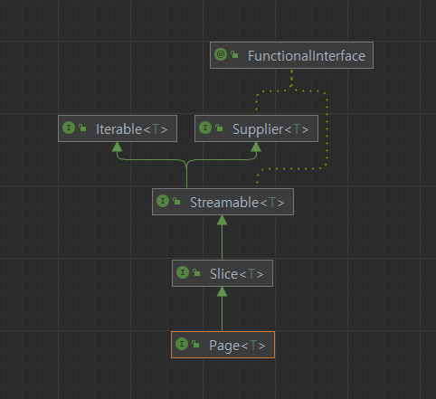

# 목차

- [목차](#목차)
- [1. 페이징과 정렬 파라미터](#1-페이징과-정렬-파라미터)
  - [1.1 특별한 반환 타입](#11-특별한-반환-타입)
  - [1.2 count 쿼리의 분리](#12-count-쿼리의-분리)

# 1. 페이징과 정렬 파라미터

스프링 데이터 JPA를 이용해서 페이징을 간단하게 처리할 수 있다.

```java
Page<Member> findByAge(int age, Pageable pageable);
```

```java
@Test
void paging() {
    memberRepository.save(new Member("member1", 10));
    memberRepository.save(new Member("member2", 10));
    memberRepository.save(new Member("member3", 10));
    memberRepository.save(new Member("member4", 10));
    memberRepository.save(new Member("member5", 10));

    int age = 10;
    PageRequest pageRequest = PageRequest.of(0, 3, Sort.by(Direction.DESC, "username"));
    Page<Member> page = memberRepository.findByAge(age, pageRequest);
}
```

- `Pageable` 파라미터 : _PageRequest_ 를 구현 후 이것을 인자로 전달한다.
- _Sort.by_ 는 페이징할 때 정렬을 설정하는 부분이다. 정렬 조건이 복잡해지면 해당 부분을 삭제하고 따로 쿼리를 작성하는 것이 좋다.

## 1.1 특별한 반환 타입

Page 인터페이스는 Slice 인터페이스를 상속한다.



- getTotalPages : 전체 페이지 수
- getTotalElements : 전체 데이터 수

_Page_ 인터페이스로 선언 시 전체 페이지 수와 데이터 수를 세기위한 쿼리문이 추가로 나간다.
따라서 이런 카운트가 필요없을 때는 _Page_ 인터페이스를 _Slice_ 인터페이스로 바꾸기만 해줘도 성능 최적화가 가능하다.

_Slice_ 는 쿼리를 날릴 때 `limit + 1`을 조회해서 다음 페이지 여부를 확인한다.

```java
public interface Page<T> extends Slice<T> {

	static <T> Page<T> empty() {
		return empty(Pageable.unpaged());
	}

	static <T> Page<T> empty(Pageable pageable) {
		return new PageImpl<>(Collections.emptyList(), pageable, 0);
	}

	int getTotalPages();

	long getTotalElements();
	
	<U> Page<U> map(Function<? super T, ? extends U> converter);
}
```

## 1.2 count 쿼리의 분리

left outer join 일 때 굳이 카운트 쿼리까지 join 할 필요는 없다.
이 때 countQuery 만을 따로 분리 후 작성이 가능하다.

```java
@Query(value = "select m from Member m left join m.team t",
    countQuery = "select count(m) from Member m")
Page<Member> findByAge(int age, Pageable pageable);
```

- **countQuery 를 분리했을 때:**

```text
select
    count(member0_.member_id) as col_0_0_ 
from
    member member0_
```

- **countQuery 를 따로 분리하지 않았을 때**

```text
select
    count(member0_.member_id) as col_0_0_ 
from
    member member0_ 
left outer join
    team team1_ 
        on member0_.team_id=team1_.team_id
```

> **참고.**<br/>
> 전체 count 쿼리는 매우 무겁다.

