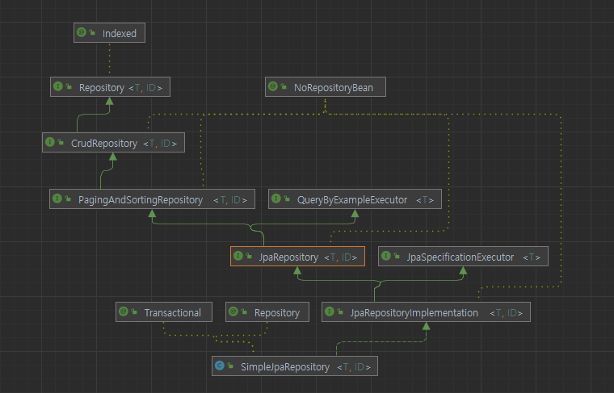

# 목차

- [목차](#목차)
- [1. 데이터 JPA 구현체](#1-데이터-jpa-구현체)
  - [1.1 데이터 JPA의 save() 메서드](#11-데이터-jpa의-save-메서드)

# 1. 데이터 JPA 구현체



_JpaRepository_ 인터페이스를 구현하는 클래스는 _SimpleJpaRepository_ 이다.

클래스 부분을 보면 _@Transactional_ 어노테이션이 선언되어 있기 때문에, 데이터 JPA 테스트를 진행할 땐 테스트 코드에
해당 어노테이션을 붙이지 않아도 된다. 다만 서비스 계층은 여러 리포지토리 접근이 필요한 경우가 대다수이므로 이럴 때는 _@Transactional_
어노테이션을 생략해선 안 된다.

```java
@Repository
@Transactional(readOnly = true)
public class SimpleJpaRepository<T, ID> implements JpaRepositoryImplementation<T, ID> {
    ...
}
```

기본적으로 _readOnly = true_ 가 붙어 있다. 이 값이 있으면 조회할 때 flush 작업을 생략하므로 성능 이점을 가져갈 수 있다.

> **참고.**  
> [읽기 전용 쿼리의 성능 최적화](https://github.com/dailyzett/TIL/blob/main/common/jpa/1_5.md#542-%EC%9D%BD%EA%B8%B0-%EC%A0%84%EC%9A%A9-%EC%BF%BC%EB%A6%AC%EC%9D%98-%EC%84%B1%EB%8A%A5-%EC%B5%9C%EC%A0%81%ED%99%94)

## 1.1 데이터 JPA의 save() 메서드

save() 메서드를 보면 새로운 엔티티에 대해선 _em.persist()_ 를 날리지만,
이미 존재하는 엔티티라면 _em.merge()_ 가 실행된다.

```java
@Transactional
@Override
public <S extends T> S save(S entity) {

    Assert.notNull(entity, "Entity must not be null.");

    if (entityInformation.isNew(entity)) {
        em.persist(entity);
        return entity;
    } else {
        return em.merge(entity);
    }
}
```

새로운 엔티티인지 판단하는 근거는 아래와 같다.

- 식별자가 객체일 때 null 로 판단한다.
- 식별자가 자바 기본 타입일 때 0으로 판단한다.
- Persistable 인터페이스를 구현해서 판단 로직 변경이 가능하다.

_em.merge()_ 의 문제점은 식별자를 개발자가 직접 입력할 때 문제가 발생한다.
예를 들어, _@GeneratedValue_ 가 없는 식별자가 있다고 가정할 때,

```java
@Entity
public class Item {

	@Id
	private String id;
}
```
```text
2022-08-15 17:48:10.997 DEBUG 3916 --- [           main] org.hibernate.SQL                        : 
    select
        item0_.id as id1_0_0_ 
    from
        item item0_ 
    where
        item0_.id=?
2022-08-15 17:48:11.014  INFO 3916 --- [           main] p6spy                                    : #1660553291014 | took 10ms | statement | connection 3| url jdbc:h2:tcp://localhost/~/datajpa
select item0_.id as id1_0_0_ from item item0_ where item0_.id=?
select item0_.id as id1_0_0_ from item item0_ where item0_.id='A';
2022-08-15 17:48:11.046 DEBUG 3916 --- [           main] org.hibernate.SQL                        : 
    insert 
    into
        item
        (id) 
    values
        (?)
2022-08-15 17:48:11.047  INFO 3916 --- [           main] p6spy                                    : #1660553291047 | took 0ms | statement | connection 3| url jdbc:h2:tcp://localhost/~/datajpa
insert into item (id) values (?)
insert into item (id) values ('A');
```

- select 쿼리가 한 번 더 나가는 이유는 _merge_ 의 작동 방식 때문이다.
- _merge_ 는 우선 DB를 호출해서 값을 확인하고, 값이 없으면 새로운 엔티티로 인지한다. 그래서 select 와 insert 총 두 번의 쿼리가 나간다.

이 문제를 해결하려면 _Persistable_ 인터페이스를 구현하면 된다.

```java
@Entity
public class Item implements Persistable<String> {

    @Id
    private String id;

    /**
     * 등록시간을 조합해서 사용하면 이 필드로 새로운 엔티티 여부를 편리하게 확인할 수 있다.
     * @CreatedDate == null 이면 새로운 값으로 판단해서 em.persist() 를 호출하는 방식이다.
     */
    @CreatedDate
    private LocalDateTime createdDate;

    public Item(String id) {
        this.id = id;
    }

    @Override
    public String getId() {
        return id;
    }

    @Override
    public boolean isNew() {
        return createdDate == null;
    }
}
```