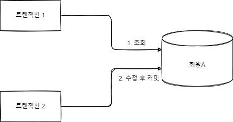
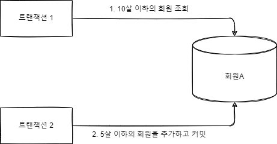
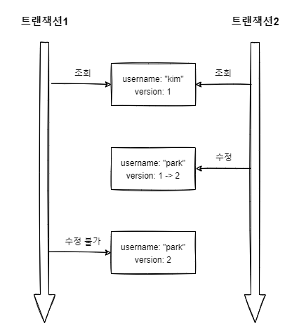
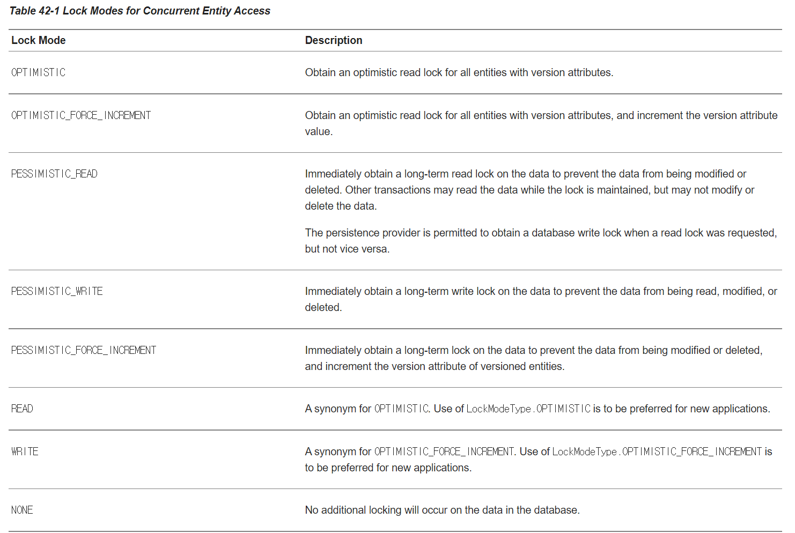
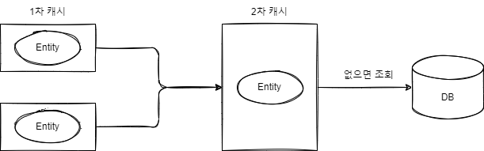

# 목차

- [목차](#목차)
- [1. 트랜잭션과 락](#1-트랜잭션과-락)
  - [1.1 트랜잭션과 격리 수준](#11-트랜잭션과-격리-수준)
    - [트랜잭션 격리 수준](#트랜잭션-격리-수준)
      - [READ UNCOMMITTED](#read-uncommitted)
      - [READ COMMITTED](#read-committed)
      - [REPEATABLE READ](#repeatable-read)
      - [SERIALIZABLE](#serializable)
  - [1.2 낙관적 락과 비관적 락 기초](#12-낙관적-락과-비관적-락-기초)
    - [낙관적 락](#낙관적-락)
    - [비관적 락](#비관적-락)
  - [1.3 @Version](#13-version)
    - [버전 정보 비교 방법](#버전-정보-비교-방법)
  - [1.4 JPA 락 사용](#14-jpa-락-사용)
  - [1.5 JPA 낙관적 락](#15-jpa-낙관적-락)
    - [NONE](#none)
    - [OPTIMISTIC](#optimistic)
    - [OPTIMISTIC_FORCE_INCREMENT](#optimistic_force_increment)
  - [1.6 JPA 비관적 락](#16-jpa-비관적-락)
    - [PESSIMISTIC_WRITE](#pessimistic_write)
    - [PESSIMISTIC_READ](#pessimistic_read)
    - [PESSIMISTIC_FORCE_INCREMENT](#pessimistic_force_increment)
  - [1.7 비관적 락과 타임아웃](#17-비관적-락과-타임아웃)
- [2. 2차 캐시](#2-2차-캐시)
  - [2.1 1차 캐시와 2차 캐시](#21-1차-캐시와-2차-캐시)
    - [2차 캐시](#2차-캐시)
  - [2.2 JPA 2차 캐시 기능](#22-jpa-2차-캐시-기능)
    - [캐시 모드 설정](#캐시-모드-설정)
    - [캐시 조회, 저장 방식 설정](#캐시-조회-저장-방식-설정)
    - [JPA 캐시 관리 API](#jpa-캐시-관리-api)
  - [2.3 하이버네이트와 ENCACHE 적용](#23-하이버네이트와-encache-적용)
    - [컬렉션 캐시와 쿼리 캐시의 주의점](#컬렉션-캐시와-쿼리-캐시의-주의점)

# 1. 트랜잭션과 락

## 1.1 트랜잭션과 격리 수준

트랜잭션은 ACID 를 보장해야한다.

- **Atomic(원자성):** 트랜잭션 내에서 실행한 작업들은 마치 하나의 작업처럼 모두
성공하든가 모두 실패해야 한다.
- **Consistency(일관성):** 모든 트랜잭션은 일관성 있는 데이터베이스 상태를 유지해야 한다. 예를 들어
데이터베이스에서 정한 무결성 제약 조건을 만족해야 한다.
- **Isolation(격리성):** 동시에 실행되는 트랜잭션이 서로 영향을 끼치지 못하도록 격리한다.
- **Duration(지속성):** 트랜잭션을 성공적으로 끝내면 그 결과가 항상 기록되어야 한다. 중간에 시스템 문제가 발생해도
데이터베이스 로그 등을 이용해서 성공한 트랜잭션 내용을 복구해야 한다.

트랜잭션의 격리성을 완벽히 보장하려면 모든 트랜잭션을 순차적으로 실행해야 한다.
하지만 이렇게 되면 동시성 처리 기능이 매우 나빠진다.
이러한 문제 때문에 트랜잭션 격리 수준은 총 4단계로 나뉘어진다.

### 트랜잭션 격리 수준

아래로 갈수록 격리 수준은 높아지지만 그만큼 동시성 처리 기능은 나빠진다.

- READ UNCOMMITTED
- READ COMMITTED
- REPEATABLE READ
- SERIALIZABLE

#### READ UNCOMMITTED

커밋하지 않은 데이터를 읽을 수 있다.


- 트랜잭션 1이 데이터를 수정하고 있는데 커밋하지 않아도 트랜잭션 2가 수정 중인 데이터를 조회할 수 있다.
- 트랜잭션 2가 _DIRTY READ_ 한 데이터를 사용하는데 트랜잭션 1을 롤백하면 데이터 정합성에 심각한 문제가 발생할 수 있다.

#### READ COMMITTED

커밋한 데이터만 읽을 수 있다. 따라서 DIRTY READ가 발생하지 않는다.



1. 트랜잭션 1이 회원 A를 조회한다.
2. 갑자기 트랜잭션 2가 회원 A를 수정하고 커밋한다.

이렇게 되면 트랜잭션 1이 회원 A를 조회했을 때 수정된 회원 데이터가 조회된다.
이처럼 반복해서 같은 데이터를 읽을 수 없는 상태를 _NON_REPEATABLE READ_ 라고 한다.

#### REPEATABLE READ

한 번 조회한 데이터를 반복해서 조회해도 같은 데이터가 조회된다.



1. 트랜잭션 1이 10살 이하의 회원을 조회한다.
2. 조회가 완료되기 전, 트랜잭션 2가 5살 이하의 회원을 추가하고 커밋한다.
3. 트랜잭션 1이 10살 이하의 회원을 조회하면 회원 하나가 추가된 상태로 조회된다.

이처럼 반복 조회 시 결과 집합이 달라지는 것을 _PHANTOM READ_ 라고 한다.

#### SERIALIZABLE

가장 엄격한 트랜잭션 수준이다. _DIRTY READ_, _NON_REPEATABLE READ_, _PHANTOM READ_ 모두를 방지할 수 있지만,
동시성 처리 성능이 급격하게 떨어질 수 있다.

애플리케이션 대부분은 동시성 처리 기능이 중요하므로 데이터베이스들은 보통 READ COMMITTED 격리 수준을 기본으로 사용한다.

## 1.2 낙관적 락과 비관적 락 기초

JPA의 영속성 컨텍스트를 적절히 활용하면 데이터베이스 트랜잭션이 READ COMMITTED 수준이어도 애플리케이션 레벨에서
REPEATABLE READ 가 가능하다. 물론 엔티티가 아닌 스칼라 값을 직접 조회하면 영속성 컨텍스트 관리를 받지 못하므로 반복 가능한
읽기를 할 수 없다.

### 낙관적 락

트랜잭션 대부분은 충돌이 발생하지 않는다고 낙관적으로 가정한다.

- JPA가 제공하는 버전 관리 기능을 사용한다.
- 트랜잭션을 커밋하기 전까지는 트랜잭션의 충돌 여부를 알 수 없다.

### 비관적 락

트랜잭션 대부분은 충돌이 발생한다고 가정하고 우선 락을 걸고 보는 방법이다.

- 데이터베이스가 제공하는 락 기능을 사용한다.
- 대표적으로 select for update 구문이 있다.

여기에 추가로 트랜잭션 범위를 넘어서는 문제도 있다. 사용자 A와 B가 동시에 게시글 하나를 수정한다고 가정한다.

1. 둘이 동시에 게시글 수정 버튼을 클릭해 게시글 수정 작업에 들어간다.
2. 사용자 A가 먼저 게시글 수정 후 수정 완료 버튼을 누른다.
3. 이후 사용자 B가 수정 완료 버튼을 누른다.
4. 결과적으로 먼저 완료한 사용자 A의 수정사항은 사라지고 사용자 B의 수정사항만 남게 된다.

이것을 **두 번의 갱신 분실 문제**라고 부른다. 이 문제는 트랜잭션 만으로 해결할 수 없다. 이 때는 세 가지 선택 방법이 있다.

1. 마지막 커밋만 인정한다.
2. 최초 커밋만 인정한다.
3. 충돌하는 갱신 내용을 병합한다.

기본은 1번을 따른다. 하지만 JPA가 제공하는 버전 관리 기능을 제공하면 손쉽게 2번을 구현할 수 있다.

## 1.3 @Version

JPA가 제공하는 낙관적인 락을 사용하려면 _@Version_ 어노테이션을 사용해야 한다. 적용 가능한 타입은 Long, Integer,
Short, Timestamp 로 총 네 가지다.

```java
@Entity
public class Member {
	
    @Id
    private String id;
    private String username;
    
    @Version
    private Integer version;
}
```

- 엔티티에 버전 관리용 필드를 하나 추가하고 _@Version_ 어노테이션을 붙이면 된다.
- 이제부터 엔티티를 수정할 때 마다 버전이 하나씩 자동으로 증가한다.
- 엔티티를 수정할 때 조회 시점의 버전과 수정 시점의 버전이 다르만 예외가 발생한다.

```java
//트랜잭션 1 조회 username="kim", version=1
Member member = em.find(Member.class, id);

//트랜잭션 2에서 해당 회원 이름을 수정해서 username="park", version=2로 증가
member.setUsername("park");

//회원 객체를 영속성 컨텍스트에 담고 flush
em.persist(member);
em.flush(); // commit 시점에서 예외 발생, 데이터베이스 version=2, 엔티티 version=1
```

그림으로 표현하면 아래와 같다.



1. 트랜잭션 1이 조회할 때의 _version_ 은 1 이었다.
2. 그런데 트랜잭션 2가 수정하고 커밋해서 _version_ 은 2로 바뀌었다.
3. 트랜잭션 1이 가지고 있는 _version_ 은 1인데, 데이터베이스 내부의 _version_ 은 2이다. 따라서 마지막 커밋은 인정되지 않고,
최초 커밋만 인정된다.

### 버전 정보 비교 방법

JPA는 엔티티를 수정하고 트랜잭션을 커밋하면 영속성 컨텍스트가 플러시 하면서 UPDATE 쿼리를 실행한다.
이 때 버전을 사용하는 엔티티면 검색 조건에 엔티티의 버전 정보를 추가한다.

```sql
UPDATE MEMBER
SET
    USERNAME=?,
    VERSION=?
WHERE
    ID=?
    AND VERSION=?
```

**버전은 엔티티의 값을 변경하면 증가한다.**

- 값 타입인 임베디드 타입과 값 타입 컬렉션은 논리적인 개념상 해당 엔티티의 값이므로 수정하면 버전이 증가한다.
- 연관관계 필드는 외래 키를 관리하는 연관관계의 주인 필드를 수정할 때만 버전이 증가한다.

@Version으로 추가한 버전 관리 필드는 JPA가 직접 관리하므로 개발자가 임의로 수정하면 안된다.
버전 값을 강제로 증가하려면 특별한 락 옵션을 사용해야 한다.

>**참고.**<br/>
> 벌크 연산은 버전을 무시한다. 벌크 연산에서 버전을 증가하려면 버전 필드를 쿼리로 강제로 증가시켜야 한다.

## 1.4 JPA 락 사용

JPA를 사용할 때 추천 전략은 READ COMMITTED 트랜잭션 격리 수준 + 낙관적 버전 관리다.

**락을 적용할 수 있는 위치:**

```text
- EntityManager.lock(), EntityManager.find(), EntityManager.refresh()
- Query.setLockMode()
- @NamedQuery

//조회하면서 즉시 락을 건다.
Member member = em.find(Member.class, id, LockModeType.OPTIMISTIC);

//필요할 때 락을 건다.
Member member = em.find(Member.class, id);
...
em.lock(member, LockModeType.OPTIMISTIC); 
```

**LockModeType 속성:**



## 1.5 JPA 낙관적 락

JPA는 _@Version_ 을 사용한다. 따라서 낙관적 락을 사용하려면 버전이 있어야 한다.
낙관적 락은 트랜잭션을 커밋하는 시점에 충돌을 알 수 있다.

```text
낙관적 락에서 발생하는 예외

-javax.persistence.OptimisticLockException(JPA 예외)
-org.hibernate.StableObjectStateException(하이버네이트 예외)
-org.springframework.orm.ObjectOptimisticLockingFailureException(스프링 예외 추상화)
```

- 락 옵션 없이 _@Version_ 만 있어도 낙관적 락이 적용된다.
- 하지만 락 옵션을 이용해 더욱 세밀하게 제어할 수 있다.

### NONE

- 용도: 조회한 엔티티를 수정할 때 다른 트랜잭션에 의해 변경(삭제)되지 않아야 한다.
- 동작: 엔티티를 수정할 때 버전을 체크하면서 버전을 증가한다.
- 이점: 두 번의 갱신 분실 문제를 방지한다.

### OPTIMISTIC

- 용도: 이 옵션은 엔티티를 조회만 해도 버전을 체크한다. 한 번 조회한 엔티티는 트랜잭션을 종료할 때까지 다른 트랜잭션에서
변경하지 않음을 보장한다.
- 동작: 트랜잭션을 커밋할 때 버전 정보를 조회해서 현재 엔티티의 버전 정보와 같은지 검증한다.
- 이점: DIRTY READ 와 NON-REPEATABLE READ 를 방지한다.

### OPTIMISTIC_FORCE_INCREMENT

낙관적 락을 사용하면서 버전 정보를 강제로 증가시킨다.

- 용도: 논리적인 단위의 엔티티 묶음을 관리할 수 있다.
```text
게시물과 첨부파일이 일대다, 다대일의 양방향 연관관계이고 첨부파일이 연관관계의 주인이다.
게시물을 수정하는 데 단순히 첨부파일만 추가하면 게시물의 버전은 증가하지 않는다.(연관관계의 주인이 아니므로)

해당 게시물은 물리적으로 변경되지 않았지만 논리적으로는 변경되었다.
이 때 게시물의 버전도 강제로 증가시키기 위해 OPTIMISTIC_FORCE_INCREMENT 를 사용할 수 있다.
```

- 동작: 엔티티를 수정하지 않아도 트랜잭션을 커밋할 때 UPDATE 쿼리를 사용해서 버전 정보를 강제로 증가시킨다.
추가로, 엔티티를 수정하면 수정 시 버전 UPDATE가 발생한다. 따라서 총 두 번의 버전 증가가 나타날 수 있다.

- 이점: 강제로 버전을 증가해서 논리적인 단위의 엔티티 묶음을 버전 관리할 수 있다.

## 1.6 JPA 비관적 락

데이터베이스 락 메커니즘에 의존하는 방법이다. 주로 SQL 쿼리에 select for update 구문을 사용하면서 시작하고 버전 정보는
관리하지 않는다. 주로 PESSIMISTIC_WRITE 모드를 사용한다.

특징:

- 엔티티가 아닌 스칼라 타입일 때도 사용할 수 있다.
- 데이터를 수정하는 즉시 트랜잭션 충돌을 감지할 수 있다.

### PESSIMISTIC_WRITE

- 용도: 데이터베이스 쓰기에 락을 건다.
- 동작: 데이터베이스 select for update를 사용해서 락을 건다.
- 이점: NON-REPEATABLE READ를 방지한다. 락이 걸린 로우는 다른 트랜잭션이 수정할 수 없다.

### PESSIMISTIC_READ

데이터를 반복 읽기만 하고 수정하지 않는 용도로 락을 걸 때 사용한다. 일반적으로 잘 사용하지 않는다.

### PESSIMISTIC_FORCE_INCREMENT

바관적 락중 유일하게 버전 정보를 사용한다. 비관적 락이지만 강제로 버전 정보를 증가시킨다.

## 1.7 비관적 락과 타임아웃

비관적 락을 사용하면 락을 획득할 때까지 다른 트랜잭션은 대기한다. 이 때 계속 대기할 수는 없으므로 타임아웃 시간을
줄 수 있다.

```java
Map<String, Object> properties = new HashMap<String, Object>();

//타임아웃 10초까지 대기 설정
properties.put("javax.persistence.lock.timeout", 10000);

Member member = em.find(Member.class, "memberId", LockModeType.PESSIMISTIC_WRITE, properties);
```

참고로 타임아웃은 데이터베이스 특성에 따라 동작하지 않을 수도 있다.

# 2. 2차 캐시

## 2.1 1차 캐시와 2차 캐시

네트워크를 통해 데이터베이스에 접근하는 시간 비용은 애플리케이션 서버에서 내부 메모리에 접근하는 시간 비용보다
수만에서 수십만배 이상 비싸다. 따라서 조회한 데이터를 메모리에 캐시해서 데이터베이스 접근 횟수를 줄이면 애플리케이션 성능을
획기적으로 개선할 수 있다.

- 1차 캐시?
  - 일반적인 웹 애플리케이션 환경은 트랜잭션을 시작하고 종료할 때까지만 1차 캐시가 유효하다.
  - OSIV를 사용해도 클라이언트의 요청이 들어올 때부터 끝날 때까지만 1차 캐시가 유효하다.
  - 따라서 애플리케이션 전체로 보면 데이터베이스 접근 횟수를 획기적으로 줄이진 못한다.

대부분의 JPA 구현체들은 애플리케이션 범위의 캐시를 지원하는데 이것을 공유 캐시 또는 2차 캐시라고 한다.



### 2차 캐시

- 2차 캐시는 애플리케이션 범위의 캐시다.
- 따라서 애플리케이션을 종료할 때까지 캐시가 유지된다.
- 엔티티 매니저를 통해 데이터를 조회할 때 우선 2차 캐시에서 찾고 없으면 데이터베이스에서 찾는다.

**2차 캐시는 결과를 반환할 때 원본을 반환하는게 아니라 복사본을 반환한다.**

- 원본을 반환하면 여러 곳에서 같은 객체를 동시에 수정해야 하는 문제가 발생할 수 있다.
- 이 문제를 해결하려면 객체에 락을 걸어야 하는데 락을 거는 순간 동시성 성능이 떨어진다.
- 그래서 동시성 성능을 극대화하기 위해 복사본을 반환한다.(객체 복사 비용이 훨씬 저렴하기 때문)

> **참고.**<br/>
> 2차 캐시는 데이터베이스 기본 키를 기준으로 캐시하지만 다른 영속성 컨텍스트 요청에 대해서 객체의 동일성을 보장하지 않는다.

## 2.2 JPA 2차 캐시 기능

### 캐시 모드 설정

2차 캐시를 사용하려면 엔티티에 _@Cacheable_ 을 붙인다.

```java
@Cacheable
@Entity
public class Member {
    @Id
    @GeneratedValue
    private Long id;
}
```

다음으로 applicaion.yml(스프링 부트 기준)에 _shared-cache-mode_ 를 설정해서 애플리케이션 전체에
캐시를 어떻게 적용할지 옵션을 설정한다.

```yaml
  jpa:
    properties:
      javax:
        persistence:
          sharedCache:
            mode: ENABLE_SELECTIVE
```

ALL, NONE, ENABLE_SELECTIVE, DISABLE_SELECTIVE, UNSPECIFIED 가 있는데 보통 ENABLE_SELECTIVE 를 사용한다.
해당 설정은 _@Cacheable_ 어노테이션이 붙은 엔티티만 캐시를 적용하겠다는 뜻이다.

### 캐시 조회, 저장 방식 설정

옵션은 다음과 같다.

- javax.persistence.CacheRetrieveMode: 캐시 조회 모드 설정 옵션
- javax.persistence.CacheStoreMode: 캐시 보관 모드 설정 옵션

```java
public enum CacheRetrieveMode {
    USE, // 캐시에서 조회한다. 기본값
    BYPASS // 캐시를 무시하고 데이터베이스에 직접 접근
}
```

```java
public enum CacheStoreMode {
    USE, // 조회한 데이터를 캐시에 저장, 있으면 최신 상태로 갱신하지 않는다. 트랜잭션 커밋하면 등록 수정한 엔티티도 캐시에 저장.
    BYPASS, // 캐시에 저장하지 않는다.
    REFRESH // USE 전략에 추가로 데이터베이스에서 조회한 엔티티를 최신 상태로 다시 캐시한다.
}
```

**적용 방법:**

```java
//엔티티 매니저 범위
em.setProperty("javax.persistence.cache.retrieveMode", CacheRetrieveMode.BYPASS);

//find()
Map<String, Object> param = new HashMap<>();
param.put("javax.persistence.cache.retrieveMode", CacheRetrieveMode.BYPASS);
param.put("javax.persistence.cache.storeMode", CacheStoreMode.BYPASS);

em.find(MemberEntity.class, id, param);

//JPQL
em.createQuery(
	"select m from Member m where m.id = :id", Member.class)
        .setParameter("id", id)
        .setHint("javax.persistence.cache.retrieveMode", CacheRetrieveMode.BYPASS)
        .setHint("javax.persistence.cache.storeMode", CacheStoreMode.BYPASS)
        .getSingleResult();
```

### JPA 캐시 관리 API

JPA는 캐시를 관리하기 위한 _javax.persistence.Cache_ 인터페이스를 제공한다.

```java
public interface Cache {

  /**
   * 해당 엔티티가 캐시에 있는지 여부 확인
   */
  public boolean contains(Class cls, Object primaryKey);

  /**
   * 해당 엔티티 중 특별 식별자를 가진 엔티티를 캐시에서 제거
   */
  public void evict(Class cls, Object primaryKey);

  /**
   * 해당 엔티티 전체를 캐시에서 제거
   */
  public void evict(Class cls);

  /**
   * 모든 캐시 데이터 제거
   */
  public void evictAll();

  /**
   * JPA Cache 구현체 조회
   */
  public <T> T unwrap(Class<T> cls);
}
```

## 2.3 하이버네이트와 ENCACHE 적용

하이버네이트는 세 가지 캐시를 지원한다.

1. 엔티티 캐시: 엔티티 단위로 캐시
2. 컬렉션 캐시: 엔티티와 연관된 컬렉션을 캐시. **컬렉션이 엔티티를 담고 있으면 식별자 값만 캐시한다.**
3. 쿼리 캐시: 쿼리와 파라미터 정보를 키로 사용해서 캐시. **결과가 엔티티면 식별자 값만 캐시한다.**

### 컬렉션 캐시와 쿼리 캐시의 주의점

**쿼리 캐시와 컬렉션 캐시는 결과 집합의 식별자 값만 캐시한다.**
이 식별자 값을 하나씩 엔티티 캐시에서 조회해서 실제 엔티티를 찾는다.

문제는 쿼리 캐시나 컬렉션 캐시만 사용하고 대상 엔티티에 엔티티 캐시를 적용하지 않았을 때 발생한다.

1. `select m from Member m` 쿼리를 실행했는데 쿼리 캐시가 적용되어 있다. 결과 집합 건은 100건이다.
2. 결과 집합에는 식별자 값만 있으므로 한 건씩 엔티티 캐시 영역에서 조회한다.
3. Member 엔티티는 엔티티 캐시를 사용하지 않으므로 한 건씩 데이터베이스에서 조회한다.
4. 결국 100건의 SQL이 더 실행된다.

**이런 문제 발생을 방지하기 위해 컬렉션 캐시나 쿼리 캐시를 사용하려면 대상 엔티티에도 반드시 엔티티 캐시를 적용해야 한다.**

