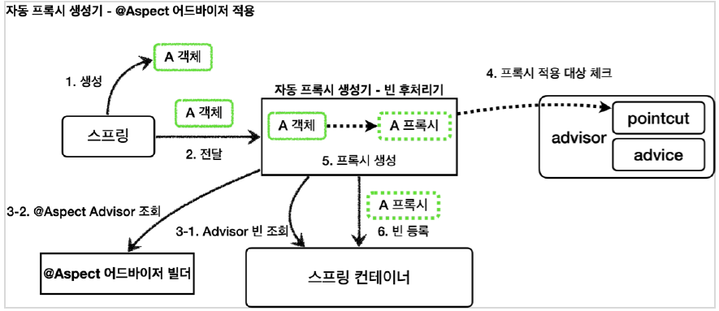

# 목차

- [목차](#목차)
- [1. Aspect AOP](#1-aspect-aop)
  - [1.1 @Aspect 프록시 - 동작 원리](#11-aspect-프록시---동작-원리)

# 1. Aspect AOP

스프링 애플리케이션에 프록시를 적용하려면 포인트컷과 어드바이스로 구성되어 있는 어드바이저를 만들어서 스프링 빈으로 등록하면 된다.
그러면 나머지는 앞서 배운 자동 프록시 생성기가 모두 자동으로 처리해준다.

스프링은 *@Aspect* 애노테이션으로 매우 편리하게 포인트컷과 어드바이스로 구성되어 있는 어드바이저 생성 기능을 지원한다.

> **참고.**
>
> *@Aspect* 는 AOP를 가능하게 하는 AspectJ 프로젝트에서 제공하는 애노테이션이다. 스프링은 이것을 차용해서 프록시를 통한 AOP를 가능하게 한다.

```java
@Slf4j
@Aspect
@RequiredArgsConstructor
public class LogTraceAspect {

  private final LogTrace logTrace;

  @Around("execution(* hello.proxy.app..*(..))")
  public Object execute(ProceedingJoinPoint joinPoint) throws Throwable {
    TraceStatus status = null;
    try {
      String message = joinPoint.getSignature().toShortString();
      status = logTrace.begin(message);

      //로직 호출
      Object result = joinPoint.proceed();

      logTrace.end(status);
      return result;
    } catch (Exception e) {
      logTrace.exception(status, e);
      throw e;
    }
  }
}
```

- @Aspect: 애노테이션 기반 프록시를 작성할 때 필요하다.
- @Around(...):
  - 괄호 안에 포인트컷 표현식을 넣는다. 표현식은 AspectJ 표현식을 사용한다.
  - 아래의 메서드는 어드바이스가 된다.
- ProceedingJoinPoint joinPoint: 어드바이스에서 살펴본 *MethodInvocation* 과 비슷한 기능이다. 내부에 실제 호출 대상,
  전달 인자, 그리고 어떤 객체와 어떤 메서드가 호출되었는지 정보가 포함되어 있다.
- joinPoint.proceeding: 실제 호출 대상(target)을 호출한다.

```java
@Configuration
@Import({AppV1Config.class, AppV2Config.class})
public class AopConfig {

  @Bean
  public LogTraceAspect logTraceAspect(LogTrace logTrace) {
    return new LogTraceAspect(logTrace);
  }
}
```

Config 클래스에는 추가해줬던 @Aspect 애노테이션이 붙은 클래스와 부가 기능이 되는 어드바이스를 넘겨주면 된다.

- 해당 코드에 사용된 @Aspect 와 어드바이스
  - @Aspect: LogTraceAspect
  - 어드바이스: LogTrace

## 1.1 @Aspect 프록시 - 동작 원리

자동 프록시 생성기는 *@Aspect* 애노테이션을 찾아 이것을 어드바이저로 만들어준다.

자동 프록시 생성기가 하는 일:

1. **@Aspect 를 보고 어드바이저로 변환해서 저장**


2. **어드바이저를 기반으로 프록시 생성**


