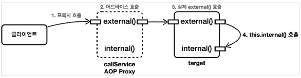

# 목차

# 1. 프록시와 내부 호출

스프링은 프록시 방식의 AOP를 사용한다. 따라서 AOP를 사용하려면 항상 프록시를 통해서 대상 오브젝트(Target)을 호출해야 한다.
**그래서 대상 오브젝트의 내부에서 메서드 호출이 발생하면 프록시를 거치지 않고 대상 오브젝트를 직접 호출하는 문제가 발생한다.**

```java
@Slf4j
@Component
public class CallService {

    public void external() {
        log.info("call external");
        internal();
    }

    public void internal() {
        log.info("call internal");
    }
}
```

테스트 코드로 *external()* 메서드를 호출하면 *internal()* 메서드에도 AOP가 적용될 것 같지만 적용되지 않는다.

```java
@Test
void external() {
    callService.external();
}
```

```text
2022-10-10 15:57:30.980  INFO 23164 --- [           main] h.aop.internalcall.aop.CallLogAspect     : aop=void hello.aop.internalcall.CallServiceV0.external()
2022-10-10 15:57:30.990  INFO 23164 --- [           main] hello.aop.internalcall.CallServiceV0     : call external
2022-10-10 15:57:30.990  INFO 23164 --- [           main] hello.aop.internalcall.CallServiceV0     : call internal
```

스프링은 프록시 방식의 AOP를 사용하기 때문에 내부 메서드의 호출에 대해서는 AOP를 적용할 타이밍을 찾을 수 없다.
코드에선 단순히 *internal()* 로 되어 있지만, 사실 이 메서드는 앞의 *this* 가 생략된 것이다. *this* 는 실제 타겟을 의미한다.



## 1.1 대안 1 - 자기 자신 호출

내부 호출을 해결하는 가장 간단한 방법은 자기 자신을 의존관계 주입받는 것이다.

```java
public class CallService {

    private CallService callService;

    @Autowired
    public void setCallServiceV1(CallService callService) {
        log.info("callService setter={}", callService.getClass());
        this.callService = callService;
    }
  
    ...
    callService.internal();
}
```

setter 의존 주입 형식으로 자기 자신을 주입받는다. 이후 *this.internal()* 을 *callService.internal()* 로 자기 자신을 외부에서 호출하는 방식을 사용하면 AOP를 적용할 수 있다.

> **참고.**
>
> 스프링 부트 2.6 이상부터는 순환 참조를 금지하도록 정책이 변경되었다. 따라서 자기 자신을 호출해서 테스트를 성공하려면 *yml* 이나 *properties* 파일에
> `spring.main.allow-circular-references=true` 를 추가해야 한다.

## 1.2 대안 2 - 지연조회

*ApplicationContext* 를 이용해서 빈을 지연 조회하는 방식을 선택하면 굳이 setter 주입을 할 필요가 없다. 다만 *ApplicationContext* 는 오브젝트만 꺼내오기에는 그 기능이 너무 방대하다. 따라서 이 때는 오브젝트를 실제 사용하는 지점에서 가져오기만 하면 되기 때문에 *ObjectProvider<?>* 를 사용하는 것이 좋다.

```java
public class CallService {

    private final ObjectProvider<CallService> callServiceProvider;

    public CallService(
        ObjectProvider<CallService> callServiceProvider) {
        this.callServiceProvider = callServiceProvider;
    }

    public void external() {
        log.info("call external");
        CallService bean = callServiceProvider.getObject();
        bean.internal();
    }
}
```

결과는 대안 1과 똑같다.

## 1.3 대안 3 - 구조변경

대안 1번과 2번은 억지로 AOP를 적용시키는 것 같이 부자연스러움이 있다. 사실 가장 나은 대안은 내부 호출이 발생하지 않도록 구조 자체를 변경하는 것이다.
실제 스프링에서도 이 방법을 가장 권장한다.

*internal()* 메서드를 아예 다른 클래스로 분리하는 것으로부터 시작한다.

```java
public class InternalService {

    public void internal() {
        log.info("call internal");
    }
}
```

내부 동작 메서드를 클래스 별로 완전히 분리하는 것으로 프록시가 적용되도록 한다.

# 2. 프록시 기술과 한계 - 타입 캐스팅

JDK 동적 프록시 방식은 구체 클래스로 타입 캐스팅이 불가능한 한계가 있다.

```java
@Test
void jdkProxy() {
    MemberServiceImpl target = new MemberServiceImpl();
    ProxyFactory proxyFactory = new ProxyFactory(target);
    proxyFactory.setProxyTargetClass(false); // JDK 동적 프록시로 설정

    MemberService proxy = (MemberService) proxyFactory.getProxy();
    MemberServiceImpl castingProxy = (MemberServiceImpl) proxy;
}
```

이 테스트 코드는 실패한다. JDK proxy 는 인터페이스를 기반으로 프록시를 생성하기 때문에 그 인터페이스를 구현한 구체 클래스에 대한
정보는 전혀 알지 못하기 때문이다.

반면 CGLIB 방식을 사용하면 테스트는 성공한다.

```java
proxyFactory.setProxyTargetClass(true);
```

CGLIB는 구체 클래스를 기반으로 프록시를 생성한다. 따라서 CGLIB는 인터페이스와 구체 클래스 전부 타입 캐스팅이 가능하다.

이것이 중요한 이유는 **프록시의 의존관계 주입**때문이다.

## 2.1 프록시의 의존관계 주입

```java
public class ProxyDITest {

    @Autowired
    MemberService memberService;

    @Autowired
    MemberServiceImpl memberServiceImpl;

    @Test
    void test() {
        log.info("memberService={}", memberService.getClass());
        log.info("memberServiceImpl={}", memberServiceImpl.getClass());
        memberServiceImpl.hello("hello");
    }
}
```

properties 에서 JDK 동적 프록시를 사용한다는 가정 하에, 이 테스트는 실패한다.
예외 메시지를 보면, *MemberServiceImpl* 을 기대했는데 엉뚱한 proxy 오브젝트가 넘어왔다고 알려준다.

```text
org.springframework.beans.factory.UnsatisfiedDependencyException: Error creating bean with name 'hello.aop.proxyvs.ProxyDITest': Unsatisfied dependency expressed through field 'memberServiceImpl';
nested exception is org.springframework.beans.factory.BeanNotOfRequiredTypeException: Bean named 'memberServiceImpl' is expected to be of type 'hello.aop.member.MemberServiceImpl' but was actually of type 'jdk.proxy2.$Proxy53'
```

JDK proxy 는 인터페이스를 구현했기 때문에 인터페이스인 *MemberService* 로는 타입 캐스팅이 가능하다.
반면 *MemberServiceImpl* 정보는 없기 때문에 타입 캐스팅이 불가능하다. 따라서 JDK 동적 프록시를 사용할 때는 인터페이스에만 의존 주입을 해야한다.

CGLIB를 사용하면 이런 고민 자체가 필요없다. 하지만 CGLIB 방식에도 단점이 있다.

## 2.2 CGLIB의 한계

- 대상 클래스에 기본 생성자 필수
- 생성자 두 번 호출 문제
- final 키워드 클래스, 메서드 사용 불가

CGLIB는 구체 클래스를 상속 받기 때문에 위처럼 세가지 문제가 있다.


> **대상 클래스에 기본 생성자 필수**

자바 언어에서 상속을 받으려면 서브 클래스의 생성자를 호출할 때 서브 클래스의 생성자에서 슈퍼 클래스의 생성자도 같이 호출해야한다.
생략되어있으면 자동으로 *super()* 가 호출된다. 이 부분은 자바 문법 규약이 되기 때문에 깨뜨릴 수 없다.

> **생성자 두번 호출 문제**

1. 실제 target 오브젝트를 생성할 때
2. 프록시 오브젝트를 생성할 때 부모 클래스의 생성자 호출

> **final 키워드 클래스, 메서드 사용 불가**

final 키워드가 클래스에 있으면 상속이 불가능하고, 메서드에 있으면 오버라이딩이 불가능하다. 다만 일반적인 상황일 때 *final* 키워드는 주로 사용하지 않기 때문에 이 부분은 크게 문제가 되지 않는다.

# 3. 스프링의 해결책

## 3.1 스프링의 기술 선택 변화

> **스프링 3.2, CGLIB를 스프링 내부에 함께 패키징**

> **CGLIB 기본 생성자 필수 문제 해결**

- 스프링 4.0부터 *objenesis* 라는 특별한 라이브러리를 사용해서 기본 생성자 없이 오브젝트 생성이 가능하게 했다.

> **생성자 두 번 호출 문제 해결**

- target 오브젝트를 생성할 때는 물론 생성자가 필수지만, 프록시 오브젝트를 만들 때는 생성자를 만들 필요가 없으므로 한 번만 호출된다.
- 이 역시 *objenesis* 라는 특별한 라이브러리 때문에 가능해졌다.

이렇게 CGLIB 문제가 해결됐기 때문에 스프링 부트 2.0 버전부터 CGLIB를 기본으로 사용하도록 했다. (JDK 동적 프록시는 구체 클래스 타입으로 의존관계 주입이 불가능하므로)

이제 남은 문제는 *final* 키워드인데, AOP를 적용할 대상에는 *final* 클래스나 *final* 메서드를 잘 사용하지 않으므로 이 부분은 큰 문제가 되지 않는다.
