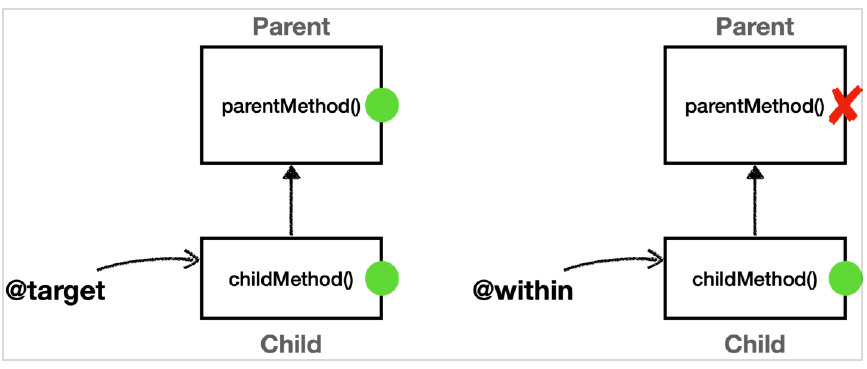

# 목차

- [목차](#목차)
- [1. 포인트컷 지시자](#1-포인트컷-지시자)
  - [1.1 가장 정확한 매칭](#11-가장-정확한-매칭)
  - [1.2 가장 생략된 매칭](#12-가장-생략된-매칭)
  - [1.3 메서드 이름으로 매칭](#13-메서드-이름으로-매칭)
  - [1.4 패키지로 매칭](#14-패키지로-매칭)
- [2. within](#2-within)
- [3. args](#3-args)
- [4. @target, @within](#4-target-within)
- [5. @annotation, @args](#5-annotation-args)
- [6. bean](#6-bean)
- [7. 매개변수 전달](#7-매개변수-전달)
- [8. this, target](#8-this-target)

# 1. 포인트컷 지시자

## 1.1 가장 정확한 매칭

```java
@Test
void exactMatch() {
    //public java.lang.String hello.member.MemberServiceImpl.hello(java.lang.String)
    pointcut.setExpression("execution(public String hello.member.MemberServiceImpl.hello(String))");
    assertThat(pointcut.matches(helloMethod, MemberServiceImpl.class)).isTrue();
}
```

## 1.2 가장 생략된 매칭

> 매칭 조건

- 접근제어자: public
- 반환타입: String
- 선언타입: hello.member.MemberServiceImpl
- 메서드이름: hello
- 파라미터: (String)
- 예외: 생략됨

```java
@Test
void allMatch() {
    pointcut.setExpression("execution(* *(..))");
    assertThat(pointcut.matches(helloMethod, MemberServiceImpl.class)).isTrue();
}
```

> 매칭 조건

- 접근제어자, 선언타입, 예외는 생략됨
- 반환타입: `*`
- 메서드이름: `*`
- 파라미터: `(..)`

## 1.3 메서드 이름으로 매칭

메서드 이름 패턴 형식으로도 지정 가능하다. 예를 들면,

- `hel*`
- `*el*`

```java
@Test
void nameMatch() {
    pointcut.setExpression("execution(* hello(..))");
    assertThat(pointcut.matches(helloMethod, MemberServiceImpl.class)).isTrue();
}
```

## 1.4 패키지로 매칭

```java
//정확한 패키지
pointcut.setExpression("execution(* hello.member.MemberServiceImpl.hello(..))");

//하위 패키지 포함
pointcut.setExpression("execution(* hello.member.*.*(..))");

//서브 패키지까지 포함
//hello.member 도 포함되고, 그 하위에 있는 모든 패키지는 대상이 된다.
pointcut.setExpression("execution(* hello.member..*.*(..))");
```

- `.` : 정확하게 해당 위치의 패키지
- `..` : 해당 위치의 패키지와 그 하위 패키지도 포함

# 2. within

within 지시자는 특정 타입 내의 조인 포인트에 대한 매칭을 제한한다. 다시 말해, 해당 타입이 매칭되면 그 안의 메서드들이 자동으로 매칭된다.

```java
@Test
void withinTest() {
    pointcut.setExpression("within(hello.member.MemberServiceImpl)");
    assertThat(pointcut.matches(helloMethod, MemberServiceImpl.class)).isTrue();
}

@Test
void withinStar() {
    pointcut.setExpression("within(hello.member.*Service*)");
    assertThat(pointcut.matches(helloMethod, MemberServiceImpl.class)).isTrue();
}

@Test
void withinSubPackage() {
    pointcut.setExpression("within(hello.member..*)");
    assertThat(pointcut.matches(helloMethod, MemberServiceImpl.class)).isTrue();
}
```

> **주의.**
>
> *within* 은 표현식에 부모 타입을 지정하면 안 된다. 정확하게 타입이 맞아야 한다.
> 이 부분에서 execution 과 차이가 난다.

# 3. args

인자가 주어진 타입의 인스턴스인 조인 포인트로 매칭한다. 기본 문법은 *execution* 의 *args* 를 적는 부분과 동일하다.
한 가지 차이점은 *args* 는 부모 타입을 허용한다. *args* 는 실제 넘어온 파라미터 객체 인스턴스를 보고 판단한다.

```java
@Test
void args() {
    assertThat(pointcut("args(String)").matches(helloMethod, MemberServiceImpl.class)).isTrue();
    assertThat(pointcut("args(Object)").matches(helloMethod, MemberServiceImpl.class)).isTrue();
    assertThat(pointcut("args()").matches(helloMethod, MemberServiceImpl.class)).isFalse();
    assertThat(pointcut("args(..)").matches(helloMethod, MemberServiceImpl.class)).isTrue();
    assertThat(pointcut("args(*)").matches(helloMethod, MemberServiceImpl.class)).isTrue();
    assertThat(pointcut("args(String, ..)").matches(helloMethod, MemberServiceImpl.class)).isTrue();
}
```

`execution(* *(Object))` 는 매칭에 실패하지만 `args(Object)` 는 성공한다.
전자는 정적으로 메서드의 시그니처로 판단하기 때문이고 후자는 런타임에 전달된 인수로 판단하기 때문에 나오는 결과가 다르다.

참고로 *args* 는 단독으로 사용되기 보다는 파라미터 바인딩에서 주로 사용된다.

# 4. @target, @within

- @target: 실행 오브젝트의 클래스에 주어진 타입의 애노테이션이 있는 조인 포인트
- @within: 주어진 애노테이션이 있는 타입 내 조인 포인트

둘 다 아래와 같이 타입에 있는 애노테이션으로 AOP 적용 여부를 판단한다.

```java
@target(hello.member.annotation.ClassAop)
@within(hello.member.annotation.ClassAop)
```

- *@target* 은 인스턴스의 모든 메서드를 조인 포인트로 적용한다. 그래서 부모 클래스의 메서드까지 어드바이스를 전부 적용한다.
- *@within* 은 자신의 클래스에 정의된 메서드에만 어드바이스를 적용하므로 부모 클래스에는 어드바이스를 적용하지 못한다.



```java
@Slf4j
@Import({AtTargetAtWithinTest.Config.class})
@SpringBootTest
public class AtTargetAtWithinTest {

    @Autowired
    Child child;

    @Test
    void success() {
        log.info("child proxy={}", child.getClass());
        child.childMethod();
        child.parentMethod();
    }

    static class Config {

        ...
    }

    static class Parent {

        ...
    }

    @ClassAop
    static class Child extends Parent {

        ...
    }

    @Slf4j
    @Aspect
    static class AtTargetAtWithinAspect {

        @Around("execution(* hello..*(..)) && @target(hello.member.annotation.ClassAop)")
        public Object atTarget(ProceedingJoinPoint joinPoint) throws Throwable {
            log.info("[@target]{}", joinPoint.getSignature());
            return joinPoint.proceed();
        }

        @Around("execution(* hello..*(..)) && @within(hello.member.annotation.ClassAop)")
        public Object atWithin(ProceedingJoinPoint joinPoint) throws Throwable {
            log.info("[@within]{}", joinPoint.getSignature());
            return joinPoint.proceed();
        }
    }
}
```

위 예제에서 *execution* 으로 적용 대상을 줄여준 것을 확인할 수 있다. *args*, *@args*, *@target* 은 실제 오브젝트 인스턴스가 생성되고 실행될 때 어드바이스 적용 여부를 확인할 수 있다.
실행 시점에 일어나는 포인트컷 적용 여부도 결국 프록시가 있어야 실행 시점에 판단할 수 있다.

**스프링 컨테이너가 프록시를 생성하는 시점은 애플리케이션 로딩 시점에 적용할 수 있다.**
따라서 위 세 개의 포인트컷 지시자가 있으면 스프링은 모든 스프링 빈에 AOP를 적용하려고 시도한다. 프록시가 없으면 실행 시점에 판단 자체가 불가능하기 때문이다. 문제는 이렇게 모든 빈에 스프링 AOP를 적용하려고 하면 스프링이 내부에서 사용하는 빈 중에서 *final* 로 지정된 빈들도 있기 때문에 예외가 터질 수 있다. 따라서 이러한 표현식은 최대한 프록시 적용 대상을 축소하는 표현식과 함께 사용해야 한다.

# 5. @annotation, @args

> @annotation

- 메서드가 주어진 애노테이션을 가지고 있는 조인 포인트를 매칭

```java
@Slf4j
@Import(AtAnnotationTest.AtAnnotationAspect.class)
@SpringBootTest
public class AtAnnotationTest {

    @Autowired
    MemberService memberService;

    @Test
    void success() {
        log.info("memberService Proxy={}", memberService.getClass());
        memberService.hello("helloA");
    }

    @Slf4j
    @Aspect
    static class AtAnnotationAspect {

        @Around("@annotation(hello.aop.member.annotation.MethodAop)")
        public Object doAtAnnotation(ProceedingJoinPoint joinPoint) throws Throwable {
            log.info("[@annotation]{}", joinPoint.getSignature());
            return joinPoint.proceed();
        }
    }
}
```

```text
2022-10-09 19:12:19.720  INFO 26020 --- [           main] hello.aop.pointcut.AtAnnotationTest      : memberService Proxy=class hello.aop.member.MemberServiceImpl$$EnhancerBySpringCGLIB$$65d28f9e
2022-10-09 19:12:19.724  INFO 26020 --- [           main] .a.p.AtAnnotationTest$AtAnnotationAspect : [@annotation]String hello.aop.member.MemberServiceImpl.hello(String)
```

> @args

- 전달된 인자의 런타임 타입에 *@check* 애노테이션이 있는 경우에 매칭한다.
- `@args(test.Check)`

# 6. bean

- 스프링 전용 포인트컷 지시자이다. 빈의 이름으로 지정한다.
- 스프링 빈의 이름으로 AOP 적용 여부를 지정하기 때문에 스프링에서만 사용할 수 있다.
- `*`과 같은 패턴 사용 가능

```java
@Slf4j
@SpringBootTest
public class BeanTest {

    @Autowired
    OrderService orderService;

    @Test
    void success() {
        orderService.orderItem("itemA");
    }

    @Slf4j
    @Aspect
    static class BeanAspect {

        @Around("bean(orderService) || bean(*Repository)")
        public Object doLog(ProceedingJoinPoint joinPoint) throws Throwable {
            log.info("[bean] {}", joinPoint.getSignature());
            return joinPoint.proceed();
        }
    }
}
```

```text
2022-10-09 19:22:53.867  INFO 22112 --- [           main] hello.aop.order.OrderService             : [orderService] 실행
2022-10-09 19:22:53.867  INFO 22112 --- [           main] hello.aop.order.OrderRepository          : [orderRepository] 실행
```

# 7. 매개변수 전달

다음 포인트컷 표현식을 사용해서 어드바이스에 매개변수를 전달할 수 있다.
`this, target, args, @target, @within, @annotation, @args`

```java
@Before("allMember() && args(arg...)")
public void logArgs3(String arg) {
    log.info("[logArgs3] args={}", arg);
}
```

- 포인트컷의 이름과 매개변수의 이름은 동일해야 한다.
- 추가로 타입이 메서드에 지정된 타입으로 제한된다.

# 8. this, target

- this: 스프링 빈 오브젝트(프록시)를 대상으로 하는 조인 포인트
- target: Target 오브젝트(실제 대상)를 대상으로 하는 조인 포인트

*this*, *target* 은 적용 타입 하나를 정확하게 지정해야 한다. (`*` 같은 패턴은 사용 불가능)

```java
this(hello.aop.member.MemberService)
target(hello.aop.member.MemberService)
```

- *this* 는 스프링 빈으로 등록되어 있는 프록시 오브젝트를 대상으로 포인트컷을 매칭한다.
- *target* 은 실제 target 오브젝트를 대상으로 포인트컷을 매칭한다.

> 프록시를 대상하는 *this* 의 경우 구체 클래스를 지정하면 프록시 생성 전략에 따라(CGLIB, JDK 동적 프록시) 다른 결과가 나올 수 있다.
