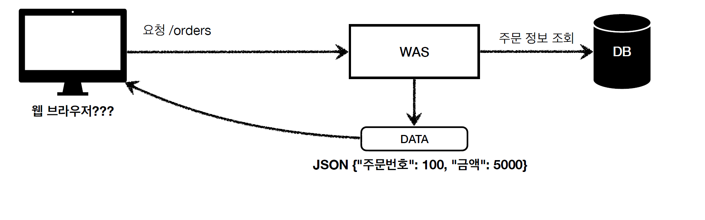
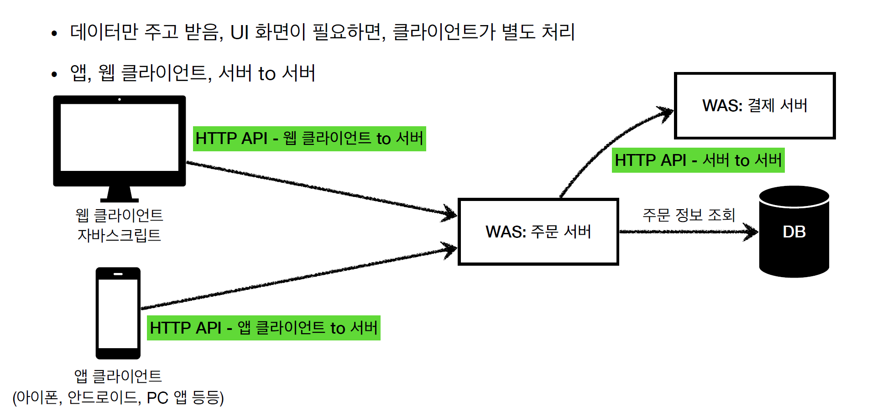
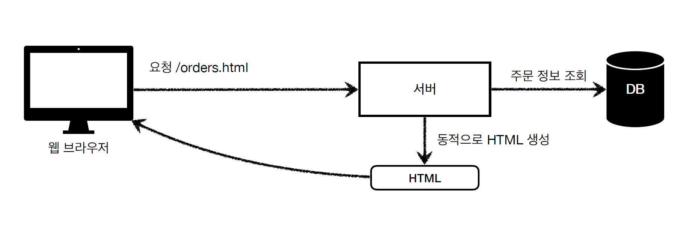
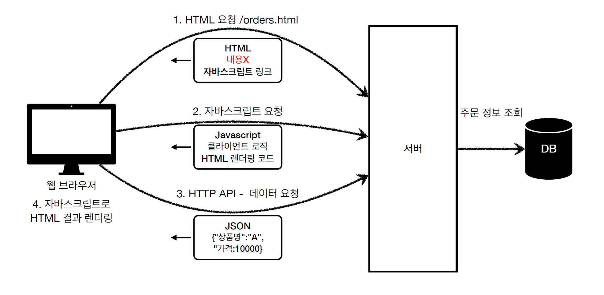

# 1.4 HTML, HTTP API, CSR, SSR

## 정적 리소스

- 고정된 HTML 파일, CSS, JS, 이미지, 영상 등을 제공
- 주로 웹 브라우저에서 요청 한다.

### HTML 페이지

HTML 페이지를 요청할 때 동적인 HTML 페이지도 요청 가능하다.
예를 들어 주문 내역을 조회해달라는 요청이 오면 WAS를 통해 DB 정보에서 주문 정보를 조회한 후,
동적인 HTML을 생성한다.

이런 것들을 **뷰 템플릿**이라고도 하며 사용하는 툴로 JSP, 타임리프, 기타 등등이 있다.

### HTTP API

HTML을 전달하는 것이 아니라 데이터를 전달한다.
주문 정보를 조회해서 JSON 같은 데이터 형식으로 파싱 후 데이터를 리턴한다.

JSON을 사용해 HTML 페이지로 출력하면 위 사진처럼 {"주문번호":100, "금색": 5000} 이 출력된다.
하지만 정보가 이런 방식으로 사용자에게 노출되는 방식은 의미도 알아보기 힘들기 때문에 좋지 않다.
따라서 정적 HTML 페이지 방식으로는 보여주지 않는다.

JSON으로 데이터를 전달할 때 주로 데이터만 처리하고 UI 화면이 필요하면 클라이언트가 별도로 처리한다.
예를 들어 스마트폰 앱 개발의 경우 자체적인 UI가 있기 때문에 WAS에게 데이터만 내려달라고 하는 경우가 많다.
이 때 JSON 형식으로 데이터를 내려주고 그 데이터는 클라이언트에서 알아서 처리하도록 내버려둔다.

웹 클라이언트 to 서버는 웹 브라우저에서 자바스크립트를 통한 HTTP API를 호출하는 경우를 말한다.
리액트나 뷰를 예시로 들 수 있다.

서버 to 서버의 경우에 데이터만 교환하고 따로 뷰는 필요하지 않다. 이 때도 HTTP 프로토콜 상에서 JSON 으로 데이터를 주고 받는다.

> 정리하면, 서비스를 개발할 때는 정적 리소스, 동적으로 제공되는 HTML 페이지, HTTP API를 어떻게 제공할 지를 고민해야 한다.

## 서버 사이드 렌더링, 클라이언트 사이드 렌더링

### 서버 사이드 렌더링

웹 브라우저에서 서버에게 `/orders.html` 요청을 넣으면 서버는 주문 정보를 DB에서 조회한다.
그리고 서버는 결과 데이터를 가지고 HTML 화면을 렌더링한다.

웹 브라우저는 HTTP 응답을 통해 HTML 코드를 받기만 하고 그 결과를 그대로 보여준다.
즉 HTML 문서는 이미 서버측에서 전부 만들어진 상태를 클라이언트는 받기만 하는 것이다.
이것을 **서버 사이드 렌더링**이라고 한다.

### 클라이언트 사이드 렌더링(CSR)

HTML 결과를 자바스크립트를 사용해 웹 브라우저에서 동적으로 생성해서 적용하는 것을 **클라이언트 사이드 렌더링**이라고 부른다.
주로 동적인 화면에 사용하고 웹 환경에서 필요한 부분만 변경할 수 있도록 만들어준다.

대표적으로 리액트, 뷰 같은 프레임워크가 있다. CSR의 작동 방식을 그림으로 나타내면 아래와 같다.

## 백엔드 개발자 입장에서 UI 기술

- 백엔드 - SSR

서버 사이드 렌더링 기술은 JSP와 타임 리프를 사용한다.(JSP는 거의 사장되었다)
백엔드 개발자는 서버 사이드 렌더링 기술 학습은 필수이다.

- 선택과 집중

백엔드 개발자의 웹 프론트엔드 기술 학습은 옵션이다.
백엔드 개발자는 서버, DB, 인프라 등등 수 많은 백엔드 기술을 공부해야 하고
웹 프론트엔드도 잘 하려면 숙련에 오랜 기간이 필요하다.

## 출처

> [인프런 강의 - 스프링 MVC 1편](https://www.inflearn.com/course/%EC%8A%A4%ED%94%84%EB%A7%81-mvc-1/dashboard)
