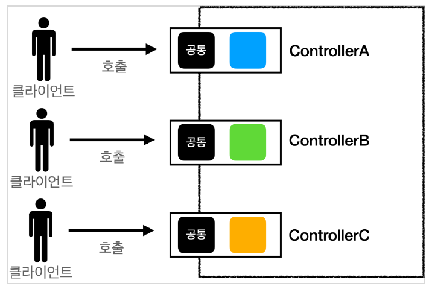
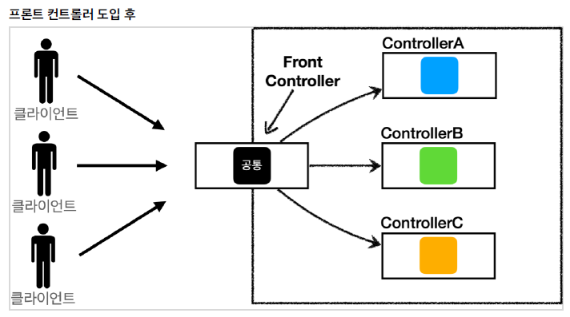

# 3.1 MVC 패턴 - 적용

```java
@WebServlet(name = "mvcMemberFormServlet", urlPatterns = "/servlet-mvc/members/new-form")
public class MvcMemberFormServlet extends HttpServlet {
    @Override
    protected void service(HttpServletRequest request, HttpServletResponse response) throws ServletException, IOException {
        String viewPath = "/WEB-INF/views/new-form.jsp";
        RequestDispatcher dispatcher = request.getRequestDispatcher(viewPath);
        dispatcher.forward(request, response);
    }
}
```

- `dispatcher.forward()`는 다른 서블릿이나 JSP로 이동할 수 있도록 만들어 준다. 이 때 서버 내부에서 재호출이 일어난다.
- `/WEB-INF` 안의 경로에 뷰 템플릿 파일이 있으면 외부에서 직접 접근이 불가능하다. MVC 패턴에서 컨트롤러만을 통해서
뷰 템플릿을 불러올 때 사용한다.

> **redirect vs forward**<br/>
> 리다이렉트는 실제 클라이언트에 응답이 갔다가 클라이언트가 redirect 경로로 다시 요청한다.
> 따라서 클라이언트가 인지할 수 있고 실제 URL 주소가 변경된다.
> 하지만 forward는 서버 내부에서 호출이 발생하므로 클라이언트가 전혀 인지하지 못한다.

## 3.1.1 MVC 패턴의 한계

MVC 패턴을 통해 컨트롤러를 구현하면 아래 코드가 컨트롤러마다 반복된다.

```java
String viewPath = "/WEB-INF/views/new-form.jsp";
RequestDispatcher dispatcher = request.getRequestDispatcher(viewPath);
dispatcher.forward(request, response);
```

메서드로 책임 분리를 해도 되지만 그 메서드조차도 매번 호출해야된다는 것은 똑같다.
그리고 `viewPath`를 보면 경로가 손코딩 돼있다.
만약 `.jsp`가 아닌 다른 뷰 템플릿 파일로 바뀌면 일일이 확장자를 전부 변경해야 한다.

- **파라미터로 항상 `HttpServletRequest`, `HttpServletResponse` 반복**

`request` 객체와 `response` 객체는 둘 다 사용하지 않을 수도 있지만 서블릿에는 매번 중복되서 나타난다.
그리고 `HttpServletRequest`, `HttpServletResponse`를 사용하는 메서드는 테스트 케이스를 작성하기도 어렵다는 단점이 있다.



### 문제 해결

이 문제를 해결하려면 **프론트 컨트롤러**패턴을 도입해야 한다.
컨트롤러를 호출하기 전에 공통 기능을 처리해야 하는 또 다른 컨트롤러를 앞에다 두는 것이다.
스프링 MVC의 핵심도 바로 이런 프론트 컨트롤러에 있다.




#### 프론트 컨트롤러의 특징

- 프론트 컨트롤러 서블릿 하나로 여러 클라이언트의 요청을 받는다.
- 프론트 컨트롤러가 요청에 맞는 컨트롤러를 찾아서 호출한다.
- 공통 처리가 가능하기 때문에 나머지 컨트롤러는 서블릿을 사용하지 않아도 된다.