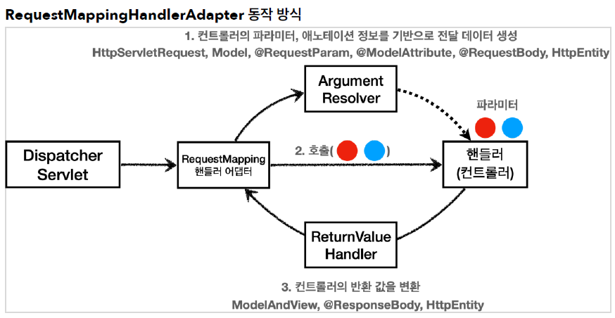
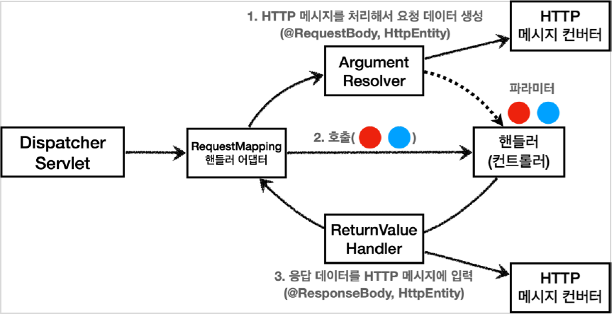

# 5.7 HTTP 메시지 컨버터

뷰 템플릿으로 HTML을 생성해서 응답하는 것이 아니라, HTTP API처럼 JSON 데이터를 HTTP 메시지 바디에서 직접 읽거나 쓰는 경우 HTTP 메시지 컨버터를
사용하면 편리하다.


HTTP 메시지 컨버터는 HTTP 요청, HTTP 응답 둘 다 사용된다.

## 5.7.1 스프링 부트 기본 메시지 컨버터

HTTP 메시지 컨버터에도 타입에 따라 적용되는 우선 순위가 있다.

```text
0 = ByteArrayHttpMessageConverter
1 = StringHttpMessageConverter
2 = MappingJackson2HttpMessageConverter
```

대상 클래스 타입과 미디어 타입 둘을 체크해서 사용여부를 결정한다.
만약 만족하지 않으면 다음 메시지 컨버터로 우선순위가 넘어간다.

- ByteArrayHttpMessageConverter
  - 클래스 타입: `byte[]`, 미디어 타입: `*/*`
- StringHttpMessageConverter
  - 클래스 타입: `String`, 미디어 타입: `*/*`
- MappingJackson2HttpMessageConverter
  - 클래스 타입: 객체 또는 `HashMap`, 미디어 타입: `application/json` 관련

    
> HTTP 요청 데이터 읽기

1. HTTP 요청에 따라 컨트롤러에서 `@RequestBody`, `HttpEntity` 파라미터를 사용.
2. 메시지 컨버터가 메시지를 읽을 수 있는지 확인하기 위해 `canRead()` 호출.
   1. `@RequestBody`의 대상 클래스 확인(`byte[]`, `String`, `CustomObject`)
   2. HTTP 요청의 **Content-Type** 미디어 타입의 지원 여부(`text/plain`, `application/json`, `*/*`)  
3. `canRead()` 조건을 만족하면 `read()`를 호출해서 객체 생성 후 반환.

> HTTP 응답 데이터 읽기

1. 컨트롤러에서 `@ResponseBody`, `HttpEntity`로 값 반환
2. 메시지 컨버터가 메시지를 쓸 수 있는지 확인하기 위해 `canWrite()` 호출
   1. 반환할 대상 클래스(`byte[]`, `String`, `CustomObject`)
   2. HTTP 요청의 Accept 타입의 지원 여부(더 정확히는 `@RequestMapping`의 `produces`)
3. `canWrite()` 조건을 만족하면 `write()`를 호출해서 HTTP 응답 메시지 바디에 데이터를 생성

### 예시

- **StringHttpMessageConverter**

미디어 타입이 `*/*`이기 때문에 HTTP `content-type`가 JSON이여도
파라미터 타입이 `String`이라면 `StringHttpMessageConverter`이 실행된다. 

```http request
content-type: application/json
```

```java
@RequestMapping
void hello(@RequetsBody String data) {}
```

- **MappingJackson2HttpMessageConverter**

HTTP 요청 미디어 컨텐츠 타입이 JSON이고 사용자 정의 객체를 `@RequestBody`로 받고 있기 때문에
이 때는 `MappingJackson2HttpMessageConverter`이 선택된다.

```http request
content-type: application/json
```

```java
@RequestMapping
void hello(@RequetsBody HelloData data) {}
```

- **모호한 부분**

```http request
content-type: text/html
```

```java
@RequestMapping
void hello(@RequetsBody HelloData data) {}
```

일단 클래스 타입이 사용자 정의 객체이기 때문에 바이트와 스트링 메시지 컨버터는 자동으로 탈락된다.
남은 것은 `MappingJackson2HttpMessageConverter`인데, 이 메시지 컨버터는 미디어 타입이 `application/json`일 때만 작동한다.

즉 이 예시 코드는 우선 순위에 있는 모든 메시지 컨버터를 사용하지 못하는 코드이다. 

## 5.7.2 요청 매핑 핸들러 어댑터 구조

HTTP 메시지 컨버터는 스프링 MVC에서 어디쯤 사용되는 것일까?  
정답은 `@RequestMapping`을 처리하는 핸들러 어댑터인 `RequestMappingHandlerAdapter`에 있다.



> ArgumentResolver

애노테이션 기반의 컨트롤러는 매우 다양한 파라미터를 사용할 수 있다.
- `HttpServletRequest` `Model`
- `@RequestParam` `@ModelAttribute`
- `@RequestBody` `HttpEntity`

이렇게 파라미터를 유연하게 처리할 수 있는 이유는 `ArgumentResolver`가 있기 때문이다.
애노테이션 기반 컨트롤러를 처리하는 `RequestMappingHandlerAdapter`는 `ArgumentResolver`를 호출해서 핸들러가 필요로 하는 다양한 파라미터를 생성한다.
그리고 파라미터의 값이 모두 준비되면 핸들러를 호출하면서 값을 넘겨준다.

#### 동작 방식

```java
public interface HandlerMethodArgumentResolver {
    
	boolean supportsParameter(MethodParameter parameter);

	@Nullable
	Object resolveArgument(MethodParameter parameter, @Nullable ModelAndViewContainer mavContainer,
			NativeWebRequest webRequest, @Nullable WebDataBinderFactory binderFactory) throws Exception;

}
```


- `ArguementResolver`의 `supportParameter()`를 호출해서 해당 파라미터를 지원하는지 확인한다.
- 지원하면 `resolveParameter()`를 호출해서 실제 객체를 생성한다.
- 실제 객체는 핸들러 호출 시 전달된다.

> ReturnValueHandler

`ArguementResolver`와 비슷하지만 응답 값을 변환하고 처리한다.

컨트롤러에서 `String`으로 뷰 이름을 반환해도 동작하는 이유가 `ReturnValueHandler` 덕분이다.

### HTTP 메시지 컨버터의 위치

**요청**의 경우 `@RequestBody` 를 처리하는 `ArgumentResolver` 가 있고, `HttpEntity` 를 처리하는
`ArgumentResolver` 가 있다. 이 `ArgumentResolver` 들이 HTTP 메시지 컨버터를 사용해서 필요한
객체를 생성하는 것이다.

**응답**의 경우 `@ResponseBody` 와 `HttpEntity` 를 처리하는 `ReturnValueHandler` 가 있다. 그리고
여기에서 HTTP 메시지 컨버터를 호출해서 응답 결과를 만든다.



