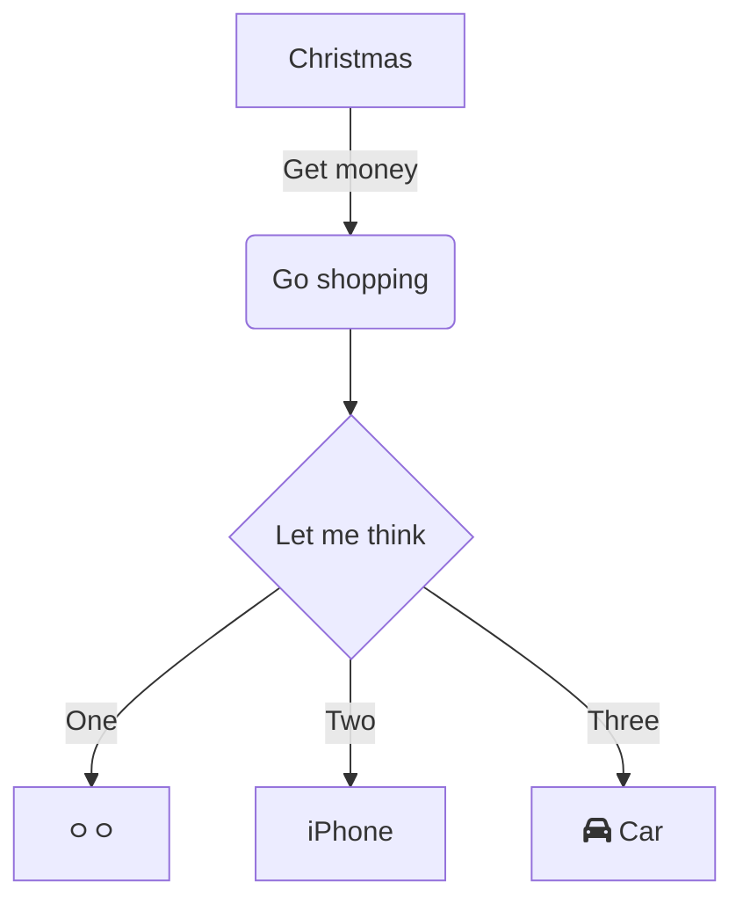

# 6.3 다이내믹 프록시와 팩토리 빈

## 6.3.1 프록시와 프록시 패턴, 데코레이터 패턴

자신이 클라이언트가 사용하려고 하는 실제 대상인 것처럼 위장해서 클라이언트의 요청을 받아주는 것을 대리자, 대리인과 같은 역할을 한다고 해서
**프록시**라고 부른다. 그리고 프록시를 통해 최종적으로 요청을 위임받아 처리하는 실제 오브젝트를 **타깃** 또는 **실체**라고 부른다.

프록시의 특징은 타깃과 같은 인터페이스를 구현했다는 것과 프록시가 타깃을 제어할 수 있는 위치에 있다는 것이다.
프록시는 사용 목적에 따라 두 가지로 구분할 수 있다.
- 첫번째는 클라이언트가 타깃에 접근하는 방법을 제어하기 위해서다.
- 두번째는 타깃에 부가적인 기능을 부여해주기 위해서다.

### 데코레이터 패턴

타깃에 부가적인 기능을 런타임 시 다이내믹하게 부여해주기 위해 프록시를 사용하는 패턴을 말한다.
데코레이터 패턴은 프록시가 꼭 한 개로 제한되지 않는다. 프록시가 여러 개인 만큼 순서를 정해서 단계적으로 위임하는 구조로 만들면 된다.

예를 들어 소스코드에 라인넘버를 붙여준다거나, 문법에 따라 색을 변경해주거나, 특정 폭으로 소스를 잘라주거나,
페이지를 표시해주는 등의 부가적인 기능을 각각 프록시로 만들어두고 아래 그림처럼 런타임 시에 이를 적절한 순서로 조합해서 사용하면 된다.

