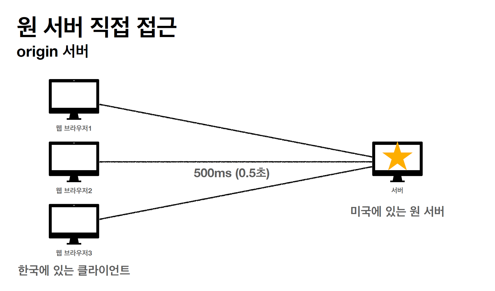
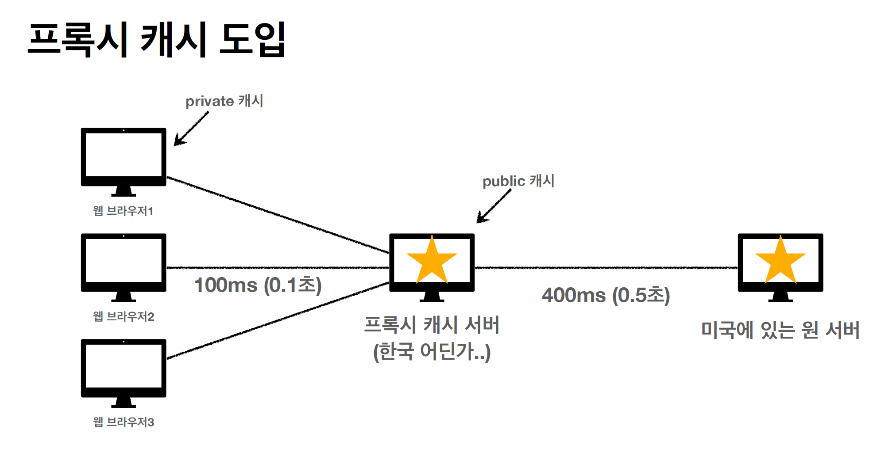

# HTTP 캐시 기본 동작

## 1. 개요

캐시를 사용하지 않는 경우 데이터를 가져올 때 일일이 서버에서 그 데이터를 갱신해야 한다.
이렇게 되면 변경되지 않은 데이터를 가져올 때도 항상 가져와야 하므로 시간이 오래 걸릴 수밖에 없다.
그래서 클라이언트와 서버 간 통신에서 캐시를 지원하는데, 캐시를 사용해서 얻는 이점은 다음과 같다.

- 캐시 덕분에 캐시 가능 시간동안 네트워크를 사용하지 않아도 된다.
- 비싼 네트워크 사용량을 줄일 수 있다.
- 브라우저 로딩 속도가 줄어든다.

### 1.1 캐시 시간 초과

캐시를 사용할 때 보통 캐시 유효 시간을 지정한다.

```http request
HTTP/1.1 200 OK
Content-Type: image/jpeg
cache-control: max-age=60
Content-Length: 34012
```

캐시 유효 시간이 초과하면 서버를 통해 다시 데이터를 조회하고 캐시를 갱신한다.
이 때 네트워크 다운로드가 발생한다. 
캐시 유효 시간이 초과하면 다음과 같은 두 가지 상황이 나타난다.

1. 서버에서 기존 데이터를 변경
2. 서버에서 기존 데이터를 변경하지 않음

2번 같은 경우, 서버에서 데이터를 변경하지 않았는데 굳이 네트워크 다운로드를 할 필요가 없다.
그냥 저장해두었던 캐시를 재사용하면 되기 때문이다.
이 때 클라이언트는 데이터와 서버의 데이터가 같은지를 확인할 수 있는 수단이 필요하다.
그 수단은 검증 헤더에 있는 **Last-Modified**이다.

```http request
HTTP/1.1 200 OK
Content-Type: image/jpeg
cache-control: max-age=60
Last-Modified: 2020년 11월 10일 10:00:00
Content-Length: 34012
```

클라이언트에 저장된 캐시의 Last-Modified 와 서버에서 보낸 Last-Modified 가 같다면,
브라우저 캐시를 그대로 사용하면 되기 때문에 훨씬 효율적이다.
캐시 유효 시간이 끝나면 클라이언트는 **if-modified-since** 를 헤더에 담아 전송한다.
그리고 클라이언트의 if-modified-since 와 서버의 Last-Modified 가 같으면 서버는 304 상태 코드를 전송한다.
304 상태 코드를 서버로부터 받으면 클라이언트는 브라우저 캐시 저장소에서 데이터를 가져온다.

### 1.2 ETag(Entity Tag)

하지만 Last-Modified 만 사용하는 것에도 단점이 있다.

- 제일 작은 시간의 단위가 **초**이기 때문에 초 미만의 캐시 조정이 불가능하다.
- 서버가 A 데이터를 B 로 교체했다. 그리고 다시 B 데이터를 A로 교체했다.
이 경우, 데이터는 같지만 Last-Modified 값은 바뀌므로 네트워크 다운로드가 필요하다.
- 서버에서 별도의 캐시 로직을 관리하지 못한다.

이것을 ETag를 이용해서 해결할 수 있다.
ETag를 이용해서 캐시용 데이터에 임의의 고유한 버전 이름을 담아둘 수 있다.

> 예) ETag: "v1.0", ETag: "a2jiodwjekjl3"

데이터가 변경되면 이 이름을 바꾸어서 변경한다.
ETag는 Hash를 이용해서 생성하기 때문에 데이터를 변경한 날짜가 달라도 최종 데이터의 내용이 같으면 ETag는 같다.
ETag를 이용해서 캐시 판별을 하려면 서버에서 보내는 헤더 양식이 조금 달라진다.

```http request
HTTP/1.1 200 OK
Content-Type: image/jpeg
cache-control: max-age=60
ETag: "aaaaaaaaaa"
Content-Length: 34012

lkj123kljoiasudlkjaweioluywlnfdo912u34ljko98udjklasl
kjdfl;qkawj9;o4ruawsldkal;skdjfa;ow9ejkl3123123
```

서버에서 위와 같은 ETag를 보냈을 때, 캐시 유효 시간이 만료되면 클라이언트는 아래의 요청을 보낸다.

```http request
GET /star.jpg
If-None-Match: "aaaaaaaaaa"
```

ETag는 단순하게 이 값이 일치하면 유지, 다르다면 서버에서 받아온다.
중요한 것은 캐시 제어 로직을 완전히 서버에서 컨트롤 한다는 점이다.
클라이언트는 캐시 제어 로직을 알지 못하고 ETag의 동일 여부만 알 수 있다.

### 1.3 캐시 제어 헤더

- Cache-Control
- Pragma
- Expires

**1. Cache-Control**

- Cache-Control: max-age 

> 캐시 유효 시간을 설정한다. 초 단위이다.

- Cache-Control: no-cache

> 데이터는 캐시해도 되지만, 항상 원 서버에 검증이 필요하다.

- Cache-Control: no-store

> 데이터에 민감한 정보가 있으므로 저장하면 안 될 때 사용한다.

2. Pragma

캐시 제어의 하위 호환 버전이다. HTTP 1.0 이하를 쓰는 웹 페이지에서 하위 호환을 위해 사용한다.

3. Expires

캐시 만료일을 정확한 날짜로 지정한다. Cache-Control: max-age가 훨씬 유연하기 때문에 max-age 사용을 권장하지만
이것 역시도 하위 호환성을 위해 남아있다. max-age와 같이 설정되면 Expires 가 무시된다.


## 2. 프록시 캐시



만약 웹 브라우저에서 항상 원 서버에서 데이터를 가져와야 한다면 네트워크 비용은 많이 들 수 밖에 없다.
그래서 현재 웹 서버 환경은 중간에 프록시 캐시 서버를 둬서 그 비용을 줄이는 방법을 사용하고 있다.

캐시가 저장되는 장소에 따라 private 캐시와 public 캐시로 나뉜다.



- **Cache-Control: public**
  - 응답이 public 캐시에 저장되어도 됨
- **Cache-Control: private**
  - 응답이 해당 사용자만을 위한 것
- Cache-Control: s-maxage
  - 프록시 캐시에만 적용되는 max-age
- Age: 60(HTTP 헤더)
  - 오리진 서버에서 응답 후 프록시 캐시 내에 머문 시간

사용자 정보의 경우 프록시 캐시 서버에 남아 있으면 보안에 매우 취약해진다.
따라서 이런 경우는 private 으로 설정하는 것이 맞다.
반면, Youtube 의 인기 동영상 처럼, 사람들이 많이 보는 데이터의 경우 public 캐시로 둬서
프록시 캐시 서버로부터 데이터를 가져오는 것이 원 서버에서 가져오는 것 보다 훨씬 빠르다.


## 3. 캐시 무효화

가령 어떤 페이지를 만들 때 이 페이지는 절대로 캐시로 남아 있으면 안되는 페이지가 있을 수 있다.
그럴 때는 Cache-Control 의 여러 특성들을 섞어야 한다.

- Cache-Control: no-cache, no-store, must-revalidate
- Pragma: no-cache(하위 호환을 위해)

캐시를 무효화 하고 싶다면 위 항목들을 모두 설정해줘야 한다.
새롭게 등장한 must-revalidate의 역할은 다음과 같다.

> 캐시 만료 후 최초 조회시 원 서버에 검증해야함, 원 서버에 접근 실패 시 504 오류가 반드시 발생.

no-cache 와 must-revalidate 의 역할이 겹치지만 같이 선언하는 이유는,
만약 프록시 캐시 서버에서 원 서버의 통신이 끊겼을 때 클라이언트가 프록시 캐시에 있는 데이터를 꺼내서 보내줄 수도 있기 때문이다.
다음 그림을 보자.


이 때 must-revalidate 를 사용하면 원 서버와 통신이 불가능할 때 504 상태 코드를 던지기 때문에, 이런 상황을 막을 수 있다.

## 4. 참고 자료

> [모든 개발자를 위한 HTTP 웹 기본 지식](https://www.inflearn.com/course/http-웹-네트워크/dashboard)