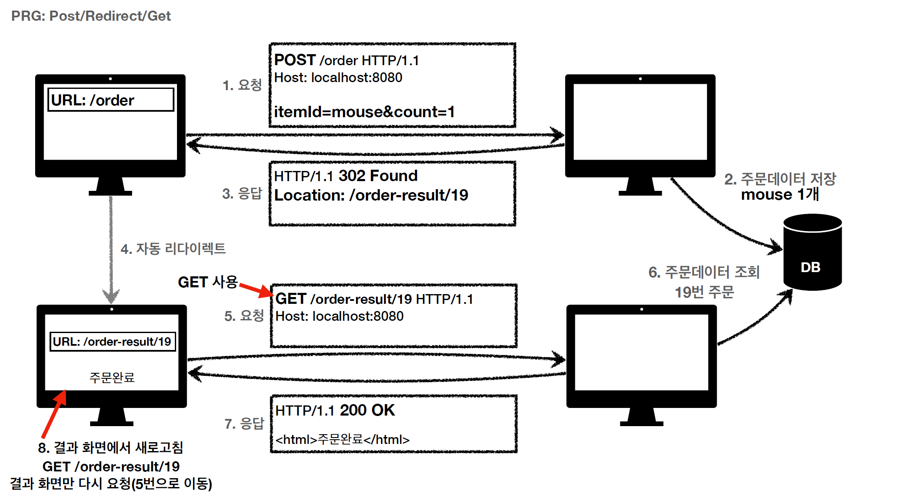

## HTTP 상태 코드

### 1. 개요

클라이언트가 요청을 하면 서버는 응답 코드로 상태 코드를 보낸다.
상태 코드는 앞자리 숫자마다 그 역할이 다르다.

- 1XX : 요청이 수신되어 처리 중(거의 안씀)
- 2XX : 요청 정상 처리
- 3XX : 요청을 처리하려면 추가 행동이 필요(리다이렉트 관련)
- 4XX : 클라이언트 오류
- 5XX : 서버 오류

200, 201 과 같은 잘 알려진 상태 코드를 제외하고, 299 같은 모르는 상태 코드가 왔을 때 상위 상태 코드로 해석해서 처리한다.
즉 299라면 2XX으로 처리하고 599라면 5XX로 처리할 것이다. 따라서 미래에 새로운 상태 코드가 추가되어도 클라이언트를 변경하지 않아도 된다.

### 2. 2XX 상태 코드

주로 사용하는 상태 코드로 200, 201, 202, 204가 있다.

#### 2.1 200 - OK

> 요청 성공을 뜻한다.

대부분 GET 메서드로 데이터 조회 성공 시 보는 상태 코드이다. 

#### 2.2 201 - Created

> 요청 성공 시 새로운 리소스가 생성됐다는 것을 뜻한다.

POST 메서드로 신규 리소스 등록 시 201 Created 응답 코드가 리턴된다.
생성된 리소스는 응답의 **Location 헤더** 필드로 식별한다.

#### 2.3 202 - Accepted

> 요청이 접수되었으나 처리가 완료되지 않았음을 뜻한다.

받은 요청들을 모아서 한꺼번에 처리하는 배치 처리와 같은 곳에서 사용한다.

#### 2.4 204 - No Content

> 서버가 요청을 받았지만 응답 페이로드 본문에 보낼 데이터가 없다.

상태 코드 204를 사용하면 결과 내용이 없어도 성공을 인식할 수 있게 만들 수 있다.
예를 들어 블로그 글을 쓸 때, 일단 편집한 글을 임시 저장만 해놓고 현재 화면은 유지하고 싶을 때 사용할 수 있다.

### 3. 3XX 상태 코드

요청을 처리하기 위해 유저 에이전트의 추가 조치가 필요하다는 것을 말해주는 상태 코드이다.
3XX 상태 코드를 이해하기 위해서는 리다이렉션에 관한 이해가 필요하다.
웹 브라우저는 3XX 응답 결과에 Location 헤더가 있으면, Location 위치로 자동으로 이동한다. 이것을 **리다이렉트**라고 부른다.
리다이렉트의 종류는 3가지다.

- 영구 리다이렉션 : 특정 리소스의 URI가 영구적으로 이동
- 일시 리다이렉션 : 일시적인 변경
  - ex) 주문 완료 후 주문 내역 화면으로 이동, POST/Redirect/GET
- 특수 리다이렉션 : 결과 대신 캐시를 사용

#### 3.1 영구 리다이렉션 - 301, 308

리소스의 URI가 영구적으로 이동했을 때 사용한다. 예를 들어, 원래 이벤트 처리 페이지가 /event 였지만 새로운 이벤트 페이지는 /new-event이다.
이런 경우 사용자가 기존의 /event URL로 접속했을 때, 자동으로 /new-event 페이지로 보낼 수 있다.

- 301 Moved Permanently : 리다이렉트 요청 시 메서드가 GET으로 변하고 본문이 없어질 수 있음.
- 308 Permanent Redirect : 리다이렉트시 요청 메서드와 본문 유지

페이지 변경 시 요구하는 정보도 달라지기 때문에 주로 301 상태 코드를 많이 사용한다.

#### 3.2 일시 리다이렉션 - 302, 303, 307

리소스의 URI가 일시적으로 변경된다. 상품 주문이나 상품 결제와 같이 서버에 중복으로 들어가면 안 되는 프로세스일 때 사용한다.
중복되면 안되는 프로세스일 때 해당 상태 코드를 설정하는 것도 중요하지만, 서버 코드에도 중복되는 주문에 대한 예외 처리는 필수이다.
이 리다이렉션 코드를 사용하면 사용자 편의성이 증대되는 장점이 있다.(POST 요청 화면에서 새로 고침시 나오는 경고 메시지가 나오지 않기 때문)

그림을 보면 주문 데이터가 DB에 두 번 저장된다.
사실 두 번만 저장되는 것이 아니라 사용자가 새로 고침을 시도하는 만큼 DB에 누적된다고 볼 수 있다.

상태 코드 **302 Found**가 있으면 자동으로 Location 헤더를 탐색해 그 위치로 자동 이동한다.
그리고 자동 리다이렉트 시 메서드도 GET으로 바꿔버리기 때문에 DB에 주문 데이터가 중복 저장될 가능성도 없다.
이런 과정을 Post/Redirect/Get 이라고 하고, 앞글자만 따서 **PRG** 라고 한다.

- PRG
  - URL이 이미 POST -> GET 으로 리다이렉트
  - 새로 고침해도 GET으로 결과 화면만 조회
  

302, 303, 307은 전부 일시 리다이렉션 상태 코드이지만 세부 내용이 다르다.

- 302 : 리다이렉트시 요청 메서드가 GET으로 변하고, 본문이 제거될 수 있음(**MAY**)
- 303 : 리다이렉트시 요청 메서드가 GET으로 변경(**MUST**)
- 307 : 리다이렉트시 요청 메서드와 본문 유지(요청 메서드 변경 X, **MUST NOT**)

모호한 302 보다 303, 307을 권장하지만, 현실적으로 이미 많은 애플리케이션 라이브러리들이 302를 기본값으로 사용한다.
자동 리다이렉션시에 GET 메서드로 변경해도 상관없다면 302 상태 코드를 사용해도 상관 없다. (변경하면 안되면 307을 사용하면 된다)

#### 3.3 기타 리다이렉션 - 300, 304

- 300 : Multiple Choices 인데 안쓴다.
- **304 Not Modified**

304 는 캐시 목적으로 사용한다.
예를 들어 캐시에 담긴 리소스가 변경된 거 같을 때 클라이언트가 서버에게 캐시에 있는 데이터가 안 맞는 거 같다고 데이터를 요청할 수 있다.
그 때 304 상태 코드를 던지면 클라이언트에게 리소스가 변경되지 않았음을 알려주고 로컬 PC에 저장된 캐시를 재사용하도록 명령할 수 있다.
304 응답은 응답에 본문을 포함해선 안 된다. 이미 로컬 PC에 있는 캐시를 사용하기로 했기 때문이다. 주로 조건부 GET, HEAD 요청 시 사용한다.

### 4. 4XX - 클라이언트 오류

클라이언트의 요청에 잘못된 문법등으로 서버가 요청을 수행할 수 없을 때 보낸다. **오류의 원인이 클라이언트**에게 있다.
클라이언트가 이미 잘못된 요청을 보내고 있기 때문에, 똑같은 재시도는 항상 실패한다.

#### 4.1 400 - Bad Request

> 클라이언트가 잘못된 요청을 해서 서버가 요청을 처리할 수 없음

요청 파라미터가 잘못되거나 API 스펙이 잘못됐을 때의 상태 코드이다.

#### 4.2 401 - Unauthorized

> 클라이언트가 해당 인증에 대한 인증이 필요함

Unauthorized 라 인가되지 않음인 것 같지만, 인증 상태에 대한 코드가 맞다.
401 오류 발생 시 응답에 WWW-Authenticate 인증 방법을 설명해야 한다.

#### 4.3 402 - Forbidden

> 서버가 요청을 이해했지만 승인을 거부함

인증은 됐으나 자격 증명이 불충분한 경우의 상태 코드다. 관리자만 접근할 수 있는 페이지에 일반 사용자가 접근하려 할 때 사용할 수 있다.

#### 4.4 404 - Not Found

> 요청 리소스를 찾을 수 없음

요청 리소스가 서버에 없거나, 권한이 부족한 리소스에 접근할 때 해당 리소스를 숨기고 싶을 때 사용한다.

### 5. 5XX - 서버 오류

5XX는 4XX와는 다르게 서버 오류기 때문에 서버의 문제가 해결됐을 때 재시도 시, 요청이 성공할 수 있다.

#### 5.1 500 - Internal Server Error

> 서버 문제로 오류 발생, 애매하면 500 오류

#### 5.2 503 - Service Unavailable

> 서버가 일시적인 과부하, Retry-After 헤더 필드로 얼마 뒤에 복구되는지 전송 가능

### 6. 참고 자료

> (인프런) 모든 개발자를 위한 HTTP 웹 기본 지식

