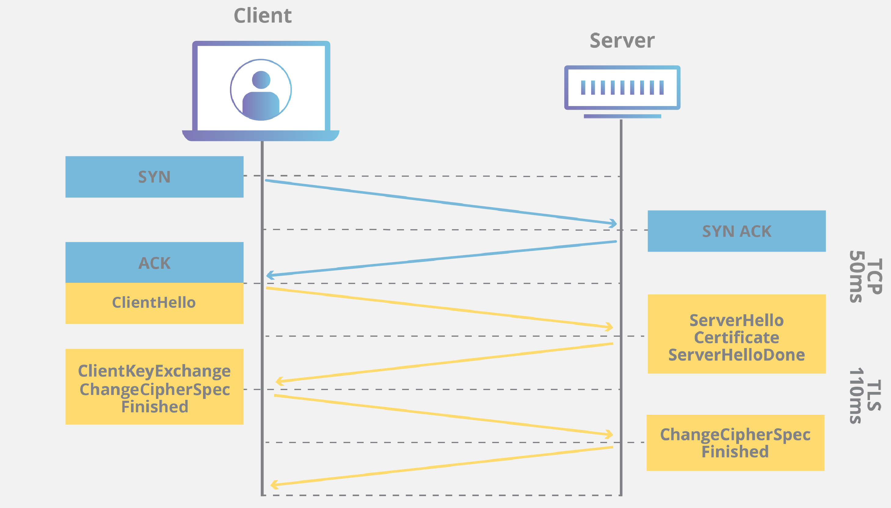
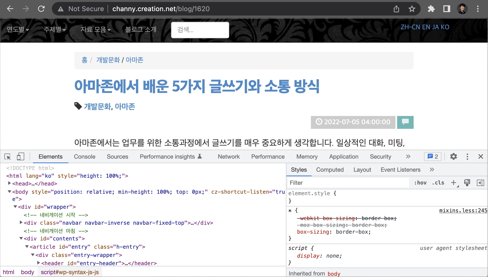

# 목차

- [목차](#목차)
- [웹 브라우저에 URL을 입력하면 어떤 일이 생기나요?](#웹-브라우저에-url을-입력하면-어떤-일이-생기나요)
- [전체 과정](#전체-과정)
  - [1. 웹 브라우저에 URL을 입력하고 Enter 키 입력](#1-웹-브라우저에-url을-입력하고-enter-키-입력)
      - [통신 규약](#통신-규약)
      - [도메인](#도메인)
      - [경로](#경로)
      - [리소스](#리소스)
  - [2. 웹 브라우저가 도메인명의 IP 주소 조회](#2-웹-브라우저가-도메인명의-ip-주소-조회)
      - [DNS 프리페치(Prefetch)](#dns-프리페치prefetch)
  - [3. 웹 브라우저가 서버와 TCP 연결 시작](#3-웹-브라우저가-서버와-tcp-연결-시작)
      - [콘텐츠 전송 네트워크(CDN)](#콘텐츠-전송-네트워크cdn)
      - [홉](#홉)
      - [TLS 핸드셰이크](#tls-핸드셰이크)
  - [4. 웹 브라우저가 HTTP 요청을 서버로 전송](#4-웹-브라우저가-http-요청을-서버로-전송)
      - [요청 라인](#요청-라인)
      - [요청 헤더](#요청-헤더)
      - [본문](#본문)
  - [5. 웹 서버가 요청을 처리하고 응답을 다시 전송](#5-웹-서버가-요청을-처리하고-응답을-다시-전송)
  - [6. 웹 브라우저가 컨텐츠 렌더링](#6-웹-브라우저가-컨텐츠-렌더링)

# 웹 브라우저에 URL을 입력하면 어떤 일이 생기나요?

> 수행하는 단계

- 웹 사이트를 호스팅하는 웹 서버의 위치 조회
- 웹 서버에 연결
- 특정 페이지를 가져오기 위한 요청 전송
- 웹 서버의 응답을 처리
- 사용자가 웹 사이트와 상호 작용할 수 있도록 페이지를 렌더링 하는 방법

# 전체 과정

## 1. 웹 브라우저에 URL을 입력하고 Enter 키 입력

사용자가 네이버에 들어가기 위해 아래와 같은 URL을 입력했다.

`https://www.naver.com`

#### 통신 규약

`https://`는 통신 프로토콜이다. _Hyper Test Transfer Protocol Secure_ 를 나타낸다.

**특징 :**

- 해당 스키마는 브라우저에 전송 계층 보안(_TLS_)를 사용하여 서버에 연결하도록 지시한다.
- _TLS_ 는 인터넷을 통한 통신을 보호하는 암호화 프로토콜이다.
- _HTTPS_ 프로토콜을 사용하면 서버 간 교환되는 데이터를 암호화할 수 있다.
- 이외에 `ftp://`, `mailto://` 또는 `file://` 도 있는데, 브라우저가 처리 방법을 알고 있는 다른 프로토콜이다.


#### 도메인

`naver.com`은 웹 사이트의 도메인 이름이다. DNS는 특정 서버의 IP 주소를 가리킨다.


#### 경로

URL에 리소스에 대한 추가 경로가 있는 경우가 있다.
예를 들어 `https://channy.creation.net/blog/hello-world` 라는 URL이 있다면
`blog`는 서버에서 요청된 리소스인 `hello-world`로 이어지는 경로이다. 
정적 HTML, CSS, Javascript, 이미지 파일, 동적으로 생성된 컨텐츠에 상관없이 리소스를 구성하는 방법이다.


#### 리소스

이 URL을 브라우저에 입력하면 `hello-world`는 보려는 웹 사이트의 리소스 이름이다.
`hello-world`뒤에 html과 같은 파일 확장자가 없으면 일반적으로 서버가 이 컨텐츠를 생성했음을 나타낸다.

## 2. 웹 브라우저가 도메인명의 IP 주소 조회

브라우저에 URL을 입력하고 Enter 키를 누르면 브라우저는 인터넷에 연결할 서버를 파악해야 한다.
이렇게 하려면 입력한 도메인을 사용하여 웹 사이트를 호스팅하는 서버의 IP 주소를 확인해야 한다.

DNS 조회는 빠른 시간 내에 이뤄저야 하므로 DNS 데이터는 웹 브라우저 사이의 서로 다른 계층과 인터넷의
다양한 위치에 임시로 저장된다. 이것을 **캐시**라고 부른다.

**확인하는 캐시 목록:**

- 고유 캐시
- 운영 체제 캐시
- 라우터의 로컬 네트워크 캐시
- 회사 네트워크 또는 ISP의 DNS 서버 캐시

웹 브라우저가 캐시를 확인할 수 없을 때는 회사 네트워크 또는 ISP의 DNS 서버가 재귀적 DNS 조회를 수행한다.
재귀적 DNS 조회는 인터넷에 있는 여러 DNS 서버를 요청하며, 검색될 때까지 DNS 레코드를 더 많은 DNS 서버에 요청한다.

웹 브라우저가 IP 주소로 DNS 레코드를 가져오면 인터넷에서 서버를 찾아 연결을 설정해야 한다.

> **재귀적 DNS 서비스로 사용자를 웹 사이트로 라우팅하는 방법에 대한 다이어그램:**


IP 주소를 확보하면 DNS 해석기(DNS resolver)는 다음에 누군가가 `example.com`을 탐색할 때 좀 더
빠르게 응답할 수 있도록 사용자가 지정하는 일정 기간 동안 해당 IP를 캐싱한다.

#### DNS 프리페치(Prefetch)

웹 페이지 내에 도메인명을 미리 확인하면 사용자가 해당 도메인으로 이동할 때, DNS 확인 시간으로 인한 시간 지연이
발생하지 않도록 도와주는 기능이다. **검색 결과 페이지**처럼 다양한 도메인명의 링크가 있는 페이지를 보고 있는 경우
유용하다.

## 3. 웹 브라우저가 서버와 TCP 연결 시작

인터넷에 연결된 웹 브라우저 요청 패킷은 일반적으로 **TCP/IP**라고 하는 전송 제어 프로토콜을 통해 웹 서버를 찾는다.

#### 콘텐츠 전송 네트워크(CDN)

하지만 웹 서버에서 직접 리소스를 가져오는 방법은 위치에 따라 효율적이지 않을 수 있다.
따라서 요즘은 콘텐츠 전송 네트워크(**CDN**)을 사용하여 정적 및 동적 컨텐츠를 웹 브라우저 가까이에 위치 시킨다.

예를 들어 한국에서 유투브 영상을 볼 때, 영상을 볼려고 할 때마다 미국 본사의 유투브 서버와 통신한다면 거리가 먼 만큼
버퍼링도 오래 걸릴 것이다. 이런 경우 웹 서버보다는 CDN에서 가져온 동영상 파일일 가능성이 크다.

#### 홉

이제 요청이 내 컴퓨터에서 `naver.com`으로 이동하는 홉을 추적하기 위해 `tracerout`를 사용할 수 있다.
예를 들어 아래 그림의 1번은 ISP의 네트워크에 있고 2번은 AWS 글로벌 네트워크에 있다.


웹 브라우저 요청은 인터넷 라우팅 테이블에 따라 순서대로 이동한다. 각 요청은 성능이 가장 좋은 위치를
통해 지능적으로 라우팅되어 브라우저에 컨텐츠를 전송한다. 이 때 웹 서버는 **로드밸런싱** 기능을 사용하는데,
이를 통해 여러 웹 서버의 부하 분산을 실현한다.

#### TLS 핸드셰이크

웹 브라우저가 인터넷에서 서버를 찾은 후 TCP 연결을 설정하고 HTTP를 통해 통신을 시작한다.
하지만 _HTTPS_ 를 사용하는 경우 데이터 암호화를 위한 **TLS 핸드셰이크**라는 추가 과정을 수행한다.

<details>
    <summary><b>TLS 핸드셰이크란?</b></summary><br/>

> TLS는 인터넷 상의 통신을 위한 개인 정보와 데이터 보안을 용이하게 하기 위해 설계된 보안 프로토콜이다.

1. **TLS와 SSL의 차이점**

TLS는 Netscape가 개발한 SSL이라고 불리는 이전의 암호화 프로토콜에서 발전한 것이다.

2. **TLS와 HTTPS와의 차이점**

HTTPS는 HTTP 프로토콜 상위에서 TLS 암호화를 구현한 것으로 모든 웹 사이트와 다른 웹 서비스에 사용된다.
따라서 HTTPS를 사용하는 웹 사이트는 TLS 암호화를 사용한다.

3. **왜 TLS를 사용해야 할까?**

TLS 암호화는 데이터 유출과 다른 공격으로부터 웹 응용 프로그램을 보호하는 데 도움을 주기 때문이다.

4. **TLS는 무엇을 하는가?**

TLS 프로토콜은 암호화, 인증, 무결성이라는 세 가지 주요 요소를 제공한다.

- 암호화 : 제 3자로부터 제공되는 정보를 숨긴다.
- 인증 : 정보를 교환하는 당사자가 요청된 당사자임을 보장한다.
- 무결성: 데이터가 위조되거나 변조되지 않았는지 확인한다.

5. **TLS가 작동하는 방식은?**

웹 사이트에 TLS를 사용하기 위해서는 원본 서버에 TLS 인증서가 설치되어 있어야 한다.
그 후 인증 기관이 도메인을 소유한 사람 혹은 비즈니스에게 TLS 인증서를 발행한다.

인증서는 서버의 공개 키와 더불어 누가 도메인 소유자인지에 대한 중요한 정보를 포함하며, 이 두 가지는 서버의
신원을 확인하는데 매우 중요한 역할을 한다.

**TLS Handshake 과정:**

- 사용할 TLS 버전을 지정한다.
- 사용할 암호 제품군을 결정한다.
- 서버의 TLS 인증서를 사용하여 서버의 신원을 인증한다.
- Handshake가 완료되면 키 간의 메시지를 암호화하기 위한 세션 키를 생성한다.




데이터가 암호화되고 인증되고 나면 메시지 인증 코드(MAC)와 함께 서명된다.
수신자는 데이터의 무결성을 보장하기 위해 MAC을 확인할 수 있다.

6. **TLS/SSL이 공개 키 암호화를 사용하는 방법**

- 공개적으로 공유되는 웹사이트의 SSL/TLS 인증서에는 공개 키가 포함되며 개인 키는 원본 서버에 설치된다.
- SSL/TLS 인증서는 웹사이트가 소유한다.
- _TLS Handshake_ 는 공개 키 암호화를 사용하여 원본 서버의 ID를 인증하고 세션 키 생성에 사용되는 데이터를 교환한다.

키 교환 알고리즘은 세션 키 사용을 허락하기 위해 공개-개인 키를 사용한다.
그리고 이것은 _handshake_ 가 완료되면 대칭 암호화에 사용된다.

클라이언트와 서버는 각 통신 세션에 대해 신규 세션 키를 허락할 수 있으므로 공격자가 만약
세션 키 중 하나를 식별하거나 훔쳐도 통신 해독은 불가능하다.

7. **TLS가 웹 애플리케이션 성능에 미치는 영향**

TLS 최신 버전은 성능에 거의 영향을 미치지 않는다.

TLS 연결을 설정하는 데 수반되는 복잡한 프로세스 때문에 클라이언트와 서버는 몇 번의 커뮤니케이션을 해야 하며
이것은 곧 로딩 시간의 지연을 의미한다.

하지만 이런 지연들을 돕는 기술이 있다.

- **TLS False Start** : TLS Handshake 가 완료되기 이전에 서버와 클라이언트가 데이터 전송을 시작함.
- **TLS Session Resumption** : 이전에 통신한 적이 있는 서버와 클라이언트가 간략화된 Handshake를 사용하도록 허용하는 기술.

이런 개선사항 덕분에 TLS와 연관된 계산 비용은 오늘날 표준에 따르면 거의 무시해도 좋은 정도이다.


</details>

## 4. 웹 브라우저가 HTTP 요청을 서버로 전송

HTTP 요청에는 요청 라인, 헤더 및 본문(body)가 있다.

#### 요청 라인

요청 라인에는 다음이 포함된다.

- GET, POST, PUT, PATCH, DELETE 같은 요청 메서드
- 요청된 리소스를 가리키는 경로
- 통신할 HTTP 버전

URL 요청에 대한 요청 라인의 예시:

`GET /blog/1620 HTTP/1.1`

#### 요청 헤더

```text
Host: channy.creation.net
User-Agent: curl/7.64.1
Accept: */*
```

헤더는 요청을 라우팅하는데 도움이 되는 추가 정보를 클라이언트에서 전달하고,
어떤 유형의 클라이언트가 요청을 수행하는 지 나타내는 등 다양한 정보를 제공한다.

#### 본문

POST, PUT 과 같은 리소스를 조작하는 요청의 경우 본문에는 생성하거나 업데이트할 클라이언트의 데이터가 포함된다.
아래는 GET 메서드라 본문이 없다.

```text
GET /blog/1620 HTTP/1.1
Host: channy.creation.net
Connection: keep-alive
Pragma: no-cache
Cache-Control: no-cache
sec-ch-ua: " Not A;Brand";v="99", "Chromium";v="90", "Google Chrome";v="90"
sec-ch-ua-mobile: ?0
Upgrade-Insecure-Requests: 1
User-Agent: Mozilla/5.0(Macintosh; Intel Mac OS X 10_15_7) AppleWebKit/537.36(KHTML, like Gecko) Chrome/90.0.4430.212 Safari/537.36
Accept: text/html,application/xhtml+xml,application/xml;q=0.9,image/avif,image/webp,image/apng,*/*;q=0.8,application/signed-exchange;v=b3;q=0.9
Sec-Fetch-Site: same-origin
Sec-Fetch-Mode: navigate
Sec-Fetch-User: ?1
Sec-Fetch-Dest: document
Referer: <https://channy.creation.net/>
Accept-Encoding: gzip, deflate, br
Accept-Language: en-US,en;q=0.9
dnt: 1
sec-gpc: 1
```

## 5. 웹 서버가 요청을 처리하고 응답을 다시 전송

응답에는 다음이 포함된다.

- 클라이언트에게 요청 상태를 알려주는 상태 라인
- 브라우저에 응답 처리 방법을 알려주는 응답 헤더
- 해당 경로에서 요청된 리소스

> **응답 본문 예시: **

```text
HTTP/1.1 200 OK
Date: Tue, 25 May 2021 19:40:59 GMT
Server: Apache
X-Frame-Options: SAMEORIGIN
X-Powered-By: Express
Cache-Control: max-age=0, no-cache
Content-Type: text/html; charset=utf-8
Vary: Accept-Encoding
X-Mod-Pagespeed: 1.13.35.2-0
Content-Encoding: br
Keep-Alive: timeout=1, max=100
Connection: Keep-Alive
Transfer-Encoding: chunked

<!DOCTYPE html>
<html lang="ko">
<head>
    나머지 HTML 항목
```

## 6. 웹 브라우저가 컨텐츠 렌더링

웹 브라우저가 서버로부터 응답을 받으면 응답 헤더를 검사하여 리소스를 렌더링하는 방법에 대한 정보를 확인한다.
예를 들어 `Content-Type: text/html; charset=utf-8`는 HTML 리소스를 수신했음을 알린다.

브라우저가 HTML을 파싱하고 렌더링할 때 Javascript, CSS, 이미지 및 데이터를 가져오라는 추가 요청이 가능하다.
이 중 많은 부분을 병렬로 실행할 수 있지만 항상 그렇지는 않다.



- 그림에서 HTML은 CSS나 JS 파일 리소스를 참조하고 있다.
- 브라우저는 페이지에 스타일을 지정하기 위해 CSS 리소스를 가져오도록 서버에 후속 요청을 한다.