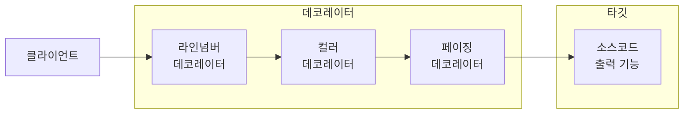
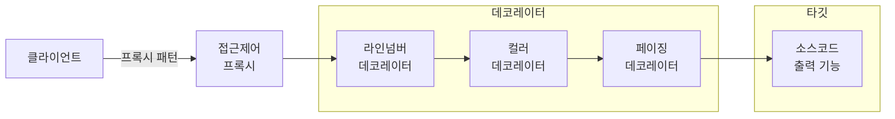
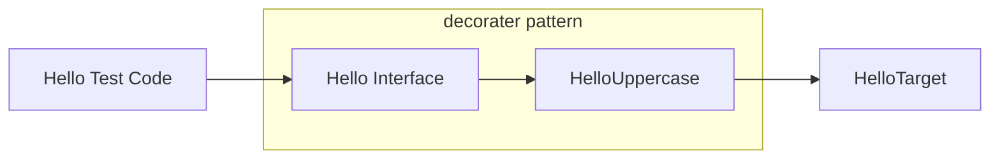
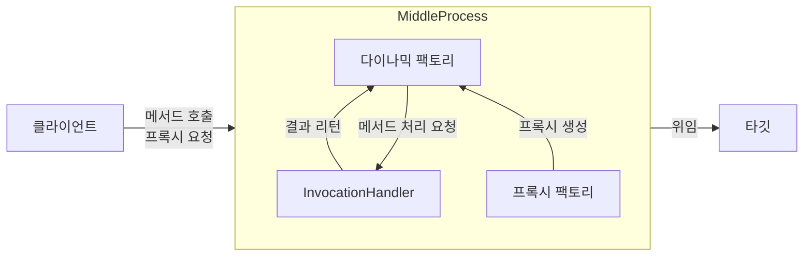
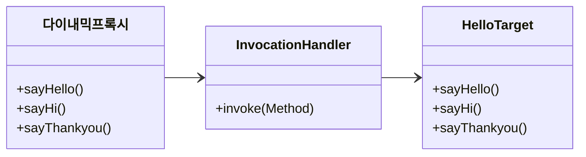

# 6.3 다이내믹 프록시와 팩토리 빈

## 6.3.1 프록시와 프록시 패턴, 데코레이터 패턴

자신이 클라이언트가 사용하려고 하는 실제 대상인 것처럼 위장해서 클라이언트의 요청을 받아주는 것을 대리자, 대리인과 같은 역할을 한다고 해서
**프록시**라고 부른다. 그리고 프록시를 통해 최종적으로 요청을 위임받아 처리하는 실제 오브젝트를 **타깃** 또는 **실체**라고 부른다.

프록시의 특징은 타깃과 같은 인터페이스를 구현했다는 것과 프록시가 타깃을 제어할 수 있는 위치에 있다는 것이다.
프록시는 사용 목적에 따라 두 가지로 구분할 수 있다.
- 첫번째는 클라이언트가 타깃에 접근하는 방법을 제어하기 위해서다.
- 두번째는 타깃에 부가적인 기능을 부여해주기 위해서다.

### 데코레이터 패턴

타깃에 부가적인 기능을 런타임 시 다이내믹하게 부여해주기 위해 프록시를 사용하는 패턴을 말한다.
데코레이터 패턴은 프록시가 꼭 한 개로 제한되지 않는다. 프록시가 여러 개인 만큼 순서를 정해서 단계적으로 위임하는 구조로 만들면 된다.

예를 들어 소스코드에 라인넘버를 붙여준다거나, 문법에 따라 색을 변경해주거나, 특정 폭으로 소스를 잘라주거나,
페이지를 표시해주는 등의 부가적인 기능을 각각 프록시로 만들어두고 아래 그림처럼 런타임 시에 이를 적절한 순서로 조합해서 사용하면 된다.



프록시로서 동작하는 각 데코레이터는 위임하는 대상에도 인터페이스로 접근하기 때문에 자신이 최종 타깃으로 위임하는지,
아니면 다음 단계의 데코레이터 프록시로 위임하는지 알지 못한다.

> 데코레이터 패턴은 타깃의 코드를 손대지 않고, 클라이언트가 호출하는 방법도 변경하지 않은 채로 새로운 기능을 추가할 때 유용한 방법이다.


### 프록시 패턴

타깃 오브젝트를 생성하기가 복잡하거나 당장 필요하지 않은 경우에는 꼭 필요한 시점까지 오브젝트를 생성하지 않는 것이 좋다.
그런데 타깃 오브젝트에 대한 레퍼런스가 미리 필요할 수 있다. 이럴 때 **프록시 패턴**을 적용하면 된다.

특별한 상황에서 타깃에 대한 접근권한을 제어하기 위해 프록시 패턴을 사용할 수 있다.
Collections의 **unmodifiableCollection()** 을 통해 만들어지는 오브젝트가 전형적인 접근권한 제어용 프록시라고 볼 수 있다.
이렇게 프록시 패턴은 타깃의 기능 자체에는 관여하지 않으면서 접근하는 방법을 제어해주는 프록시를 이용하는 것이다.

#### 프록시 패턴 vs 데코레이터 패턴

구조적으로 보면 프록시 패턴과 데코레이터 패턴은 유사하다.
다만 프록시는 코드에서 자신이 만들거나 접근할 타깃 클래스 정보를 알고 있는 경우가 많다.
생성을 지연하는 프록시라면 구체적인 생성 방법을 알아야 하기 때문에 타깃 클래스에 대한 직접적인 정보를 알아야 한다.
물론 프록시 패턴이라고 하더라도 인터페이스를 통해 위힘하도록 만들 수도 있다.



## 6.3.2 다이내믹 프록시

### 프록시의 구성과 프록시 작성의 문제점

프록시는 두 가지 기능으로 구성된다.

- 타깃과 같은 메서드를 구현하고 있다가 메서드가 호출되면 타깃 오브젝트로 위임한다.
- 지정된 요청에 대해서는 부가기능을 수행한다.

하지만 이런 프록시는 만들기가 번거러운데 이유는 다음과 같다.

- 타깃의 인터페이스를 구현하고 위임하는 코드를 작성하기가 번거롭다.
부가기능이 필요 없는 메서드도 구현해서 타깃으로 위임하는 코드를 일일이 만들어줘야 한다.
- 부가기능 코드가 중복될 가능성이 많다.

두 번째 문제인 부가기능의 중복 문제는 코드를 분리하면 어떻게 될 것 같지만, 첫 번째 문제는 간단해보이지 않는다.
이런 문제를 해결하는 데 유용한 것이 JDK의 **다이내믹 프록시**이다.

### 리플렉션

> 다이내믹 프록시는 리플렉션 기능을 이용해서 프록시를 만들어준다.
> 리플렉션은 자바의 코드 자체를 추상화해서 접근하도록 만든 것이다.

아래 코드는 리플렉션 API 중에서 메서드에 대한 정의를 담은 Method 인터페이스를 이용해 메서드를 호출하는 방법이다.

```java
Method lenghMethod = String.class.getMethod("length");
```

스트링이 가진 메서드 중에서 "length" 라는 이름을 갖고 있고, 파라미터는 없는 메서드의 정보를 가져오는 것이다.
invoke() 메서드는 메서드를 실행시킬 대상 오브젝트와 파라미터 목록을 받아서 메서드를 호출한 뒤에 그 결과를 Object 타입으로 돌려준다.

### 프록시 클래스

다이내믹 프록시를 이용한 프록시를 만들어보자. 그림으로 표현하면 아래와 같다.



<details>
<summary><b>Hello Interface</b></summary>
<div markdown="1">

```java
public interface Hello {
    String sayHello(String name);
    String sayHi(String name);
    String sayThankYou(String name);
}
```
</div>
</details>

<details>
<summary><b>HelloTarget</b></summary>
<div markdown="1">

```java
public class HelloTarget implements Hello{
    @Override
    public String sayHello(String name) {
        return "Hello " + name;
    }

    @Override
    public String sayHi(String name) {
        return "Hi " + name;
    }

    @Override
    public String sayThankYou(String name) {
        return "Thank you " + name;
    }
}
```

</div>
</details>

<details>
<summary><b>HelloUppercase</b></summary>
<div markdown="1">

```java
public class HelloUppercase implements Hello{
    Hello hello;

    public HelloUppercase(Hello hello) {
        this.hello = hello;
    }

    @Override
    public String sayHello(String name) {
        return hello.sayHello(name).toUpperCase();
    }

    @Override
    public String sayHi(String name) {
        return hello.sayHi(name).toUpperCase();
    }

    @Override
    public String sayThankYou(String name) {
        return hello.sayThankYou(name).toUpperCase();
    }
}
```

</div>
</details>

<details>
<summary><b>Hello Test Code</b></summary>
<div markdown="1">

```java
@Test
public void simpleProxy(){
    Hello helloTarget = new HelloUppercase(new HelloTarget());
    assertEquals(helloTarget.sayHello("Toby"), "HELLO TOBY");
    assertEquals(helloTarget.sayHi("Toby"), "HI TOBY");
    assertEquals(helloTarget.sayThankYou("Toby"), "THANK YOU TOBY");
}
```

</div>
</details>

이 프록시는 프록시 적용의 일반적인 문제점 두 가지를 모두 갖고 있다.
인터페이스의 모든 메서드를 구현해 위임하도록 코드를 만들어야 하며, 부가기능인 리턴 값을 대문자로 바꾸는 기능이 모둔 메서드에 중복돼서 나타난다.

### 다이내믹 프록시 적용

클래스로 만든 프록시인 HelloUppercase를 다이내믹 프록시를 이용해 다시 만들어보자.
다이내믹 프록시가 동작하는 방식은 아래 그림과 같다.



- 다이내믹 프록시는 프록시 팩토리에 의해 런타임 시 다이내믹하게 만들어지는 오브젝트이다.
- 클라이언트는 다이내믹 프록시 오브젝트를 타깃 인터페이스를 통해 사용할 수 있다.
그래서 프록시를 만들 때 인터페이스를 모두 구현해가면서 클래스를 정의하지 않아도 된다.
프록시 팩토리에게 인터페이스 정보만 제공해주면 해당 인터페이스를 구현한 클래스의 오브젝트를 자동으로 만들어주기 때문이다.
- 부가기능은 프록시 오브젝트와 독립적으로 InvocationHandler를 구현한 오브젝트에 남는다.
- 남은 것은 각 메서드 요청을 어떻게 처리할 지 결정하는 일이다.
리플렉션으로 메서드와 파라미터 정보를 모두 갖고 있으므로 타깃 오브젝트의 메서드를 호출하게 할 수도 있다.

다이내믹 프록시를 이용해 Hello 코드를 리팩토링하면 아래 그림처럼 순서도를 그릴 수 있다.




<details>
<summary><b>InvocationHandler 구현 클래스</b></summary>
<div markdown="1">

```java
package proxyTest;

import java.lang.reflect.InvocationHandler;
import java.lang.reflect.Method;

public class UppercaseHandler implements InvocationHandler {
    Hello target;

    public UppercaseHandler(Hello target) {
        this.target = target;
    }

    @Override
    public Object invoke(Object proxy, Method method, Object[] args) throws Throwable {
        String ret = (String) method.invoke(target, args);
        return ret.toUpperCase();
    }
}
```
</div>
</details>

<details>
<summary><b>프록시 생성</b></summary>
<div markdown="1">

```java
@Test
public void simpleProxy(){
    Hello proxiedHello = (Hello) Proxy.newProxyInstance(
            // 동적으로 생성되는 다이내믹 프록시 클래스의 로딩에 사용할 클래스 로더
            getClass().getClassLoader(),
            // 구현할 인터페이스
            new Class[]{Hello.class},
            // 부가기능과 위임 코드를 담은 InvocationHandler
            new UppercaseHandler(new HelloTarget())
    );

    assertEquals(proxiedHello.sayHello("Toby"), "HELLO TOBY");
    assertEquals(proxiedHello.sayHi("Toby"), "HI TOBY");
    assertEquals(proxiedHello.sayThankYou("Toby"), "THANK YOU TOBY");
}
```

</div>
</details>

### 다이내믹 프록시의 확장

UppercaseHandler는 모든 메서드의 리턴 타입이 스트링이라고 가정한다.
그렇기 때문에 리턴 타입을 확인해서 스트링인 경우에만 대문자로 바꿔주고 나머지는 그대로 넘겨주는 방식으로 수정해야 한다.

리플렉션의 Method 인터페이스를 이용해 타깃의 메서드를 호출하는 것이니 Hello 타입의 타깃으로 제한할 필요도 없다.
따라서 기존 Hello 타입의 변수를 전부 Object 로 변환해도 된다.

<details>
<summary><b>확장된 UppercaseHandler</b></summary>
<div markdown="1">

```java
public class UppercaseHandler implements InvocationHandler {
    Object target;

    public UppercaseHandler(Object target) {
        this.target = target;
    }

    @Override
    public Object invoke(Object proxy, Method method, Object[] args) throws Throwable {
        Object ret = method.invoke(target, args);
        if(ret instanceof String){
            return ((String)ret).toUpperCase();
        }else{
            return ret;
        }
    }
}
```

</div>
</details>

## 6.3.3 다이내믹 프록시를 이용한 트랜잭션 부가기능

UserServiceTx 를 다이내믹 프록시 방식으로 변경해보자.

<details>
<summary><b>다이내믹 프록시를 위한 트랜잭션 부가기능</b></summary>
<div markdown="1">

```java
public class TransactionHandler implements InvocationHandler {
    private Object target;
    private PlatformTransactionManager transactionManager;
    private String pattern;

    public void setTarget(Object target) {
        this.target = target;
    }

    public void setTransactionManager(PlatformTransactionManager transactionManager) {
        this.transactionManager = transactionManager;
    }

    public void setPattern(String pattern) {
        this.pattern = pattern;
    }

    @Override
    public Object invoke(Object proxy, Method method, Object[] args) throws Throwable {
        if (method.getName().startsWith(pattern)) {
            return invokeTransaction(method, args);
        }else{
            return method.invoke(target, args);
        }
    }

    private Object invokeTransaction(Method method, Object[] args) throws Throwable {
        TransactionStatus status = this.transactionManager.getTransaction(new DefaultTransactionDefinition());
        try {
            Object ret = method.invoke(target, args);
            this.transactionManager.commit(status);
            return ret;
        } catch (InvocationTargetException e) {
            this.transactionManager.rollback(status);
            throw e.getTargetException();
        }
    }
}
```

</div>
</details>

타깃을 저장할 변수를 Object로 선언했기 때문에 UserServiceImpl 외에 트랜잭션 적용이 필요한 어떤 타깃 오브젝트에도 적용할 수 있다.
그리고 기존 테스트 코드는 아래와 같이 변경된다.

```java
TransactionHandler txHandler = new TransactionHandler();
txHandler.setTarget(testUserService);
txHandler.setTransactionManager(transactionManager);
txHandler.setPattern("upgradeLevels");

UserService txUserService = (UserService) Proxy.newProxyInstance(
        getClass().getClassLoader(), 
        new Class[] {UserService.class}, 
        txHandler
);
```

## 6.3.4 다이내믹 프록시를 위한 팩토리 빈

이제 TransactionHandler와 다이내믹 프록시를 스프링의 DI를 통해 사용할 수 있도록 만들어야할 차례이다.
문제는 다이내믹 프록시 오브젝트는 일반적인 스프링의 빈으로는 등록할 방법이 없다는 점이다.
다이내믹 프록시는 내부적으로 클래스를 다이내믹하게 새로 정의해서 사용하기 때문에 정확히 어떤 클래스를 지목하고 있는지 알 수 없다.
따라서 다이내믹 프록시는 Proxy 클래스의 newProxyInstance() 라는 스태틱 팩토리 메서드를 통해서만 만들 수 있다.

### 팩토리 빈

스프링은 클래스 정보를 가지고 디폴트 생성자를 통해 오브젝트를 만드는 방법 외에도 빈을 만들 수 있는 여러 가지 방법을 제공한다.
그 중 하나가 팩토리 빈을 이용한 빈 생성 방법이다.

> 팩토리 빈이란 스프링을 대신해서 오브젝트의 생성로직을 담당하도록 만들어진 특별한 빈을 말한다.

팩토리 빈을 만드는 방법 중 가장 간단한 방법은 **FactoryBean** 인터페이스를 구현하는 것이다.

> **Note.**<br>
> 스프링은 private 생성자를 가진 클래스도 빈으로 등록해주면 리플렉션을 이용해 오브젝트를 만들어준다.
> 리플렉션은 private으로 선언된 접근 규약을 위반할 수 있는 강력한 기능이 있기 때문이다.
> 하지만 private 생성자를 가진 클래스를 빈으로 등록하는 일은 권장되지 않으며, 등록하더라도 빈 오브젝트가 제대로 동작하지 않을 가능성이 있으니 주의해야 한다.

팩토리 빈은 전형적인 팩토리 메서드를 가진 오브젝트다.
스프링은 FactoryBean 인터페이스를 구현한 클래스가 빈의 클래스로 지정되면, 팩토리 빈 클래스의 오브젝트의 getObject() 메서드를 이용해
오브젝트를 가져오고, 이를 빈 오브젝트로 사용한다.

드물지만 팩토리 빈이 만들어주는 빈 오브젝트가 아니라 팩토리 빈 자체를 가져오고 싶은 경우도 있다.
이럴 때를 위해 스프링은 "&" 를 빈 이름 앞에 붙여주면 팩토리 빈 자체를 돌려준다.

### 다이내믹 프록시를 만들어주는 팩토리 빈

Proxy의 newProxyInstace() 메서드를 통해서만 생성이 가능한 다이내믹 프록시 오브젝트는 일반적인 방법으로는 스프링의 빈으로 등록할 수 없다.
대신 **팩토리 빈**을 사용하면 스프링의 빈으로 만들어줄 수 있다.


- 스프링 빈에는 팩토리 빈과 UserServiceImpl만 빈으로 등록
  - 팩토리 빈은 다이내믹 프록시가 위임할 타깃 오브젝트인 UserServiceImpl에 대한 레퍼런스를 프로퍼티를 통해 DI 받아둬야 한다.
  - 다이내믹 프록시와 함께 생성할 TransactionHandler에게 타깃 오브젝트를 전달해줘야 하기 때문이다.
- 그 외에도 다이내믹 프록시나 TransactionHandler를 만들 때 필요한 정보는 팩토리 빈의 프로퍼티로 설정해뒀다가
다이내믹 프록시를 만들면서 전달해줘야 한다.

### 트랜잭션 프록시 팩토리 빈

<details>
<summary><b>트랜잭션 프록시 팩토리 빈</b></summary>
<div markdown="1">

```java
package service;

import org.springframework.beans.factory.FactoryBean;
import org.springframework.transaction.PlatformTransactionManager;

import java.lang.reflect.Proxy;

public class TxProxyFactoryBean implements FactoryBean<Object> {
private Object target;
private PlatformTransactionManager transactionManager;
private String pattern;
Class<?> serviceInterface;

    public void setTarget(Object target) {
        this.target = target;
    }

    public void setTransactionManager(PlatformTransactionManager transactionManager) {
        this.transactionManager = transactionManager;
    }

    public void setPattern(String pattern) {
        this.pattern = pattern;
    }

    public void setServiceInterface(Class<?> serviceInterface) {
        this.serviceInterface = serviceInterface;
    }

    @Override
    public Object getObject() throws Exception {
        TransactionHandler txHandler = new TransactionHandler();
        txHandler.setTarget(target);
        txHandler.setTransactionManager(transactionManager);
        txHandler.setPattern(pattern);
        return Proxy.newProxyInstance(
                getClass().getClassLoader(),
                new Class[]{serviceInterface},
                txHandler
        );
    }

    @Override
    public Class<?> getObjectType() {
        return serviceInterface;
    }

    @Override
    public boolean isSingleton() {
        return false;
    }
}
```
</div>
</details>

코드의 class<?> 는 UserService 외의 인터페이스를 가진 타깃에도 적용하기 위해 선언한 것이다.
그리고 isSingleton 은 싱글톤 빈이 아니라는 뜻이 아니라 getObject()가 매번 같은 오브젝트를 리턴하지 않는다는 것을 뜻한다.
프록시 팩토리 빈 프로퍼티에 값을 넣어주기 위해 applicationContext 도 다음과 같이 변경한다.

```xml
    <bean id="userService" class="service.TxProxyFactoryBean">
        <property name="target" ref="userServiceImpl"/>
        <property name="transactionManager" ref="transactionManager"/>
        <property name="pattern" value="upgradeLevels"/>
        <property name="serviceInterface" value="service.UserService"/>
    </bean>
```

### 트랜잭션 프록시 팩토리 빈 테스트

TxProxyFactoryBean의 트랜잭션을 지원하는 프록시를 바르게 만들어주는지를 확인하는 게 목적이므로 빈으로 등록된
TxProxyFactoryBean을 직접 가져와서 프록시를 만들어서 테스트를 진행한다.

<details>
<summary><b>트랜잭션 프록시 팩토리 빈을 적용한 테스트</b></summary>
<div markdown="1">

```java
@Test
@DirtiesContext
public void upgradeAllOrNothing() throws Exception {
    TestUserService testUserService = new TestUserService(users.get(3).getId());
    testUserService.setUserDao(userDao);
    testUserService.setMailSender(mailSender);

    TxProxyFactoryBean txProxyFactoryBean =
            context.getBean("&userService", TxProxyFactoryBean.class);
    txProxyFactoryBean.setTarget(testUserService);
    UserService txUserService = (UserService) txProxyFactoryBean.getObject();

    userDao.deleteAll();
    for (User user : users) userDao.add(user);

    try {
        txUserService.upgradeLevels();
        fail("TestUserServiceException expected");
    } catch (TestUserServiceException e) {

    }
    checkLevel(users.get(1), false);
}
```

</div>
</details>

1. 스프링 빈으로 등록된 TxProxyFactoryBean을 가져와서 target 프로퍼티를 재구성해준다.
2. 프록시 오브젝트를 생성하도록 요청한다.
3. 컨텍스트의 설정을 변경하기 때문에 @DirtiesContext 애노테이션이 필요하다.
4. 팩토리 빈 자체를 가져와야하기 때문에 빈 이름에 "&"가 붙어 있다.

## 6.3.5 프록시 팩토리 빈 방식의 장점과 한계

### 프록시 팩토리 빈의 재사용

TransactionHandler를 이용하는 다이내믹 프록시를 생성해주는 TxProxyFactoryBean은 코드의 수정 없이도 다양한 클래스에 적용할 수 있다.
그리고 하나 이상의 TxProxyFactoryBean을 동시에 빈으로 등록해도 괜찮다.
팩토리 빈이기 때문에 각 빈의 타입은 타깃 인터페이스와 일치하기 때문이다.

### 프록시 팩토리 빈 방식의 장점

데코레이터 패턴이 적용된 프록시를 사용하면 많은 장점이 있음에도 적극적으로 활용되지 못하는 데는 두 가지 문제점이 있기 때문이다.

1. 프록시를 적용할 대상이 구현하고 있는 인터페이스를 구현하는 프록시 클래스를 일일이 만들어야 한다.
2. 부가적인 기능이 여러 메서드에 반복적으로 나타나게 돼서 코드 중복의 문제가 발생한다.

하지만 다이내믹 프록시를 이용하면 타깃 인터페이스를 구현하는 클래스를 일일이 만들지 않아도 된다.
거기다 다이내믹 프록시에 **팩토리 빈**을 이용한 DI까지 더해주면 번거러운 다이내믹 프록시 생성 코드도 제거할 수 있다.


### 프록시 팩토리 빈의 한계

하지만 이런 프록시 팩토리 빈에도 한계가 존재한다.
프록시를 통해 타깃에 부가기능을 제공하는 것은 **메서드 단위**로 일어난다.
즉 하나의 클래스 안에 존재하는 여러 개의 메서드에 부가기능을 한 번에 제공하는 건 가능하다.

반대로 한 번에 여러 개의 클래스에 공통적인 부가기능을 제공하는 일은 불가능하다.
트랜잭션과 같이 비즈니스 로직을 담은 많은 클래스의 메서드에 적용할 필요가 있다면 **거의 비슷한 프록시 팩토리 빈의 설정**이 중복되는 것을 막을 수 없다.

하나의 타깃에 여러 개의 부가기능을 적용하려고 할 때도 문제다.
적용 대상인 서비스 클래스가 200개쯤 된다면, 보통 하나당 3, 4 줄이면 되는 서비스 빈의 설정에 5, 6줄씩 되는 프록시 팩토리 빈 설정이
**부가기능 개수만큼** 따라 붙어야 한다.

이 말은 600라인이면 되는 XML 설정이 4,000라인으로 늘어난다는 소리다. 4,000라인의 XML 설정은
사람이 손으로 편집할 수 있는 한계를 벗어난다. 게다가 타깃과 인터페이스만 다른, 거의 비슷한 설정이 자꾸 반복된다는 점도 큰 단점으로 작용한다.

또 한 가지 문제점은 TransactionHandler 오브젝트가 프록시 팩토리 빈 개수만큼 만들어진다는 점이다.
TransactionHandler는 타깃 오브젝트를 프로퍼티로 갖고 있다.
따라서 동일한 로직임에도 타깃 오브젝트가 달라지면 새로운 TransactionHandler 오브젝트를 만들어야 한다.
