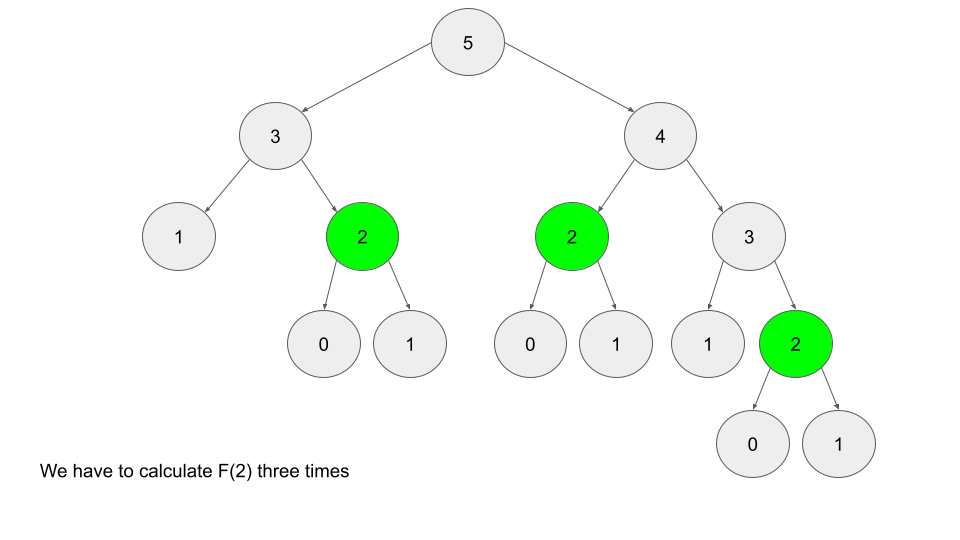

# 목차

# 1. 개요

_Dynamic Programming_ 는 문제에 대한 가능한 모든 솔루션을 효율적으로 탐색할 수 있는 프로그래밍 패러다임이다.
그래서 보통 아래의 특성을 갖는 문제를 DP 를 통해 해결할 수 있다.

1. 문제는 여러 번 재사용되는 원래 문제의 더 작은 버전인 중첩 하위 문제로 나눌 수 있다.
2. 문제에는 최적의 하위 구조가 있다. 즉 최적의 솔루션은 원래 문제의 겹치는 하위 문제에 대한 최적의 솔루션으로 구성될
수 있다.

말이 어려운데 일반적으로 브루트 포스로 풀수 있는 문제에 대해 원래라면 방문해야할 곳들을 코드 최적화를 통해 뛰어
넘는다고 생각하면 된다.

DP 를 설명하는 가장 대표적인 예로 피보나치 수열이 있다.
피보나치 수열은 0, 1로 시작하는 수열로 앞의 두 수를 더하여 다음 수를 구한다.

피보나치 수열 _F(n)_ 을 구하려고 할 때 이 수식을 _F(n - 1)_ 와 _F(n -2)_ 로 나눌 수 있다.
이 하위 수식들에 대한 답을 구하면 원래 질문에 대한 답이 나온다.

**_F(n) = F(n - 1) + F(n - 2)_**

_F(n)_ 은 최적의 하위 구조를 가지고 있다는 것을 의미한다.
예를 들어 _F(5)_ 와 _F(6)_ 을 모두 계산하려면 _F(4)_ 가 필요하다.

그리디 알고리즘 문제는 최적의 하위 구조를 갖긴 하지만, 중복되는 하위 문제는 없다.
분할 정복 알고리즘은 문제를 하위 문제로 나누지만 이러한 하위 문제는 겹치지 않는다.

DP 는 복잡한 문제를 관리 가능한 하위 문제로 쪼개고, 중복되는 하위 문제의 불필요한 재계산을 피하고,
이러한 하위 문제의 결과를 사용하여 초기 복잡한 문제를 해결할 수 있기 때문에 많이 사용된다.(주로 재귀)

DP 는 브루트 포스 알고리즘에 비해 시간 복잡도를 크게 개선한다.
피보나치에서도 브루트 포스 알고리즘을 사용하면 시간 복잡도는 매우 크게 늘어나지만
이미 나온 값들을 재사용하는 DP 알고리즘을 통해 최적화가 가능하다.

# 2. DP 구현 방법

DP 구현에는 두 가지 방법이 있다.

1. Bottom-up : tabulation 이라고도 부른다.
2. Top-down : memoization 이라고도 부른다.

> **Bottom-up (Tabulation)**

- Bottom-up 방식은 반복으로 구현되며 초기 값부터 시작된다.
- 피보나치를 생각해보면 _F(0) = 0_, _F(1) = 1_ 이다. 
- Bottom-up 방식을 사용해서 _F(2)_ 를 계산할 수 있고, 이 값을 가지고 다시 _F(3)_ 을 구할 수 있다.
- 순서대로 반복해서 _F(n)_ 을 구한다.

```text
F = array of length (n + 1)
F[0] = 0
F[1] = 1
for i from 2 to n:
    F[i] = F[i - 1] + F[i - 2]
```

> **Top-down (memoization)**

Top-down 은 재귀를 이용하고 시간 복잡도를 개선하기 위해 메모이제이션을 사용한다.
만약 피보나치 숫자 _F(n)_ 의 n<sup>th</sup> 을 찾으려고 가정한다면 _F(n-1)_ 과 _F(n-2)_ 를 찾음으로써
계산할 수 있다.

정리하면 위에서 부터 아래까지 답을 구할 때 까지 재귀를 통해 반복한다는 것을 알 수 있다.



표를 보면 _F(5)_ 를 구하는 데 _F(2)_ 연산이 세 번이나 반복된다.
값이 작기 때문에 별 것 아닌 것처럼 보일 수 있지만 당장 _F(100)_ 정도만 되더라도 연산량은 기하급수적으로 올라간다.
이에 대한 해결책은 결과를 기록하는 것(메모이제이션)이다.

결과를 기록한다는 것은 함수 호출의 결과를 해시맵이나 배열에 저장하는 것을 의미한다.
그래서 동일한 함수 호출이 다시 수행될 때 결과를 다시 계산하는 대신 기록된 결과를 간단히 반환할 수 있다.

```text
// Pseudocode example for top-down

memo = hashmap
Function F(integer i):
    if i is 0 or 1: 
        return i
    if i doesn't exist in memo:
        memo[i] = F(i - 1) + F(i - 2)
    return memo[i]
```

## 2.1 어느 것을 선택할까?

1. Bottom-up 방식은 재귀와 같은 오버헤드가 없기 때문에 더 빠르다.
2. Top-down 방식은 작성하기가 쉽다. 재귀에서는 하위 문제의 순서가 중요하지 않지만 Bottom-up 방식은 이 문제를 신경쓰면서
코드를 작성해야 되기 때문이다.


# 3. DP 를 사용해야 할 때

사실 문제만 보고 "DP 문제다" 라고 바로 판별하기는 어렵다.
대신 DP로 풀 수 있는 문제에는 일반적인 몇 가지 특성이 있다.

> **첫번째: 문제가 어떤 것의 최적값 또는 무언가를 수행하는 방법의 수를 요구한다.**

- 최소 비용은 얼마인지?
- 최대 이익은 무엇인지?
- 할 수 있는 방법이 얼마나 많은지..
- 가능한 가장 긴 것은 무엇인가?
- 특정 지점에 도달할 수 있는가?

하지만 때때로 이런 형식의 문제가 그리디 알고리즘인 경우도 있다.
그래서 아래의 특성이 이것을 그리디로 풀어야하는 지 DP 로 풀어야하는지 도움을 줄 수 있다.

> **두번째: 미래의 결정이 이전 결정에 의존한다.**

이전 단계에서 무언가를 하기로 결정했으면 그 다음 단계에 영향을 미친다.
이 특성은 DP 문제에 대해 그리디 알고리즘이 유효하지 않다는 것을 알려준다. 

요약하면,

- 무언가의 최대/최소/최장/최단을 요구하는 경우
- 무언가를 수행하는 방법의 수 또는 특정 지점에 도달할 수 있는 경우

에는 그리디 혹은 DP 알고리즘이다.
일반적으로 한 요소를 사용해서 다른 요소를 사용하지 못하게 하는 것과 같이 결정이 다른 결정에
영향을 미치는 제약 조건이 문제에 있다면 DP 를 고려하면 된다.


> **Note.**  
> Top-down 방식을 Bottom-up 방식으로 변환하려고 할 때, 가장 먼저 상태를 반복할 논리적 순서를 찾는 데 집중하자.