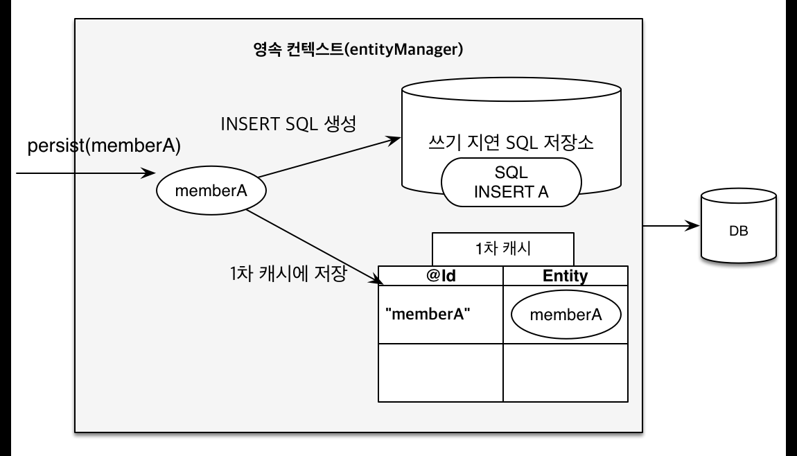

# 목차

- [목차](#목차)
- [1. 영속성 관리](#1-영속성-관리)
	- [1.1 엔티티 매니저 팩토리와 엔티티 매니저](#11-엔티티-매니저-팩토리와-엔티티-매니저)
		- [쓰레드 공유](#쓰레드-공유)
	- [1.2 영속성 컨텍스트](#12-영속성-컨텍스트)
	- [1.3 엔티티의 생명주기](#13-엔티티의-생명주기)
		- [비영속](#비영속)
		- [영속](#영속)
		- [준영속](#준영속)
		- [삭제](#삭제)
	- [1.4 영속성 컨텍스트의 특징](#14-영속성-컨텍스트의-특징)
		- [1.4.1 엔티티 조회](#141-엔티티-조회)
			- [1차 캐시에서 조회](#1차-캐시에서-조회)
			- [영속 엔티티의 동일성 보장](#영속-엔티티의-동일성-보장)
		- [1.4.2 엔티티 등록](#142-엔티티-등록)
		- [1.4.3 엔티티 수정](#143-엔티티-수정)
			- [변경 감지](#변경-감지)
		- [1.4.4 엔티티 삭제](#144-엔티티-삭제)
	- [1.5 플러시](#15-플러시)


# 1. 영속성 관리

## 1.1 엔티티 매니저 팩토리와 엔티티 매니저

- 엔티티 매니저 팩토리는 엔티티 매니저를 만드는 공장 역할을 한다.
- 공장을 만드는 비용은 크기 때문에 하나를 만들고 애플리케이션 전체에서 공유해서 사용한다.
- 공장에서 엔티티 매니저를 생성하는 비용은 크지 않다.

### 쓰레드 공유

- 엔티티 매니저 팩토리는 여러 쓰레드에서 공유해서 사용할 수 있다.
- 엔티티 매니저는 여러 쓰레드가 접근 시 **동시성 문제**가 발생하므로 절대 공유해선 안된다.

## 1.2 영속성 컨텍스트

영속성 컨텍스트는 **엔티티를 영구 저장하는 환경**이라는 뜻이다. 엔티티 매니저로 엔티티를 저장하거나 조회하면 엔티티 매니저는 영속성 컨텍스트에 엔티티를 보관하고 관리한다.

```java
public class example {

	@PersistenceContext
	EntityMananger em;

	public void save(Member member) {
		em.persist(member);
	}
}
```

- persist() 메서드는 엔티티 매니저를 사용해서 회원 엔티티를 영속성 컨텍스트에 저장한다.
- 영속성 컨텍스트는 논리적인 개념이다.

> **Note.**  
> 영속성 컨텍스트는 보통 하나의 엔티티 매니저가 생성될 때 하나가 만들어진다.  
> 하지만 여러 엔티티 매니저가 같은 영속성 컨텍스트에 접근할 수도 있다.

## 1.3 엔티티의 생명주기

엔티티에는 4가지 생명주기가 있다.

- **비영속**
- **영속**
- **준영속**
- **삭제**

### 비영속

- 엔티티 객체를 생성만 하고 저장하지 않은 상태.
- 영속성 컨텍스트나 데이터베이스와는 전혀 관련이 없음.

```java
Member member = new Member();
member.setId("member1");
member.setUsername("회원1");
```


### 영속

- 엔티티 매니저로 엔티티를 영속성 컨텍스트에 저장한 상태.
- 영속성 컨텍스트가 관리하는 엔티티를 **영속 상태**라고 한다.
- em.find(), JPQL을 사용해서 조회한 엔티티도 영속 상태이다.

```java
em.persist(member);
```


### 준영속

- 영속 상태의 엔티티를 영속성 컨텍스트가 관리하지 않으면 준영속 상태가 된다.
- 특정 엔티티를 준영속 상태로 만들려면 `em.detach()`를 호출한다.
- `em.close()`, `em.clear()`를 호출해서 영속성 컨텍스트를 초기화해도 준영속 상태가 된다.

### 삭제

- 엔티티를 영속성 컨텍스트와 데이터 베이스에서 삭제한다.

```java
em.remove(member);
```

## 1.4 영속성 컨텍스트의 특징

- 영속성 컨텍스트와 식별자 값
  - 영속성 컨텍스트는 엔티티를 식별자 값으로 구분하기 때문에 영속 상태는 식별자 값이 필수다.
  

- 영속성 컨텍스트와 데이터베이스 저장
  - JPA는 트랜잭션을 커밋하는 순간 영속성 컨텍스트에 저장된 엔티티를 데이터베이스에 반영한다.


- 영속성 컨텍스트를 사용함으로써 얻는 장점
  - 1차 캐시
  - 동일성 보장
  - 트랜잭션을 지원하는 쓰기 지연
  - 변경 감지, 지연 로딩

    
### 1.4.1 엔티티 조회

영속성 컨텍스트는 내부에 캐시를 가지고 있는데, 이것을 1차 캐시라고 부른다.

```java
//비영속
Member member = new Member();
member.setId("member1");
member.setUsername("회원1");

//영속
em.persist(member);
```

- 1차 캐시의 키는 식별자 값이다.
- 식별자 값은 데이터베이스 기본 키와 매핑되어 있다.


#### 1차 캐시에서 조회

- `em.find()`를 호출하면 우선 1차 캐시에서 식별자 값으로 엔티티를 검색한다.
- 만약 없다면 데이터베이스에서 값을 불러온 후 **영속 상태의 엔티티**를 반환한다.

1차 캐시에 있는 데이터를 불러오는 경우 메모리에 있는 데이터를 바로 불러오므로 성능상 이점이 있다.

#### 영속 엔티티의 동일성 보장

객체를 == 연산자로 비교했을 때, 객체들이 가리키는 주소가 같다면 그 객체들을 **동일하다**라고 말한다.
`em.find()`는 여러번 호출해도 1차 캐시에 있는 엔티티 인스턴스를 반환한다.

```java
//findMember1 과 findMember2는 동일하다.

Member findMember1 = em.find(Member.class, "member1");
Member findMember2 = em.find(Member.class, "member1");
```

### 1.4.2 엔티티 등록

다음은 `memberA`와 `memberB`를 영속성 컨텍스트에 등록하는 메서드이다. 

```java
@Repository
@Transactional
public class MemberRepository {

	@PersistenceContext
	EntityManager em;
	
	//persist()를 실행해도 DB에 곧바로 엔티티를 저장하지 않고 내부 쿼리 저장소에 INSERT SQL을 모아둔다.
	public void save(){
		Member memberA = new Member();
		Member memberB = new Member();

		em.persist(memberA);
		em.persist(memberB);
	}
  ...
}
```

- 메서드가 종료되면 트랜잭션의 한 단위가 끝나고 커밋이 발생한다.
- 커밋이 발생하면 모아둔 쿼리를 DB에 전송한다.
- 이런 과정을 트랜잭션을 지원하는 **쓰기 지연**이라고 한다.

|         회원 A 영속         |         회원 B 영속         |           커밋            |
|:-----------------------:|:-----------------------:|:-----------------------:|
|  |  |  |

- 트랜잭션을 커밋하면 엔티티 매니저는 우선 영속성 컨텍스트를 **플러시**한다.
- 플러시는 영속성 컨텍스트 내용을 DB에 동기화하는 작업이다.

### 1.4.3 엔티티 수정

#### 변경 감지

```java
@Repository
@Transactional
public class MemberRepository {

	@PersistenceContext
	EntityManager em;

	public Member change(){
		Member memberA = em.find(Member.class, "memberA");

		memberA.setName("kim");
		memberA.setAge("27");
		
		//em.update(member) ???
		
		return memberA;
	}
}
```

- JPA는 값 업데이트를 위해 `update()` 같은 메서드는 필요하지 않다.
- 엔티티의 변경사항을 데이터베이스에 자동으로 반영하는 것을 **변경 감지**라고 한다.

JPA는 엔티티를 영속성 컨텍스트에 보관할 때, 최초 상태를 복사해서 저장해두는데 이것을 **스냅샷**이라고 한다.
그리고 플러시 시점에 스냅샷과 엔티티를 비교해서 변경된 부분을 찾아 업데이트한다.

> **Note.**  
> 변경 감지는 영속 상태의 엔티티에만 적용된다.


JPA가 날리는 UPDATE SQL은 모든 필드를 동시에 업데이트한다.
- 모든 필드를 사용하면 수정 쿼리가 항상 같다.
- 데이터베이스에 동일한 쿼리를 보내기 때문에 데이터베이스는 이전에 한 번 파싱된 쿼리를 재사용할 수 있다.

테이블 컬럼이 대략 30개 이상이 되면 업데이트할 필드만 선택하는 **동적 수정 쿼리**가 더 빠르다.
이 때는 하이버네이트 확장 기능을 사용해야 한다.

```java
@Entity
@org.hibernate.annotation.DynamicUpdate
public class Member {
  ...
}
```

### 1.4.4 엔티티 삭제

- 엔티티를 삭제하려면 먼저 삭제 대상 엔티티를 조회해야 한다.
- `remove()`도 엔티티를 즉시 삭제하는 것이 아니라 삭제 쿼리를 쓰기 지연 SQL 저장소에 등록한다.

## 1.5 플러시

플러시는 영속성 컨텍스트의 변경 내용을 데이터베이스에 반영한다.
영속성 컨텍스트를 플러시하는 방법은 세 가지가 있다.

1. `em.flush()` 호출
2. 트랜잭션 커밋 시 자동 호출
3. JPQL 쿼리 실행 시 플러시 자동 호출

참고로 식별자를 기준으로 조회하는 find() 메서드는 플러시가 실행되지 않는다.

> **Note.**  
> 플러시는 영속성 컨텍스트에 보관된 엔티티를 지우는 것이 아니다.
> 영속성 컨텍스트의 변경 내용을 데이터베이스에 동기화하는 것이 플러시이다.


