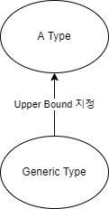

# 목차

# 1. 개요

이번장에서 알아야 할 것들

- 실체화한 타입 파라미터(reified type parameter)
- 선언 지점 변성(declaration-site variance)

실체화한 타입 파라미터는 인라인 함수 호출에서 타입 인자로 쓰인 구체적인 타입을 "실행" 시점에 알 수 있다.

선언 지점 변성은 상위/하위 타입 관계에 따라 두 제네릭 타입이 어떤 관계가 되는지 지정할 수 있는데, 자바의 와일드 카드와 비슷하다고 보면 된다.

## 1.1 제네릭 타입 파라미터

제네릭 확장 프로퍼티를 선언할 수 있다.

```kotlin
private val <T> List<T>.penultimate: T // 모든 List에 이 제네릭 확장 프로퍼티를 사용할 수 있다.
    get() = this[size - 1]

@Test
fun test2() {
    println(listOf(1, 2, 3, 4).penultimate) // 이 호출에서 타입 파라미터 T는 int로 추론된다.
}
```

> **확장 프로퍼티만 제네릭하게 만들 수 있다.** 클래스 프로퍼티에 여러 타입의 값을 저장할 수는 없으므로 제네릭한 일반 프로퍼티는 말이 되지 않는다.

## 1.2 타입 파라미터 제약

어떤 타입을 제네릭 타입 파라미터의 상한(Upper Bound)으로 지정하면 그 제네릭 타입을 인스턴스화할 때, 사용하는 타입 인자는 반드시 그 상한 타입이거나 그 상한 타입의 하위 타입이어야 한다.


<p align="center"></p>


