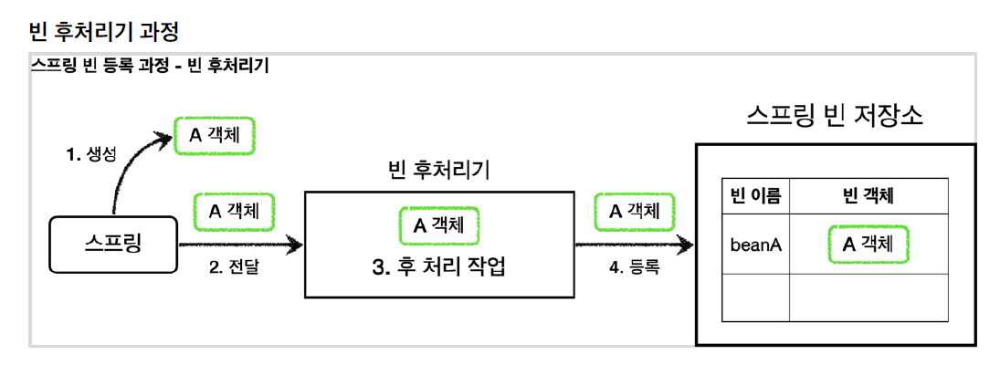
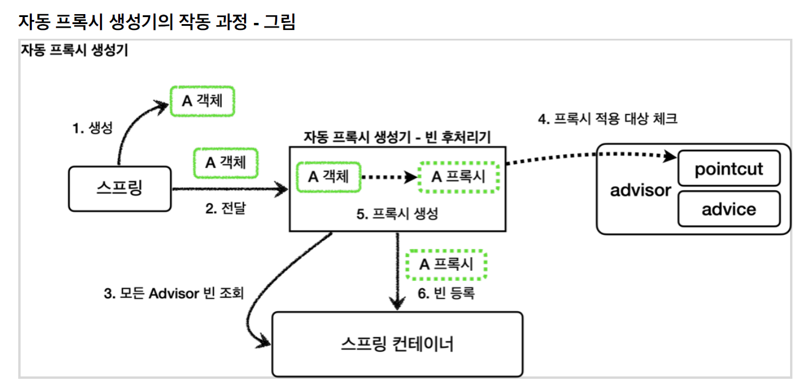

# 목차

- [목차](#목차)
- [1. 빈 후처리기 - 소개](#1-빈-후처리기---소개)
- [2. 빈 후처리기 - 예제](#2-빈-후처리기---예제)
- [3. 빈 후처리기의 장점](#3-빈-후처리기의-장점)
- [4. 스프링이 제공하는 빈 후처리기](#4-스프링이-제공하는-빈-후처리기)
  - [4.1 AutoProxyCreator](#41-autoproxycreator)
    - [4.1.1 포인트컷의 사용처](#411-포인트컷의-사용처)

# 1. 빈 후처리기 - 소개

_@Bean_ 이나 컴포넌트 스캔으로 스프링 빈을 등록하면, 스프링은 대상 오브젝트를 생성하고
스프링 컨테이너나 빈 저장소에 등록한다. 그리고 이후에는 스프링 컨테이너를 통해 등록한 스프링 빈을
조회해서 사용하면 된다.

스프링이 빈 저장소에 등록할 목적으로 생성한 오브젝트를 **빈 저장소에 등록하기 직전에
조작**하고 싶다면 빈 후처리기(BeanPostProcessor)를 사용하면 된다.

- 빈 후처리기의 기능

1. 오브젝트를 조작할 수 있다.
2. 완전히 다른 오브젝트로 바꿔치기 하는 것도 가능하다.



1. **생성**: 스프링 빈 대상이 되는 오브젝트를 생성한다.
2. **전달**: 생성된 오브젝트를 빈 저장소에 등록하기 직전에 빈 후처리기에 전달한다.
3. **후 처리 작업**: 빈 후처리기는 전달된 빈 오브젝트를 조작하거나 다른 오브젝트로 대체할 수 있다.
4. **등록**: 빈 후처리기는 빈을 반환한다. 전달된 빈을 그대로 반환하면 해당 빈이 등록되고, 바꿔치기하면
   다른 오브젝트가 빈 저장소에 등록된다.

# 2. 빈 후처리기 - 예제

```java
@Slf4j
public class BasicTest {

  @Test
  void basicConfig() {
    AnnotationConfigApplicationContext applicationContext = new AnnotationConfigApplicationContext(
      BasicConfig.class);

    //B는 빈으로 등록
    B b = applicationContext.getBean("beanA", B.class);
    b.helloB();

    //A는 빈으로 등록 X
    assertThatThrownBy(() -> {
      applicationContext.getBean(A.class);
    }).isInstanceOf(NoSuchBeanDefinitionException.class);
  }

  @Slf4j
  @Configuration
  static class BasicConfig {

    @Bean(name = "beanA")
    public A a() {
      return new A();
    }

    @Bean
    public AToBPostProcessor helloPostProcessor() {
      return new AToBPostProcessor();
    }
  }

  @Slf4j
  static class A {

    public void helloA() {
      log.info("hello A");
    }
  }

  @Slf4j
  static class B {

    public void helloB() {
      log.info("hello B");
    }
  }

  @Slf4j
  static class AToBPostProcessor implements BeanPostProcessor {

    @Override
    public Object postProcessAfterInitialization(Object bean, String beanName)
      throws BeansException {
      log.info("beanName={} bean={}", beanName, bean);
      if(bean instanceof A) {
        return new B();
      }
      return bean;
    }
  }
}
```

실행 결과를 보면 _beanA_ 라는 스프링 빈 이름에 A 오브젝트 대신 B 오브젝트가 등록된다.

**정리**

- 빈 후처리기는 빈을 조작하고 변경할 수 있는 후킹 포인트이다.
- 빈 오브젝트를 조작하거나 심지어 다른 오브젝트로 바꾸어 버릴 수 있을 정도로 막강하다.

> **참고.**
> _@PostConstruct_ 는 스프링 빈 생성 이후에 빈을 초기화하는 역할을 한다.
> 빈의 초기화라는 것은 단순히 _@PostConstruct_ 애노테이션이 붙은 초기화 메서드를 한 번 호출만 하면 된다.
> 즉, 이것도 생성된 빈을 한 번 조작하는 것이다.
> 스프링은 *CommonAnnotationBeanPostProcessor* 라는 빈 후처리기를 자동으로 등록하는데,
> 여기에서 *@PostConstruct* 어노테이션이 붙은 메서드를 호출한다. 따라서 스프링 스스로도 스프링 내부의 기능을
> 확장하기 위해 빈 후처리기를 사용한다.

# 3. 빈 후처리기의 장점

1. 프록시 팩토리 방식은 프록시를 적용하려는 클래스마다 설정 파일에 일일이 등록해야한다는 단점이 있다.
   예를 들어 Controller, Service, Repository 클래스 전부에 프록시를 적용하고 싶다면 설정 파일엔 각각의 설정 코드를 기입해줘야 한다.
2. 빈 후처리기 방식을 이용하면 빈 생성 이후 후처리기에만 프록시 관련 설정 코드를 추가하면 되기 때문에 많은 설정 코드가 필요 없고,
   적용할 프록시 기능마다 딱 하나의 설정 코드만 추가하면 된다.
3. 컴포넌트 스캔을 통해 등록한 빈들도 프록시를 적용할 수 있다.

# 4. 스프링이 제공하는 빈 후처리기

```gradle
implementation 'org.springframework.boot:spring-boot-starter-aop'
```

이 라이브러리를 추가하면 *aspectjweaver* 라는 *aspectJ* 라이브러리를 등록하고 스프링 부트가 AOP 관련 클래스를 자동으로 스프링 빈에 등록한다. 스프링 부트가 없던 시절에는 *@EnableAspectJAutoProxy* 를 직접 사용해야 했는데, 이 부분을 스프링 부트가 자동으로 처리해주는 것이다.

## 4.1 AutoProxyCreator

- 앞의 스프링 부트 설정으로 *AnnotationAwareAspectJAutoProxyCreator* 라는 빈 후처리기가 스프링 빈에 자동으로 등록된다.
- 이 빈 후처리기는 스프링 빈으로 등록된 *Advisor* 들을 자동으로 찾아서 프록시가 필요한 곳에 프록시를 적용해준다.
- 스프링 빈 후처리기는 *@Aspect* 도 자동으로 인식해서 프록시를 만들고 AOP를 적용해준다.



### 4.1.1 포인트컷의 사용처

**프록시 적용 여부 판단 - 생성 단계**

* 자동 프록시 생성기는 포인트컷을 사용해서 해당 빈이 프록시를 생성할 필요가 있는지 없는지 판단한다.
* 클래스와 메서드 조건 모두를 비교한다.

**어드바이스 적용 여부 판단 - 사용 단계**

- 프록시가 호출되었을 때, 부가 기능인 어드바이스를 적용할지 말지 포인트컷을 보고 판단한다.

> **참고.**
>
> 프록시를 모든 곳에 생성하는 것은 리소스 낭비이다. 꼭 필요한 곳에 최소한의 프록시를 적용해야 한다.
> 그래서 자동 프록시 생성기는 포인트컷으로 한 번 필터링해서 어드바이스가 사용될 가능성이 있는 곳에만 프록시를 생성한다.
