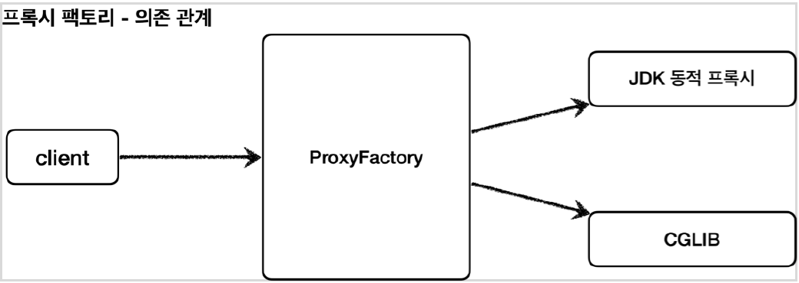
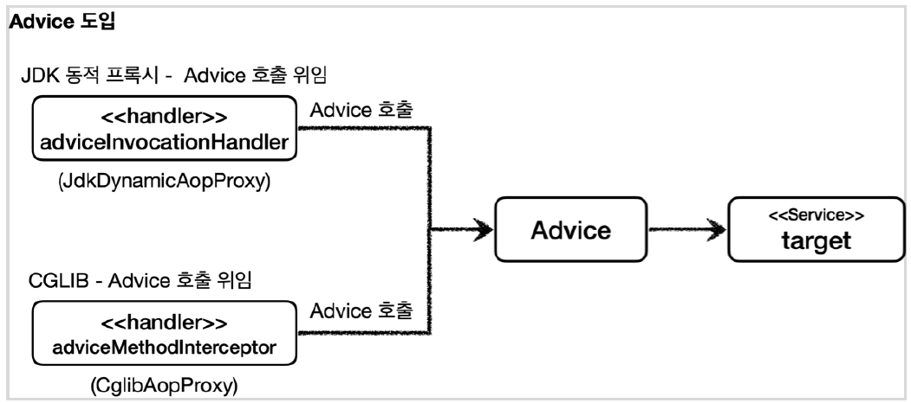

# 목차

- [목차](#목차)
- [프록시 팩토리 - 소개](#프록시-팩토리---소개)
- [프록시 팩토리 - 예제 코드 1](#프록시-팩토리---예제-코드-1)

# 프록시 팩토리 - 소개

프록시를 사용하면 아래와 같은 문제점에 부딪힌다.

- 인터페이스가 있는 경우에는 JDK 동적 프록시를 적용하고, 없는 경우에는 CGLIB 를 사용하고 싶다면?
- 두 기술을 함께 사용할 때 _InvocationHandler_ 와 _MethodInterceptor_ 을 각각 중복으로 만들어야 할까?
- 특정 조건에 맞을 때 프록시 로직을 적용하는 기능도 공통으로 제공하는 방법은 없을까?


이런 문제들을 해결하기 위해 스프링은 **프록시 팩토리** 기능을 제공한다.



프록시 팩토리는 인터페이스가 있으면 JDK 동적 프록시를, 없으면 CGLIB 를 사용한다.
이것이 가능한 이유는 스프링이 _Advice_ 라는 새로운 개념을 도입했기 때문이다.

개발자는 JDK 동적 프록시이든 CGLIB 이든 _Advice_ 만 만들면 된다.



# 프록시 팩토리 - 예제 코드 1

_Advice_ 는 프록시에 적용하는 부가 기능 로직이다. 이것을 구현하기 위해서는 아래 인터페이스를 구현하면 된다.

```java
/**
 * @Param MethodInvocation 다음 메서드를 호출하는 방법, 현재 프록시 오브젝트 인스턴스, args, 메서드 정보 등이 담겨 있다.
 * MethodInterceptor 은 Interceptor 을 상속하고, Interceptor 은 Advice 를 상속한다.
 */
public interface MethodInterceptor extends Interceptor {
	Object invoke(MethodInvocation invocation) throws Throwable;
}
```

```java
@Slf4j
public class ProxyFactoryTest {

    @Test
    @DisplayName("인터페이스가 있으면 JDK 동적 프록시 사용")
    void interfaceProxy() {
        ServiceImpl target = new ServiceImpl();
        ProxyFactory proxyFactory = new ProxyFactory(target);
        proxyFactory.addAdvice(new TimeAdvice());
        ServiceInterface proxy = (ServiceInterface) proxyFactory.getProxy();

        log.info("targetClass={}", target.getClass());
        log.info("proxyClass={}", proxy.getClass());

        proxy.save();

        assertThat(AopUtils.isAopProxy(proxy)).isTrue();
        assertThat(AopUtils.isJdkDynamicProxy(proxy)).isTrue();
        assertThat(AopUtils.isCglibProxy(proxy)).isFalse();
    }
}
```

- **new ProxyFactory(target)** : 프록시 팩토리를 생성할 때, 생성자에 프록시의 호출 대상을 함께 넘겨 준다.
인터페이스가 있다면 _JdkDynamicProxy_, 없으면 _CGLIBProxy_ 를 사용한다.
- **ProxyFactory.addAdvice(new TimeAdvice())** : 프록시 팩토리를 통해서 만든 프록시가 사용할 부가 기능 로직을
사용한다.


> `proxyFatory.setProxyTargetClass(true)` 를 하면 인터페이스의 유무에 상관없이 CGLIB 방식으로 프록시를 생성한다.
> 참고로 스프링 부트는 AOP를 적용할 때 기본적으로 true로 설정해서 사용한다.

