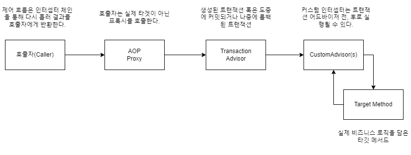
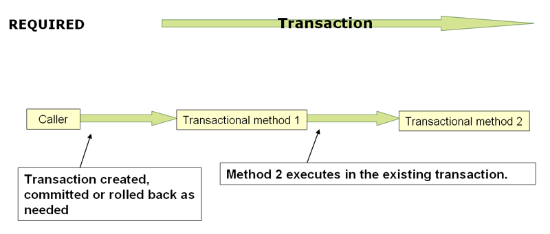
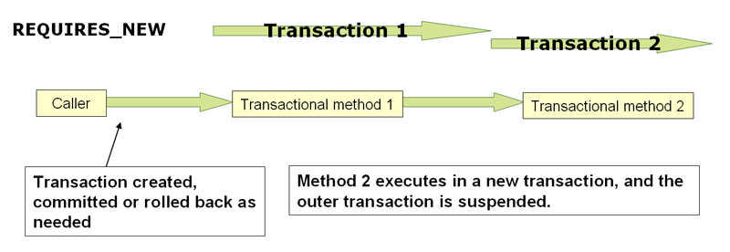

# 목차

- [목차](#목차)
- [1. 트랜잭션 관리](#1-트랜잭션-관리)
  - [1.1 스프링 프레임워크의 트랜잭션 지원 모델의 장점](#11-스프링-프레임워크의-트랜잭션-지원-모델의-장점)
    - [1.1.1 글로벌 트랜잭션](#111-글로벌-트랜잭션)
    - [1.1.2 로컬 트랜잭션](#112-로컬-트랜잭션)
    - [1.1.3 스프링 프레임워크의 일관성 있는 프로그래밍 모델](#113-스프링-프레임워크의-일관성-있는-프로그래밍-모델)
  - [1.2 스프링 트랜잭션 추상화의 이해](#12-스프링-트랜잭션-추상화의-이해)
  - [1.3 트랜잭션과 리소스 동기화](#13-트랜잭션과-리소스-동기화)
    - [1.3.1 고 수준 동기화 접근 방식](#131-고-수준-동기화-접근-방식)
    - [1.3.2 저 수준 동기화 접근 방식](#132-저-수준-동기화-접근-방식)
  - [1.4 선언적 트랜잭션 관리](#14-선언적-트랜잭션-관리)
    - [1.4.1 선언적 트랜잭션 구현의 이해](#141-선언적-트랜잭션-구현의-이해)
    - [1.4.2 트랜잭션 전파](#142-트랜잭션-전파)
  - [1.5 프로그래밍 방식 트랜잭션 관리](#15-프로그래밍-방식-트랜잭션-관리)

# 1. 트랜잭션 관리

스프링은 일관된 트랜잭션 추상화 관리를 제공한다. 이로써 얻는 이점은 아래와 같다.

- JTA, JDBC, Hibernate, JPA 와 같은 다양한 트랜잭션 API 에서 일관된 프로그래밍이 가능
- 선언적 트랜잭션 관리를 지원한다.
- JTA 같은 복잡한 트랜잭션 API 보다 간단한 프로그래머틱한 트랜잭션 관리
- 스프링 데이터 액세스 추상화와의 통합

## 1.1 스프링 프레임워크의 트랜잭션 지원 모델의 장점

- 오래전, 자바 EE 개발자들은 트랜잭션 관리에 두 가지 선택을 했다.
  - global transaction
  - local transaction

문제는 두 가지 전부 심각한 제약이 존재한다. 이러한 제약을 스프링 프레임워크는 어떻게 해결해나가는 것일까?

### 1.1.1 글로벌 트랜잭션

글로벌 트랜잭션을 사용하면 RDB 및 메시지 큐와 같은 여러 트랜잭션 리소스로 작업할 수 있다.
애플리케이션 서버는 글로벌 트랜잭션을 관리하기 위해 JTA를 사용하지만 JTA는 여러가지로 복잡한 부분이 많다.

- _JTA UserTransaction_ 은 일반적으로 JNDI 에서 제공된다.
- JTA는 보통 응용 프로그램의 서버 환경에서만 사용할 수 있기 때문에, 글로벌 트랜잭션을 사용하면
응용 프로그램 코드의 재사용성이 떨어질 수 있다.

> **Note.**  
> JNDI는 애플리케이션에 이름 지정 및 디렉토리 기능을 제공하는 API 이다.


### 1.1.2 로컬 트랜잭션

로컬 트랜잭션은 JDBC 커넥션과 관련된 트랜잭션과 같이 리소스에 따라 다르다.
로컬 트랜잭션은 사용하긴 쉽지만 심각한 단점이 있다.

- 여러 트랜잭션 리소스를 거쳐서 작동할 수 없다.
- 예를 들어, JDBC 커넥션을 사용해서 트랜잭션을 관리하는 코드는 글로벌 JTA 트랜잭션 내에서 실행할 수 없다.
- 애플리케이션 서버는 트랜잭션 관리에 관여하지 않기 때문에 여러개의 리소스에 대한 정확성을 보장하지 못한다.
- 로컬 트랜잭션은 프로그래밍 모델을 침범한다.

> **Note.**  
> 프로그래밍 모델은 API 또는 특정 코드 패턴에 연결된 실행 모델을 뜻한다.
> 이 모델은 "**기본 프로그래밍 언어의 실행 모델**" 과 "**프로그래밍 모델의 실행 모델**" 이라는 두 가지 실행 모델이 있다.
> 전자의 예는 Java, C, 등등이 있고 후자의 예로는 Spark, POSIX 쓰레드 라이브러리, Hadoop 의 MapReduce 가 있다.
> 
> 중요한 차이점은 프로그래밍 모델의 실행 모델은 코드가 작성된 기본 언어 실행 모델과 다르다.
> 예를 들어, C 언어는 입력과 출력, 쓰레드 동작에 대한 실행 모델이 없다. 그러나 이런 동작들을 사용할 수 있는 이유는
> 공통 C 라이브러리에서 C 언어로만 호출하는 것처럼 구현해놨기 때문이다. 

### 1.1.3 스프링 프레임워크의 일관성 있는 프로그래밍 모델

스프링은 이러한 글로벌 트랜잭션과 로컬 트랜잭션의 단점을 해결한다.
스프링 프레임워크는 선언적 트랜잭션 관리, 프로그래밍 트랜잭션 관리 모두를 제공한다. 대부분의 경우는 전자를 선호한다.


선언적 트랜잭션 관리를 이용하면 개발자는 일반적으로 트랜잭션 관리와 관련된 코드를 전혀 작성하지 않아도 되기 때문에 
스프링 프레임워크 트랜잭션 API 또는 기타 트랜잭션 API에 의존하지 않게 된다.

## 1.2 스프링 트랜잭션 추상화의 이해

스프링 트랜잭션 추상화의 핵심은 트랜잭션 전략의 개념이다.

트랜잭션 전략은 아래 두 가지로 정의된다.
- _org.springframework.transaction.PlatformTransactionManager_ 
- _org.springframework.transaction.ReactiveTransactionManager_ 

```java
public interface PlatformTransactionManager extends TransactionManager {
	
    // TransactionDefinition 파라미터에 따라 TransactionStatus 오브젝트를 반환한다.
    TransactionStatus getTransaction(@Nullable TransactionDefinition definition) throws TransactionException;
    
    void commit(TransactionStatus status) throws TransactionException;
    
    void rollback(TransactionStatus status) throws TransactionException;
}
```

_PlatformTransactionManger_ 는 인터페이스이므로 필요에 따라 쉽게 목 오브젝트나 테스트 스텁으로 대체할 수 있다.
_PlatformTransactionManger_ 의 구현은 스프링 프레임워크 IoC 컨테이너의 다른 오브젝트처럼 정의된다.
이 점만으로도 JTA로 작업하는 경우보다 트랜잭션의 추상화가 가능하다.

아래는 리액티브 트랜잭션 매니저의 트랜잭션 전략 코드이다. 이것도 결국 인터페이스로 설계되었기 때문에
_PlatformTransactionManger_ 와 같이 목 오브젝트나 테스트 스텁 작성이 쉬워진다.

```java
public interface ReactiveTransactionManager extends TransactionManager {
    Mono<ReactiveTransaction> getReactiveTransaction(@Nullable TransactionDefinition definition) throws TransactionException;

    Mono<Void> commit(ReactiveTransaction transaction) throws TransactionException;

    Mono<Void> rollback(ReactiveTransaction transaction) throws TransactionException;
}
```

_TransactionDefinition_ 인터페이스는 다음을 정의한다.

- 전파(Propagation)
- 격리(Isolation)
- 만료(Timeout)
- Read-only

이러한 설정들은 표준 트랜잭션 개념을 반영한다.
그리고 개발자가 원하는대로 전파 속성과 격리 수준을 교체할 수도 있다.

```java
public interface TransactionDefinition {
    int PROPAGATION_REQUIRED = 0;
    //... 더 있지만 너무 많아서 생략

    default int getPropagationBehavior() {
        return 0;
    }

    default int getIsolationLevel() {
        return -1;
    }

    default int getTimeout() {
        return -1;
    }

    default boolean isReadOnly() {
        return false;
    }

    @Nullable
    default String getName() {
        return null;
    }

    static TransactionDefinition withDefaults() {
        return StaticTransactionDefinition.INSTANCE;
    }
}
```

## 1.3 트랜잭션과 리소스 동기화

이 섹션에서 다룰 내용은 다음과 같다.

- 트랜잭션에 동기화되어야 하는 리소스가 올바르게 생성, 재사용 및 정리되도록 보장하는 방법
- _TransactionManager_ 를 통해 트랜잭션 동기화가 트리거 되는 방법

### 1.3.1 고 수준 동기화 접근 방식

주된 접근 방식은 스프링의 템플릿 기반 영속성 통합 API를 사용하거나 네이티브 ORM API를 사용하는 것이다.
이런 접근 방식은 리소스 생성 및 재사용, 정리, 리소스의 선택적 트랜잭션 동기화, 예외 매핑을 내부적으로 처리하기 때문에
개발자가 이러한 작업을 처리할 필요가 없다.

일반적으로 기본 ORM API 를 사용하거나 JdbcTemplate 을 사용한다.

### 1.3.2 저 수준 동기화 접근 방식

- DataSourceUtils(JDBC)
- EntityManagerFactoryUtils(JPA)
- SessionFactoryUtils(하이버네이트)

이러한 클래스를 사용하여 적절한 스프링 프레임워크 관리 인스턴스를 확보할 수 있다.
예를 들어 JDBC 의 _DataSource_ 에서 _getConnection()_ 메서드를 직접 호출하는 기존 JDBC 접근 방식
대신 다음과 같이 Spring 의 _DataSourceUtils_ 클래스를 사용할 수 있다.

```java
Connection conn = DataSourceUtils.getConnection(dataSource);
```

기존 트랜잭션에 동기화 된 연결이 있는 경우 해당 인스턴스가 반환된다.
그렇지 않으면 메서드 호출이 새로운 커넥션 생성을 트리거한다.
이 커넥션은 선택적으로 기존 트랜잭션과 동기화되고, 동일한 트랜잭션에서 이후에 재사용할 수 있다.

앞서 언급했듯이 모든 _SQLException_ 은 unchecked 타입의 _DataAccessException_ 계층 중 하나인
_CannotGetJdbcConnectionException_ 에 래핑된다.

스프링의 JDBC, JPA 혹은 Hibernate 를 사용하면 _DataSourceUtils_ 같은 것들은 사용하지 않는 것이 낫다.
관련 API 를 직접 사용하는 것 보단 스프링 추상화 작업에 맡기는 것이 훨씬 간편하기 때문이다.

## 1.4 선언적 트랜잭션 관리

> 스프링 프레임워크를 사용하는 개발자들의 대부분은 이것을 사용한다.
> 선언적 트랜잭션 관리는 애플리케이션에 가장 적은 영향을 미치기 때문에 OCP 원칙에 가장 잘 부합한다.

스프링의 선언적 트랜잭션 관리는 **Spring AOP** 를 통해 가능하다.
하지만 트랜잭션 코드는 스프링 프레임워크 배포와 함께 제공되기 때문에 이 코드를 효과적으로 사용하기 위해
스프링 AOP 개념을 이해할 필요는 없다.

스프링 프레임워크의 선언적 트랜잭션 관리는 메서드 수준까지 동작을 지정할 수 있다.

### 1.4.1 선언적 트랜잭션 구현의 이해

선언적 트랜잭션의 구현에서 파악해야할 개념은 아래와 같다.

- 스프링 AOP 프록시를 통해 활성화된다.
- 트랜잭션 어드바이스는 메타데이터(XML 또는 어노테이션)에 의해 구동된다.

AOP와 트랜잭션 메타데이터의 조합이 적합한 _TransactionManger_ 구현과 함께 _TransactionInterceptor_
를 이용해서 메서드 호출을 중심으로 트랜잭션을 구동하는 AOP 프록시를 생성한다.

_TransactionInterceptor_ 는 명령형 및 반응형 프로그래밍 모델에 대한 트랜잭션 관리를 제공한다.
인터셉터는 메서드 반환 타입을 검사해서 원하는 트랜잭션 관리 방식을 감지한다. 한 마디로 중간 관리자 느낌이다.

> @Transactional 은 일반적으로 _PlatformTransactionManager_ 가 관리하는 thread-bound 트랜잭션과
> 함께 작동하여 현재 실행 쓰레드 내의 모든 데이터 액세스 작업에 트랜잭션을 노출시킨다.
> 하지만 이것은 메서드 내에서 새로 시작된 쓰레드에는 전파되지 않는다.

아래 이미지는 트랜잭션 프록시에서 메서드를 호출하는 것을 설명하는 그림이다.



### 1.4.2 트랜잭션 전파

스프링에서 트랜잭션 전파와 관련된 몇 가지 의미를 자세히 설명한다.

스프링이 관리하는 트랜잭션에서 물리적 트랜잭션과 논리적 트랜잭선의 차이점, 전파 설정이 이 둘 사이에 적용되는
방식의 차이점을 알고 있어야 한다.

- **PROPAGATION_REQUIRED**



1. 트랜잭션이 커밋되거나 롤백으로 인해 생성되서 _Transactional method 1_ 이 생성된다.
2. _Transaction method 2_ 는 이미 실행되고 있는 트랜잭션 내부에서 실행된다.

PROPAGATION_REQUIRED 는 트랜잭션이 아직 존재하지 않는 경우 현재 범위에서 로컬, 또는 더 큰 범위에 대해
기존 외부 트랜잭션에 참여하는 물리적 트랜잭션을 적용한다.

> 기본적으로 참여 트랜잭션은 로컬 격리 수준, 만료 값 또는 읽기 전용 플래그를 자동으로 무시하고 외부와 결합한다.
> 격리 수준이 다른 기존 트랜잭션에 참여할 때 거부되게 하려면 트랜잭션 관리자에서 _validateExistingTransactions_
> 플래그를 true 로 전환하는 것이 좋다.

전파 설정이 PROPAGATION_REQUIRED 이면 설정이 적용되는 각 메서드에 대해 논리적 트랜잭션 범위가 생성된다.

- 이러한 각 논리적 트랜잭션 범위는 외부 트랜잭션 범위가 내부 트랜잭션 범위와 논리적으로 독립적인 상태에서
rollback-only 상태를 개별적으로 지정할 수 있다.
- PROPAGATION_REQUIRED 동작의 경우 이러한 모든 범위는 동일한 물리적 트랜잭션에 매핑된다.
- 따라서 내부 트랜잭션 범위에 설정된 rollback-only 마커는 외부 트랜잭션이 실제로 커밋할 기회에 영향을 미친다.

그러나 내부 트랜잭션 범위가 rollback-only 마커를 설정하는 경우, 외부 트랜잭션은 롤백을 결정하지 않았으므로
이 롤백은 예상치 못한 상황이다. 이 지점에서 _UnexpectedRollbackException_ 예외가 발생한다.
이것은 트랜잭션 호출자가 커밋이 실제로 수행되었다고 가정하도록 하는 일이 절대로 없게 하기 위한 일종의 안전 장치이다.

- **PROPAGATION_REQUIRES_NEW**



1. 트랜잭션이 생성된다.
2. 메서드 2는 새로운 트랜잭션에서 실행되고 외부 트랜잭션은 일시 중단된다.

PROPAGATION_REQUIRES_NEW 는 항상 영향을 받는 각 트랜잭션 범위에 대해 독립적인 물리적 트랜잭션을
사용하며, 외부 범위에 대한 기존 트랜잭션에는 참여하지 않는다.

이러한 배열에서, 기본 리소스 트랜잭션이 다르므로 
외부 트랜잭션이 내부 트랜잭션의 롤백 상태에 영향을 받지 않고,
내부 트랜잭션의 잠금이 완료 직후 해제된 상태에서 독립적으로 커밋 혹은 롤백을 할 수 있다.

- **PROPAGATION_NESTED**

롤백할 수 있는 여러 개의 세이브 포인트가 있는 단일 물리적 트랜잭션을 사용한다.
이러한 부분 롤백을 통해 내부 트랜잭션 범위가 해당 범위에 대한 롤백을 트리거할 수 있으며
일부 작업이 롤백되었음에도 불구하고 외부 트랜잭션이 물리적 트랜잭션을 계속할 수 있다.

이 설정은 일반적으로 JDBC 세이브 포인트에 매핑되므로 JDBC 리소스 트랜잭션에서만 작동한다.

## 1.5 프로그래밍 방식 트랜잭션 관리

스프링 프레임워크는 두 가지 프로그래머틱한 트랜잭션 관리 방법을 제공한다.

- _TransactionTemplate_ 혹은 _TransactionalOperator_
- _TransactionManager_ 를 바로 구현

스프링 팀은 일반적으로 명령형 흐름의 프로그래머틱한 트랜잭션 관리를 위해 _TransactionTemplate_ 을 추천하고
리액티브한 코드에 대해서는 _TransactionalOperator_ 을 추천한다.
두 번째 방식은 JTA 를 사용하는 것과 비슷하지만 예외 처리가 덜 번거롭다.