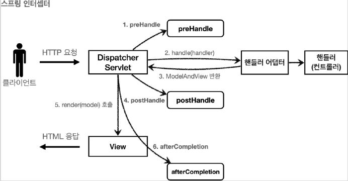

# 6.4 로그인 처리2 - 필터, 인터셉터

- 로그인을 하는 이유: 권한이 필요한 URI에 접근하기 위함

하지만 단순히 로그인만 구현했다고 URI 접근 권한은 통제할 수 없다.  
통제하려면 서블릿 필터 혹은 인터셉터를 이용해야 한다.


## 6.4.1 서블릿 필터

필터는 서블릿이 지원하는 수문장 역할을 한다.

HTTP 요청 &rightarrow; WAS &rightarrow; **필터** &rightarrow; 서블릿 &rightarrow; 컨트롤러

필터를 적용하면 필터가 호출된 다음 서블릿이 호출된다.  
따라서 특정 URI 접근 통제, 요청 로그를 남기는 요구사항이 있다면 필터를 이용하면 된다.

- 필터에서 적절하지 않은 요청이라고 판단되면 요청을 거절할 수 있다. (로그인 여부 체크에 적당하다.)
- 중간에 필터를 자유롭게 추가할 수 있다. (필터 체인)

### LogFilter - 로그 필터

- LogFilter.class
  - `doFilter()` 메서드를 이용해 로그 출력
  - 동일 요청에 대한 로그인지 판단하기 위해 `uuid` 변수 생성
  - `chain.doFilter()`는 필수이다. 적어주지 않으면 요청이 다음 서블릿으로 가지 않는다.

```java
@Slf4j
public class LogFilter implements Filter {
	@Override
	public void doFilter(ServletRequest request, ServletResponse response, FilterChain chain)
		throws IOException, ServletException {
		log.info("log filter doFilter");
		HttpServletRequest httpRequest = (HttpServletRequest) request;
		String requestURI = httpRequest.getRequestURI();
		
		String uuid = UUID.randomUUID().toString();

		try{
			log.info("REQUEST [{}][{}]", uuid, requestURI);
			chain.doFilter(request, response);
		}catch (Exception e){
			throw e;
		}finally {
			log.info("RESPONSE [{}][{}]", uuid, requestURI);
		}
	}
}
```

- WebConfig.class
  - 서블릿 필터는 빈으로 등록해야 한다.
  - 따라서 `@Configuration`에 `LogFilter()`를 등록

```java
@Configuration
public class WebConfig{

	@Bean
	public FilterRegistrationBean logFilter() {
		// 스프링 부트가 필터를 넣어줌.
		FilterRegistrationBean<Filter> filterRegistrationBean = new FilterRegistrationBean<>();
		filterRegistrationBean.setFilter(new LogFilter());
		filterRegistrationBean.setOrder(1); // 필터를 적용할 순서
		filterRegistrationBean.addUrlPatterns("/*");
		return filterRegistrationBean;
	}
}
```

로그는 모든 URI에 대해 필터를 적용하므로 구현이 간단하다.  
하지만 로그인의 경우 적용해야 할 URI를 따로 지정해야 한다.

### LoginCheckFilter - 로그인 필터

- LoginCheckFilter.class
  - 회원가입에 사용자 인증이 필요하다면 회원가입이 불가능하다.
  - 이것은 `/login`, `/logout`, `/css` 도 동일하다.

```java
@Slf4j
public class LoginCheckFilter implements Filter {

	private static final String[] whiteList = {"/", "/members/add", "/login", "/logout", "/css/*"};

	@Override
	public void doFilter(ServletRequest request, ServletResponse response, FilterChain chain)
		throws IOException, ServletException {
		HttpServletRequest httpRequest = (HttpServletRequest) request;
		HttpServletResponse httpResponse = (HttpServletResponse) response;
		String requestURI = httpRequest.getRequestURI();

		try{
			log.info("인증 체크 필터 시작 {}", requestURI);
			// whileList에 해당하지 않는 URI에만 로그인 기능 적용
			if (isLoginCheckPath(requestURI)) {
				log.info("인증 체크 로직 실행 {}", requestURI);
				HttpSession session = httpRequest.getSession(false);
				if (session == null || session.getAttribute(SessionConst.LOGIN_MEMBER) == null) {
					log.info("미인증 사용자 요청 {}", requestURI);
					httpResponse.sendRedirect("/login?redirectURL=" + requestURI);
					return;
				}
			}

			chain.doFilter(request, response);
		}catch (Exception e){
			throw e;
		}finally {
			log.info("인증 체크 필터 종료 {}", requestURI);
		}
	}

	/**
	 * 화이트리스트인 경우 인증 체크 X
	 */
	private boolean isLoginCheckPath(String requestURI){
		return !PatternMatchUtils.simpleMatch(whiteList, requestURI);
	}
}
```

로그인 필터는 구현했지만 사용자 편의성 관련 기능이 빠진 것이 하나 있다.

- 사용자가 로그인이 필요한 URI에 접속한다. (/items)
- 로그인하지 않았으므로 로그인 화면으로 이동한다. (/login)
- 로그인하면 다시 기존 화면으로 리다이렉트 해야한다. (/items)

따라서 `LoginController.class`의 일부를 수정해줘야 한다.

- 기존 리턴은 단순히 `redirect:/` 이기 때문에 로그인에 성공하면 홈 화면으로 리다이렉트한다.
- `@RequestParam`으로 `redirectURL` 정보를 가져온다.

```java
	@PostMapping("/login")
	public String loginV4(@ModelAttribute("loginForm") LoginForm form,
		@RequestParam(defaultValue = "/") String redirectURL, BindingResult bindingResult,
		HttpServletRequest request) {
		if (bindingResult.hasErrors()) {
			return "login/loginForm";
		}

		Member loginMember = loginService.login(form.getLoginId(), form.getPassword());

		if (loginMember == null) {
			bindingResult.reject("loginFail", "아이디 또는 비밀번호가 맞지 않습니다.");
			return "login/loginForm";
		}

		// 로그인 성공 처리
		// 세션이 없으면 신규 세션 생성, 있으면 있는 세션 반환
		HttpSession session = request.getSession();
		// 세션에 로그인 회원 정보 보관
		session.setAttribute(SessionConst.LOGIN_MEMBER, loginMember);
		
		//기존 리턴: return "redirect:/";
		return "redirect:" + redirectURL;
	}
```

> **참고.**  
> 필터는 스프링 인터셉터가 제공하지 않는 기능이 있다.  
> `chain.doFilter()`를 호출해서 다음 필터 또는 서블릿을 호출할 때 `request`, `response`를 다른 객체로 바꿀 수 있다.  
> `ServletRequest`, `ServletResponse`를 구현한 다른 객체를 만들어서 넘기면 해당 객체가 다음 필터 또는 서블릿에 사용된다.

## 6.4.2 스프링 인터셉터

스프링 인터셉터는 서블릿 필터가 거치게 되는 흐름과 조금 다르다.

**HTTP 요청 &rightarrow; WAS &rightarrow; 필터 &rightarrow; 서블릿 &rightarrow; 스프링 인터셉터 &rightarrow; 컨트롤러**

- 스프링 인터셉터는 디스패처 서블릿과 컨트롤러 사이에서 호출된다.
- 인터셉터도 URL 패턴을 지정할 수 있다. 단, 서블릿 필터보다 매우 정밀하게 설정 가능하다.

인터셉터를 만들려면 먼저 `HandlerInterceptor` 인터페이스를 구현해야 한다.  
이 인터페이스에는 세 가지 디폴트 메서드가 있다.

- preHandle
- postHandle
- afterCompletion



여기서 `postHandle`과 `afterCompletion`는 예외가 발생할 때 실행 유무의 차이가 있다.

**예외 발생 시:**

- postHandle: 컨트롤러에서 예외 발생 시 호출되지 않음
- afterCompletion: 예외를 파라미터로 받아서 어떤 예외가 발생했는지 로그로 출력 가능

### 로그인 체크 인터셉터

- 인터셉터는 리턴값이 true면 다음 인터셉터 혹은 컨트롤러를 호출한다.
- **스프링 인터셉터는 호출 시점이 완전히 분리되어 있기 때문에 지역변수 사용 시 주의해야 한다.**
  - 예를 들어 서블릿 필터는 `uuid`를 지역변수로 선언해 `init()`, `destory()`에서 사용할 수 있다.
  - 하지만 인터셉터는 싱글톤처럼 사용되기 때문에 필터와 같이 사용하면 위험하다.
  - 만약 `preHandle`, `postHandle`, `afterCompletion`에서 공유해야할 데이터가 있으면
  `request.getParameter()`, `request.setParameter()`로 주고 받으면 된다.

```java
@Slf4j
public class LoginCheckInterceptor implements HandlerInterceptor {

	@Override
	public boolean preHandle(HttpServletRequest request, HttpServletResponse response,
		Object handler) throws Exception {

		String requestURI = request.getRequestURI();
		log.info("인증 체크 인터셉터 실행 {}", requestURI);

		HttpSession session = request.getSession();

		if (session == null || session.getAttribute(SessionConst.LOGIN_MEMBER) == null) {
			log.info("미인증 사용자 요청");
			response.sendRedirect("/login?redirectURL=" + requestURI);
			return false;
		}
		return true;
	}
}
```

- WebConfig.class
  - 인터셉터를 사용하면 적용할 URI를 코드에 작성하지 않는다.
  - `WebMvcConfigurer`를 구현한 `WebConfig`에 URI 패턴을 지정한다.
  - 메서드 체인을 이용해서 순서, URL 패턴을 설정한다.

```java
@Configuration
public class WebConfig implements WebMvcConfigurer {

	String[] whiteList = {"/", "/members/add", "/login", "/logout", "/css/**", "/*.ico", "/error"};
	
	@Override
	public void addInterceptors(InterceptorRegistry registry) {
		registry.addInterceptor(new LogInterceptor())
			.order(1)
                        //인터셉터를 적용할 URI
			.addPathPatterns("/**")
                        //인터셉터를 제외할 URI
			.excludePathPatterns("/css/**", "/*.ico", "/error");

		registry.addInterceptor(new LoginCheckInterceptor())
			.order(2)
			.addPathPatterns("/**")
			.excludePathPatterns(whiteList);
	}
    ...
}
```

> **참고.**  
> [PathPattern 공식 문서](https://docs.spring.io/spring-framework/docs/current/javadoc-api/org/springframework/web/util/pattern/PathPattern.html)

