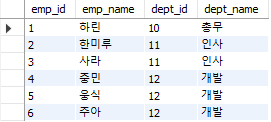

# 목차
- [목차](#목차)
- [3. 실행 계획이 SQL 구문의 성능을 결정](#3-실행-계획이-sql-구문의-성능을-결정)
  - [3.1 인덱스 스캔의 실행 계획](#31-인덱스-스캔의-실행-계획)
  - [3.2 테이블 결합의 실행 계획](#32-테이블-결합의-실행-계획)
      - [Nested Loop](#nested-loop)
      - [Sort Merge](#sort-merge)
      - [Hash](#hash)
    - [3.2.1 객체에 대한 조작의 종류](#321-객체에-대한-조작의-종류)
  - [3.3 실행 계획의 중요성](#33-실행-계획의-중요성)

# 3. 실행 계획이 SQL 구문의 성능을 결정

SQL 구문의 지연이 발생하면 먼저 실행 계획을 살펴봐야 한다.

- Oracle: `set autotrace traceonly`  
- MySQL: `EXPLAIN EXTENDED SQL 구문`

실행 계획의 출력 포맷에서 공통적으로 나타나는 세 가지 부분:

- 조작 대상 객체
- 객체에 대한 조작 종류
- 조작 대상이 되는 레코드 수

## 3.1 인덱스 스캔의 실행 계획

일반적으로 스캔하는 모집합 레코드 수에서 선택되는 레코드 수가 적다면 테이블 풀 스캔보다 빠르게 접근을 수행한다.

시간 복잡도를 따졌을 때 풀 스캔은 _O(n)_ 이고, 인덱스 스캔은 _O(log n)_ 이다.


그래프를 확인하면 일정 분기점부터는 _O(log n)_ 의 경사가 완만해지므로 조회 성능이 더 좋아진다.

## 3.2 테이블 결합의 실행 계획

SQL에서 지연이 일어나는 경우는 대부분 결합과 관련되어 있다. 결합을 사용하면 실행 계획이 복잡해지기 때문에
옵티마이저도 올바른 실행 계획을 세우기 어렵다.

```sql
create table reservations(
	id bigint auto_increment,
    ship_id varchar(100) not null,
    reserve_name varchar(10) not null,
    primary key (id)
);

create table shops(
	shop_id bigint auto_increment,
    shop_name varchar(100),
    rating int,
    area varchar(100),
    primary key(shop_id)
);
```

먼저 간단한 테이블 두 개를 생성하고 프로시저로 더미 데이터를 넣는다.

```sql
DELIMITER $$
drop procedure if exists loopinsert$$

create procedure loopinsert()
begin
    declare i int default 1;

    while i <= 60 do
            insert into shops(shop_name, rating, area) values(concat(i, '번 상점') , i , '서울');
            set i = i + 1;
        end while;
END $$
DELIMITER $$
call loopinsert;
```

|shops 테이블|reservations 테이블|
|:---:|:---:|
|||

이 상태에서 INNER JOIN 을 이용해 두 테이블을 결합한다.

```sql
select shop_name from shops s inner join reservations r on s.shop_id = r.ship_id;
```

**MySQL 실행 계획:**



> **참고**  
> MySQL은 결합할 때 _Nested Loop_ 알고리즘을 사용한다.


일반적으로 DBMS는 결합할 때 세 가지 알고리즘을 사용한다.

#### Nested Loop 

- 가장 간단한 결합 알고리즘.
- 한쪽 테이블을 읽으면서 결합 조건에 맞는 레코드를 다른 쪽 테이블에서 찾는 방식.

#### Sort Merge

- 결합 키로 레코드를 정렬하고, 순차적으로 두 개의 테이블을 결합한다.
- 결합 전에 전처리로 정렬 수행. 이 때 워킹 메모리 사용

#### Hash

- 결합 키값을 해시값으로 매핑하는 방법.
- 해시 테이블을 만들어야하므로 워킹 메모리 필요


### 3.2.1 객체에 대한 조작의 종류

실행 계획은 일반적으로 트리 구조다. 이 때 중첩 단계가 깊을수록 먼저 실행된다.

- 트리 구조이기 때문에 같은 중첩 단계라면 위에서 아래로 실행된다.
- 결합의 경우 어떤 테이블에 먼저 접근하는지가 굉장히 중요하다.
- 결과를 보면 테이블 r(reservation)이 테이블 s(shop) 보다 위에 있다. 즉, reservation 테이블 접근이 먼저 일어난다는 것을 알 수 있다.

## 3.3 실행 계획의 중요성

최근 옵티마이저 기능은 우수하지만 항상 최적의 실행 계획을 도출하지는 못한다. 이런 경우에는 다른 튜닝 수단을 사용해야 한다.
그리고 개발자가 실행 계획을 수동으로 변경할 수 있게 해주는 수단을 **힌트**라고 부른다.


