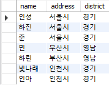
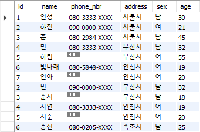
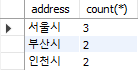

# 목차

- [목차](#목차)
- [4.2 조건 분기, 집합 연산, 윈도우 함수, 갱신](#42-조건-분기-집합-연산-윈도우-함수-갱신)
  - [4.2.1 SQL 조건분기](#421-sql-조건분기)
  - [4.2.2 SQL의 집합 연산](#422-sql의-집합-연산)
    - [UNION - 합집합](#union---합집합)
    - [INTERSECT - 교집합](#intersect---교집합)
    - [EXCEPT - 차집합](#except---차집합)
  - [4.2.3 윈도우 함수](#423-윈도우-함수)
  - [4.2.4 트랜잭션 갱신](#424-트랜잭션-갱신)
    - [삽입](#삽입)
    - [제거](#제거)
    - [갱신](#갱신)

# 4.2 조건 분기, 집합 연산, 윈도우 함수, 갱신

## 4.2.1 SQL 조건분기

SQL은 분기를 구현하기 위해 _CASE_ 식을 사용한다. 프로그래밍 언어 분기 코드와 차이점은 SQL의 조건 분기는 특정 상수값을
반환한다는 점이다.

```sql
select name, address,
       case when address = '서울시' then '경기'
            when address = '인천시' then '경기'
            when address = '부산시' then '영남'
            when address = '속초시' then '관동'
            when address = '서귀포시' then '호남'
            else null end district
from address;
```

**결괏값:**



_CASE_ 는 **식**이기 때문에, SELECT, WHERE, GROUP BY, HAVING, ORDER BY 구와 같은 어느 곳에서도 적용 가능하기 때문에
다양한 활용이 가능하다.

## 4.2.2 SQL의 집합 연산

### UNION - 합집합

테이블을 이용한 합집합 연산은 _UNION_ 을 사용한다.

```sql
select * from address 
union 
select * from address2;
```

**결괏값:**



- _UNION_ 은 합집합을 구할 때 중복된 레코드를 제거한다.
- 중복된 레코드를 제거하기 싫다면 _UNION ALL_ 을 사용한다.

### INTERSECT - 교집합

- MySQL 은 해당 연산을 지원하지 않는다.
- 교집합을 사용하려면 _INNER JOIN_ 을 사용해야 한다.

```sql
select * from address a1 inner join address2 a2 on a1.name = a2.name;
```

**결괏값:**


### EXCEPT - 차집합

- 차집합을 구하는 연산이지만 MySQL은 지원하지 않는다.
- MySQL은 _LEFT OUTER JOIN_ 을 사용해 구현 가능하다.
- 현재 교집합은 name 컬럼이 "인성, 민" 인 사람이므로 address 테이블에서 이 둘을 제외한 값이 나와야 한다.

```sql
select * from address a1 
    left outer join address2 a2 
        on a1.name = a2.name
where a2.name is null;
```

**결괏값:**


## 4.2.3 윈도우 함수

윈도우 함수는 **집약 기능이 없는 GROUP BY 구**이다.

- GROUP BY는 자르기와 집약 기능 둘 다 존재한다.
- 윈도우 함수는 자르기 기능만 있다.

사용 방법: 

1. 집약 함수 뒤에 _OVER_ 구를 작성한다.
2. 내부에 자를 키를 지정할 _PARTITION BY, ORDER BY_ 를 입력한다.

```sql
select address, count(*) 
    over(partition by address)
from address;
```

|         GROUP BY          |          윈도우 함수           |
|:-------------------------:|:-------------------------:|
|  |  |

- _GROUP BY_ 는 address 필드를 자르고 갯수를 집약한 결과를 출력한다.
- 윈도우 함수는 자르기만 하고 집약하지 않는다.

## 4.2.4 트랜잭션 갱신

SQL 갱신 기능은 세 가지로 분류된다.

- 삽입(insert)
- 제거(delete)
- 갱신(update)

### 삽입

```sql
insert into address (name, phone_nbr, address, sex, age) values ('인성', '080-3333-XXXX', '서울시', '남', 30);
```

### 제거

```sql
# address 테이블 전체 삭제
delete from address;

# 삭제 레코드 조건 필요할 때:
delete from address where name = ??
```

### 갱신

```sql
update address
set name = 'XX';

# 갱신 조건 필요할 때 WHERE 구 추가할 수 있음.
# 갱신할 때 한 레코드에 대해 여러 컬럼 업데이트 가능.
# 1번 방법
update address
set phone_nbr = '080-5848-XXXX',
    age = 20
where name = '빛나래';

# 2번 방법
update address
 set (phone_nbr, age) = ('080-5858-XXXX', 20)
 where name = '빛나래';
```

참고로 MySQL에선 2번 방법은 지원하지 않는다.