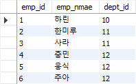

# 목차

- [목차](#목차)
- [1. DBMS 아키텍처](#1-dbms-아키텍처)
    - [쿼리 평가 엔진](#쿼리-평가-엔진)
    - [버퍼 매니저](#버퍼-매니저)
    - [디스크 용량 매니저](#디스크-용량-매니저)
    - [트랜잭션 매니저와 락 매니저](#트랜잭션-매니저와-락-매니저)
    - [리커버리 매니저](#리커버리-매니저)
- [2. DBMS와 버퍼](#2-dbms와-버퍼)
  - [2.1 DBMS와 기억장치의 관계](#21-dbms와-기억장치의-관계)
    - [하드디스크(HDD)](#하드디스크hdd)
    - [메모리](#메모리)
    - [버퍼를 활용한 속도 향상](#버퍼를-활용한-속도-향상)
  - [2.2 메모리 위에 있는 두 개의 버퍼](#22-메모리-위에-있는-두-개의-버퍼)
  - [2.3 메모리의 성질이 초래하는 트레이드 오프](#23-메모리의-성질이-초래하는-트레이드-오프)
  - [2.4 시스템 특성에 따른 트레이드 오프](#24-시스템-특성에-따른-트레이드-오프)
      - [검색과 갱신 중에서 중요한 것](#검색과-갱신-중에서-중요한-것)
  - [2.5 추가적인 메모리 영역 "워킹 메모리"](#25-추가적인-메모리-영역-워킹-메모리)

# 1. DBMS 아키텍처

### 쿼리 평가 엔진

쿼리 평가 엔진은 사용자로부터 입력받은 SQL 구문을 분석하고, 어떤 순서로 기억장치의 데이터에 접근할지를 결정한다.
- 이 때 결정되는 계획을 **실행 계획**이라고 한다.
- 실행 계획에 기반을 둬서 데이터에 접근하는 방법을 **접근 메서드**라고 한다.

### 버퍼 매니저

DBMS는 버퍼라는 특별한 용도로 사용하는 메모리 영역을 확보해둔다.
이 메모리 영역을 관리하는 것이 버퍼 매니저이다.

### 디스크 용량 매니저

데이터베이스는 영구적으로 정보를 저장해야 한다.
디스크 용량 매니저는 어디에 어떻게 데이터를 저장할지를 관리하며, 데이터의 읽고 쓰기를 관리한다.

### 트랜잭션 매니저와 락 매니저

상용 소프트웨어에서 데이터베이스를 사용하는 사람은 한 명이 아니라 수백, 수천명이다.
이 때 각각의 처리는 DBMS 내부에서 **트랜잭션**이라는 단위로 관리된다.
트랜잭션의 정합성을 유지하면서 실행시키고, 필요한 경우 데이터에 락을 걸어 다른 사람의 데이터 요청을 대기시킨다.

### 리커버리 매니저

시스템 장애를 대비해서 데이터는 정기적으로 백업하고, 복구 가능해야 한다.
리커버리 매니저는 이러한 역할을 수행한다.

# 2. DBMS와 버퍼

## 2.1 DBMS와 기억장치의 관계

DBMS는 데이터 저장을 목적으로 하는 미들웨어이다. 따라서 기억장치와 밀접한 관계를 맺고 있다.
대표적인 기억장치로 하드디스크와 메모리가 있다.

### 하드디스크(HDD)

DBMS가 데이터를 저장하는 곳은 대부분 하드디스크이다.
그렇다고 해서 DBMS가 데이터를 항상 하드디스크에 저장한다는 뜻은 아니다.

### 메모리

메모리는 하드디스크에 비해 속도는 빠르지만 가격이 훨씬 비싸다.
따라서 하드디스크에 비해 탑재할 수 있는 양은 크지 않다.
일반적인 데이터베이스 서버의 경우 탑재되는 메모리 양은 한두 자리 정도이다.

### 버퍼를 활용한 속도 향상

그럼에도 DBMS가 메모리에 데이터를 적재하는 이유는 성능 향상 때문이다.  
- 일반적인 SQL 구문의 실행 시간 대부분은 저장소 I/O에 사용한다.
- 성능 향상을 목적으로 데이터를 저장하는 메모리를 **버퍼**또는 **캐시**라고 한다.

버퍼에 **데이터를 어떻게, 어느 정도의 기간 동안 올릴지**를 관리하는 것이 DBMS의 버퍼 매니저이다.  

## 2.2 메모리 위에 있는 두 개의 버퍼

DBMS가 데이터를 유지하기 위해 사용하는 메모리는 크게 두 가지가 있다.

- 데이터 캐시
- 로그 버퍼

**데이터 캐시**는 디스크에 있는 일부 데이터를 메모리에 유지하기 위해 사용하는 메모리 영역이다.  
만약 사용자가 SELECT 구문을 실행했을 때 데이터 캐시에 모든 정보가 있다면 속도는 매우 빠르다.
하지만 데이터 캐시에 없는 정보는 저속 저장소까지 데이터를 가져와야 하기 때문에 속도는 느려진다.

**로그 버퍼**는 갱신 처리(INSERT, UPDATE, DELETE, MERGE)와 관계 있다.  
DBMS는 갱신과 관련된 SQL 구문을 입력받으면 곧바로 처리하지 않고 로그 버퍼에 변경 정보를 보내고, 그 이후 디스크에 변경을 수행한다.
그 이유는 저장소의 갱신 작업도 큰 시간을 소모하기 때문이다.  
즉 DBMS의 갱신 처리 방식은 SQL 구문의 실행 시점과 저장소에 갱신하는 시점에 차이가 있는 **비동기 처리** 방식이다.

## 2.3 메모리의 성질이 초래하는 트레이드 오프

메모리는 기본적으로 **휘발성**이다. 휘발성이란 특징에서 오는 단점은 다음과 같다.

- DBMS가 꺼지면 버퍼에 있는 메모리도 같이 사라진다.
- 로그 버퍼에 있던 데이터가 로그 파일에 반영되기 전 DBMS가 종료되면 로그 버퍼의 데이터는 그대로 사라진다.
- 중요한 상황일 때, 데이터 정합성을 보장하지 못하면 비즈니스에서 큰 장애로 이어진다.

따라서 이를 피하고자 DBMS는 **커밋시점**에 반드시 갱신 정보를 로그 파일에 쓴다.  
즉 **커밋**이란 갱신 처리를 확정하는 것이다. DBMS는 커밋된 데이터를 영속화한다.

하지만 커밋이 일어날 때 반드시 디스크에 **동기 접근**이 일어난다.   
이것은 비동기 접근보다 성능이 훨씬 떨어진다.  

> 데이터 정합성을 얻고 성능을 포기하느냐, 성능을 얻고 정합성을 포기하느냐에서 트레이드 오프가 일어난다.

## 2.4 시스템 특성에 따른 트레이드 오프

로그 버퍼와 데이터 캐시의 크기를 비교했을 때 일반적으로 데이터 캐시 쪽이 훨씬 크다.  
데이터베이스가 이러한 극단적인 비대칭 크기를 고수하는 이유는 아래와 같다.

- 일반적으로 **갱신**보다는 **검색**이 자주 이루어진다.
- 검색 대상 레코드가 수백만에서 수천만 건에 달하는 경우는 종종 있지만,
갱신 처리는 트랜잭션마다 한 건에서 수만 건 정도 밖에 되지 않는다.

따라서 갱신 처리에 값비싼 메모리를 할당하기 보다는 자주 **검색하는 데이터**를 캐시에 올려놓는 것이 좋다고 생각하기 때문이다.

#### 검색과 갱신 중에서 중요한 것

- 데이터 캐시가 크게 잡혀있다면 검색 처리와 관련된 처리가 중심이라는 것을 알 수 있다.
- 로그 버퍼가 크게 잡혀 있다면 갱신 처리와 관련해 큰 부하가 걸릴 것을 고려한 설계임을 알 수 있다.

## 2.5 추가적인 메모리 영역 "워킹 메모리"

정렬 또는 해시 관련 처리에 사용되는 메모리를 **워킹 메모리**라고 한다.  

- 정렬은 ORDER BY, 집합 연산, 윈도우 함수 등의 기능을 사용할 때 실행된다.
- 해시는 주로 테이블의 결합에서 해시 결합이 사용되는데 실행된다.

워킹 메모리 영역은 정렬 또는 해시가 필요할 때 사용되고, 종료되면 해제되는 임시 영역이다.  
일반적으로 데이터 캐시와 로그 버퍼와는 다른 영역으로 관리된다.

워킹 메모리가 중요한 이유:

- 워킹 메모리보다 다루려는 데이터의 양이 클 때 대부분의 DBMS는 임시 영역을 사용한다.
- 임시 영역은 저장소 위에 있으므로 접근 속도가 느리다.

또한 워킹 메모리는 여러 개의 SQL 구문들이 공유해서 사용한다.  
즉, 하나의 SQL 구문은 무리 없어도, 여러 개를 실행하는 순간 메모리가 부족해질 수 있다.  
워킹 메모리가 부족하면 속도가 느려지기 때문에 이런 상황을 재현하는 부하 검사를 실시하는 것은 필수다.

