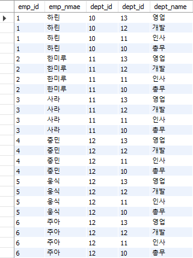

# 목차

# 1. 초기 데이터

| employee            | department              |
|:--------------------|:------------------------|
|  |  |

# 2. 결합의 종류

- 크로스 결합
- 내부 결합
- 외부 결합
- 자기 결합
- 등가 결합/비등가 결합
- 자연 결합

크로스 결합, 내부 결합, 외부 결합은 서로 배타적이기 때문에 `외부 결합이면서 내부 결합이다` 라는 조건은 없다.

등가/비등가 결합은 결합 조건으로 `=` 를 사용하는지, `>, >=` 를 사용하는지의 차이를 의미한다.
따라서 `외부 결합이면서 등가 결합` 이라는 조합은 가능하다.

자연 결합은 아래와 같이 사용한다.

```sql
select * from employee natural join department
```

자연 결합은 결합 조건을 따로 적지 않고, 암묵적으로 같은 이름의 필드가 등호로 결합된다.
내부 결합으로 치환하면 아래와 같다.

```sql
select * from employee e
inner join department d
on e.dept_id = d.dept_id;
```

간편해 보이지만 필드 이름이나 자료형이 다르면 사용할 수 없기 때문에 확장성이 떨어진다.
그리고 내부 조인을 사용한다고 해서 적어야 할 코드의 양이 기하급수적으로 늘어나는 것도 아니다.
가장 큰 단점은 다른 사람이 이 쿼리를 봤을 때 테이블 구조를 전부 파악하지 않는 이상에야 가독성이 떨어진다는 점이다.

## 2.1 크로스 결합

- **크로스 결합의 작동**

```sql
select * from employee cross join department;
```



크로스 결합은 두 개의 테이블에서 가능한 연산을 전부 구하는 것이다.
따라서 총 `6 X 4 = 24` 컬럼이 반환된다.

- **실무에서 사용되지 않는 이유**

이러한 결과가 필요한 경우가 없고, 비용이 매우 많이 드는 연산이기 때문에 사용하지 않는다.

- **실수로 나오는 크로스 결합**

그럼에도 불구하고 크로스 결합이 나오는 이유는 실수 때문이다.

```sql
select * from employee, department;
```

이렇게 쿼리문을 작성하면 결합 조건이 없으므로 DBMS 는 어쩔 수 없이 두 개의 테이블을 크로스 조인한다.
테이블을 두 개만 결합하는 경우 이런 실수는 없겠으나, 세 개 이상 결합 시 결합 조건을 빼 먹는 경우가 종종 있기
때문에 주의해야 한다.


## 2.2 내부 결합

- **내부 결합의 작동**

내부 결합의 키워드는 inner join 이지만 `inner` 은 생략할 수 있다.

```sql
select e.emp_id, e.emp_name, d.dept_id, d.dept_name
from employee e join department d
on e.dept_id = d.dept_id;
```


사원 테이블로는 부서 테이블의 이름까진 알 수 없다.
이 때, 사원 테이블과 부서 테이블에 공통적으로 존재하는 `dept_id` 필드로 두 테이블을 결합한다.

결과를 보면 내부 결합은 크로스 결합의 부분 집합이라는 것을 알 수 있다.
즉, 가장 간단하게 내부 결합을 구현하려면 먼저 크로스 결합을 연산하고 내부 결합을 도출하면 되지만
크로스 결합은 성능이 매우 나쁘기 때문에 DBMS 는 이 방식으로 구현하지 않는다.

## 2.3 외부 결합

외부 결합은 크로스 결합의 부분 집합이 될 수도, 아닐 수도 있다.

외부 결합은 세 가지 타입으로 나뉜다.

- 왼쪽 외부 결합
- 오른쪽 외부 결합
- 완전 외부 결합

왼쪽과 오른쪽 외부 결합은 기능적으로는 같다.
단지 마스터가 되는 테이블이 어느 쪽에 있느냐에 따라 왼쪽과 오른쪽으로 구분될 뿐이다.

따라서 아래의 코드는 완전히 동일한 코드다.

```sql
select e.emp_id, e.emp_name, d.dept_id, d.dept_name 
from department d left join employee e
on e.dept_id = d.dept_id;

select e.emp_id, e.emp_name, d.dept_id, d.dept_name
from employee e right join department d
on e.dept_id = d.dept_id;
```


현재 department 테이블이 마스터 테이블이기 때문에 마스터 테이블 쪽에만 존재하는
키가 있을 때는 해당 키를 제거하지 않고 결과를 보존한다.
따라서 키를 모두 가진 레이아웃의 리포트를 만들 때 자주 사용한다.

## 2.4 자기 결합

자기 결합은 문자 그대로 자기 자신과 결합하는 연산이다.
아래와 같이 0~9 부터 있는 숫자 테이블이 있을 때,


```sql
select d1.number + (d2.number * 10) as seq
from digit d1 cross join digit d2
order by seq;
```

자기 결합을 통해서 자기 테이블과의 크로스 결합을 해서 1~99 까지 출력할 수 있다.

자기 결합은 자신의 테이블로만 결합을 실행하지만 결국 쿼리문을 보면
d1, d2 를 각각 다른 테이블로 다뤄 결합을 실행한다.
따라서 논리 레벨에서 보면 서로 다른 두 개의 테이블을 결합한다고 생각해도 상관없다.


# 3. 결합 알고리즘과 성능

옵티마이저가 선택 가능한 결합 알고리즘은 세 가지다.

- Nested Loops
- Hash
- Sort Merge

옵티마이저가 어떤 알고리즘을 선택할지 여부는 데이터 크기 또는 결합 키의 분산이라는 요인에 의존한다.
가장 빈번하게 사용되는 알고리즘의 순서를 매기면 Nested Loops > Hash > Sort Merge 순이다.

## 3.1 Nested Loops

Nested Loops 는 말 그대로 중첩 반복을 이용하는 알고리즘이다.


1. _TABLE A_ 에서 레코드를 하나씩 반복해가며 스캔한다. 이 테이블을 구동 테이블 또는 외부 테이블이라고 부른다.
_TABLE B_ 는 내부 테이블이라고 부른다.
2. 구동 테이블의 레코드 하나마다 내부 테이블의 레코드를 하나씩 스캔해서 결합 조건에 맞으면 리턴한다.
3. 이러한 작동을 구동 테이블의 모든 레코드에 반복한다.

그리고 Nested Loops 는 다음 특징을 가진다.

- 모든 DBMS 에서 지원한다.
- 한 번에 처리하는 레코드량이 적기 때문에 Hash 또는 Sort Merge 보다 메모리가 적게 든다.
- _Table A_, _Table B_ 의 결합 대상 레코드를 R(A), R(B) 라고 했을 때 접근되는 레코드의 개수는
`R(A) X R(B)` 가 된다. Nested Loops 의 실행 시간은 이러한 레코드 수에 비례한다.

곱하기 연산이므로 처리하는 레코드의 수는 `R(A) X R(B)` 나 `R(B) X R(A)` 나 동일하다.
하지만 실제 구동 테이블의 선택은 Nested Loops 의 성능에 많은 영향을 끼친다.
구체적으로 구동 테이블이 작을수록(더 정확하게 검색 조건으로 압축된 구동 테이블의 레코드 수가 작을 때) Nested Loops 의 성능이 좋아진다.

여기서 중요한 것은 이중 반복의 외측과 내측의 반복 처리가 **비대칭**이라는 점이다.

- **구동 테이블의 중요성**

구동 테이블을 적게하면 성능이 좋아진다곤 했지만 이것은 전제 조건이 없으면 틀린 말이 된다.
실제로 `구동 테이블을 적게 한다` 라는 말에는 암묵적으로 다음 말이 포함된다.

> **내부 테이블의 결합 키 필드에 인덱스가 존재**

내부 테이블에 인덱스가 존재한다면 해당 인덱스를 통해 DBMS 는 테이블을 전부 순회하지 않아도 된다.
달리 말하면 내부 테이블의 반복을 어느 정도 건너뛸 수 있게 된다는 점이다.

이상적인 경우는 구동 테이블의 레코드 한 개에 내부 테이블의 레코드 한 개가 대응하고,
해당 레코드를 내부 테이블의 인덱스를 사용해 찾을 수 있는 경우이다.
이렇게 되면 반복을 생략할 수 있고 접근하는 레코드 수는 `R(A) X 2`가 된다.

물론 내부 테이블의 반복을 완전하게 생략할 수 있는 경우는 결합 키가 내부 테이블에 대해 유일한 경우뿐이다.
이 때 등치 결합이라면 내부 테이블의 접근 대상 레코드를 한 개로 한정할 수 있으므로, 이중 반복의 내측에 있는
반복을 완전하게 생략할 수 있다.

반면 결합 키가 내부 테이블에 대해 유일하지 않은 경우는 인덱스로 내부 테이블에 접근하는 경우라도
여러 개의 레코드가 히트될 가능성이 있다. 이 경우 히트된 레코드에 대해서 반복을 적용해야 한다.

> **정리.**  
> 구동 테이블이 작은 Nested Loops + 내부 테이블의 결합 키에 인덱스

- **Nested Loops 의 단점**

내부 테이블의 결합 키가 유일하지 않으면 인덱스를 사용해도 히트되는 레코드 수가 많아지기 때문에 결국 반복을 적용해야 한다.


점포와 점포가 받은 주문 테이블이 1:N 이라고 가정하자.
이 경우 점포가 받은 주문 테이블보다 점포 테이블이 작은 것이 당연하다.
따라서 점포 테이블을 구동 테이블로 하고 주문 테이블의 점포 ID를 결합 키로 사용하는 것을 생각할 수 있다.

하지만 한 개의 점포 ID에 수백만 건, 수천만 건의 레코드가 히트된다면 결국 내부 테이블에 대한 반복 횟수는 많아지고
성능이 떨어지게 된다.

점포가 속한 지역이나 규모에 따라 당연히 주문 수량에는 차이가 난다.
즉, 규모가 적은 경우에는 빠르게 결합이 되지만 규모가 크다면 그에 비례해서 성능도 느려지게 된다.
한마디로 성능이 균등하게 나오지 않는다는 문제점이 발생한다.

이 문제를 해결하는 방법은 두 가지다.

1. 구동 테이블로 큰 테이블을 선택한다.
2. 해시 방식의 결합을 사용한다.

1번 방법을 사용하면 내부 테이블에 대한 점포 테이블의 접근이 점포 ID(기본 키)로 실행되기 때문에,
항상 하나의 레코드로 접근하는 것이 보장된다. 따라서 점포에 따른 성능 비균등 문제를 해결해서 극단적으로 성능이 저하되는 것을 막을 수 있다.
이것은 주문 테이블이라는 거대 테이블 접근 비용이 현실적인 범위라면 굉장히 효과적인 방식이다.

## 3.2 Hash

> **Hash의 작동**

1. 일단 작은 테이블을 스캔하고, 결합 키에 해시 함수를 적용해서 해시값으로 변환한다.
2. 이어서 다른 테이블을 스캔하고 결합 키가 해시 값에 존재하는지 확인하는 방식으로 결합을 수행한다.

작은 테이블을 먼저 스캔하는 이유는 해시 테이블은 DBMS의 워킹 메모리에 저장되므로 조금이라도 작은 것이 효율적이기 때문이다.

> **Hash의 특징**
  - 결합 테이블로부터 해시 테이블을 생성하기 때문에 Nested Loops 보다 많은 메모리를 필요로 한다.
  - 메모리가 부족하면 저장소를 사용하므로 지연이 발생한다.
  - 출력되는 해시값은 입력값의 순서를 알지 못하므로, 등치 결합에만 사용할 수 있다.
  
    
> **Hash가 유용한 경우**
  - 적절한 구동 테이블을 선택하지 못하는 경우
  - 내부 테이블에 인덱스가 없는 경우 또는 인덱스를 추가하지 못하는 경우
  - 구동 테이블은 있지만 내부 테이블에서 히트되는 레코드 수가 너무 많은 경우

하지만 해시 결합을 사용하는 경우에도 트레이드 오프에 대해 주의할 점이 있다.
해시 테이블을 만들어야 하므로 소비되는 메모리 양이 많다.
따라서 동시 실행성이 높은 _OLTP_ 처리를 할 때 해시 결합을 사용하게 되면
DBMS가 사용할 수 있는 메모리가 부족해져 저장소가 사용될 수 있다.

두번째로 해시 결합은 반드시 양쪽 테이블의 레코드를 전부 읽어야 하므로, 테이블 풀 스캔이 사용되는 경우가 많다.
따라서 테이블의 규모가 굉장히 크다면 테이블 풀 스캔에 걸리는 시간까지 고려해야 한다.

## 3.3 Sort Merge

결합 대상 테이블들을 각각 결합 키로 정렬 후, 일치하는 결합 키를 찾으면 결합한다.

> **Sort Merge의 특징**

- 대상 테이블을 모두 정렬해야 하므로 Nested Loops 보다 사용되는 메모리가 많다.
- 해시 결합과는 다르게 부등호를 통한 결합에도 사용할 수 있다.
- 원리적으로 테이블이 결합 키로 정렬되어 있다면 정렬 과정을 생략할 수 있다. 하지만 이것은 SQL에서 테이블에 있는
레코드의 물리적인 위치를 알고 있을 때만 가능하다. 즉, 구현 의존적이다.
- 테이블을 정렬하므로 한쪽 테이블을 모두 스캔한 시점에서 결합을 완료할 수 있다.

>**Sort Merge가 유효한 경우**

결합 자체에 걸리는 시간은 결합 대상의 레코드 수가 많아도 나쁘지 않지만,
테이블 정렬에 많은 시간과 리소스를 요구할 가능성이 있다. 따라서 테이블의 정렬을 생략할 수 있는 경우에는 고려해볼만 하지만
그 이외의 경우에는 Nested Loops 와 Hash 결합을 사용하는 것이 더 낫다.

# 4. 의도하지 않은 크로스 결합

크로스 결합은 실무에서 거의 사용하는 경우는 없지만 _삼각 결합_ 이라는 패턴으로 예상치 못하게 찾아오는 경우가 있다.


쿼리로 표현하면 아래와 같다.

```sql
select A.col_a, B.col_b, C.col_c
from Table_A A
    inner join Table_B B
        on A.col_a = B.col_b
    inner join Table_C C
        on A.col_a = C.col_c
```

이러한 경우 4가지 형태의 실행 계획이 나올 수 있다.

- _Table_A_ 를 구동 테이블로 _Table_B_ 와 결합하고 그 결과를 _Table_C_ 와 결합
- _Table_A_ 를 구동 테이블로 _Table_C_ 와 결합하고 그 결과를 _Table_B_ 와 결합
- _Table_B_ 를 구동 테이블로 _Table_A_ 와 결합하고 그 결과를 _Table_C_ 와 결합
- _Table_C_ 를 구동 테이블로 _Table_A_ 와 결합하고 그 결과를 _Table_B_ 와 결합

> **크로스 결합이 선택되는 이유**

_Table_B_ 와 _Table_C_ 처럼 결합 조건이 없는 경우 결합 조건이 없는 테이블들을 크로스 결합으로 결합해버린다.
이는 _Table_B_ 와 _Table_C_ 를 먼저 결합하고 그 결과를 _Table_A_ 와 결합하는 순서로 결합을 수행한다.

크로스 결합은 비효율적임에도 이렇게 수행될 수 있는 이유는 옵티마이저가 B와 C 테이블의 크기를 충분히 작다고 판단했을 수도
있기 때문이다. 두 테이블의 크기가 충분히 작다면 테이블 A에 두번 결합하는 것보다는 먼저 작은 테이블들을 결합하고 결과를 다시
결합함으로써 1회로 횟수를 줄이는 것이 합리적이다.

이런 패턴은 거래 명세 등의 큰 트랜잭션 테이블과 고객 또는 달력 등의 작은 마스터 테이블을 결합할 때 자주 나타난다.
테이블이 작은 경우 크로스 결합은 큰 문제를 일으키지 않지만, 비교적 큰 테이블끼리 결합할 때 선택되는 경우도 있다.
**이는 단순히 테이블의 크기 뿐만 아니라 히트되는 레코드 수가 변할 때도 발생한다.**

1. 첫번째로 레코드 수를 꽤 압축할 수 있는 입력이 들어왔을 때 옵티마이저는 '크로스 결합으로 충분하겠다'라고 판단하고 이를 저장한다.
2. 이후에 레코드 수를 압축할 수 없는 입력이 들어왔는데도 옵티마이저는 저장된 정보를 바탕으로 이전 실행 계획을 선택한다.

> **의도하지 않은 크로스 결합을 회피하는 방법**

이 방법은 _Table_B_ 와 _Table_C_ 사이에 결합 조건을 설정할 수 있고, 결합 조건을 설정해도 결과에 아무런
영향을 미치지 않을 때 사용 가능하다.

```sql
select A.col_a, B.col_b, C.col_c
from Table_A A
    inner join Table_B B
        on A.col_a = B.col_b
    inner join Table_C C
        on A.col_a = C.col_c
        and C.col_c = B.col_b
```

B와 C 사이의 불필요한 결합 조건을 임의로 추가해줌으로써 크로스 결합을 회피할 수 있다.

# 5. 결합이 느리다면?

## 5.1 상황에 따른 최적의 알고리즘

1. 소규모-소규모 : 어떤 알고리즘을 선택해도 성능 차이가 크지 않다.
2. 소규모-대규모 : 소규모 테이블을 구동 테이블로 하는 Nested Loops 를 사용한다. 당연히 대규모 테이블에 인덱스 설정은 필수이다.
하지만 인덱스를 설정했음에도 히트되는 테이블 수가 너무 많으면 구동 테이블과 내부 테이블을 바꾸거나, Hash 결합을 고려할 수 있다.
3. 대규모-대규모 : 일단은 Hash 결합을 사용한다. 결합 키로 처음부터 정렬되어 있는 상태라면 Sort Merge 를 사용한다.

# 6. EXISTS 와 NOT EXISTS

EXISTS 와 NOT EXISTS 를 사용하는 경우에도 실행 계획에는 결합이 나타난다.
하지만 이 때 일반적으로 사용되는 Nested Loops 와 Hash 가 아닌 조금 변형된 형태의 알고리즘이 사용된다.
실행되는 알고리즘 자체는 DBMS 에 따라 다를 수 있으나 뒤에 실행 계획을 살펴보면 뒤에 'Semi' 라는 키워드가 붙는다.

`Semi-Join` 의 특징은 다음과 같다.

- EXISTS 와 IN 을 사용할 때 쓰이는 특수한 알고리즘이다.
- 결과에 구동 테이블의 데이터만 포함되며, 1개의 레코드는 반드시 1개의 결과만 생성한다.
- 내부 테이블에서 조건에 맞는 레코드를 한 개라도 발견한 시점에서 남은 레코드의 검색을 생략하므로, 일반적인 결합보다 성능이 좋다.

반대로 NOT EXISTS 나 NOT IN 에는 `Anti-Join` 이 사용된다. 이 동작은 `Semi-Join` 과 거의 비슷하다.

- 레코드를 한개라도 발견한 시점에서 남은 레코드의 검색을 생략한다.
- 다른 점은 구동 테이블의 레코드 데이터가 결과에서 제외된다는 점이다.


