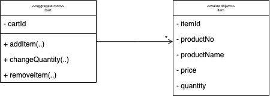

# 이벤트 소싱과 마이크로 아키텍처

책을 읽으면서 설계에 해당하는 부분을 직접 구현해보는 것이 목적

---

카트 도메인 모델

- 상품을 카트에 아이템으로 추가한다.
- 카트에 있는 아이템의 수량을 변경한다.
- 카트에 있는 아이템을 삭제한다.

- applyEvent(..) 메서드의 역할
  - "on" 이라고 이름 붙은 클래스를 찾아가 리플렉션으로 이벤트를 발행한다.
  - 만약 리플레이라면 불필요한 도메인 이벤트를 보관하지 않는다.
  - 신규 이벤트 일때만 도메인 이벤트를 보관한다.
