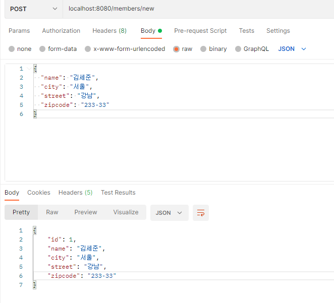
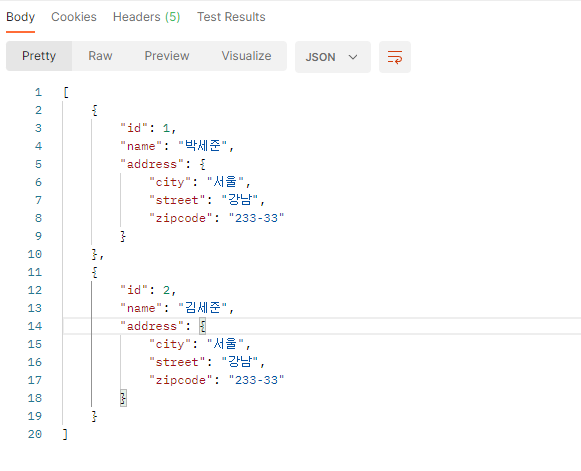
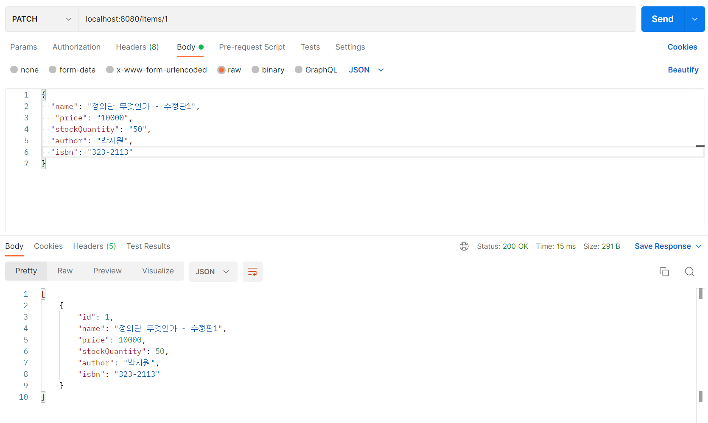
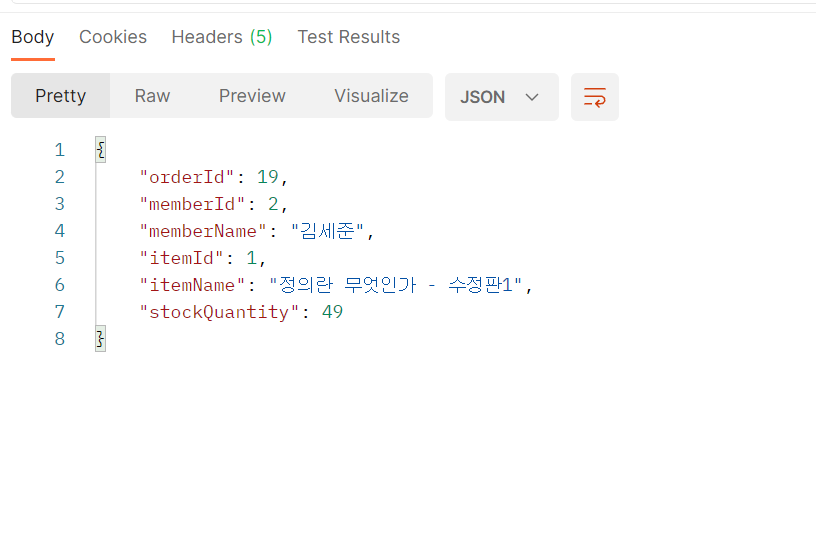

# JPA SHOP

- JPA 연습 개발 리포지토리

## 사용 기술

- Java 17
- Spring Boot
- JPA
- JaCoCo
- GitHub Actions
- H2 DB

## 동작 요약

모든 요청과 응답은 _JSON_ 으로 주고 받음.

<details>
    <summary><b>회원 가입</b><br/></summary>

POST: `localhost:8080/members/new`


</details>

<details>
  <summary><b>회원 리스트 조회</b><br/></summary>

GET: `localhost:8080/members/`


</details>

<details>
  <summary><b>아이템 정보 수정</b><br/></summary>

PATCH: `localhost:8080/items/{id}`



</details>

<details>
  <summary><b>상품 주문</b><br/></summary>

POST: `localhost:8080/order`


</details>

## 기술적 이슈 해결 과정

<details>
  <summary><b>컨트롤러 예외 테스트 처리하기</b><br/></summary>

```java
public class MemberRequest {

    @NotEmpty(message = "회원 이름은 필수 입니다")
    private String name;
```

- MemberRequest DTO 의 name 값이 없으면 예외가 터져야한다.
- 하지만 컨트롤러에서 _BindingResult.hasError()_ 형식으로 예외를 던지면 아래의 코드가 _NestedServletException_
을 던지면서 테스트가 정상적으로 실행되지 않는다.

```java
@Test
@DisplayName("POST: members/new 회원이름 입력값 없을 때")
void exceptionTest1() throws Exception {
    //given
    MemberRequest request = createHaveNotNameFieldMemberInfo();

    //when
    mockMvc.perform(post("/members/new")
            .contentType(MediaType.APPLICATION_JSON)
            .accept(MediaType.APPLICATION_JSON)
            .content(mapper.writeValueAsString(request)))

```

이를 해결하기 위해 컨트롤러에서 예외가 터지면 이것을 잡아서 일단 정상 처리 시켜주고
사용자가 작성한 코드에 따라 다음 행동을 결정하는 _@ExceptionHandler_ 를 사용.

```java
@RestControllerAdvice
public class ExceptionAdvice {

    @ExceptionHandler
    public ResponseEntity<ErrorResult> bindFieldErrorExceptionHandler(BindException e) {
        ErrorResult errorResult = new ErrorResult("FieldErrorException",
            String.valueOf(Objects.requireNonNull(e.getFieldError()).getDefaultMessage()));
        return new ResponseEntity<>(errorResult, HttpStatus.BAD_REQUEST);
    }
}
```

이제 DTO 객체에서 _name_ 필드를 입력하지 않으면 _ExceptionHandler_ 가 작동해서 _ErrorResult_ 객체에
예외가 발생한 원인과 디폴트 메시지를 넣게 된다.

결과적으로 _controller_ 코드에서는 _BindingResult_ 의 if 처리 구문이 없어져서 코드는 깔끔해지고,
테스트 코드도 정상적으로 작동한다.

```java
@PostMapping("/members/new")
public ResponseEntity<MemberResponse> create(
    @Validated @RequestBody MemberRequest memberRequest) {

    Long joinId = memberService.join(memberRequest.toEntity());
    Member member = memberService.findOne(joinId);
    log.info("member info={}", member.toString());
    return new ResponseEntity<>(MemberResponse.from(member), HttpStatus.CREATED);
}
```

```java
@Test
@DisplayName("POST: members/new 회원이름 입력값 없을 때")
void exceptionTest1() throws Exception {
    //given
    MemberRequest request = createHaveNotNameFieldMemberInfo();

    //when
    mockMvc.perform(post("/members/new")
            .contentType(MediaType.APPLICATION_JSON)
            .accept(MediaType.APPLICATION_JSON)
            .content(mapper.writeValueAsString(request)))

        //then
        .andExpect(status().isBadRequest())
        .andExpect(jsonPath("$.code").value("FieldErrorException"))
        .andExpect(jsonPath("$.message").value("회원 이름은 필수 입니다"));
}
```
</details>

<details>
  <summary><b>빌드 과정에서의 @Builder.default 경고</b><br/></summary>

- 깃허브 액션의 CI 빌드 도중 아래의 waring 출력

```text
/home/runner/work/jpashop/jpashop/src/main/java/jpabook/jpashop/domain/Member.java:38: warning: @Builder will ignore the initializing expression entirely. If you want the initializing expression to serve as default, add @Builder.Default. If it is not supposed to be settable during building, make the field final.
> Task :compileJava
	private List<Order> orders = new ArrayList<>();
	                    ^
1 warning
```

> **이유:**

- 회원 가입할 때 _Member_ 엔티티의 _orders_ 정보는 입력하지 않는다.
- 롬복의 _@Builder_ 는 필드를 사용하는 생성자와 각 필드의 setter 메서드로 구성된 inner 클래스를
하나 만들어서 내부에서 원본 클래스의 인스턴스를 반환한다.
- _Order_ 는 사용자 정의 객체이므로 이런 객체 타입을 초기화하는 코드는 _@Builder_ 에 당연히 존재하지 않는다.
`new ArrayList<>()` 로 초기화했다고 하더라도 _@Builder_ 가 적용되는 순간 null 로 초기화 된다.
- 따라서 정상적인 empty List 로 초기화하려면 _@Builder.Default_ 어노테이션이 필요.

```java
@Builder.Default
@OneToMany(mappedBy = "member")
private List<Order> orders = new ArrayList<>();
```

</details>

<details>
  <summary><b>회원 정보 조회 시 유연한 확장 고려</b><br/></summary>

```java
@GetMapping("api/v1/members")
public List<Member> membersV1() {
    return memberService.findMembers();
}
```

멤버 객체들을 찾아 그대로 멤버 엔티티를 리턴하면 코드를 작성할 땐 편하지만 큰 문제가 발생한다.

1. 조회에 필요 없는 필드값들도 같이 들어간다.
2. JSON API 명세에 값이 추가되었을 때 유연한 확장이 불가능하다.

```json
[
  "count": 2 // ????
    {
        "id": 1,
        "name": "new-hello",
        "address": null,
        "orders": []
    },
    {
        "id": 2,
        "name": "new-hello2",
        "address": null,
        "orders": []
    }
]
```

멤버 엔티티 리스트들을 그대로 반환해서 보여주다보니 모든 필드가 그대로 보여진다.
또한 API 명세가 멤버 필드만 출력하는 것이 아니라 총 몇개인지 `count`를 출력해달라고 한다면
JSON 스펙이 깨져버리는 문제가 발생한다.

따라서 확장을 고려하기 위해 `Result<T>`가 필요하고 필요한 정보만을 보여주기 위해 `MemberDto` 가 필요하다.

```java
@GetMapping("api/v2/members")
public Result membersV2() {
    List<Member> members = memberService.findMembers();
    List<MemberDto> collect = members.stream()
        .map(m -> new MemberDto(m.getName()))
        .collect(Collectors.toList());

    return new Result(collect.size(), collect);
}

@Data
@AllArgsConstructor
static class Result<T> {

    private int count;
    private T data;
}

@Data
@AllArgsConstructor
static class MemberDto {

    private String name;
}
```

멤버를 조회 후 stream api로 Member 엔티티들을 MemberDto 로 바꾸는 코드이다.
코드 변경 후 ResponseEntity 는 아래와 같이 출력된다.

추후에 API 명세가 바뀌더라도 Result 클래스에 확장이 필요한 필드만 추가하면 되고
Member 엔티티에서 필요한 정보만을 담는 `MemberDto`가 있기 때문에 확장 및 정보 은닉에 유리해졌다.

```json
{
    "count": 2,
    "data": [
        {
            "name": "new-hello"
        },
        {
            "name": "new-hello2"
        }
    ]
}
```


</details>

<details>
  <summary><b>json 응답 객체로 변경 시 무한 반복 문제</b><br/></summary>

```java
@GetMapping("/api/v1/simple-orders")
public List<Order> ordersV1() {
    return orderRepository.findAllByString(new OrderSearch());
}
```

연관관계가 맺어진 _Order_ 객체 내부에는 다음과 같이 Member 객체가 있다.

```java
@ManyToOne(fetch = FetchType.LAZY)
@JoinColumn(name = "member_id")
private Member member;
```
순환 참조가 생기는 이유는 아래와 같다.
1. jackson 라이브러리가 Order 객체를 JSON 으로 변환 시도한다.
2. 그런데 양방향 매핑관계이므로 Member 객체에도 Order 리스트가 있다.

```java
@Builder.Default
@OneToMany(mappedBy = "member")
private List<Order> orders = new ArrayList<>();
```

3. jackson orders 객체도 json 으로 변환하려고 한다.
4. 그런데 orders 는 결국 Order의 리스트이다. Order 객체를 가보니 또 Member 가 있다.
5. 이것이 무한 반복되면서 결국 에러가 발생한다.

이것을 해결하려면 참조하는 객체에 _@JsonIgnore_ 어노테이션을 붙여줘야한다.

```java
@JsonIgnore
@Builder.Default
@OneToMany(mappedBy = "member")
private List<Order> orders = new ArrayList<>();
```

하지만 이렇게 하면 또 다른 문제가 발생한다.

```json
{
  "timestamp": "2022-08-08T21:54:28.186+00:00",
  "status": 500,
  "error": "Internal Server Error",
  "trace": "org.springframework.http.converter.HttpMessageConversionException: Type definition error: [simple type, class org.hibernate.proxy.pojo.bytebuddy.ByteBuddyInterceptor]; nested exception is com.fasterxml.jackson.databind.exc.InvalidDefinitionException: No serializer found for class org.hibernate.proxy.pojo.bytebuddy.ByteBuddyInterceptor and no properties discovered to create BeanSerializer (to avoid exception, disable SerializationFeature.FAIL_ON_EMPTY_BEANS) (through reference chain: java.util.ArrayList[0]->jpabook.jpashop.domain.Order[\"member\"]->jpabook.jpashop.domain.Member$HibernateProxy$hXF0jkbi[\"hibernateLazyInitializer\"])\r\n\tat org.springframework.http.converter.json.AbstractJackson2HttpMessageConverter.writeInternal(AbstractJackson2HttpMessageConverter.java:462)\r\n\tat org.springframework.http.converter.AbstractGenericHttpMessageConverter.write(AbstractGenericHttpMessageConverter.java:104)\r\n\tat org.springframework.web.servlet.mvc.method.annotation.AbstractMessageConverterMethodProcessor.writeWithMessageConverters(AbstractMessageConverterMethodProcessor.java:290)\r\n\tat org.springframework.web.servlet.mvc.method.annotation.RequestResponseBodyMethodProcessor.handleReturnValue(RequestResponseBodyMethodProcessor.java:183)\r\n\tat org.springframework.web.method.support.HandlerMethodReturnValueHandlerComposite.handleReturnValue(HandlerMethodReturnValueHandlerComposite.java:78)\r\n\tat org.springframework.web.servlet.mvc.method.annotation.ServletInvocableHandlerMethod.invokeAndHandle(ServletInvocableHandlerMethod.java:135)\r\n\tat org.springframework.web.servlet.mvc.method.annotation.RequestMappingHandlerAdapter.invokeHandlerMethod(RequestMappingHandlerAdapter.java:895)\r\n\tat org.springframework.web.servlet.mvc.method.annotation.RequestMappingHandlerAdapter.handleInternal(RequestMappingHandlerAdapter.java:808)\r\n\tat org.springframework.web.servlet.mvc.method.AbstractHandlerMethodAdapter.handle(AbstractHandlerMethodAdapter.java:87)\r\n\tat org.springframework.web.servlet.DispatcherServlet.doDispatch(DispatcherServlet.java:1067)\r\n\tat org.springframework.web.servlet.DispatcherServlet.doService(DispatcherServlet.java:963)\r\n\tat org.springframework.web.servlet.FrameworkServlet.processRequest(FrameworkServlet.java:1006)\r\n\tat org.springframework.web.servlet.FrameworkServlet.doGet(FrameworkServlet.java:898)\r\n\tat javax.servlet.http.HttpServlet.service(HttpServlet.java:655)\r\n\tat org.springframework.web.servlet.FrameworkServlet.service(FrameworkServlet.java:883)\r\n\tat javax.servlet.http.HttpServlet.service(HttpServlet.java:764)\r\n\tat org.apache.catalina.core.ApplicationFilterChain.internalDoFilter(ApplicationFilterChain.java:227)\r\n\tat org.apache.catalina.core.ApplicationFilterChain.doFilter(ApplicationFilterChain.java:162)\r\n\tat org.apache.tomcat.websocket.server.WsFilter.doFilter(WsFilter.java:53)\r\n\tat org.apache.catalina.core.ApplicationFilterChain.internalDoFilter(ApplicationFilterChain.java:189)\r\n\tat org.apache.catalina.core.ApplicationFilterChain.doFilter(ApplicationFilterChain.java:162)\r\n\tat org.springframework.web.filter.RequestContextFilter.doFilterInternal(RequestContextFilter.java:100)\r\n\tat org.springframework.web.filter.OncePerRequestFilter.doFilter(OncePerRequestFilter.java:117)\r\n\tat org.apache.catalina.core.ApplicationFilterChain.internalDoFilter(ApplicationFilterChain.java:189)\r\n\tat org.apache.catalina.core.ApplicationFilterChain.doFilter(ApplicationFilterChain.java:162)\r\n\tat org.springframework.web.filter.FormContentFilter.doFilterInternal(FormContentFilter.java:93)\r\n\tat org.springframework.web.filter.OncePerRequestFilter.doFilter(OncePerRequestFilter.java:117)\r\n\tat org.apache.catalina.core.ApplicationFilterChain.internalDoFilter(ApplicationFilterChain.java:189)\r\n\tat org.apache.catalina.core.ApplicationFilterChain.doFilter(ApplicationFilterChain.java:162)\r\n\tat org.springframework.web.filter.CharacterEncodingFilter.doFilterInternal(CharacterEncodingFilter.java:201)\r\n\tat org.springframework.web.filter.OncePerRequestFilter.doFilter(OncePerRequestFilter.java:117)\r\n\tat org.apache.catalina.core.ApplicationFilterChain.internalDoFilter(ApplicationFilterChain.java:189)\r\n\tat org.apache.catalina.core.ApplicationFilterChain.doFilter(ApplicationFilterChain.java:162)\r\n\tat org.apache.catalina.core.StandardWrapperValve.invoke(StandardWrapperValve.java:197)\r\n\tat org.apache.catalina.core.StandardContextValve.invoke(StandardContextValve.java:97)\r\n\tat org.apache.catalina.authenticator.AuthenticatorBase.invoke(AuthenticatorBase.java:541)\r\n\tat org.apache.catalina.core.StandardHostValve.invoke(StandardHostValve.java:135)\r\n\tat org.apache.catalina.valves.ErrorReportValve.invoke(ErrorReportValve.java:92)\r\n\tat org.apache.catalina.core.StandardEngineValve.invoke(StandardEngineValve.java:78)\r\n\tat org.apache.catalina.connector.CoyoteAdapter.service(CoyoteAdapter.java:360)\r\n\tat org.apache.coyote.http11.Http11Processor.service(Http11Processor.java:399)\r\n\tat org.apache.coyote.AbstractProcessorLight.process(AbstractProcessorLight.java:65)\r\n\tat org.apache.coyote.AbstractProtocol$ConnectionHandler.process(AbstractProtocol.java:890)\r\n\tat org.apache.tomcat.util.net.NioEndpoint$SocketProcessor.doRun(NioEndpoint.java:1787)\r\n\tat org.apache.tomcat.util.net.SocketProcessorBase.run(SocketProcessorBase.java:49)\r\n\tat org.apache.tomcat.util.threads.ThreadPoolExecutor.runWorker(ThreadPoolExecutor.java:1191)\r\n\tat org.apache.tomcat.util.threads.ThreadPoolExecutor$Worker.run(ThreadPoolExecutor.java:659)\r\n\tat org.apache.tomcat.util.threads.TaskThread$WrappingRunnable.run(TaskThread.java:61)\r\n\tat java.base/java.lang.Thread.run(Thread.java:833)\r\nCaused by: com.fasterxml.jackson.databind.exc.InvalidDefinitionException: No serializer found for class org.hibernate.proxy.pojo.bytebuddy.ByteBuddyInterceptor and no properties discovered to create BeanSerializer (to avoid exception, disable SerializationFeature.FAIL_ON_EMPTY_BEANS) (through reference chain: java.util.ArrayList[0]->jpabook.jpashop.domain.Order[\"member\"]->jpabook.jpashop.domain.Member$HibernateProxy$hXF0jkbi[\"hibernateLazyInitializer\"])\r\n\tat com.fasterxml.jackson.databind.exc.InvalidDefinitionException.from(InvalidDefinitionException.java:77)\r\n\tat com.fasterxml.jackson.databind.SerializerProvider.reportBadDefinition(SerializerProvider.java:1300)\r\n\tat com.fasterxml.jackson.databind.DatabindContext.reportBadDefinition(DatabindContext.java:400)\r\n\tat com.fasterxml.jackson.databind.ser.impl.UnknownSerializer.failForEmpty(UnknownSerializer.java:46)\r\n\tat com.fasterxml.jackson.databind.ser.impl.UnknownSerializer.serialize(UnknownSerializer.java:29)\r\n\tat com.fasterxml.jackson.databind.ser.BeanPropertyWriter.serializeAsField(BeanPropertyWriter.java:728)\r\n\tat com.fasterxml.jackson.databind.ser.std.BeanSerializerBase.serializeFields(BeanSerializerBase.java:774)\r\n\tat com.fasterxml.jackson.databind.ser.BeanSerializer.serialize(BeanSerializer.java:178)\r\n\tat com.fasterxml.jackson.databind.ser.BeanPropertyWriter.serializeAsField(BeanPropertyWriter.java:728)\r\n\tat com.fasterxml.jackson.databind.ser.std.BeanSerializerBase.serializeFields(BeanSerializerBase.java:774)\r\n\tat com.fasterxml.jackson.databind.ser.BeanSerializer.serialize(BeanSerializer.java:178)\r\n\tat com.fasterxml.jackson.databind.ser.std.CollectionSerializer.serializeContents(CollectionSerializer.java:145)\r\n\tat com.fasterxml.jackson.databind.ser.std.CollectionSerializer.serialize(CollectionSerializer.java:107)\r\n\tat com.fasterxml.jackson.databind.ser.std.CollectionSerializer.serialize(CollectionSerializer.java:25)\r\n\tat com.fasterxml.jackson.databind.ser.DefaultSerializerProvider._serialize(DefaultSerializerProvider.java:480)\r\n\tat com.fasterxml.jackson.databind.ser.DefaultSerializerProvider.serializeValue(DefaultSerializerProvider.java:400)\r\n\tat com.fasterxml.jackson.databind.ObjectWriter$Prefetch.serialize(ObjectWriter.java:1514)\r\n\tat com.fasterxml.jackson.databind.ObjectWriter.writeValue(ObjectWriter.java:1007)\r\n\tat org.springframework.http.converter.json.AbstractJackson2HttpMessageConverter.writeInternal(AbstractJackson2HttpMessageConverter.java:456)\r\n\t... 48 more\r\n",
  "message": "Type definition error: [simple type, class org.hibernate.proxy.pojo.bytebuddy.ByteBuddyInterceptor]; nested exception is com.fasterxml.jackson.databind.exc.InvalidDefinitionException: No serializer found for class org.hibernate.proxy.pojo.bytebuddy.ByteBuddyInterceptor and no properties discovered to create BeanSerializer (to avoid exception, disable SerializationFeature.FAIL_ON_EMPTY_BEANS) (through reference chain: java.util.ArrayList[0]->jpabook.jpashop.domain.Order[\"member\"]->jpabook.jpashop.domain.Member$HibernateProxy$hXF0jkbi[\"hibernateLazyInitializer\"])",
  "path": "/api/v1/simple-orders"
}
```

proxy.pojo.bytebuddy 예외를 터뜨리는데, 답은 _FetchType_ 에 있다.

1. Order 엔티티에 접근 후 Member 엔티티를 가져오려고 하는데 `@ManyToOne(fetch = FetchType.LAZY)`가 붙어있다.
2. 지연 로딩일 때 접근하는 것은 원본 엔티티가 아니라 프록시 타입이다.
3. 프록시는 초기화될 때 내부적으로 bytebuddy 라이브러리를 사용해서 프록시 타입으로 초기화한다.
4. 즉 jackson 입장에서는 Member 타입을 찾아야 하는데 Member 의 프록시 타입이 반환되서 해당 예외가 발생한 것이다.

프록시 타입에 관계없이 JSON 응답을 출력하려면 아래의 종속성을 추가해줘야 한다.

```gradle
implementation 'com.fasterxml.jackson.datatype:jackson-datatype-hibernate5'
```

이후 부트 진입점에 _Hibernate5Module_ 을 등록해준다.

```java
@Bean
Hibernate5Module hibernate5Module() {
    return new Hibernate5Module();
}
```

```json
[
  {
    "id": 4,
    "member": null,
    "orderItems": null,
    "delivery": null,
    "orderDate": "2022-08-09T07:10:30.029686",
    "status": "ORDER",
    "totalPrice": 50000
  },
  {
    "id": 11,
    "member": null,
    "orderItems": null,
    "delivery": null,
    "orderDate": "2022-08-09T07:10:30.062604",
    "status": "ORDER",
    "totalPrice": 220000
  }
]
```

"기본 설정은 지연 로딩을 모두 무시하고 null 로 출력하라" 이므로 지연 로딩된 엔티티들은
아래처럼 null 로 표시된다. null 로 표현하기 싫다면 아래 처럼옵션을 설정해주면 된다.

```java
@Bean
Hibernate5Module hibernate5Module() {
    Hibernate5Module hibernate5Module = new Hibernate5Module();
    hibernate5Module.configure(Feature.FORCE_LAZY_LOADING, true);
    return hibernate5Module;
}
```

하지만 이렇게 엔티티를 직접 노출시키는 방법은 문제가 많다.

- 간단한 조회인데도 다른 엔티티를 모조리 끌고 오기 때문에 성능 문제가 발생한다.
- API 명세가 바뀌어서 엔티티를 직접 변경하는 경우 그 엔티티를 사용하던 다른 서비스에도 지대한 영향을 끼친다.

</details>