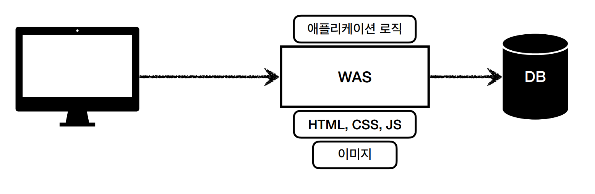

# 1.1 웹 서버, 웹 애플리케이션 서버

## 웹 서버(Web Server)

- HTTP 기반으로 동작
- 정적 리소스 제공, 기타 부가기능

> **정적 리소스?**  
> 특정 폴더에 정적 파일(HTML, CSS, JS< 이미지, 영상)을 올려두면 이를 웹 서버가 처리해주는 것을 말한다.

- 웹 서버는 대표적으로 NGNIX와 APACHE가 있다.

## 웹 애플리케이션 서버(WAS)

- HTTP 기반으로 동작
- 웹 서버 기능 포함 (정적 리소스 제공 가능)
- **프로그램 코드를 실행해서 애플리케이션 로직 수행**
  - 동적 HTML, HTTP API(JSON)
  - 서블릿, JSP, 스프링 MVC
- WAS 의 대표로 Tomcat, Jetty, Undertow 가 있다.

## 웹 서버 vs 웹 애플리케이션 서버

- 웹 서버는 정적 리소스만 처리 가능, WAS는 애플리케이션 로직 처리

하지만 둘을 비교하기에는 경계가 모호하다.
웹 서버도 프로그램을 실행하는 기능을 포함하기도 하기 때문이다.
그리고 웹 에플리케이션 서버도 웹 서버의 기능을 제공한다.

- 자바는 서블릿 컨테이너 기능을 제공하면 WAS 라고 부른다.

하지만 서블릿 없이 자바 코드를 실행하는 서버 프레임워크도 있다.
그래서 굳이 비교한다면 WAS는 애플리케이션 코드를 실행하는데 더 특화되어 있다고 알아두면 된다.

## 웹 시스템 구성 - WAS, DB

WAS, DB 만으로 시스템 구성이 가능하다. 왜냐하면 WAS는 정적 리소스, 애플리케이션 로직 모두를 제공하기 때문이다.
하지만 이렇게 되면 WAS가 너무 많은 기능을 담당한다는 문제가 남는다. 

HTML, CSS, JS, 이미지 같은 정적 리소스의 경우는 처리하는데 드는 비용이 싸다.
반면에 애플리케이션 로직은 드는 비용이 비싸다.
그리고 만약 WAS 장애가 일어나는 경우 웹 브라우저에서 접근 자체가 불가능하다.
이것은 일반 화면 뿐만 아니라 **오류 화면**까지도 노출이 불가능하게 만드는 결과를 만든다.

그래서 작은 시스템인 경우에는 모든 기능을 WAS가 떠맡아도 상관 없으나 시스템이 커질수록 기능 분담이 필요하다.

사진처럼 정적 리소스는 웹 서버 부분에서 처리하고 애플리케이션 로직같은 동적인 처리가 필요하면 그 처리를 WAS에게 위임한다.
이로써 WAS는 중요한 애플리케이션 로직 처리만 전담할 수 있다.

이렇게 구성을 했을 때 얻는 장점은 리소스 관리가 효율적이란 점이다.

정적 리소스 요청이 많아지면 웹 서버를 증설하면 되고 애플리케이션 리소스 요청이 많아지면 WAS를 증설하면 된다.

또 다른 장점은 오류 대처에 유연하다는 것이다.
정적 리소스만 제공하는 웹 서버는 장애를 일으킬 확률이 적다.
애플리케이션 로직이 들어가지 않기 때문이다. 반면 애플리케이션 로직이 들어가는 WAS 서버는 장애를 일으킬 확률이 높다.
하지만 기능을 분리해놨기 때문에 WAS에서 장애를 일으키더라도 웹 서버가 오류 화면 HTML을 클라이언트에게 제공할 수 있다.

## 출처

> [인프런 강의 - 스프링 MVC 1편](https://www.inflearn.com/course/%EC%8A%A4%ED%94%84%EB%A7%81-mvc-1/dashboard)