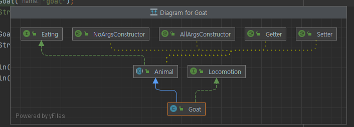

# 목차

- [목차](#목차)
- [1. 개요](#1-개요)
- [2. 프로젝트 설정](#2-프로젝트-설정)
- [3. 예제](#3-예제)
- [4. 자바 리플렉션의 유스 케이스](#4-자바-리플렉션의-유스-케이스)
- [5. 자바 클래스 검사](#5-자바-클래스-검사)
  - [5.1 시작](#51-시작)
  - [5.2 클래스 이름](#52-클래스-이름)
  - [5.3 클래스 접근제한자](#53-클래스-접근제한자)
  - [5.4 패키지 정보](#54-패키지-정보)
  - [5.5 슈퍼 클래스](#55-슈퍼-클래스)
  - [5.6 구현된 인터페이스](#56-구현된-인터페이스)
  - [5.7 생성자, 메서드 및 필드](#57-생성자-메서드-및-필드)
- [6. 생성자 검사](#6-생성자-검사)
- [7. 필드 검사](#7-필드-검사)
- [8. 메서드 검사](#8-메서드-검사)

# 1. 개요

리플렉션은 클래스, 인터페이스, 필드 및 메서드의 **런타임 속성**을 수정할 수 있게 해준다.
리플렉션은 컴파일 타임 때 어떤 것을 써야할 지 이름을 알 수 없을 때 유용하다.

# 2. 프로젝트 설정

- Java 리플렉션을 사용할 때 특정 jar, 특정 설정, Maven 이나 Gradle 같은 설정은 필요하지 않다.
- `import java.lang.reflect.*` 코드로 임포트만 해주면 된다.

# 3. 예제

> **Person 클래스:**

```java
public class Person {

	private String name;
	private int age;
}
```

> **테스트 코드:**

```java
@Test
public void test1() {

    //getDeclaredFields() 로 선언된 필드를 모두 가져온다. public, protected, private 접근제한자에 상관없이 모두 가져온다.
    Object person = new Person();
    Field[] declaredFields = person.getClass().getDeclaredFields();

    //getFieldNames() 메서드는 선언된 필드의 이름을 받아 ArrayList<String> 컬렉션에 보관한다.
    List<String> actualFieldNames = getFieldNames(declaredFields);

    // "name", "age" 가 포함되어 있는지 검증한다.
    assertThat(actualFieldNames).containsAll(Arrays.asList("name", "age"));
}
```

> **getFieldsNames() 스태틱 메서드:**

```java
private static List<String> getFieldNames(Field[] fields) {
    ArrayList<String> fieldNames = new ArrayList<>();
    for (Field field : fields) {
        fieldNames.add(field.getName());
    }
    return fieldNames;
}
```


# 4. 자바 리플렉션의 유스 케이스

- 일반적으로 개발할 때 데이터베이스 테이블에는 명명 규칙을 정해놓는다.
- 예를 들어 학생 테이블을 _tbl_student_data_ 라고 하도록 테이블 이름 앞에 _tbl_ 이라는 접두사를 붙일 수 있다.

이 때 자바 객체의 이름을 Student 혹은 StudentData 로 지정해서 데이터베이스와 통신할 때 사용할 수 있다.

- 리플렉션을 사용해서 객체 이름과 필드 이름을 검색한다. 
- 리플렉션을 이용하면 이 객체 데이터를 데이터베이스 테이블에 매핑하고 객체 필드 값을 적절한 데이터베이스 필드 이름에 할당하는 것이 가능하다.

# 5. 자바 클래스 검사

자바 클래스 객체는 모든 객체 내부의 세부 정보에 대한 접근을 제공한다.

## 5.1 시작

> **Eating 인터페이스:**

```java
public interface Eating {
	String eats();
}
```

> **Eating 을 구현하는 Animal 추상 클래스:**

```java
@Getter
@Setter
@NoArgsConstructor
public abstract class Animal implements Eating{

	public static String CATEGORY = "domestic";
	private String name;

	protected abstract String getSound();
}
```

> **Locomotion 인터페이스:**

```java
public interface Locomotion {
	String getLocomotion();
}
```

> **Goat 클래스:**

```java
@NoArgsConstructor
public class Goat extends Animal implements Locomotion{

	@Override
	protected String getSound() {
		return "bleat";
	}

	@Override
	public String getLocomotion() {
		return "walks";
	}

	@Override
	public String eats() {
		return "grass";
	}
}
```

## 5.2 클래스 이름

```java
@Test
public void test1() {
    Object goat = new Goat("goat");
    Class<?> clazz = goat.getClass();

    assertThat(clazz.getSimpleName()).isEqualTo("Goat");
    assertThat(clazz.getName()).isEqualTo("com.example.javareflection.domain.Goat");
    assertThat(clazz.getCanonicalName()).isEqualTo("com.example.javareflection.domain.Goat");
}
```

- _Class_ 의 _getSimpleName()_ 은 객체의 기본 이름을 반환한다.
- 아래 두 개의 메서드는 패키지 선언을 포함한 클래스 이름을 반환한다.

## 5.3 클래스 접근제한자

- _Integer_ 을 반환하는 _getModifiers_ 메서드를 호출해서 클래스에서 사용되는 접근제한자를 결정할 수 있다.
- _java.lang.reflect.Modifier_ 클래스는 특정 수정자의 존재 여부에 대해 반환된 Integer 를 분석하는 정적 메서드를 제공한다.

```java
@Test
public void test2() throws ClassNotFoundException {
    Class<?> goatClass = Class.forName("com.example.javareflection.domain.Goat");
    Class<?> animalClass = Class.forName("com.example.javareflection.domain.Animal");

    int goatMods = goatClass.getModifiers();
    int animalMods = animalClass.getModifiers();

    System.out.println("goatMods = " + goatMods);
    System.out.println("animalMods = " + animalMods);
    assertThat(Modifier.isPublic(goatMods)).isTrue();
    assertThat(Modifier.isAbstract(animalMods)).isTrue();
}
```

> **출력 결과:**

```text
goatMods = 1
animalMods = 1025
```

_getModifiers()_ 는 접근제한자를 숫자로 반환하는데, _Modifier.isXXX_ 를 호출해서 해당 클래스가 어떤 접근제한자를 가지고 있는지 확인 가능하다.


## 5.4 패키지 정보

리플렉션을 이용해서 클래스 또는 객체의 패키지 정보를 얻을 수 있다.

> **테스트 코드:**

```java
@Test
public void test3() {
    Goat goat = new Goat("goat");
    Class<? extends Goat> goatClass = goat.getClass();
    Package pkg = goatClass.getPackage();

    System.out.println("pkg = " + pkg);
}
```

> **출력 결과:**

```java
pkg = package com.example.javareflection.domain
```

## 5.5 슈퍼 클래스

리플렉션으로 자바 클래스의 상위 클래스를 얻을 수 있다.

```java
@Test
public void test4() {
    Goat goat = new Goat("goat");
    String s = "any String";

    Class<? extends Goat> goatClass = goat.getClass();
    Class<? extends String> strClass = s.getClass();

    System.out.println("goatClass = " + goatClass.getSuperclass());
    System.out.println("strClass = " + strClass.getSuperclass());
}
```

> **출력 결과:**

```text
goatClass = class com.example.javareflection.domain.Animal
strClass = class java.lang.Object
```

- 인텔리제이를 사용하는 경우 상위 클래스 다이어그램을 더 쉽게 확인 가능하다.
- Ctrl + Alt + U 를 누르면 아래와 같이 다이어그램이 나타난다.



## 5.6 구현된 인터페이스

다음은 리플렉션으로 구현된 인터페이스 목록을 얻는 방법이다.

```java
@Test
public void test5() throws ClassNotFoundException {
    Class<?> goatClass = Class.forName("com.example.javareflection.domain.Goat");
    Class<?> animalClass = Class.forName("com.example.javareflection.domain.Animal");

    Class<?>[] goatClassInterfaces = goatClass.getInterfaces();
    Class<?>[] animalClassInterfaces = animalClass.getInterfaces();

    System.out.println("goatClassInterfaces = " + goatClassInterfaces[0].getSimpleName());
    System.out.println("animalClassInterfaces = " + animalClassInterfaces[0].getSimpleName());
}
```

> **출력 결과:**

```text
goatClassInterfaces = Locomotion
animalClassInterfaces = Eating
```

- 출력 결과를 보면 단일 인터페이스 결과만 나오는 것을 확인할 수 있다.
- Goat 클래스는 Locomotion 인터페이스를 구현하고 Animal 클래스는 Eating 인터페이스를 구현함을 알 수 있다.
- 즉 클래스에 명시적으로 선언한 인터페이스만 배열 결괏값으로 반환된다.

## 5.7 생성자, 메서드 및 필드

```java
@Test
public void test6() throws ClassNotFoundException {
    Class<?> goatClass = Class.forName("com.example.javareflection.domain.Goat");

    Constructor<?>[] constructors = goatClass.getConstructors();

    System.out.println("constructors = " + constructors[0].getName());
}
```

> **출력 결과:**

```text
constructors = com.example.javareflection.domain.Goat
```

- _getConstructors()_ 로 생성자 정보를 얻을 수 있다.
- _getFieldNames()_ 로 여러 필드 정보를 얻을 수 있다.
- _getMethodNames()_ 로 여러 메서드 정보를 얻을 수 있다.


# 6. 생성자 검사

자바 리플렉션을 사용하면 모든 클래스의 생성자를 검사하고 런타임에 클래스를 생성하는 것이 가능하다.


> **Bird 클래스:**

```java
package com.example.javareflection.domain;

import lombok.Setter;

@Setter
public class Bird extends Animal{

	private boolean walks;

	public Bird() {
		super("bird");
	}

	public Bird(String name, boolean walks) {
		super(name);
		setWalks(walks);
	}

	public Bird(String name) {
		super(name);
	}

	public boolean walks() {
		return walks;
	}

	@Override
	protected String getSound() {
		return null;
	}

	@Override
	public String eats() {
		return null;
	}
}
```


```java
@Test
void test1() throws ClassNotFoundException, NoSuchMethodException {
    Class<?> birdClass = Class.forName("com.example.javareflection.domain.Bird");

    Constructor<?> cons1 = birdClass.getConstructor();
    Constructor<?> cons2 = birdClass.getConstructor(String.class);
    Constructor<?> cons3 = birdClass.getConstructor(String.class, boolean.class);
}
```

- 테스트 코드에서 주어진 매개변수 유형의 생성자가 `Bird` 클래스에 존재하지 않으면 _NoSuchMethodException_ 이 발생한다.

```java
@Test
void test1()
    throws ClassNotFoundException, NoSuchMethodException, InvocationTargetException, InstantiationException, IllegalAccessException {
    Class<?> birdClass = Class.forName("com.example.javareflection.domain.Bird");

    Constructor<?> cons1 = birdClass.getConstructor();
    Constructor<?> cons2 = birdClass.getConstructor(String.class);
    Constructor<?> cons3 = birdClass.getConstructor(String.class, boolean.class);

    Bird bird1 = (Bird) cons1.newInstance();
    Bird bird2 = (Bird) cons2.newInstance("Weaver bird");
    Bird bird3 = (Bird) cons3.newInstance("dove", true);

    assertThat(bird1.getName()).isEqualTo("bird");
    assertThat(bird2.getName()).isEqualTo("Weaver bird");
    assertThat(bird3.getName()).isEqualTo("dove");

    assertThat(bird3.walks()).isTrue();
    assertThat(bird1.walks()).isFalse();
}
```

- `Constructor` 클래스의 `newInstance()` 메서드를 호출해서 필요한 매개변수를 전달하여 클래스를 인스턴스화하는 테스트 코드이다.
- 런타임에 생성자 매개변수를 전달해 새로운 클래스를 생성했다.

# 7. 필드 검사

리플렉션을 이용해 필드도 생성자와 마찬가지로 런타임에 값을 가져오고 설정할 수 있다.

```java
@Test
void test2() throws Exception {
    Class<?> birdClass = Class.forName("com.example.javareflection.domain.Bird");

    Field[] fields = birdClass.getFields();
    System.out.println("fields = " + fields[0].getName());
}
```

> **출력 결과:**

```text
fields = CATEGORY
```

- 출력 결과를 보면 CATEGORY 하나만 출력된다.
- `getFields()` 메서드는 public 접근자 필드를 반환한다.
- 그래서 `Animal` 클래스에는 private 접근자의 `name` 필드가 있지만 출력 결과에 나타나지 않는다.

그러나 _getDeclaredFields()_ 메서드를 호출하면 클래스에 선언된 private 필드를 불러올 수 있다.

```java
Field[] declaredFields = birdClass.getDeclaredFields();
System.out.println("fields = " + declaredFields[0].getName());
```

결과로 `fields = walks` 가 출력된다.

```java
@Test
void test2() throws Exception {
    Class<?> birdClass = Class.forName("com.example.javareflection.domain.Bird");
    Bird bird = (Bird) birdClass.getConstructor().newInstance();
    Field field = birdClass.getDeclaredField("walks");

    field.setAccessible(true);
    assertThat(field.getBoolean(bird)).isFalse();

    field.set(bird, true);
    assertThat(field.getBoolean(bird)).isTrue();
    assertThat(bird.walks()).isTrue();
}
```

- 원래라면 `Bird` 클래스의 `walks`는 private 필드이기 때문에 `assertThat`으로 비교하는 것도 불가능하다. (_IllegalAccessException_ 예외를 던진다)
- 하지만 `setAccessible(true)` 설정으로 private 필드에도 접근이 가능해진다.


# 8. 메서드 검사

- 자바 리플렉션을 사용하면 런타임에 메서드를 호출하고 필요한 매개변수를 전달할 수 있다.
- 각각의 매개변수 유형을 지정하여 오버로드된 메서드도 호출 가능하다.


_getMethods()_ 를 호출하면 java.lang.Object 클래스의 public 메서드를 모두 가져온다.

```java
@Test
void test3() throws Exception {
    Class<?> birdClass = Class.forName("com.example.javareflection.domain.Bird");
    Method[] methods = birdClass.getMethods();

    ArrayList<String> methodNames = new ArrayList<>();
    for (Method method : methods) {
        methodNames.add(method.getName());
    }

    methodNames.forEach(method -> System.out.println("method = " + method));
}
```

>**출력 결과:**

```text
method = walks
method = eats
method = setWalks
method = getName
method = setName
method = wait
method = wait
method = wait
method = equals
method = toString
method = hashCode
method = getClass
method = notify
method = notifyAll
```


필요한 public 메서드만 얻을려면 _getDeclaredMethods()_ 를 호출해야 한다.

>**getDeclaredMethod() 호출 시:**

```text
method = walks
method = setWalks
method = getSound
method = eats
```

전달되는 매개변수 개수에 따라 런타임에 상황에 맞는 메서드를 호출하는 방법은 아래와 같다.

```java
@Test
void test3() throws Exception {
    Class<?> birdClass = Class.forName("com.example.javareflection.domain.Bird");
    Bird bird = (Bird) birdClass.getConstructor().newInstance();

    Method setWalksMethod = birdClass.getDeclaredMethod("setWalks", boolean.class);
    Method walksMethod = birdClass.getDeclaredMethod("walks");

    boolean invoke = (boolean) walksMethod.invoke(bird);

    assertThat(bird.walks()).isFalse();
    assertThat(invoke).isFalse();

    setWalksMethod.invoke(bird, true);

    boolean invoke2 = (boolean) walksMethod.invoke(bird);

    assertThat(bird.walks()).isTrue();
    assertThat(invoke2).isTrue();
}
```

1. 초기엔 아무 매개변수 없이 `invoke()` 를 호출했으므로 `bird.walks()` 는 false 이다.
2. `setWalksMethod` 메서드는 boolean 매개변수를 전달하는 오버로딩된 메서드를 가리킨다.
3. `setWalksMethod.invoke(bird, true);` 를 호출함으로써 `Bird` 클래스 내의 `walks` 값은 true 로 변경된다.
4. 그래서 _bird.walks()_ 를 검증해보면 처음엔 false 였지만 나중엔 true 로 나온다.