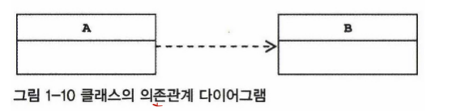
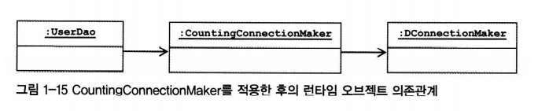

# 목차

- [목차](#목차)
- [의존 관계 주입(Dependency Injection)](#의존-관계-주입dependency-injection)
  - [1. IoC 와 DI](#1-ioc-와-di)
    - [1.1 런타임 의존 관계 설정](#11-런타임-의존-관계-설정)
      - [1.1.1 의존 관계란?](#111-의존-관계란)
      - [1.1.2 의존 관계 주입이란?](#112-의존-관계-주입이란)
      - [1.1.3 의존관계 검색(Dependency Lookup)](#113-의존관계-검색dependency-lookup)
      - [1.1.4 DI vs DL](#114-di-vs-dl)
    - [1.2 DI 의 장점](#12-di-의-장점)
      - [장점 1.기능 구현의 교환](#장점-1기능-구현의-교환)
      - [장점 2. 부가 기능 추가](#장점-2-부가-기능-추가)
    - [1.3 메서드를 이용한 의존관계 주입](#13-메서드를-이용한-의존관계-주입)
    - [1.4 XML을 이용한 설정](#14-xml을-이용한-설정)
      - [1.4.1 XML 의존 오브젝트 관계 정의](#141-xml-의존-오브젝트-관계-정의)
        - [DTD와 스키마](#dtd와-스키마)
    - [2. 출처](#2-출처)

# 의존 관계 주입(Dependency Injection)

## 1. IoC 와 DI

IoC 는 매우 넓은 의미에서 사용된다.
스프링을 IoC 컨테이너라고 해서는 스프링이 제공하는 기능의 특징을 명확하게 설명하지 못한다.

- 서블릿 컨테이너처럼 단순히 서버에서 동작하는 서비스 컨테이너라는 뜻?
- 단순히 IoC 개념이 적용된 템플릿 메서드 패턴을 이용해 만들어진 프레임워크라는 뜻?

그래서 몇몇 사람의 제안으로 스프링이 제공하는 IoC 의 핵심을 짚어주는 용어로 **의존관계 주입(DI)** 라는 단어가 탄생했다.

> 의존 관계 주입의 핵심
>> DI는 오브젝트 레퍼런스를 외부로부터 주입받고 이를 통해 다른 오브젝트와 동적으로 의존 관계가 만들어지는 것이 핵심이다.

### 1.1 런타임 의존 관계 설정

#### 1.1.1 의존 관계란?

두 개의 클래스가 의존 관계에 있다고 말할 때는 항상 방향성을 부여해야 한다.



이 그림의 뜻은 B가 변하면 A에 영향을 미친다는 뜻이다. 의존 관계는 방향성이 매우 중요하다.
A가 B에 의존하고 있지만, 반대로 B는 A에 의존하지 않는다. 즉, A와는 다르게 B는 A의 변화에 영향을 받지 않는다.

#### 1.1.2 의존 관계 주입이란?

인터페이스를 통해 설계 시점에 느슨한 의존관계를 갖는 경우, 런타임 시에 사용할 오브젝트가 어떤 클래스로 만든 것인지 미리 알 수 없다.
이 말은 클라이언트 코드 속에서는 직접적으로 드러나지 않는다는 뜻이다. 프로그램이 시작되고 클라이언트가 런타임 시에 의존 관계를 맺는 대상,
즉 실제 사용대상인 오브젝트를 **의존 오브젝트**라고 말한다.

> 의존관계 주입은 이렇게 구체적인 의존 오브젝트와 클라이언트 오브젝트를 런타임 시에 연결해주는 작업을 말한다.

정리하면 다음과 같다.

- 클래스 모델이나 코드에는 런타임 시점의 의존관계가 드러나지 않는다. 이를 위해 인터페이스에만 의존하고 있어야 한다.
- 런타임 시점의 의존관계는 컨테이너나 팩토리 같은 제 3의 존재가 결정한다.
- 의존관계는 사용할 오브젝트에 대한 레퍼런스를 외부에서 주입해줌으로써 만들어진다.

#### 1.1.3 의존관계 검색(Dependency Lookup)

의존관계 검색(DL)은 자신이 필요로 하는 의존 오브젝트를 능동적으로 찾는다.
이 "능동적" 라는 단어는 오브젝트 생성에도 관여하고, 어떤 클래스의 오브젝트를 이용할지 결정한다는 뜻이 아니다.
DL은 런타임 시 의존관계를 맺을 오브젝트를 결정하는 것과 오브젝트의 생성 작업은 외부 컨테이너 IoC에게 맡기지만,
이를 가져올 때는 메서드나 생성자를 통한 주입 대신 스스로 컨테이너에게 요청하는 방법을 사용한다.

```java
public UserDao(){
    DaoFactory daoFactory = new DaoFactory();
    this.connectionMaker = daoFactory.connectionMaker();
}
```

코드를 보면 외부로부터 주입이 아니라 스스로 IoC 컨테이너인 DaoFactory 에게 요청하고 있다.
스프링의 IoC 컨테이너인 ApplicationContext 는 getBean() 메서드를 제공하는데, 이것이 의존관계 검색에 이용되는 메서드이다.
의존관계 검색은 의존관계 주입의 대부분의 장점을 가지면서 IoC 원칙에도 잘 들어맞는다. 다만 방법이 조금 다를 뿐이다.

#### 1.1.4 DI vs DL

일반적인 상황이라면 DL 보다는 DI 를 사용하는 것이 더 낫다.
사용자에 대한 DB 정보를 어떻게 가져올 것인가에 집중해야하는 UserDao()에 스프링 API 를 이용하는 코드가 섞여 있는 것은 어색하다.
하지만 의존관계 검색을 사용해야 될 때가 있다.

예를 들면 테스트를 해야할 때다.
의존 관계 주입이 되어 있다고 하더라도, 애플리케이션 기동 시점에서 적어도 한 번은 의존관계 검색 방식을 통해서 오브젝트를 가져와야 한다.
서버에는 main() 과 같은 기동 메서드는 없지만 서블릿에서 스프링 컨테이너에 담긴 오브젝트를 사용하기 위해서 한 번은 의존관계 검색 방식을 이용해야 한다.
하지만 스프링은 이러한 서블릿을 미리 구현해놓고 있기 때문에 사용자가 직접 구현할 필요는 없다.

- DI와 DL의 중요 차이점

- **DL 방식에서 검색하는 오브젝트가 스프링 빈일 필요는 없다.**

예를 들어, UserDao 에서 getBean() 메서드를 사용할 때 UserDao 는 굳이 빈 등록이 필요 없다.
어딘가에서 직접 new UserDao()를 해서 사용해도 된다. 

- **DI 방식에서 검색하는 오브젝트는 스프링 빈이여야 한다.**

컨테이너가 UserDao 에 ConnectionMaker 오브젝트를 주입해주려면 UserDao 의 생성과 초기화 권한을 가져야 한다.
따라서 UserDao도 스프링 빈으로 등록이 필요한다.

### 1.2 DI 의 장점

코드에서 런타임 클래스에 대한 의존관계가 나타나지 않으며, 인터페이스를 통해 결합도가 낮은 코드를 만든다.
따라서 다른 책임을 가진 사용 의존관계에 있는 대상이 바뀌어도 자신은 영향을 받지 않고, 변경을 통한 다양한 확장 방법에는 자유롭다.

#### 장점 1.기능 구현의 교환

개발 중에는 로컬 DB를 사용하지만 운영 서버로 넘어갔을 때는 다른 DB를 사용해야 한다.
이럴 때 DAO 에 로컬 DB를 반복해서 사용한 코드가 작성되어 있다면 운영 서버로 이관하려 할 때 해당 코드를 일일이 수정해야 한다.
하지만 모든 DAO가 생성 시점에 인터페이스를 컨테이너로부터 제공받고 모든 구체적인 클래스의 이름은 설정 파일에 있다고 해보자.
이를 서버에 배포할 때는 어떤 DAO 클래스와 코드도 수정할 필요 없다. 단지 설정 파일만 변경해주면 DB 변경이 가능하다.

#### 장점 2. 부가 기능 추가

DAO 가 DB를 얼마나 많이 연걸해서 사용하는지 파악하고 싶다고 가정해보자.
DB 연결 횟수를 카운팅하기 위해 모든 DAO의 메서드에 카운터를 증가시키는 코드를 삽입하는 것은 미련한 짓이다.
하지만 DI를 이용하면 보다 깔끔하게 해결할 수 있다.



의존관계를 그려보면 이렇게 된다. 최종적으로 부르는 DConnectionMaker 중간에,
카운팅을 담당하는 CountingConnectionMaker 를 추가해주기만 하면 된다.

```java
@Configuration
public class CountingDaoFactory {
    @Bean
    public UserDao userDao() {
        return new UserDao(connectionMaker());
    }

    @Bean
    public ConnectionMaker connectionMaker() {
        return new CountingConnectionMaker(realConnectionMaker());
    }

    @Bean
    public ConnectionMaker realConnectionMaker() {
        return new DConnectionMaker();
    }
}
```

코드도 간단하다. DAO 를 카운팅하기 위해 만들어진 클래스를 팩토리 클래스로 생성하고 의존관계 주입을 하면 된다.
해당 코드를 사용하는 테스트 코드는 다음과 같이 작성할 수 있다.

```java
CountingConnectionMaker ccm = context.getBean("connectionMaker", CountingConnectionMaker.class);
System.out.println("Connection counter : " + ccm.getCount());
```

### 1.3 메서드를 이용한 의존관계 주입

의존관계 주입시 생성자가 아닌 메서드를 이용해 주입할 수 있다.

- 수정자 메서드를 이용한 주입

이 메서드는 항상 set으로 시작한다.
입력 값에 대한 검증이나 그 밖의 작업을 수행할 때 수정자 메서드를 이용한 주입을 이용할 수 있다.
이 방식은 외부로부터 제공받은 오브젝트 레퍼런스를 저장해뒀다가 
내부의 메서드에서 사용하게 하는 DI 방식에서 활용하기에 적당하다.

- 예시

```java
public class UserDao{
    private ConnectionMaker connectionMaker;

    public void setConnectionMaker(ConnectionMaker connectionMaker) {
        this.connectionMaker = connectionMaker;
    }
}
```

- 일반 메서드를 이용한 주입

생성자가 수정자 메서드보다 나은 점은 한 번에 여러 개의 파라미터를 받을 수 있다는 점이다.
하지만 파라미터의 개수가 많아지고 비슷한 타입이 여러 개라면 실수하기 쉽다.
임의의 초기화 메서드를 이용하는 DI는 적절한 개수의 파라미터를 가진 여러 개의 초기화 메서드를
가질 수도 있기 때문에 한 번에 모든 필요한 파라미터를 다 받아야 하는 생성자보다 낫다.


### 1.4 XML을 이용한 설정

범용 DI 컨테이너를 사용하면서 오브젝트 사이의 의존정보를 일일이 자바 코드로 만들어주려면 번거롭다.
팩토리 클래스를 보면 대부분 틀에 박힌 구조가 반복되기 때문이다.
그래서 스프링은 애노테이션 방식의 설정 방식 이외에도 XML 을 이용한 설정도 지원한다.
XML 은 단순한 텍스트 파일이기 때문에 컴파일과 같은 별도의 빌드 작업이 없다는 것이 장점이다.

하나의 @Bean 메서드를 통해 얻을 수 있는 빈의 DI 정보는 다음 세 가지다.

- 빈의 이름
- 빈의 클래스
- 빈의 의존 오브젝트

XML 에서 &lt;bean&gt; 태그도 이 세 가지 정보를 정의할 수 있다.

|         | 자바 코드 설정 정보            | XML 설정 정보                       |
|:--------|:-----------------------|:--------------------------------|
| 빈 설정 파일 | @Configuration         | &lt;beans&gt;                   |
| 빈의 이름   | @Bean methodName()     | &lt;bean id="methodName"        |
| 빈의 클래스  | return new BeanClass() | class="a.b.c... BeansClass"&gt; |


#### 1.4.1 XML 의존 오브젝트 관계 정의

XML 에서는 &lt;property&gt; 태그를 사용해 의존 오브젝트와의 관계를 정의한다.
이 태그는 name 과 ref 라는 두 개의 애트리뷰트를 갖는다. 

- name : 프로퍼티의 이름
- ref : 의존관계 주입해줄 오브젝트의 **빈 이름**

##### DTD와 스키마

XML 문서의 구조를 정의하는 방법에는 DTD와 스키마가 있다.
스프링을 DI 위한 기본 태그를 제외하고 특별한 목적을 위해 별도의 태그를 사용할 수 있는 방법을 제공한다.
이 태그들은 각각 별개의 스키마 파일에 정의되어 있고 독립적인 네임 스페이스를 이용해야 한다.
따라서 특별한 이유가 없다면 DTD 보다는 스키마를 이용하는 것이 더 바람직하다.

### 2. 출처

> 토비의 스프링 1권

