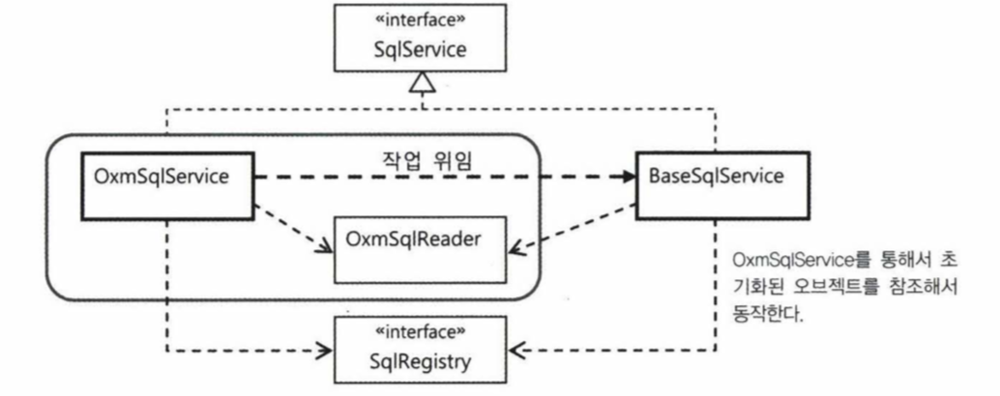

# 목차

- [목차](#목차)
- [7.3 서비스 추상화 적용](#73-서비스-추상화-적용)
  - [7.3.1 OXM 서비스 추상화](#731-oxm-서비스-추상화)
    - [OXM 서비스 인터페이스](#oxm-서비스-인터페이스)
  - [7.3.2 OXM 서비스 추상화 적용](#732-oxm-서비스-추상화-적용)
    - [멤버 클래스를 참조하는 통합 클래스](#멤버-클래스를-참조하는-통합-클래스)
    - [위임을 이용한 BaseSqlService의 재사용](#위임을-이용한-basesqlservice의-재사용)
  - [7.3.3 리소스 추상화](#733-리소스-추상화)
    - [리소스](#리소스)
    - [리소스 로더](#리소스-로더)
    - [Resource를 이용해 XML 파일 가져오기](#resource를-이용해-xml-파일-가져오기)

# 7.3 서비스 추상화 적용

`JaxbXmlSqlReader`는 좀 더 개선시킬 부분이 있다.

- 자바에는 JAXB 외에도 다양한 XML과 오브젝트를 매핑시키는 기술이 있다. 필요에 따라 다른 기술로 손쉽게 바꿔서 사용할 수 있게 해야 한다.
- XML 파일을 좀 더 다양한 소스에서 가져올 수 있게 만든다. 이것은 임의의 클래스패스나 파일 시스템 상의 절대위치 또는 HTTP 프로토콜을 통해 원격에서
가져오도록 확장할 수는 없는가 하는 점이다.

## 7.3.1 OXM 서비스 추상화

JAXB 외에도 실전에서 자주 사용되는 XML과 자바 오브젝트 매핑 기술이 있다.

- Castor XML
- JiBX
- XmlBeans
- Xstream

이렇게 XML과 자바오브젝트를 매핑해서 상호 변환해주는 기술을 간단히 **OXM**이라고 한다.

스프링은 트랜잭션, 메일 전송 뿐 아니라 OXM에 대해서도 서비스 추상화 기능을 제공한다.

### OXM 서비스 인터페이스

스프링이 제공하는 OXM 추상화 서비스 인터페이스에는 자바 오브젝트를 XML로 변환하는 `Marshaller`와 XML 을 자바 오브젝트로 변환하는
`Unmarshaller`가 있다.

`Unmarshaller` 인터페이스는 XML 파일에 대한 정보를 담은 Source 타입의 오브젝트를 주면, 설정에서 지정한 OXM 기술을 이용해
자바 오브젝트 트리로 변환하고, 루트 오브젝트를 돌려준다.

```java
@Test
public void unmarshallSqlMap() throws XmlMappingException, IOException {
    StreamSource xmlSource = new StreamSource(getClass().getResourceAsStream("/sqlmap.xml"));
    Sqlmap sqlmap = (Sqlmap) this.unmarshaller.unmarshal(xmlSource);

    List<SqlType> sqlList = sqlmap.getSql();
    assertEquals(sqlList.size(), 3);
}
```

서비스 추상화 덕분에 어떤 OXM 기술이든 언마샬은 한 줄로 끝나는 것을 볼 수 있다.

## 7.3.2 OXM 서비스 추상화 적용


### 멤버 클래스를 참조하는 통합 클래스

`OxmSqlService`는 `BaseSqlService`와 유사하게 `SqlReader` 타입의 의존 오브젝트를 사용하되 이를 스태틱 멤버 클래스로 내장하고
자신만이 사용할 수 있도록 만들어보자. 의존 오브젝트를 자신만이 독점하는 구조로 만드는 방법이다.

밖에서 볼 때는 하나의 오브젝트로 보이지만 내부에서는 의존관계를 가진 두 개의 오브젝트가 깔끔하게 결합돼서 사용된다.

```java
public class OxmSqlService implements SqlService {
    private final OxmSqlReader sqlReader = new OxmSqlReader();
    @Override
    public String getSql(String key) throws SqlRetrievalFailureException {
        // TODO : implementation
        return null;
    }

    private static class OxmSqlReader implements SqlReader {
        @Override
        public void read(SqlRegistry sqlRegistry) {
            // TODO : implementation
        }
    }
}
```

코드를 보면 `OxmSqlReader` 에 final 키워드가 붙어 있으므로 DI 하거나 변경이 불가능하다.
두 개의 클래스를 강하게 결합시킨 이유는 **OXM을 이용하는 서비스 구조로 최적화하기 위해서다.**
하나의 클래스로 만들어두기 때문에 빈의 등록과 설정은 단순해지고 쉽게 사용할 수 있다.

<details>
<summary><b>OxmSqlService: 내부 오브젝트의 프로퍼티를 전달해주는 코드</b></summary>
<div markdown="1">

```java
public class OxmSqlService implements SqlService {

    private final OxmSqlReader sqlReader = new OxmSqlReader();

    public void setUnmarshaller(Unmarshaller unmarshaller) {
        this.sqlReader.setUnmarshaller(unmarshaller);
    }

    public void setSqlmapFile(String sqlmapFile) {
        this.sqlReader.setSqlmapFile(sqlmapFile);
    }

    @Override
    public String getSql(String key) throws SqlRetrievalFailureException {
        // TODO : implementation
        return null;
    }

    private static class OxmSqlReader implements SqlReader {
        private Unmarshaller unmarshaller;
        private String sqlmapFile;

        public void setUnmarshaller(Unmarshaller unmarshaller) {
            this.unmarshaller = unmarshaller;
        }

        public void setSqlmapFile(String sqlmapFile) {
            this.sqlmapFile = sqlmapFile;
        }

        @Override
        public void read(SqlRegistry sqlRegistry) {
            // TODO : implementation
        }
    }
}
```

</div>
</details>

`OxmSqlReader`는 외부에 노출되지 않기 때문에 `OxmSqlService`에 의해서만 만들어지고, 스스로 빈으로 등록될 수 없다.
따라서 자신이 DI를 통해 제공받아야 하는 프로퍼티가 있다면 `OxmSqlService`의 공개된 프로퍼티를 통해 간접적으로 DI 받아야 한다.

그래서 위의 코드를 보면 setter 메서드로 `setUnmarshaller` 와 `setSqlmapFile` 두 개가 있다.

### 위임을 이용한 BaseSqlService의 재사용

`OxmSqlService` 와 `BaseSqlService` 의 loadSql()과 getSql()이라는 SqlService의 핵심 메서드 구현 코드가 `BaseSqlService`와 동일하다.
이런 경우에는 위임 구조를 이용해 코드의 중복을 제거할 수 있다.



`loadSql()`과 `getSql()`의 구현 로직은 `BaseSqlService`에만 두고, `OxmSqlService`는 일종의 설정과 기본 구성을
변경해주기 위한 어댑터 같은 개념으로 `BaseSqlService` 앞에 두는 설계가 가능하다.

아래 코드는 `BaseSqlService`에 대한 위임 방식으로 `OxmSqlService` 작성한 코드이다.

```java
public class OxmSqlService implements SqlService{
    private final BaseSqlService baseSqlService = new BaseSqlService();
    ...
    
    @PostConstruct
    public void loadSql(){
        this.baseSqlService.setSqlReader(this.oxmSqlReader);
        this.baseSqlService.seqSqlRegistry(this.sqlRegistry);
        
        this.baseSqlService.loadSql();
    }
    
    public String getSql(String key) throws SqlRetrievalFailureException{
        return this.baseSqlService.getSql(key);
    }
}
```

## 7.3.3 리소스 추상화

지금까지 만든 `OxmSqlReader` 와 `XmlSqlReader` 는 공통적인 문제점이 있다.
SQL 매핑 정보가 담긴 XML 파일 이름을 프로퍼티로 외부에서 지정할 수는 있지만 UserDao 클래스와 같은
클래스패스에 존재하는 파일로 제한된다는 점이다.

그리고 자바에는 다양한 위치에 존재하는 리소스에 대한 단일화된 접근 인터페이스를 제공해주는 클래스가 없다.
그나마 URL을 이용해 웹상의 리소스에 접근할 때 사용할 수 있는 java.net.URL 클래스가 있을 뿐이다.

### 리소스

```java
import java.io.IOException;

public interface Resource extends InputStreamSource {
    boolean exists();
    boolean isReadable();
    boolean isOpen();

    URL getURL() throws IOException;
    URL getURI() throws IOException;
    File getFile() throws IOException;
    
    Resource createRelative(String relativePath) throws IOException;
    
    long lastModified() throws IOException;
    String getFilename();
    String getDescription();
}

public interface InputStreamSource{
    InpustStream getInputStream() throws IOException;
}
```

스프링의 거의 모든 API는 외부의 리소스 정보가 필요할 때는 항상 이 Resource 추상화를 이용한다.
Resource는 스프링에서 빈이 아니라 값으로 취급되기 때문에 매번 빈으로 등록할 필요가 없다.

그래서 추상화를 적용하는 방법이 문제다.
Resource는 빈으로 등록하지 않는다고 했으니 외부에서 값을 지정한다고 해봐야 <property>의 value 애트리뷰트에 넣는 방법 밖에 없다.
하지만 value 애트리뷰트에 넣을 수 있는 것은 단순한 문자열 뿐이다.

### 리소스 로더

그래서 스프링에는 URL 클래스와 비슷하게 접두어를 이용해서 Resource 오브젝트를 선언하는 방법을 제공한다.
문자열 안에 리소스의 종류, 리소스의 위치를 함께 표현하게 해주는 것이다.
그리고 실제 Resource 타입 오브젝트로 변환해주는 `ResourceLoader`를 제공한다.

`ResourceLoader`의 대표적인 예는 **애플리케이션 컨텍스트**다.
`ApplicationContext`는 `ResourceLoader` 인터페이스를 상속하고 있다.

스프링 컨테이너는 리소스 로더를 다양한 목적으로 사용하고 있다.

- 스프링 설정정보가 담긴 XML 파일을 리소스 로더를 이용해 Resource 형태로 읽어온다.
- 외부에서 읽어오는 모든 정보 또한 리소스 로더를 사용한다.
- 빈의 프로퍼티 값을 변환할 때도 리소스 로더가 자주 사용된다.

### Resource를 이용해 XML 파일 가져오기

스트링으로 되어 있던 sqlMapFile 프로퍼티를 모두 Resource 타입으로 바꾼다.

<details>
<summary><b>리소스 적용한 OxmSqlService 코드</b></summary>
<div markdown="1">

```java
public class OxmSqlService implements SqlService {
    public void setSqlmap(Resource sqlmap) {
        this.oxmSqlReader.setSqlmap(sqlmap);
    }
    ...

    private class OxmSqlReader implements SqlReader {
        private Resource sqlmap = new ClassPathResource("sqlmap.xml", UserDao.class);
    }

    public void setSqlmap(Resource sqlmap) {
        this.sqlmap = sqlmap;
    }

    public void read(SqlRegistry sqlRegistry) {
        try {
            Source source = new StreamSource(sqlmap.getInputStream());
            ...
        } catch (IOException e){
            throw new IllegalStateException(this.sqlmap.getFilename()) + "을 가져올 수 없습니다", e);
        }
    }
}
```

</div>
</details>

Resource는 단지 리소스에 접근할 수 있는 **추상화된 핸들러일 뿐이다.** 실제 리소스가 아니라는 점을 주의하자.

클래스패스 대신 파일 시스템의 특정 위치에 있는 파일이나 HTTP 프로토콜로 접근 가능한 웹 리소스를 가져올 때,
아래와 같이 설정한다.

- file: 접두어 사용

```xml
<bean id="sqlService" class="sqlservice.OxmSqlService">
    <property name="unmarshaller" ref="unmarshaller" />
    <property name="sqlmap" value="file:/opt/resources/sqlmap.xml"/>
</bean>
```

- http: 접두어 사용

```xml
<bean id="sqlService" class="sqlservice.OxmSqlService">
    <property name="unmarshaller" ref="unmarshaller" />
    <property name="sqlmap" value="http://www.epril.com/resources/sqlmap.xml"/>
</bean>
```

