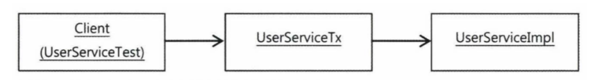

# 목차

- [목차](#목차)
- [6.1 트랜잭션 코드의 분리](#61-트랜잭션-코드의-분리)
  - [6.1.1 메서드 분리](#611-메서드-분리)
  - [6.1.2 DI를 이용한 클래스의 분리](#612-di를-이용한-클래스의-분리)
    - [DI 적용을 이용한 트랜잭션 분리](#di-적용을-이용한-트랜잭션-분리)
    - [분리된 트랜잭션 기능](#분리된-트랜잭션-기능)
    - [트랜잭션 적용을 위한 DI 설정](#트랜잭션-적용을-위한-di-설정)
    - [트랜잭션 분리에 따른 테스트 수정](#트랜잭션-분리에-따른-테스트-수정)
    - [트랜잭션 경계설정 코드 분리의 장점](#트랜잭션-경계설정-코드-분리의-장점)

# 6.1 트랜잭션 코드의 분리

<details>
<summary><b>upgradeLevels() 메서드</b></summary>
<div markdown="1">

```java
public void upgradeLevels() throws Exception {
    TransactionStatus status = this.transactionManager.getTransaction(new DefaultTransactionDefinition());

    try{
        List<User> users = userDao.getAll();
        for (User user : users) {
            if (canUpgradeLevel(user)) {
                upgradeLevel(user);
            }
        }
        
        this.transactionManager.commit(status);
    }catch (Exception e){
        this.transactionManager.rollback(status);
    }
}
```

</div>
</details>

스프링이 제공하는 서비스 추상화를 이용해 기술에 종속적이지 않은 트랜잭션 코드가 됐지만,
트랜잭션을 설정하기 위한 코드가 추가되었다.

## 6.1.1 메서드 분리


검은색 박스에 있는 부분만 비즈니스 로직이고 나머지는 전부 트랜잭션 설정 코드이다.
upgradeLevels() 메서드는 현재 트랜잭션이라는 설정과 사용자 등급 업그레이드라는 두 가지 책임을 지니고 있는 셈이다.
또한 트랜잭션 코드와 비즈니스 로직 코드는 주고 받는 정보도 없다. 따라서 트랜잭션 로직 부분을 메서드로 분리해보자.

<details>
<summary><b>비즈니스 로직과 트랜잭션 경계설정의 분리 코드</b></summary>
<div markdown="1">

```java
private void upgradeLevelsInternal(){
    List<User> users = userDao.getAll();
    for (User user : users) {
        if (canUpgradeLevel(user)) {
            upgradeLevel(user);
        }
    }
}

public void upgradeLevels() throws Exception {
TransactionStatus status = this.transactionManager.getTransaction(new DefaultTransactionDefinition());

    try{
        upgradeLevelsInternal();   
        this.transactionManager.commit(status);
    }catch (Exception e){
        this.transactionManager.rollback(status);
    }
}
```

</div>
</details>


## 6.1.2 DI를 이용한 클래스의 분리

메서드 단위로 분리했지만 트랜잭션 처리 메서드가 여전히 UserService 클래스에 남는다는 문제가 있다.
UserService 는 User와 관련된 서비스를 처리하는 곳이지, 트랜잭션 처리를 담당하는 곳이 아니다.
따라서 이 트랜잭션 메서드를 밖으로 빼는 작업을 해야 한다.

### DI 적용을 이용한 트랜잭션 분리

현재 UserService를 사용하고 있는 클라이언트는 테스트를 위해 만들어진 UserServiceTest이다.
다만 이 둘은 강력하게 결합되어 있기 때문에 중간 다리에 어떤 로직을 추가하기는 어렵다.
그래서 느슨한 결합을 위해 UserServiceImpl을 구현 클래스로 두고 UserService라는 인터페이스를 생성해야 한다.

지금 해결하려고 하는 문제는 비즈니스 로직을 담고 있는 코드만 놔두고 트랜잭션 경계설정을 담당하는 코드를
외부로 빼내려는 것이다. 그렇기 때문에 아래 그림과 같은 구조를 생각할 수 있다.


UserServiceImpl를 호출하기 전에 UserServiceTx를 먼저 호출하는 작업을 거친다면,
클라이언트 입장에서 볼 때는 트랜잭션이 적용된 비즈니스 로직 구현이라는 동작을 기대할 수 있다.

### 분리된 트랜잭션 기능

<details>
<summary><b>UserServiceTx 클래스 생성</b></summary>
<div markdown="1">

```java
public class UserServiceTx implements UserService{
    UserService userService;
    PlatformTransactionManager transactionManager;

    public void setTransactionManager(PlatformTransactionManager transactionManager) {
        this.transactionManager = transactionManager;
    }

    public void setUserService(UserService userService) {
        this.userService = userService;
    }

    @Override
    public void add(User user) {
        userService.add(user);
    }

    @Override
    public void upgradeLevels() {
        TransactionStatus status = this.transactionManager
                .getTransaction(new DefaultTransactionDefinition());
        try {
            userService.upgradeLevels();
            this.transactionManager.commit(status);
        } catch (RuntimeException e) {
            this.transactionManager.rollback(status);
            throw e;
        }
    }
}
```

</div>
</details>

트랜잭션의 경계설정이라는 부가적인 작업을 부여한 UserServiceTx 클래스이다.

### 트랜잭션 적용을 위한 DI 설정

이제 남은 것은 UserServiceTx 를 중간에 놓고 이 클래스를 거쳐 UserService 로직을 실행시키는 일이다.



```xml
<bean id="userService" class="service.UserServiceTx">
    <property name="transactionManager" ref="transactionManager"/>
    <property name="userService" ref="userServiceImpl"/>
</bean>

<bean id="userServiceImpl" class="service.UserServiceImpl">
    <property name="userDao" ref="userDao"/>
    <property name="mailSender" ref="mailSender"/>
</bean>

```

이제 클라이언트는 UserServiceTx 빈을 호출해서 사용하도록 만들어야한다.
따라서 userService 라는 대표적인 빈 아이디는 UserServiceTx 클래스로 정의된 빈에게 부여해준다.
userService 빈은 UserServiceImpl 클래스로 정의되는, 아이디가 userServiceImpl인 빈을 DI 하게 만든다.

### 트랜잭션 분리에 따른 테스트 수정

테스트 코드를 수정해야 하는 이유는 UserService 인터페이스를 확장하는 두 개의 하위 클래스가 생겼기 때문이다.
@Autowired는 기본적으로 타입이 일치하는 빈을 찾아주는데, 타입으로 하나의 빈을 결정할 수 없는 경우에는
**필드 이름을 이용해 빈을 찾는다**

일반적인 기능에선 userService 인터페이스를 통해 결과를 확인하는 것도 충분하지만,
목 오브젝트를 이용한 테스트는 직접 MailSender에 DI 해줘야할 필요가 있었다.
따라서 자동 주입되는 UserService를 UserServiceImpl 로 바꿔주는게 맞다.

### 트랜잭션 경계설정 코드 분리의 장점

1. 비즈니스 로직을 담당하고 있는 UserServiceImpl 코드를 작성할 때, 트랜잭션과 같은 기술적인 내용에는 전혀 신경쓰지 않아도 된다.
2. 비즈니스 로직에 대한 테스트를 손쉽게 만들어낼 수 있다.

