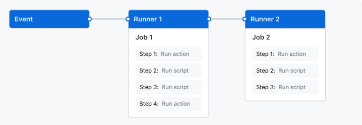

# 1. GitHub Actions 의 이해

## 1.1 개요

- _GitHub Actions_ 는 빌드, 테스트 및 배포를 자동화할 수 있는 CI/CD 플랫폼이다.
- 리포지토리에 대한 모든 _pull request_ 를 빌드 및 테스트하는 **워크플로(workflow)** 를 생성할 수 있다.
- _merged pull request_ 가 발생하면 서버에 자동 배포할 수 있다.

### 장점

- 리포지토리에서 다른 이벤트가 발생할 때마다 워크플로를 실행할 수 있다.
- 예를 들어 누군가 리포지토리에 이슈를 등록했을 때 적절한 라벨을 자동으로 추가하는 워크플로를 실행할 수 있다.

## 1.2 GitHub Actions 구성 요소

_pull request_ 요청이나 이슈를 등록했을 때 워크플로를 구성할 수 있다.

- 워크플로는 한 개 이상의 작업(_job_)을 포함한다. 작업은 순차적 또는 병렬로 실행될 수 있다.
- 각각의 작업은 JVM 실행기나 컨테이너에서 작동하며, 사용자 정의 스크립트나 액션을 실행하는 한 개 이상의 스텝을 가진다.

### Workflow

- 워크플로는 하나 이상의 작업을 실행하는 구성 가능한 자동화 프로세스이다.
- 워크플로는 리포지토리의 _yaml_ 파일에서 정의되며, 리포지토리의 이벤트에 의해 트리거될 때 실행되거나 수동 혹은 사용자가
지정한 일정에 실행 될 수 있다.
- _.github/workflows_ 리포지토리에는 다른 작업을 하는 여러 개의 워크플로가 있을 수 있다.
  - _pull request_ 를 빌드하고 테스트하는 워크플로
  - 릴리즈가 배포될 때 애플리케이션에 배포하는 워크플로
  - 새로운 이슈를 등록했을 때 라벨을 추가하는 워크플로

### Event

이벤트는 워크플로 실행을 일으키는 리포지토리의 특정 활동을 뜻한다.

이벤트 예시 :
- _pull request_ 생성
- 이슈 생성
- 커밋을 리포지토리에 push 하는 행위

사용자는 수동으로 워크플로를 일정에 맞춰 실행시키거나 [REST API posting](https://docs.github.com/en/rest/repos/repos#create-a-repository-dispatch-event) 할 수 있다.

### Job(작업)

- 작업은 동일한 러너(_runner_) 에서 실행되는 워크플로 스텝의 집합이다.  
- 각 스텝은 실행될 _shell script_ 이거나 실행할 액션으로 구성된다.
- 스텝은 동일한 러너에서 실행되므로 어떤 스텝에서 다른 스텝으로 데이터를 공유할 수 있다.
  - 예를 들면, 애플리케이션을 빌드하는 스텝 이후 빌드된 애플리케이션을 테스트하는 스텝이 있을 수 있다.

다른 작업과 종속성을 가질 수 있다. 기본값으로 작업은 종속성이 없으며 서로 병렬로 실행된다.  
만약 작업이 다른 작업에 종속되면 완료될 때까지 기다렸다가 실행될 수 있다.

사용 예시 : 

- 종속성이 없는 서로 다른 아키텍처에 대해 여러 빌드 작업과 이런 작업에 종속되는 패키징 작업
- 빌드 작업은 병렬로 실행되며 모두 성공적으로 완료되면 패키징 작업이 실행된다.

> [작업 사용](https://docs.github.com/en/actions/using-jobs)

### Action

액션은 복잡하지만 자주 반복되는 작업(task)을 수행하는 커스텀 응용 프로그램이다.  

사용 예시 : 

- GitHub에서 git 리포지토리를 가져올 수 있다.
- 빌드 환경에 정확한 _toolchain_ 을 설정할 수 있다.
- 클라우드에 대해 인증을 설정할 수 있다.
- 사용자는 자신의 액션을 작성하거나 _GitHub Marketplace_ 에서 워크플로에 사용할 작업을 찾을 수 있다.

> [액션 생성하기](https://docs.github.com/en/actions/creating-actions)

### Runner

러너는 워크플로가 트리거될 때 워크플로를 실행하는 서버이다.

- 각 러너는 한 번에 하나의 작업을 실행할 수 있다.
- 워크플로의 러너로써 Ubuntu Linux, Microsoft Windows, macOS 를 제공한다.
- 다른 운영 체제가 필요하거나 특정 하드웨어 구성이 필요한 경우 자신만의 러너를 호스팅할 수 있다.

> [커스텀 호스팅 러너 만들기](https://docs.github.com/en/actions/hosting-your-own-runners)
