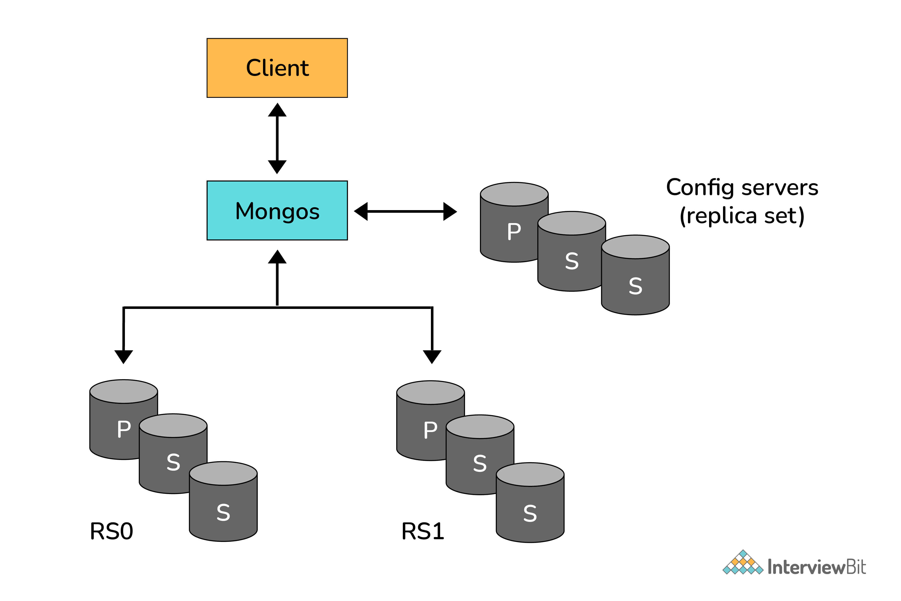

<details>
  <summary><b>SQL 과 NoSQL 의 차이</b></summary><br/>

1. SQL을 사용하면 RDBMS에서 데이터를 저장, 수정, 삭제 및 검색할 수 있다.
   1. RDB의 데이터는 정해진 데이터 스키마에 따라 테이블이 저장된다.
   2. RDB는 관계를 통해 테이블에 분산된다.

따라서 스키마를 준수하지 않은 레코드는 테이블에 추가할 수 없다.
하나의 테이블에서 중복 없이 하나의 데이터만을 관리하기 때문에 부정확한 데이터를 다룰 위험이 없어지는 장점이 있다.

2. NoSQL 은 스키마도 없고 관계도 없다.
   1. NoSQL 은 레코드를 도큐먼트라고 부른다.
   2. NoSQL 은 다른 구조의 데이터를 같은 컬렉션에 추가하는 것이 가능하다.
   3. Json과 비슷한 형태로 RDB 처럼 여러 테이블에 나누어 담지 않고 관련 데이터를 동일한 컬렉션에 집어 넣는다.

NoSQL 은 데이터가 중복되어 서로 영향을 줄 위험이 있다.
따라서 조인을 잘 사용하지 않고 자주 변경되지 않는 데이터일 때 NoSQL 을 사용하면 효과적이다.


</details>


---

<details>
  <summary><b>몽고 DB는 무엇인가?</b></summary><br/>

- C++ 언어로 쓰여진 오픈 소스 NoSQL 데이터베이스. JSON과 유사한 양식을 사용한다.
- _Collection_ 과 _Document_ 개념에 따라 동작한다.
</details>

---

<details>
  <summary><b>몽고 DB를 사용함으로써 얻는 이점은?</b></summary><br/>

- 필드, 범위 기반, 문자열 패턴 일치 타입 쿼리를 지원한다.
- 모든 필드에서 기본 및 보조 인덱스를 지원한다.
- 기본적으로 프로시저 대신 JavaScript 객체를 사용한다.
- 동적 데이터베이스 스키마를 사용한다.
- 확장 또는 축소가 매우 쉽다.
- Sharding 을 내장 지원한다.
</details>

---

<details>
  <summary><b>몽고 DB에서 Document 란 무엇인가?</b></summary><br/>

도큐먼트는 연관된 값이 있는 키들의 집합이다. Map, Hash 또는 Dictionary 로 표현한다.
Javascript 에서 도큐먼트는 오브젝트로 표현된다.

```text
{"greeting":  "Hello world!"}
```

여러 키/값 쌍이 포함될 수도 있다.

```text
{"greeting" : "Hello world!", "views" : 3}
```

</details>

---

<details>
  <summary><b>몽고 DB에서 Collection 이란 무엇인가?</b></summary><br/>

- 컬렉션은 도큐먼트 그룹이다. RDB에서 테이블과 유사한 것으로 생각할 수 있다.
- 단일 컬렉션 내의 여러개의 도큐먼트는 다른 모양(shape) 를 가질 수 있다. 즉 컬렉션에는 동적 스키마가 존재한다.

예를 들어 아래의 도큐먼트는 단일 컬렉션에 저장될 수 있다.

```text
{"greeting" : "Hello world!", "views": 3}
{"signoff": "Good bye"}
```
</details>

---

<details>
  <summary><b>몽고 DB는 언제 사용하는가?</b></summary><br/>

- 읽기 및 쓰기 트래픽에서 고 수준의 확장이 필요할 때: 
  - 몽고 DB는 샤딩을 통해 수평적인 확장을 지원한다.
  - 여러 시스템에 데이터를 분산한다.
  - 대규모 데이터 집합의 높은 처리량 작업이 가능하다.
- 데이터 리포지토리를 대규모로 확장 가능하다.
- 텍스트, _geospatial_, _time-series_ 차원으로 데이터를 저장, 관리, 검색할 수 있다.

</details>

---

<details>
  <summary><b>몽고 DB의 쿼리는 어떻게 동작하는가?</b></summary><br/>

쿼리를 수행하기 위해 `find` 메서드를 사용한다.

1. 쿼리는 도큐먼트가 전혀 없는 것부터 모든 컬렉션을 순회하며 컬렉션에 있는 도큐먼트에서의 하위 집합을 반환한다.
2. 반환되는 도큐먼트는 쿼리에 담긴 도큐먼트를 찾을 첫 번째 인자에 의해 결정된다.

예를 들어 "alice" 값이 있는 "username" 키를 찾으려면 아래의 쿼리를 날린다.

`> db.users.find({"username" : "alice"})`

</details>

---

<details>
  <summary><b>몽고 DB에서 인덱싱이라는 용어는 무슨 뜻인가?</b></summary><br/>

몽고 DB의 인덱스는 쿼리를 효율적으로 해결하는데 도움을 준다.
인덱스가 하는 일은 데이터 세트의 일부분을 탐색하기 쉬운 타입으로 저장하는 것이다.
몽고 DB의 인덱스는 일반적인 RDB 인덱스와 거의 동일하게 작동한다.


</details>

---

<details>
  <summary><b>샤딩의 과정을 설명하시오.</b></summary><br/>

샤딩은 어떤 데이터를 하위 데이터 집합 여러개로 분할하는 것을 말한다.
다른 말로 **파티셔닝**이라는 용어를 사용하기도 한다.
각 시스템에 데이터 하위 집합을 배치하여 더 크거나 성능이 더 좋은 시스템이 없어도 많은 데이터를 저장할 수 있고
더 많은 로드를 처리할 수 있다.

아래 그림에서 RS0 과 RS1 은 샤드이다. 몽고 DB의 샤딩을 사용하면 더 많은 샤드의 클러스트를 생성하고
이들 간의 컬렉션을 분할하여 각 샤드에 하위 데이터들을 배치할 수 있다. 이를 통해 애플리케이션은 standard-only 서버
혹은 복제본 데이터의 리소스 제한을 넘어서는 확장이 가능하다.



</details>