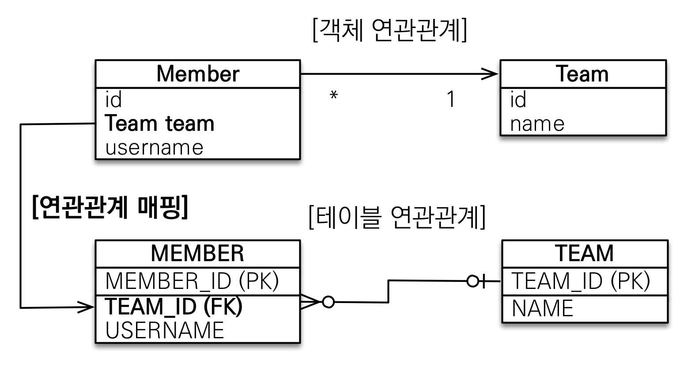
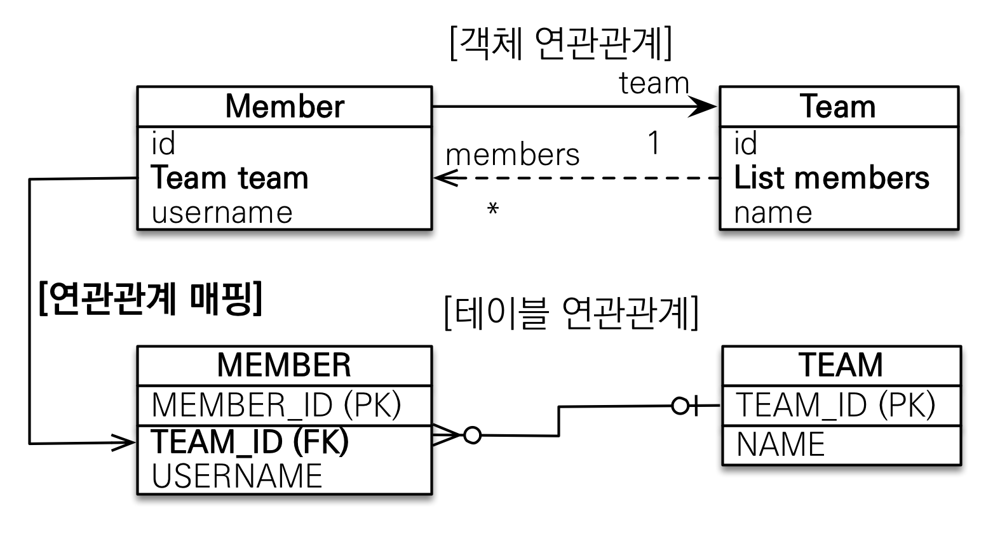
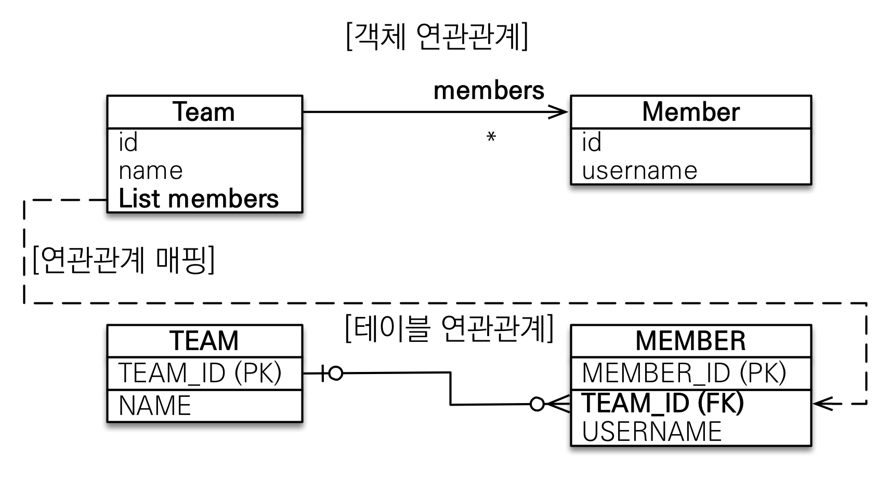
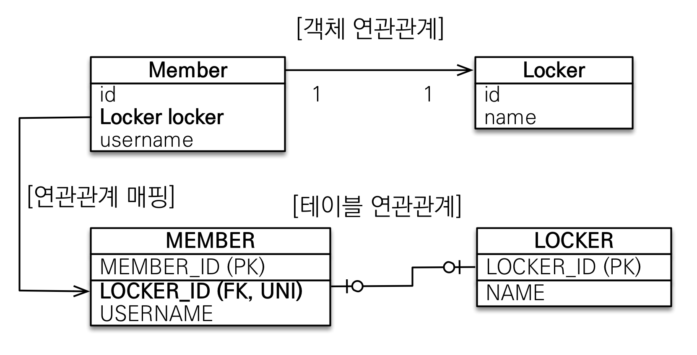
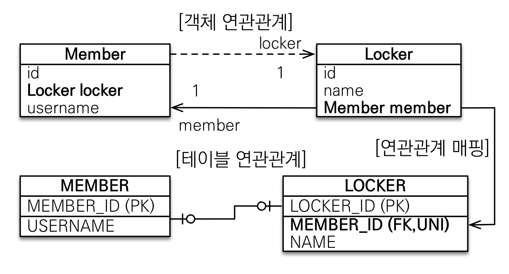
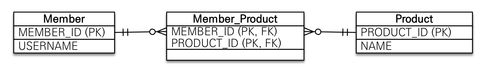
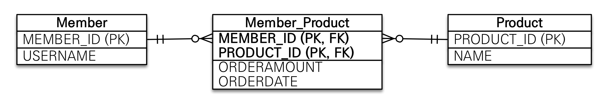
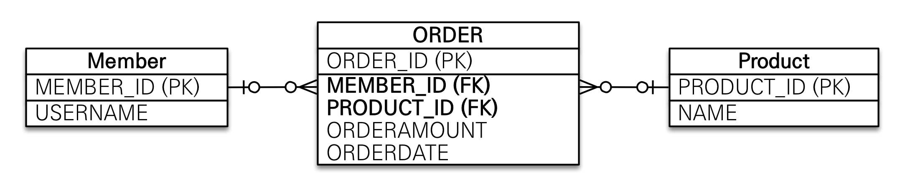

# 목차
- [목차](#목차)
- [3. 연관관계 매핑](#3-연관관계-매핑)
  - [3.1 다대일](#31-다대일)
    - [3.1.1 다대일 단방향](#311-다대일-단방향)
    - [3.1.2 다대일 양방향](#312-다대일-양방향)
    - [3.1.3 일대다 단방향](#313-일대다-단방향)
    - [3.1.4 일대다 양방향](#314-일대다-양방향)
  - [3.2 일대일](#32-일대일)
    - [3.2.1 주 테이블에 외래키](#321-주-테이블에-외래키)
    - [3.2.2 대상 테이블에 외래키](#322-대상-테이블에-외래키)
  - [3.3 다대다](#33-다대다)
    - [3.3.1 다대다 단방향](#331-다대다-단방향)
    - [3.3.2 다대다 양방향](#332-다대다-양방향)
    - [3.3.3 다대다 매핑의 한계](#333-다대다-매핑의-한계)
    - [3.3.4 다대다: 새로운 기본 키 사용](#334-다대다-새로운-기본-키-사용)
    - [3.3.5 다대다 연관관계 정리](#335-다대다-연관관계-정리)

# 3. 연관관계 매핑

엔티티 연관관계를 매핑할 때는 세 가지를 고려해야 한다.

- 다중성
- 단방향, 양방향
- 연관관계의 주인

> **다중성**

- 다대일(@ManyToOne)
- 일대다(@OneToMany)
- 일대일(@OneToOne)
- 다대다(@ManyToMany)

> **단방향, 양방향**

- 테이블은 외래키 하나로 양 테이블을 참조할 수 있기 때문에 방향성이 없다.
- 하지만 객체는 참조용 필드를 가지고 있는 객체만 연관된 객체를 조회할 수 있기 때문에 방향성이 존재한다.

> **연관 관계의 주인**

- 데이터베이스에서 외래키를 관계하는 테이블은 하나다.
- 객체에서 엔티티를 양방향 매핑하면 두 곳에서 서로를 참조하므로 관리하는 포인트는 두 곳이다.

즉, 불일치를 해결하기 위해 JPA는 두 객체 중 하나를 정해서 외래키를 관리하도록 만든다.
**외래키를 가진 테이블과 매핑한 엔티티가 외래키를 관리하는 게 효율적이므로 보통 이곳을 연관관계의 주인으로 선택한다.**

연관 관계의 주인은 _mappedBy_ 속성을 사용하지 않는다.

## 3.1 다대일

객체 양방향 관계에서 연관관계의 주인은 항상 다쪽이다. 외래키는 항상 다쪽에서 관리하기 때문이다.

### 3.1.1 다대일 단방향

<div align="center">

</div>

### 3.1.2 다대일 양방향

- 객체 연관관계에서 실선이 연관관계의 주인.
- 점선은 연관관계의 주인이 아니다.

<div align="center">

</div>

양방향 연관관계는 항상 서로를 참조해야 된다. 한쪽만 참조한 상태라면 JPA를 사용하지 않는 순수 테스트 코드에서 객체 그래프 탐색 시 NULL 을 반환할 수 있기 때문이다.

```java
@Entity
public class Member {

  //...

  @ManyToOne
  @JoinColumn(name = "TEAM_ID")
  private Team team;

  //연관관계 편의 메서드
  public void setTeam(Team team) {
    this.team = team;

    //무한루프 체크
    if (!team.getMembers().contains(this)) {
      team.getMembers().add(this);
    }
  }
}
```

```java
@Entity
public class Team {

  //...

  @OneToMany(mappedBy = "team")
  private List<Member> members = new ArrayList<>();

	public void addMember(Member member) {
		this.members.add(member);

		//무한 루프 체크
		if (member.getTeam() != this) {
			member.setTeam(this);
		}
	}
}
```

- 연관관계 편의 메서드는 한 곳에만 작성하거나 양쪽 다 작성 가능하다.
- 양쪽 작성 시 무한루프에 빠지므로 무한 루프 체크가 반드시 필요하다.

> **Note.**  
> 예를 들어 Member.toString()에서 getTeam()을 호출하고 Team.toString()에서 getMember()를 호출하면
> 무한 루프에 빠진다. 이런 문제는 JSON으로 변환할 때 자주 발생하는데 JSON 라이브러리들은 무한 루프에 빠지지
> 않도록 어노테이션 기능을 제공한다. 그리고 Lombok 라이브러리를 사용할 때도 자주 발생한다.

### 3.1.3 일대다 단방향

<div align="center">

</div>

- 그림을 보면 _Team.members_ 로 _MEMBER_ 테이블의 _TEAM_ID_ 외래키를 관리한다.

보통 자신이 매핑한 테이블에서 외래키를 관리하지만 이 그림은 반대로 되어 있다. 이것은 테이블은 항상 다쪽 테이블에서 외래키를 관리하기 때문인데, Member 객체에는 외래 키를
참조할 필드가 없다.

일대다 단방향은 _@JoinColumn_ 어노테이션을 반드시 추가해야 한다. 그렇지 않으면 중간에 테이블을 하나 추가하는 조인 테이블 방식을 사용한다.

### 3.1.4 일대다 양방향

이 매핑은 공식적으로 존재하지 않는다. 다대일 양방향 매핑을 사용하자.

## 3.2 일대일

일대일 관계는 양쪽이 서로 하나의 관계만 가진다.

- **특징:**
  - 일대일 관계는 그 반대도 항상 일대일 관계다.
  - 일대일 관계는 어느 곳이나 외래 키를 가질 수 있다.

### 3.2.1 주 테이블에 외래키

- 주 테이블에 외래 키를 두고 대상 테이블을 참조한다.
- 외래 키를 객체 참조와 비슷하게 사용할 수 있기 때문에 객체지향 개발자들이 선호한다.

<div align="center">

</div>

### 3.2.2 대상 테이블에 외래키

- 전통적인 데이터베이스 개발자들이 선호한다.
- 테이블 관계를 일대일에서 일대다로 변경할 때 테이블 구조를 그대로 유지할 수 있다.

<div align="center">

</div>

일대일 관계 중 대상 테이블에 외래 키가 있는 경우, 단방향 관계는 성립할 수 없으므로 양방향으로 만들어야한다.

```java
@Entity
public class Member {

  @Id
  @GeneratedValue
  @Column(name = "MEMBER_ID")
  private Long id;

  private String username;

  @OneToOne(mappedBy = "member")
  private Locker locker;
}
```

```java
@Entity
public class Locker {

  @Id
  @GeneratedValue
  @Column(name = "LOCKER_ID")
  private Long id;

  private String name;

  @OneToOne
  @JoinColumn(name = "MEMBER_ID")
  private Member member;
}
```

## 3.3 다대다

- 관계형 데이터베이스에서 다대다 관계는 표현이 불가능하다. 다대다를 사용하려면 중간 테이블을 거쳐 일대다, 다대일 관계로 풀어내야 한다.
- 하지만 객체는 다대다 관계가 가능하다. 양쪽 전부에 컬렉션을 추가해 참조하기만 하면 되기 때문이다.

### 3.3.1 다대다 단방향

<div align="center">

</div>

```java
@Entity
public class Member {

  @Id
  @Column(name = "MEMBER_ID")
  private String id;

  private String username;

  @ManyToMany
  @JoinTable(name = "MEMBER_PRODUCT",
          joinColumns = @JoinColumn(name = "MEMBER_ID"),
          inverseJoinColumns = @JoinColumn(name = "PRODUCT_ID"))
  private List<Product> products = new ArrayList<Product>();
}
```

```java
@Entity
public class Product {

  @Id
  @Column(name = "PRODUCT_ID")
  private String id;

  private String name;
}
```

- @JoinTable 속성:
  - name: 연결 테이블을 지정한다.
  - joinColumns: 현재 방향인 회원과 매핑할 조인 컬럼 정보를 지정한다.
  - inverseJoinColumns: 반대 방향인 상품과 매핑할 조인 컬럼 정보를 지정한다.

### 3.3.2 다대다 양방향

다대다 매핑은 역방향도 _@ManyToMany_ 를 사용한다.

```java
@Entity
public class Product {

  @Id
  @Column(name = "PRODUCT_ID")
  private String id;

  private String name;

  @ManyToMany(mappedBy = "products") // 역방향 추가
  private List<Member> members;
}
```

양방향이므로 아래의 연관관계 편의 메서드를 `Member.java`에 추가해주면 편하다.

```java
public void addProduct(Product product){
   ...
   products.add(product);
   product.getMember().add(this);
}
```

### 3.3.3 다대다 매핑의 한계

_@ManyToMany_ 를 사용하면 연결 테이블을 자동으로 설정해주기 때문에 편하다.
하지만 다대다 매핑에도 단점이 존재한다.

- 실제 상황에서 연결 테이블은 단순히 연결만 하고 끝나지 않는다.
- 주문시간, 수량 같은 데이터가 들어올 수 있다.



주문 수량과 주문 시간은 _Member_ 엔티티와 _Product_ 엔티티에서 참조가 불가능하다.
그렇기 때문에 _Member_Product_ 엔티티를 별도로 만들고 일대다, 다대일로 풀어내야 한다.

> **회원상품 엔티티 코드**

```java
@Entity
@IdClass(MemberProductId.class)
public class MemberProduct {

  @Id
  @ManyToOne
  @JoinColumn(name = "MEMBER_ID")
  private Member member;

  @Id
  @ManyTOOne
  @JoinColumn(name = "PRODUCT_ID")
  private Product product;

  private int orderAmount;
  private Date orderDate;
}
```

> **회원상품 식별자 클래스**

```java
public class MemberProductId implements Serializable {
	
	private String member;
	private String product;
	
	//hashCode and Equals
}
```

- 기본키를 매핑하는 _@Id_ 와 외래 키를 매핑하는 _@JoinColumn_ 을 동시에 적용.
- _@IdClass_ 를 사용해서 복합 기본 키를 매핑

JPA에서 복합 키를 사용하려면 별도의 식별자 클래스를 만들어야 한다.

- 복합 키 식별자의 특징:
  - `Serializable` 구현
  - `equals`와 `hashCode`구현
  - 기본 생성자 필수
  - 식별자 클래스는 public

> **식별관계란?**  
> 부모 테이블의 기본 키를 받아서 자신의 기본 키 + 외래 키로 사용하는 것을 데이터베이스 용어로 식별 관계라고 한다.

### 3.3.4 다대다: 새로운 기본 키 사용

복합 키를 사용하기 위해선 식별자 클래스도 만들어야 하고 @IdClass, equals, hashCode 도 구현해야 하기 때문에
복잡하다. 이것보다 데이터베이스에서 자동으로 생성해주는 대리 키를 Long 값으로 사용하면 간단한 매핑이 가능하다.



> **Order 엔티티**

```java
@Getter
@Setter
@Entity
@Table(name = "orders")
public class Order {

	@Id
	@GeneratedValue(strategy = GenerationType.IDENTITY)
	@Column(name = "ORDER_ID")
	private Long id;

	@ManyToOne
	@JoinColumn(name = "MEMBER_ID")
	private Member member;


	@ManyToOne
	@JoinColumn(name = "PRODUCT_ID")
	private Product product;

	private int orderAmount;
}
```

- 식별자 클래스를 구현하지 않아도 되기 때문에 코드가 단순해졌다.
- Table 이름을 _ORDERS_ 로 해준 이유는 데이터베이스에 _order_ 가 예약어로 잡혀있어 에러를 일으킨다. (MySQL 기준)


### 3.3.5 다대다 연관관계 정리

다대다를 다대일, 일대다 관계로 풀어내기 위해선 식별자를 어떻게 구성해야할지 선택해야 한다.

- 식별 관계: 받아온 식별자를 외래키 + 기본키로 사용
- 비식별 관계: 받아온 식별자는 외래키로만 사용, 새로운 식별자를 추가