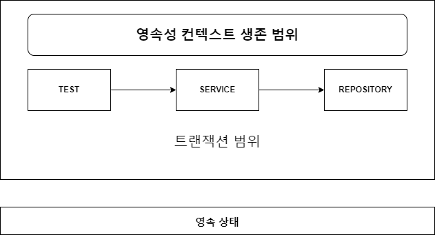
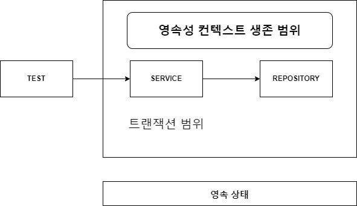
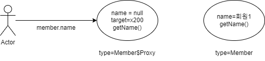

# 목차

- [목차](#목차)
- [5. 고급 주제와 성능 최적화](#5-고급-주제와-성능-최적화)
  - [5.1 예외 처리](#51-예외-처리)
    - [5.1.1 JPA 표준 예외 정리](#511-jpa-표준-예외-정리)
    - [5.1.2 스프링 프레임워크의 JPA 예외 변환](#512-스프링-프레임워크의-jpa-예외-변환)
    - [5.1.3 스프링 프레임워크에 JPA 예외 변환기 적용](#513-스프링-프레임워크에-jpa-예외-변환기-적용)
    - [5.1.4 트랜잭션 롤백 시 주의사항](#514-트랜잭션-롤백-시-주의사항)
  - [5.2 엔티티 비교](#52-엔티티-비교)
    - [5.2.1 영속성 컨텍스트가 같을 때 엔티티 비교](#521-영속성-컨텍스트가-같을-때-엔티티-비교)
    - [5.2.2 영속성 컨텍스트가 다를 때 엔티티 비교](#522-영속성-컨텍스트가-다를-때-엔티티-비교)
  - [5.3 프록시 심화 주제](#53-프록시-심화-주제)
    - [5.3.1 영속성 컨텍스트와 프록시](#531-영속성-컨텍스트와-프록시)
    - [5.3.2 프록시 타입 비교](#532-프록시-타입-비교)
    - [5.3.3 프록시 동등성 비교](#533-프록시-동등성-비교)
    - [5.3.4 상속관계와 프록시](#534-상속관계와-프록시)
  - [5.4 성능 최적화](#54-성능-최적화)
    - [5.4.1 N+1 문제](#541-n1-문제)
      - [즉시 로딩과 N+1](#즉시-로딩과-n1)
      - [지연 로딩과 N+1](#지연-로딩과-n1)
      - [페치 조인 사용](#페치-조인-사용)
      - [하이버네이트 @BatchSize](#하이버네이트-batchsize)
      - [하이버네이트 @Fetch(FetchMode.SUBSELECT)](#하이버네이트-fetchfetchmodesubselect)
      - [N+1 정리](#n1-정리)
    - [5.4.2 읽기 전용 쿼리의 성능 최적화](#542-읽기-전용-쿼리의-성능-최적화)
      - [스칼라 타입으로 조회](#스칼라-타입으로-조회)
      - [읽기 전용 쿼리 힌트 사용](#읽기-전용-쿼리-힌트-사용)
      - [읽기 전용 트랜잭션 사용](#읽기-전용-트랜잭션-사용)
      - [트랜잭션 밖에서 읽기](#트랜잭션-밖에서-읽기)
    - [5.4.3 배치 처리](#543-배치-처리)
      - [JPA 등록 배치](#jpa-등록-배치)
      - [JPA 페이징 배치 처리](#jpa-페이징-배치-처리)
      - [하이버네이트 scroll 사용](#하이버네이트-scroll-사용)
    - [5.4.4 SQL 쿼리 힌트 사용](#544-sql-쿼리-힌트-사용)
    - [5.4.5 트랜잭션을 지원하는 쓰기 지연과 성능 최적화](#545-트랜잭션을-지원하는-쓰기-지연과-성능-최적화)

# 5. 고급 주제와 성능 최적화

## 5.1 예외 처리

JPA 표준 예외들은 모두 _javax.persistence.PersistenceException_ 의 자식 클래스이다.
해당 예외는 _RuntimeException_ 을 상속한다. 따라서 JPA 예외는 모두 언체크 예외다.

### 5.1.1 JPA 표준 예외 정리

**JPA 표준 예외 종류**
- 트랜잭션 롤백을 표시하는 예외
- 트랜잭션 롤백을 표시하지 않는 예외

트랜잭션 롤백을 표시하는 예외는 심각한 예외이므로 복구해선 안 된다. 반면 후자는 심각한 예외는 아니므로 개발자가 커밋할 지 복구할 지 선택하면 된다.

### 5.1.2 스프링 프레임워크의 JPA 예외 변환

서비스 계층이 DAO 계층의 구현 기술에 종속적이라면 좋은 설계라고 할 수 없다.
이것은 예외도 마찬가지인데, 스프링은 DAO 계층에 대한 예외를 추상화해서 개발자에게 제공한다.

예를 들어 _PersistenceException_ 은 스프링에 의해 _JpaSystemException_ 으로 변환된다.

### 5.1.3 스프링 프레임워크에 JPA 예외 변환기 적용

JPA 예외를 스프링이 제공하는 추상화된 예외로 변경하려면 _PersistenceExceptionTranslationPostProcessor_ 를 스프링 빈으로 등록하면 된다.

이것은 _@Repository_ 어노테이션을 사용한 곳에 **예외 변환 AOP**를 적용해서 JPA 예외를 스프링이 추상화된 예외로 변환해준다.

> **설정 방법: XML**

```xml
<bean class="org.springframework.dao.annotation.PersistenceExceptionTranslationPostProcessor" />
```


> **설정 방법: JavaConfig**
```java
@Bean
public PersistenceExceptionTranslationPostProcessor exceptionTranslation() {
    return new PersistenceExceptionTranslationPostProcessor();
}
```

### 5.1.4 트랜잭션 롤백 시 주의사항

- 트랜잭션을 롤백하는 것은 데이터베이스 반영사항만 롤백하는 것이지 수정한 자바 객체는 원상복구해주지 않는다.
- 엔티티를 조회 후 수정했을 때 롤백이 발생하면 데이터베이스는 원상복구 되지만 수정된 객체는 영속성 컨텍스트에 계속해서 남아있다.
- 이런 경우 새로운 영속성 컨텍스트를 사용하거나 `EntityManager.clear()`를 이용해서 영속성 컨텍스트를 초기화해야 한다.

스프링은 이런 문제를 해결하기 위해 영속성 컨텍스트의 범위에 따라 다른 방법을 사용한다.

> **기본 전략: 트랜잭션 당 하나의 영속성 컨텍스트**

트랜잭션 AOP 종료 시점에 트랜잭션을 롤백하면서 영속성 컨텍스트도 함께 종료한다.

> **영속성 컨텍스트의 범위를 트랜잭션보다 넓게 사용할 때**

트랜잭션 롤백시 영속성 컨텍스트를 초기화해서 잘못된 영속성 컨텍스트를 사용하는 문제를 해결한다.

## 5.2 엔티티 비교

영속성 컨텍스트 내부에는 엔티티 인스턴스를 보관하기 위한 1차 캐시가 있다.
1차 캐시로 인해 변경 감지 기능도 동작하고, 데이터베이스를 통하지 않고 바로 레코드 조회가 가능하다.

하지만 1차 캐시의 또 다른 큰 장점은 **동일성** 을 보장한다는 점이다. JPA는 같은 영속성 컨텍스트에서 엔티티를 조회하면 항상 같은 엔티티를 반환해준다.

### 5.2.1 영속성 컨텍스트가 같을 때 엔티티 비교



테스트는 트랜잭션 범위 내에서 실행되므로 범위는 그림과 같다.

```java
@Test
void join() throws Exception {
    //given
    Member member = new Member("kim");
    
    //when
    Long saveId = memberService.join(member);
    
    //then
    Member foundMember = memberRepository.findOne(saveId);
    assertTrue(member == findMember);
}
```

테스트 코드가 이렇게 있을 때 `memberService.join()`으로 저장한 Member 객체와 `memberRepository.findOne()` 으로 찾은 Member 객체는 완전히 동일하다.

이것은 같은 트랜잭션 범위에 있으므로 같은 영속성 컨텍스트를 사용하기 때문이다.

> **Note.**  
> @Transactional 어노테이션이 여러곳에서 적용돼있을 때, 기본 전략은 먼저 시작된 트랜잭션이 있으면 그 트랜잭션을 이어받아서 사용하고 없으면 새로 시작한다.

### 5.2.2 영속성 컨텍스트가 다를 때 엔티티 비교



만약 테스트에서 접근하는 Service 와 Repository 만 영속 상태고 단위 테스트 메서드는 준영속 상태라면 테스트 결과는 당연히 실패한다.

1. `memberService.join()` 에서 영속성 컨텍스트1 을 생성한다.
2. `memberRepository.findOne()`에서 영속성 컨텍스트2 를 생성한다.

서로 다른 영속성 컨텍스트기 때문에 레코드 값은 같을 수 있어도 서로 다른 객체가 되기 때문에 테스트는 실패한다.
따라서 이 때는 동일성 비교가 아닌 `equals()` 메서드를 이용해서 동등성 비교를 해야한다.

```java
member.getId().equals(findMember.getId());
```

문제는 `findMember.getId()`는 엔티티를 영속화해야 얻을 수 있는 식별자 값이다.
식별자 값을 직접 부여할 땐 문제가 없지만 항상 먼저 부여하는 것을 보장하는 것은 쉽지 않다.

그래서 엔티티를 비교할 때는 **비즈니스 키를 이용한 동등성 비교를 권장한다.**

예를 들어 동등성 비교를 위해 `equals()` 메서드를 오버라이딩 할 때, 필드가 중복되지 않고 거의 변하지 않는 데이터베이스 기본 키 후보들이 좋은 대상이다. (ex. 주민등록번호, 연락처)

## 5.3 프록시 심화 주제

### 5.3.1 영속성 컨텍스트와 프록시

```java
@Test
@DisplayName("영속성 컨텍스트와 프록시")
void test2() {
    Member newMember = new Member();
    newMember.setUsername("회원1");
    em.persist(newMember);
    em.flush();
    em.clear();

    Member reference = em.getReference(Member.class, 1L);
    Member member = em.find(Member.class, 1L);

    System.out.println("reference = " + reference.getClass());
    System.out.println("member.getClass() = " + member.getClass());

    Assertions.assertThat(reference).isEqualTo(member);
}
```

>**결과**

```text
reference = class com.example.jpa08.domain.Member$HibernateProxy$mpbkwOmK
member.getClass() = class com.example.jpa08.domain.Member$HibernateProxy$mpbkwOmK
```

- 영속성 컨텍스트는 프록시로 조회된 엔티티와 같은 엔티티를 찾는 요청이 오면 원본 엔티티가 아닌 처음 요청된 프록시를 반환한다.


```java
Member member = em.find(Member.class, 1L);
Member reference = em.getReference(Member.class, 1L);
```

>**결과**

```text
reference = class com.example.jpa08.domain.Member
member.getClass() = class com.example.jpa08.domain.Member
```

- 위 코드처럼 원본 엔티티를 먼저 찾고 프록시를 찾는 경우에도 동일성을 보장한다.
- 다른 점은 프록시가 아닌 원본 엔티티를 반환한다는 점이다.
- 영속성 컨텍스트는 원본 엔티티를 데이터베이스에서 조회했으므로 굳이 프록시를 반환할 이유가 없다.


### 5.3.2 프록시 타입 비교

프록시는 원본 엔티티를 상속 받기 때문에 프록시로 조회한 엔티티와 원본 엔티티를 비교할 때는 `==`이 아니라 `instance of`를 이용해야 한다.

```java
Member newMember = new Member();
newMember.setUsername("kim");
em.persist(newMember);
em.flush();
em.clear();

Member reference = em.getReference(Member.class, 1L);
Assertions.assertTrue(reference instanceof Member);
```

### 5.3.3 프록시 동등성 비교

> **회원 엔티티: equals() hashCode() 재정의**

```java
@Entity
public class Member {

	@Id
	@GeneratedValue
	@Column(name = "MEMBER_ID")
	private Long id;

	private String username;

	@Override
	public boolean equals(Object obj) {
		if (this == obj) {
			return true;
		}
		if (obj == null) {
			return false;
		}
		if (this.getClass() != obj.getClass()) {
			return false;
		}

		Member member = (Member) obj;

		// username != null 이면 !username.equals(member.username)
		// username == null 이면 member.username != null
		if (username != null ? !username.equals(member.username) : member.username != null) {
			return false;
		}

		return true;
	}

	@Override
	public int hashCode() {
		return username != null ? username.hashCode() : 0;
	}
}
```

> **테스트 코드**

```java
@Test
@DisplayName("프록시와 동등성 비교")
void test4() {
    Member saveMember = new Member();
    saveMember.setUsername("kim");

    em.persist(saveMember);
    em.flush();
    em.clear();

    Member newMember = new Member();
    newMember.setUsername("kim");
    Member reference = em.getReference(Member.class, 1L);

    assertThat(newMember).isEqualTo(reference);
}
```

비즈니스 키로 비교하는 메서드를 재정의했기 때문에 동등성 비교에 성공할 것 같지만 이 테스트는 실패한다.
참고로 프록시가 아닌 원본 엔티티와 비교하면 테스트는 성공한다.

프록시의 동등성 비교를 위해서 위 코드는 수정할 부분이 있다.

1. **`==`와 `instanceof`**

```java
if(this.getClass() != obj.getClass()) return false;
```

- 이 코드는 동등성 비교가 아니라 동일성 비교다.
- 프록시는 원본 엔티티를 상속받은 자식 타입이므로 `==` 비교가 아닌 `instanceof`를 사용해야 한다.

따라서 다음과 같이 코드를 수정해야 한다.

```java
if(!(obj instanceof Member)) return false;
```

2. **멤버변수 직접 접근**

```java
if (username != null ? !username.equals(member.username) : member.username != null) {
    return false;
}
```



- `equals()` 메서드는 자신과 비교하기 때문에 private 접근제한자여도 멤버 변수에 직접접근이 가능하다
- 프록시는 실제 데이터를 가지고 있지 않다. 따라서 직접접근으로 아무 값도 얻을 수 없다.

따라서 데이터를 조회할 때 접근자를 이용해야 한다.

```java
if (username != null ? !username.equals(member.getUsername()) : member.getUsername() != null) {
    return false;
}
```

코드를 두 군데 수정하면 테스트는 성공한다.

>**정리.**  
- 프록시의 타입 비교는 == 대신 instanceof 를 사용한다.
- 프록시의 멤버변수에 직접접근하면 안 되고 접근자 메서드를 사용해야 한다.


### 5.3.4 상속관계와 프록시

// TODO

## 5.4 성능 최적화

### 5.4.1 N+1 문제

> **회원 클래스**

```java
@Entity
public class Member {
    @Id @GeneratedValue
    private Long id;

    @OneToMany(mappedBy = "member", fetch = FetchType.EAGER)
    private List<Order> orders = new ArrayList<>();
}
```

> **주문정보 클래스**

```java
@Entity
@Table(name = "ORDERS")
public class Order {
    @Id @GeneratedValue
    private Long id;

    @ManyToOne
    private Member member;
}
```

Member 클래스와 Order 클래스는 N:1 관계이다.

#### 즉시 로딩과 N+1

특정 회원 하나를 `em.find()` 메서드로 조회하면 즉시 로딩으로 설정한 주문정보도 함께 조회한다.

```java
em.find(Member.class, id);
```

```sql
SELECT M.*, O.*
FROM MEMBER M
OUTER JOIN ORDERS O ON M.ID=O.MEMBER_ID
```

- 즉시 로딩은 SQL을 두번 실행하는 것이 아니라 조인을 사용해서 한 번에 모든 정보를 조회한다.
- 좋아보이지만, 문제는 JPQL을 사용할 때 발생한다.

```java
List<Member> members = em.createQuery("select m from Member m", Member.class).getResultList();
```

JPQL을 사용하면 일단 아래와 같은 SQL이 실행된다.

```sql
SELECT * FROM MEMBER
```

1. SQL 실행 결과로 회원 엔티티를 애플리케이션에 로딩한다.
2. 그런데 회원 엔티티와 주문 컬렉션이 즉시 로딩으로 설정됐기 때문에 JPA는 다음 SQL을 추가로 실행한다.

```sql
SELECT * FROM ORDERS WHERE MEMBER_ID=?
```

그 결과로 만들어지는 SQL은 아래와 같다.

```sql
SELECT * FROM MEMBER;
SELECT * FROM ORDERS WHERE MEMBER_ID=1
SELECT * FROM ORDERS WHERE MEMBER_ID=2
SELECT * FROM ORDERS WHERE MEMBER_ID=3
SELECT * FROM ORDERS WHERE MEMBER_ID=4
...
```

이처럼 처음 실행한 SQL 결과 수만큼 추가로 SQL을 실행하는 것을 **N+1 문제**라고 한다.

#### 지연 로딩과 N+1

지연 로딩도 마찬가지로 N+1 문제가 발생할 수 있다.

```java
List<Member> members = em.createQuery("select m from Member m", Member.class).getResultList();
```

- 지연 로딩은 데이터를 실제 조회하는 순간까지 데이터 적재를 미룬다.
- 따라서 위 코드를 실행하면 `SELECT * FROM MEMBER`만 우선 실행된다.
- 문제는 모든 회원에 대해 연관된 주문 컬렉션을 사용할 때 발생한다.

```java
for (Member member : members) {
    //지연 로딩 초기화
    System.out.println("members= " + member.getOrders().size());
}
```

이것도 결국 N+1 문제다. 정리하면 N+1 문제는 즉시 로딩과 지연 로딩 전부에서 발생할 수 있다.

#### 페치 조인 사용

N+1 문제를 해결하는 가장 일반적인 방법이다. 페치 조인은 SQL 조인을 사용해서 연관된 엔티티를 함께 조회하므로
N+1 문제가 발생하지 않는다.

> **페치 조인을 사용하는 JPQL:**
```java
select m from Member m fetch join m.orders
```

> **실행된 SQL:**
```sql
SELECT M.*, O.* FROM MEMBER M INNER JOIN ORDERS O ON M.ID=O.MEMBER_ID
```

#### 하이버네이트 @BatchSize

하이버네이트가 제공하는 _@BatchSize_ 어노테이션을 사용하면 연관된 엔티티를 조회할 때 지정된 size 만큼
SQL IN 절을 사용해서 조회한다.

```java
@org.hibernate.annotations.BatchSize(size = 5)
@OneToMany(mappedBy = "member", fetch = FetchType.EAGER)
private List<Order> orders = new ArrayList<>();
```

만약 조회한 회원이 10명인데 위 코드처럼 `size=5`로 설정하면 2번의 SQL만 추가로 실행된다.

#### 하이버네이트 @Fetch(FetchMode.SUBSELECT)

연관된 데이터를 조회할 때 서브 쿼리를 사용해서 N+1 문제를 해결한다.

```java
@org.hibernate.annotations.Fetch(FetchMode.SUBSELECT)
@OneToMany(mappedBy = "member", fetch = FetchType.EAGER)
private List<Order> orders = new ArrayList<>();
```

> **JPQL:**

```java
select m from Member m where m.id > 10
```

> **실행되는 SQL:**

```sql
SELECT O FROM ORDERS O
    WHERE O.MEMBER_ID IN (
        SELECT
            M.ID
        FROM
            MEMBER M
        WHERE M.ID > 10
    )
```

즉시 로딩으로 설정하면 조회 시점에, 지연 로딩으로 설정하면 지연 로딩된 엔티티를 사용하는 시점에 위의 SQL이 실행된다.

#### N+1 정리

- 즉시 로딩 전략은 좋아보이지만 N+1 문제는 물론이고 비즈니스 로직에 따라 필요없는 엔티티를 로딩해야하는 상황이 자주 발생한다.
- 즉시 로딩은 성능 최적화가 어렵다.
- 따라서 모두 지연 로딩으로 설정하고 성능 최적화가 필요한 곳에는 JPQL 페치 조인을 사용하면 된다.

JPA의 글로벌 페치 전략은 아래와 같다.

- @OneToOne, @ManyToOne : 기본 페치 전략은 즉시 로딩
- @OneToMany, @ManyToMany : 기본 페치 전략은 지연 로딩


### 5.4.2 읽기 전용 쿼리의 성능 최적화

엔티티를 영속성 컨텍스트에 관리하면 많은 장점이 있지만 스냅샷 인스턴스를 보관해야 하기 때문에 더 많은 메모리를
사용해야 한다는 단점이 있다. 따라서 단순 읽기만 필요한 작업이라면 읽기 전용으로 엔티티를 조회해서 메모리 사용량을 최적화할 수 있다.

#### 스칼라 타입으로 조회

첫번째로 엔티티가 아닌 스칼라 타입으로 모든 필드를 조회하는 방법이 있다.

```java
select o.id, o.name, o.price from Order o
```

#### 읽기 전용 쿼리 힌트 사용

하이버네이트 전용 힌트인 _org.hibernate.readOnly_ 를 사용하면 엔티티를 읽기 전용으로 조회 가능하다.
읽기 전용이므로 영속성 컨텍스트는 스냅샷을 보관하지 않는다.

```java
TypedQuery<Order> query = em.createQuery("select o from Order o", Order.class);
query.setHint("org.hibernate.readOnly", true);
```

#### 읽기 전용 트랜잭션 사용

스프링을 사용하면 트랜잭션을 읽기 전용으로 사용할 수 있다.

```java
@Transactional(readOnly = true)
```

- 이 옵션을 설정하면 스프링이 하이버네이트 세션의 플러시 모드를 _MANUAL_ 로 변경한다.
- 강제로 플러시를 호출하지 않는 한 플러시가 발생하지 않는다.

#### 트랜잭션 밖에서 읽기

트랜잭션 없이 엔티티를 조회하는 방법이다. 트랜잭션을 사용하지 않으면 플러시가 일어나지 않으므로 조회 성능이 상승한다.

```java
@Transactional(propagtion = Propagation.NOT_SUPPORTED)
```

스프링 프레임워크를 사용하면 읽기 전용 트랜잭션을 사용하면 편리하다.

```java
@Transactional(readOnly = true) // 플러시를 사용하지 않도록 해서 조회 성능 향상
public List<DataEntity> findDatas() {

    return em.createQuery("select d from DataEntity d", DataEntity.class)
    .setHint("org.hibernate.readOnly", true) // 엔티티를 읽기 전용으로 조회해서 메모리 절약
    .getResultList();
}
```

### 5.4.3 배치 처리

수백만건의 데이터를 처리해야 하는 배치 처리가 있을 때, 일반적인 방식으로 엔티티를 조회하면
영속성 컨텍스트에 많은 엔티티가 쌓이면서 메모리가 부족해진다.

따라서 배치 처리는 적절한 단위로 영속성 컨텍스트를 초기화해줘야 한다.

#### JPA 등록 배치

영속성 컨텍스트에 엔티티가 계속 쌓이지 않도록 일정 단위마다 영속성 컨텍스트의 엔티티를 데이터베이스에 플러시하고
영속성 컨텍스트를 초기화하는 방법이다.

#### JPA 페이징 배치 처리

```java
@Transactional
public void pageContent() {
    int pageSize = 100;
    for (int i = 0; i < 10; i++) {
        List<Product> resultList = em.createQuery("select p from Product p", Product.class)
                                    .setFirstResult(i * pageSize)
                                    .setMaxResults(pageSize)
                                    .getResultList();

        //비즈니스 로직 실행
        for (Product product : resultList) {
            product.setPrice(product.getPrice() + 100);
        }

        em.flush();
        em.clear();
    }
}
```

- 한 번에 100건 씩 페이징 쿼리로 조회하면서 상품의 가격을 100원씩 증가시키는 코드이다.
- 페이지 단위마다 영속성 컨텍스트를 플러시하고 초기화한다.

#### 하이버네이트 scroll 사용

JPA는 JDCB의 커서를 지원하지 않으므로 하이버네이트 세션을 사용해야 한다.

### 5.4.4 SQL 쿼리 힌트 사용

//TODO

### 5.4.5 트랜잭션을 지원하는 쓰기 지연과 성능 최적화

//TODO
