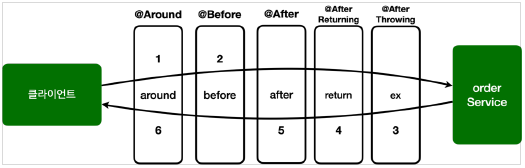

# 목차

- [목차](#목차)
- [1. 스프링 어드바이스](#1-스프링-어드바이스)
  - [1.1 어드바이스 순서](#11-어드바이스-순서)
  - [1.2 어드바이스의 종류](#12-어드바이스의-종류)

# 1. 스프링 어드바이스

## 1.1 어드바이스 순서

*@Order* 애노테이션으로 스프링 AOP 가 적용될 순서를 지정할 수 있다. 하지만 순서는 *Aspect* 단위로 지정되므로 메서드 위에 *@Order* 애노테이션을 붙여도 제대로 작동하지 않는다.
하나의 클래스에 포인트컷을 적용할 부가기능이 두 개 있는 상황이라면 두 개를 외부 클래스로 분리하거나 스태틱 클래스를 선언하는 방법이 있다.

```java
@Slf4j
@Aspect
public class AspectV6Advice {

    @Around("hello.aop.order.aop.Pointcuts.orderAndService()")
    public Object doTransaction(ProceedingJoinPoint joinPoint) throws Throwable {

        try {
            //@Before
            log.info("[트랜잭션 시작] {}", joinPoint.getSignature());
            Object result = joinPoint.proceed();
            //@AfterReturning
            log.info("[트랜잭션 커밋] {}", joinPoint.getSignature());
            return result;
        } catch (Exception e) {
            //@AfterThrowing
            log.info("[트랜잭션 롤백] {}", joinPoint.getSignature());
            throw e;
        } finally {
            //@After
            log.info("[리소스 릴리즈] {}", joinPoint.getSignature());
        }
    }

    @Before("hello.aop.order.aop.Pointcuts.orderAndService()")
    public void doBefore(JoinPoint joinPoint) {
        log.info("[before]{}", joinPoint.getSignature());
    }
}
```

## 1.2 어드바이스의 종류

- @Around : 메서드 호출 전후에 수행한다. 가장 강력한 어드바이스다. 반환값 조작, 조인포인트 실행 여부 등등을 설정할 수 있다.
- @Before : 조인 포인트 실행 이전에 수행한다.
- @After Returning : 조인 포인트가 정상 완료 후 실행된다.
- @After Throwing : 메서드가 예외를 던지는 경우 실행된다.
- @After : 조인포인트가 정상 또는 예외에 관계없이 실행된다.(finally)

```java
@Around("hello.aop.order.aop.Pointcuts.orderAndService()")
public Object doTransaction(ProceedingJoinPoint joinPoint) throws Throwable {

    try {
        //@Before
        log.info("[트랜잭션 시작] {}", joinPoint.getSignature());
        Object result = joinPoint.proceed();
        //@AfterReturning
        log.info("[트랜잭션 커밋] {}", joinPoint.getSignature());
        return result;
    } catch (Exception e) {
        //@AfterThrowing
        log.info("[트랜잭션 롤백] {}", joinPoint.getSignature());
        throw e;
    } finally {
        //@After
        log.info("[리소스 릴리즈] {}", joinPoint.getSignature());
    }
}
```

어드바이스의 종류에 따라 AOP가 적용되는 방식은 위 코드의 주석에 적힌 타이밍과 같다.

모든 어드바이스는 첫 번째 파라미터에 *JoinPoint* 를 사용할 수 있다. 물론 생략 가능하다.
하지만 *@Around* 는 *ProceedingJoinPoint* 를 사용해야 한다.
*ProceedingJoinPoint* 를 사용해야 하는 이유는 이 인터페이스에 *proceed()* 라는 메서드가 있기 때문이다.
이 메서드는 다음 어드바이스나 타겟을 호출하는 역할을 한다.

> @Before

- *ProceedingJoinPoint* 은 *@Before* 에선 사용하지 못한다. 따라서 *JoinPoint* 를 사용해야 한다.
- 메서드 종료시 자동으로 다음 타겟이 호출된다.
- *@Around* 와 다르게 작업 흐름을 변경할 수는 없다.

```java
@Before("hello.aop.order.aop.Pointcuts.orderAndService()")
public void doBefore(JoinPoint joinPoint) {
    log.info("[before]{}", joinPoint.getSignature());
}
```

> @AfterReturning

- 메서드 실행이 정상적으로 반환될 때 실행된다.
- *returning* 속성에 사용된 이름은 어드바이스 매개변수 이름과 일치해야 한다.
- 지정된 타입의 값을 반환하는 메서드만 대상으로 실행한다.
- *@Around* 와 다르게 반환되는 오브젝트를 변경할 수 없다.

```java
@AfterReturning(value = "hello.aop.order.aop.Pointcuts.orderAndService()", returning = "result")
public void doReturn(JoinPoint joinPoint, Object result) {
    log.info("[return] {} return={}", joinPoint.getSignature(), result);
}
```

> @AfterThrowing

- *@AfterReturning* 과 비슷하다.
- 예외 타입 역시 지정된 타입의 값을 반환하는 예외만 대상으로 실행된다.

```java
@AfterThrowing(value = "hello.aop.order.aop.Pointcuts.orderAndService()", throwing = "ex")
public void doThrowing(JoinPoint joinPoint, Exception ex) {
    log.info("[ex] {}", ex);
}
```

> @After

- 메서드 실행이 종료되면 실행된다(finally)
- 정상 및 예외 반환 조건 모두 처리한다.

```java
@After(value = "hello.aop.order.aop.Pointcuts.orderAndService()")
public void doAfter(JoinPoint joinPoint) {
    log.info("[after] {}", joinPoint.getSignature());
}
```

> @Around

- 메서드 실행 전후에 작업을 수행한다.
- 가장 막강한 어드바이스로 아래와 같은 동작이 전부 가능하다.
  - 조인 포인트 실행 여부 선택
  - 전달 값 변환
  - 반환 값 변환
  - 예외 변환
  - 트랜잭션 처럼 try catch finally 구문 처리 가능
- 어드바이스의 첫 번째 파라미터는 *ProceedingJoinpoint* 를 사용한다.
- *proceed()* 메서드를 여러번 실행할 수도 있다.



위 그림처럼, 스프링은 5.2.7 버전부터 동일한 *@Aspect* 안에 동일한 조인포인트의 우선 순위를 정했다.

> 그렇다면 *@Around* 만 있으면 전부 할 수 있는데 다른 어드바이스는 왜 존재하는 것일까?

아래의 코드를 보면 심각한 결함이 있다.

```java
@Around("hello.aop.order.aop.Pointcuts.orderAndService()")
public void doBefore(ProceedingJoinPoint joinPoint) {
    log.info("[before] {}", joinPoint.getSignature());
}
```

*@Around* 는 다음 타겟을 호출하기 위한 *proceed()* 가 필요한데, 이 코드에는 그런 것이 없다.
이 코드는 타겟이 호출되지 않는 치명적인 버그가 발생한다.

하지만 *@Before* 는 *joinPoint.proceed()* 를 호출하는 고민을 하지 않아도 된다.
그래서 기능은 적지만 실수할 가능성은 적고 코드도 단순하다. 또한 코드를 작성한 의도가 명확하게 드러난다.
*@Before* 라는 애노테이션을 보는 순간 "타겟 실행 전에만 한정해서 어떤 일을 하는 코드" 라는 것을 바로 알 수 있다.

> **좋은 설계는 제약이 있는 것임을 명심하자.**
