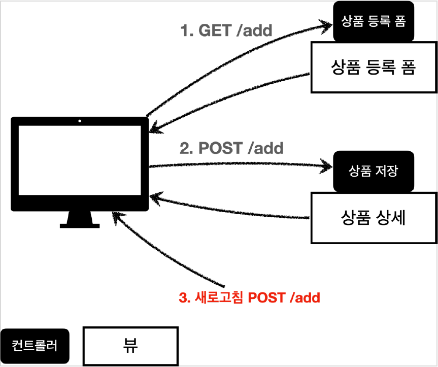

# 5.8 RedirectAttributes

## 5.8.1 POST/Redirect/GET

POST 메서드를 최종 결과로 두면 새로 고침 시 POST 메서드가 계속 요청된다는 문제점이 있다.



따라서 POST 요청 후 다른 화면으로 리다이렉트를 호출해 GET 요청으로 바꿔주는 것이 필요하다.

```java
@PostMapping("/add")
public String addItemV5(Item item){
	itemRepository.save(item);
	return"redirect:/basic/items/" + item.getId();
	}
```

문제는 `item.getId()` 처럼 문자열을 그대로 보낼 경우, 만약 이 문자열에 한글이나 띄어쓰기가 포함됐을 때 제대로
실행되지 않을 수 있다. URL은 띄어쓰기는 허용하지 않고 한글은 유니코드로 변환되서 실행되기 때문이다.
개발자가 문자열을 변환해주는 로직을 직접 작성해도 되지만 스프링은 `RedirectAttributes`를 지원한다.

## 5.8.2 RedirectAttributes

`RedirectAttributes`를 사용하면 URL 인코딩을 해주고, `pathVariable`, 쿼리 파라미터까지 처리해준다.

```java
@PostMapping("/add")
public String addItem(@ModelAttribute("item") Item item,
    RedirectAttributes redirectAttributes) {
    Item savedItem = itemRepository.save(item);
    redirectAttributes.addAttribute("itemId", savedItem.getId());
    redirectAttributes.addAttribute("status", true);
    return "redirect:/basic/items/{itemId}";
}
```

`item` 옵으젝트를 제외한 나머지 속성들은 자동으로 쿼리 파라미터에 추가된다.

- 코드 실행 시 URL 주소

```text
http://localhost:8080/basic/items/4?status=true
```

`status` 쿼리 파라미터 값을 이용해 데이터 저장 시 "저장 완료"라는 텍스트를 웹 페이지 내에 띄울 수 있다.
타임 리프를 이용하면 `${param}`으로 쿼리 파라미터 값을 쉽게 가져올 수 있다.

```thymeleafexpressions
<h2 th:if="${param.status}" th:text="'저장 완료'"></h2>
```