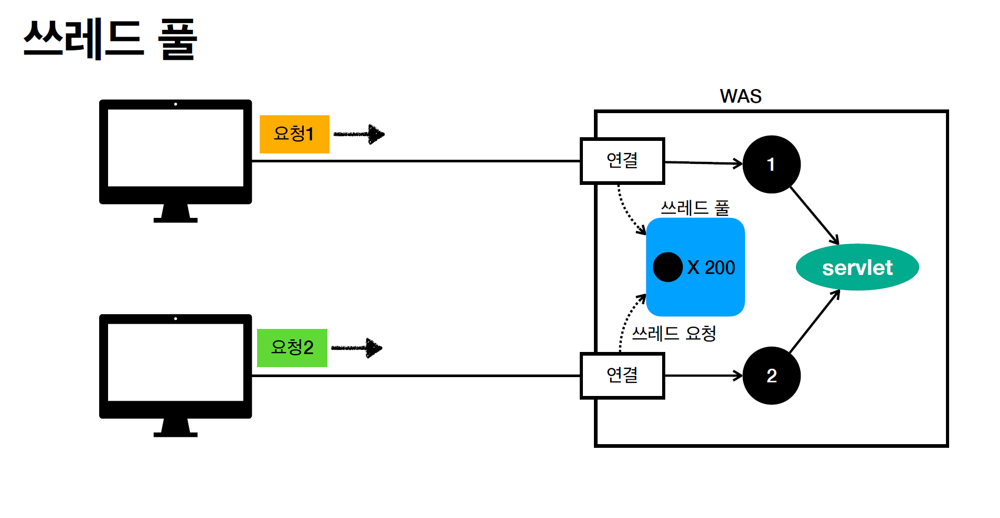

# 1.3 동시 요청 - 멀티 쓰레드

브라우저가 요청을 할 때 서블릿이 생성된다.
그렇다면 이 서블릿을 생성하는 오브젝트는 무엇일까? 바로 쓰레드이다.

## 쓰레드

- 애플리케이션 코드를 순차적으로 실행하는 것은 쓰레드.
- 자바 메인 메서드 실행 시 main 이라는 쓰레드가 실행.
- 쓰레드가 없다면 자바 앱 실행 자체가 불가능하다.
- 쓰레드는 한 번에 하나의 코드 라인만 수행하기 때문에 동시 처리를 하려면 쓰레드 추가가 필요하다.

### 요청 마다 쓰레드 생성

일단 쓰레드는 생성 비용이 비싸다. 요청이 올 때마다 매번 쓰레드를 생성하면 생성되는만큼 성능이 낮아진다.
왜냐하면 쓰레드 간 컨텍스트 스위칭 비용이 발생하고 쓰레드 생성에 제한이 없기 때문이다.

> **컨텍스트 스위칭?** 
> 쓰레드들이 실행 순서에 따라 실행될 때, 기존 쓰레드에서 다른 쓰레드로 넘어갈 때 발생하는 비용을 말한다.

정리하면 고객의 요청에 비례해서 서버 장애가 일어날 확률이 높아진다.
이 문제를 해결하기 위해 WAS는 내부에 **쓰레드 풀**이 존재한다.

### 쓰레드 풀

쓰레드 풀을 그림으로 표현하면 아래와 같다.

쓰레드 풀 사용의 장점은 쓰레드 생성 개수에 제한을 걸 수 있다는 점이다.
만약 쓰레드 풀 사이즈가 200개라면 200개를 초과하는 요청에 대해선 대기하거나 거절 신호를 보낼 수 있다.

#### 쓰레드 풀 - 실무 팁

- WAS의 주요 튜닝 포인트는 최대 쓰레드 수이다.
  - 이 값을 너무 낮게 설정하면 동시 요청이 많을 때 서버 리소스는 여유롭지만 클라이언트는 금방 응답 지연을 겪는다.
  - 이 값을 너무 높게 설정하면 CPU, 메모리 리소스 임계점 초과로 서버가 다운될 가능성이 높아진다.

장애 발생시 클라우드 환경이라면 일단 서버부터 증설하고 이후에 튜닝을 진행한다.

#### 쓰레드 풀 - 적정 숫자

쓰레드 수 적정 숫자는 애플리케이션 로직의 복잡도, CPU, 메모리, IO 리소스 상황에 따라 모두 다르다.
따라서 아래와 같은 성능 테스트가 필요하다.
- 성능 테스트
  - 최대한 실제 서비스와 유사하게 성능 테스트를 시도한다.
  - 지원 툴: 아파치 ab, 제이미터, nGrinder
  

### WAS의 멀티 쓰레드 지원

멀티 쓰레드에 대한 부분은 WAS가 처리한다.
따라서 개발자는 멀티 쓰레드 관련 코드를 신경쓰지 않아도 된다.
단, 멀티 쓰레드 환경이기 때문에 싱글톤 객체(서블릿, 스프링 빈)은 주의해서 사용해야 한다.

## 출처

> [인프런 강의 - 스프링 MVC 1편](https://www.inflearn.com/course/%EC%8A%A4%ED%94%84%EB%A7%81-mvc-1/dashboard)