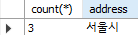
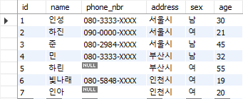
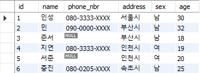

# 목차

- [목차](#목차)
- [4.1 SELECT 구문](#41-select-구문)
    - [4.2.1 WHERE](#421-where)
        - [NULL 검색](#null-검색)
    - [4.2.2 GROUP BY](#422-group-by)
    - [4.2.3 HAVING](#423-having)
    - [4.2.4 ORDER BY](#424-order-by)
    - [4.2.5 뷰와 서브 쿼리](#425-뷰와-서브-쿼리)
        - [뷰 만드는 방법](#뷰-만드는-방법)
        - [익명 뷰](#익명-뷰)
        - [서브쿼리를 사용한 조건 지정](#서브쿼리를-사용한-조건-지정)

# 4.1 SELECT 구문

- DDL 및 INSERT 구문:

```sql
create table address
(
    id        int auto_increment not null,
    name      varchar(10),
    phone_nbr varchar(50),
    address   varchar(50),
    sex       varchar(10),
    age       int,
    primary key (id)
);

insert into address (name, phone_nbr, address, sex, age)
values ('인성', '080-3333-XXXX', '서울시', '남', 30);
insert into address (name, phone_nbr, address, sex, age)
values ('하진', '090-0000-XXXX', '서울시', '여', 21);
insert into address (name, phone_nbr, address, sex, age)
values ('준', '080-2984-XXXX', '서울시', '남', 45);
insert into address (name, phone_nbr, address, sex, age)
values ('민', '080-3333-XXXX', '부산시', '남', 32);
insert into address (name, phone_nbr, address, sex, age)
values ('하린', null, '부산시', '여', 55);
insert into address (name, phone_nbr, address, sex, age)
values ('빛나래', '080-5848-XXXX', '인천시', '여', 19);
insert into address (name, phone_nbr, address, sex, age)
values ('인아', null, '인천시', '여', 20);
```

## 4.2.1 WHERE

- 검색에 추가적인 조건을 지정할 때 사용한다.
- 여기서 WHERE은 "어디?"라는 뜻이 아니라 "~라는 경우"의 관계부사를 뜻한다.

### NULL 검색

- Address 테이블에 전화번호가 없는 사람을 조회한다고 생각해보자.

```sql
select name, address
from Address
where phone_number = null;
```

이렇게 하면 오류는 나지 않지만 아무런 결괏값을 반환하지 않는다. NULL 레코드를 반환할 때는 NULL 대신 _IS NULL_ 이라는 키워드를 사용해야 한다.

> **Note.**  
> NULL은 데이터값이 아니므로 비교 연산자를 적용할 수 없기 때문이다.

## 4.2.2 GROUP BY

- 합계 또는 집계 연산을 낼 때 사용한다.

**SQL의 대표적인 집계 함수:**

- COUNT
- SUM
- MAX
- MIN
- AVG

남자 그룹과 여자 그룹에 각각 몇 명이 있는지 구하고 싶을 때:

```sql
select sex, count(*)
from address
group by sex;
```

## 4.2.3 HAVING

- GROUP BY로 낸 결과에 또다시 조건을 걸 수 있는데 바로 _HAVING_ 이다.

**사람수가 세 명인 주소 필드를 선택:**

```sql
select count(*), address
from address
group by address
having count(*) = 3;
```

**결과)**



## 4.2.4 ORDER BY

- SELECT 구문의 결과에 순서를 보장해야할 때 사용한다.

**나이가 많은 순서로 레코드 정렬:**

```sql
select *
from address
order by age desc;
```

## 4.2.5 뷰와 서브 쿼리

- 데이터베이스를 사용할 때 자주 사용하는 SELECT 문은 따로 저장해두는 편이 편하다.
- 자주 사용하는 쿼리문을 저장할 수 있도록 해주는 기능을 **뷰** 라고 한다.

### 뷰 만드는 방법

**뷰 생성:**

```sql
create view CountAddress(v_address, cnt)
as
select address, count(*)
from address
group by address
```

**사용:**

```sql
# 테이블 대신 뷰를 from 구에 넣는다.
select v_address, cnt
from CountAddress;
```

### 익명 뷰

- 뷰 사용 방법은 테이블과 같지만 내부에는 데이터를 보유하고 있지 않다.
- 따라서 레코드를 조회하기 위해 추가적인 SELECT 구문을 내부에서 실행하는 것이 필요하다.

```sql
# 뷰에서 데이터를 선택
select v_address, cnt
from CountAddress;

# 뷰를 실행할 때 SELECT 구문으로 전개
select v_address, cnt
from (select address as v_address, count(*) as cnt from address group by address)
         as CountAddress;
```

FROM 구에 SELECT 문이 중첩되어 있는데 이것을 **서브 쿼리**라고 한다.

### 서브쿼리를 사용한 조건 지정

**서브쿼리 실험을 위해 address2 테이블 생성과 데이터 기입:**

```sql

create table address2
(
    id        int auto_increment not null,
    name      varchar(10),
    phone_nbr varchar(50),
    address   varchar(50),
    sex       varchar(10),
    age       int,
    primary key (id)
);

insert into address2 (name, phone_nbr, address, sex, age)
values ('인성', '080-3333-XXXX', '서울시', '남', 30);
insert into address2 (name, phone_nbr, address, sex, age)
values ('민', '090-0000-XXXX', '부산시', '남', 32);
insert into address2 (name, phone_nbr, address, sex, age)
values ('준서', null, '부산시', '남', 18);
insert into address2 (name, phone_nbr, address, sex, age)
values ('지연', '080-3333-XXXX', '인천시', '여', 19);
insert into address2 (name, phone_nbr, address, sex, age)
values ('서준', null, '인천시', '여', 20);
insert into address2 (name, phone_nbr, address, sex, age)
values ('중진', '080-0205-XXXX', '속초시', '남', 25);
```

|address|address2|
|:----:|:----:|
|||

- 두 테이블에는 _인성_ 과 _민_ 이 공통되는 데이터이다.
- address 테이블에서 address2 테이블에 있는 사람을 선택해야 한다.
- where 구에 IN 과 서브쿼리를 이용하면 된다.

```sql
select name
from address
where name in (select name from address2);
```

IN과 서브쿼리를 조합했을 때 하드 코딩을 하지 않아도 된다는 것이 장점이다. 위 쿼리문은 내부적으로 다음과 같이 변경된다. 동적으로 상수 리스트를 생성하기 때문에 address2
테이블의 컬럼이 변경돼도 알아서 처리해준다.

```sql
select name
from address
where name in ('인성', '민', '준서', '지연', '서준', '중진');
```